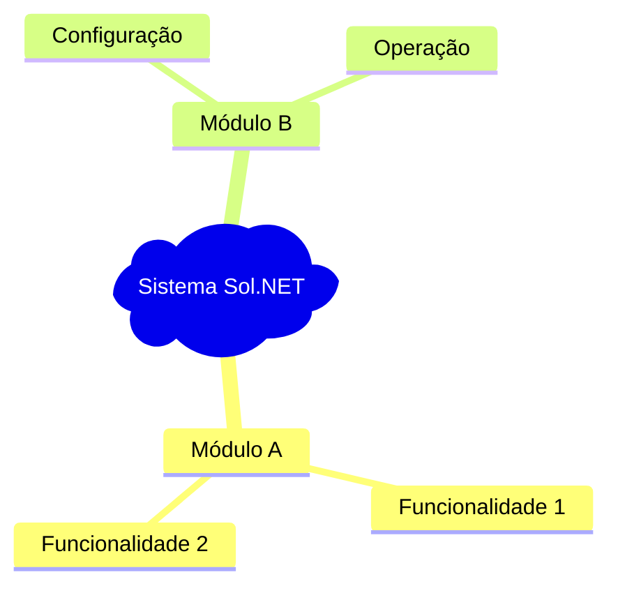

# 🤖 Instruções para GitHub Copilot - Documentação Sol.NET

## 🎯 Contexto do Repositório

Este repositório (`hetosoft/documentacao-solnet`) é dedicado exclusivamente à **documentação voltada para o usuário final** do sistema Sol.NET ERP. 

### 📍 Informações Essenciais:
- **Código fonte principal**: https://github.com/hetosoft/ProjetosSol.NET/
- **Público-alvo**: Usuários finais e administradores do Sol.NET
- **Formato**: Documentação web-friendly para GitHub Pages
- **Idioma**: Português brasileiro

---

## 📋 Padrões de Documentação

### 🎨 Estilo e Formatação

**✅ Use SEMPRE:**
- **Emojis** para categorizar e tornar visualmente atrativo
- **Títulos hierárquicos** claros (# ## ### ####)
- **Negrito** para destacar pontos importantes
- **Links internos** entre documentos relacionados
- **Exemplos práticos** e casos de uso
- **Listas organizadas** (com - ou números)

**📱 Compatibilidade Mobile:**
- Textos devem ser legíveis em dispositivos móveis
- Evite tabelas muito largas
- Use quebras de linha adequadas
- Prefira listas a tabelas complexas

### 🏗️ Estrutura Padrão de Documentos

```markdown
# 📄 [Título Principal com Emoji] - Sol.NET

## 🎯 Visão Geral
[Descrição clara do propósito]

### Principais Características:
- ✅ Característica 1
- ✅ Característica 2
- ✅ Característica 3

---

## 🔧 [Seções Principais]
[Conteúdo detalhado]

---

## 💡 Exemplos Práticos
[Casos de uso reais]

---

## ❓ FAQ / Problemas Comuns
[Perguntas frequentes]

---

**Última atualização**: [Mês de Ano]  
**Versão**: [X.X]  
**Público-alvo**: [Usuários específicos]
```

### 📂 Organização de Arquivos

**Estrutura atual:**
```
/
├── README.md (índice principal)
├── Financeiro/
│   └── Documentacao Portadores.md
├── Movimentacao/
│   ├── README.md (índice da seção)
│   ├── Documentacao Movimentacao.md
│   ├── FAQ.md
│   ├── Guia Rapido.md
│   └── [outros arquivos específicos]
```

**Convenções de nomes:**
- Use espaços nos nomes (não underscores nem hífens)
- Primeira letra maiúscula
- Nomes descritivos e claros
- README.md para índices de seção

---

## 🌐 Compatibilidade GitHub Pages

### ✅ Recursos Suportados:
- **Markdown padrão** (GitHub Flavored Markdown)
- **Mermaid diagrams** (para fluxogramas e diagramas)
- **Links relativos** entre arquivos
- **Imagens** em formato web (PNG, JPG, SVG)
- **Sintaxe destacada** para código

### 📊 Exemplo de Diagrama Mermaid:
```markdown

```

### 🔗 Links Internos:
```markdown
- [Nome do Documento](pasta/arquivo.md)
- [Seção Específica](arquivo.md#seção-específica)
- [Link Externo](https://github.com/hetosoft/ProjetosSol.NET/)
```

---

## 📚 Tipos de Documentação

### 🎯 Por Público-Alvo:

**👤 Usuário Iniciante:**
- Guias passo-a-passo
- Capturas de tela quando relevante
- Explicações de conceitos básicos
- Fluxo de trabalho simples

**🔧 Administrador/Configurador:**
- Configurações avançadas
- Cenários complexos
- Tabelas de referência
- Troubleshooting detalhado

**⚡ Usuário Experiente:**
- Referências rápidas
- Atalhos de teclado
- Checklists
- FAQs específicos

### 📖 Por Formato:

**Documentação Completa:**
- Arquivo principal com visão geral completa
- Seções bem organizadas com links internos
- Exemplos práticos detalhados
- Solução de problemas

**Guia Rápido:**
- Referência concisa para consulta rápida
- Atalhos e comandos essenciais
- Checklists operacionais
- Soluções para problemas comuns

**FAQ:**
- Perguntas organizadas por categoria
- Respostas práticas e diretas
- Links para documentação detalhada
- Cenários específicos

**README (Índice):**
- Navegação clara entre documentos
- Resumo do conteúdo de cada seção
- Sugestões de "por onde começar"
- Busca rápida por tópicos

---

## 🚀 Boas Práticas para Copilot

### ✅ Ao Criar Nova Documentação:

1. **Identifique o módulo Sol.NET** relevante
2. **Defina o público-alvo** (iniciante/admin/experiente)  
3. **Siga a estrutura padrão** com emojis apropriados
4. **Inclua exemplos práticos** do sistema Sol.NET
5. **Adicione FAQ** com problemas reais de usuários
6. **Crie links internos** para documentos relacionados
7. **Termine com metadados** (data, versão, público)

### ✅ Ao Editar Documentação Existente:

1. **Mantenha o estilo** e formatação existente
2. **Preserve a numeração** e estrutura de links
3. **Adicione às seções existentes** ao invés de criar novas
4. **Atualize o README** da seção se necessário
5. **Mantenha a consistência** de emojis e formatação

### ✅ Para Referências ao Sol.NET:

- **Sistema principal**: "Sol.NET ERP" ou "sistema Sol.NET"
- **Módulos**: "Módulo [Nome]" (ex: "Módulo Financeiro")
- **Funcionalidades**: Use nomes exatos do sistema
- **Atalhos**: Sempre no formato "F4", "Ctrl+S", etc.
- **Campos**: Entre aspas "Nome do Campo"
- **Menus**: Menu > Submenu > Opção

### ⚠️ Evite:

- Referências ao código-fonte ou aspectos técnicos de desenvolvimento
- Linguagem muito técnica sem explicação
- Documentação incompleta ou sem exemplos
- Links quebrados ou referencias incorretas
- Misturar idiomas (manter português brasileiro)
- Documentação muito extensa em um único arquivo

---

## 🔍 Referências e Exemplos

### 📁 Exemplos Existentes de Qualidade:

1. **[Movimentacao/README.md]** - Exemplo perfeito de índice navegável
2. **[Movimentacao/FAQ.md]** - Estrutura ideal para perguntas frequentes  
3. **[Financeiro/Documentacao Portadores.md]** - Documentação técnica completa
4. **[Movimentacao/Guia Rapido.md]** - Referência rápida bem estruturada

### 🎯 Foco na Experiência do Usuário:

- **Prático**: Sempre incluir exemplos reais
- **Navegável**: Links internos e estrutura clara
- **Visual**: Emojis e formatação atrativa
- **Completo**: FAQ para dúvidas comuns
- **Atual**: Manter informações atualizadas

---

## 🔗 Links de Referência

- **Repositório Principal**: https://github.com/hetosoft/ProjetosSol.NET/
- **GitHub Pages**: https://docs.github.com/pt/pages
- **Markdown Guide**: https://guides.github.com/features/mastering-markdown/
- **Mermaid Diagrams**: https://mermaid-js.github.io/mermaid/

---

**📅 Criado**: Dezembro de 2024  
**🎯 Objetivo**: Manter documentação Sol.NET consistente e user-friendly  
**👥 Público**: GitHub Copilot e colaboradores da documentação