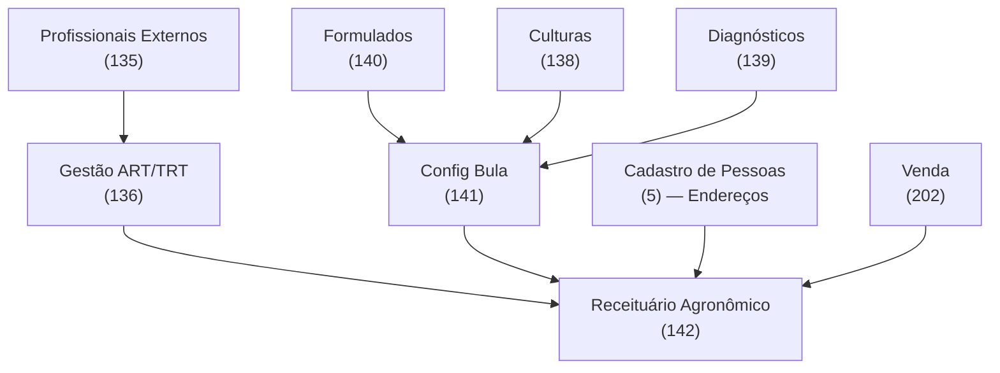

# 🌱 Índice: Documentação Módulo Agronômico - Sol.NET ERP

## 🎯 Sobre este módulo

O **Módulo Agronômico** do Sol.NET emite **Receituários Agronômicos** ligados à venda de defensivos agrícolas. Cada receituário é assinado por um profissional habilitado (Engenheiro Agrônomo ou Técnico Agrícola), consome saldo de um **ART/TRT** válido e respeita a **bula** registrada no MAPA para a combinação Produto + Cultura + Alvo.

A tela central é o **Receituário Agronômico** (código `142`). Em volta dela existem cadastros de apoio que alimentam a tela principal.

---

## 📚 Documentos deste módulo

| Documento | Quando consultar |
|-----------|-----------------|
| [📄 Documentação do Receituário Agronômico](documentacao_receituario_agronomico.md) | Para entender campos, regras de validação, fluxo de emissão, cancelamento e impressão. |
| [⚡ Guia Rápido](guia_rapido.md) | Para um checklist objetivo do passo a passo de emissão. |
| [❓ FAQ](faq.md) | Para dúvidas pontuais e problemas comuns do dia a dia. |

---

## 🗺️ Telas do módulo

Todas as telas abaixo são abertas pela **pesquisa universal (F1)**, digitando o código ou parte do nome.

| Código | Tela | Para que serve |
|--------|------|----------------|
| `135` | Profissionais Externos | Cadastro dos profissionais (CREA/CFTA) que assinam o receituário. |
| `136` | Gestão ART/TRT | Controle dos blocos de ART/TRT (numeração, saldo, validade) por profissional e empresa. |
| `138` | Cadastro Cultura Agronômica | Lista de culturas (Soja, Milho, Café, etc.). |
| `139` | Cadastro Diagnóstico Agronômico | Pragas, doenças, plantas daninhas e demais alvos. |
| `140` | Cadastro Formulado Agronômico | Produtos formulados registrados no MAPA (vínculo entre o produto comercial do ERP e o registro técnico). |
| `141` | Cadastro Config Bula Agronômico | Matriz que combina Formulado × Cultura × Alvo com doses, modo de aplicação e dias de carência. |
| `142` | **Receituário Agronômico** | Emissão da receita propriamente dita. |

Locais de Aplicação (talhões, fazendas) são os **endereços** cadastrados no cliente em **Cadastro de Pessoas** (código `5`), aba `Endereços`.

---

## 🔗 Relação entre as telas

---

## 🧭 Por onde começar

- Se está implantando o módulo do zero, siga a ordem **135 → 136 → 138 → 139 → 140 → 141** antes de tentar emitir o primeiro receituário.
- Se já tem os cadastros prontos e quer entender só a emissão, vá direto para a [documentação do Receituário Agronômico](documentacao_receituario_agronomico.md) ou para o [Guia Rápido](guia_rapido.md).

---

[← Voltar ao Portal](../README.md)
