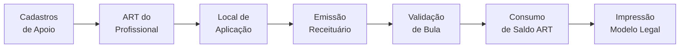

# 🌱 Índice: Documentação Módulo Agronômico - Sol.NET ERP

## 🎯 Sobre Este Módulo

O **Módulo Agronômico** do Sol.NET permite emitir **Receituários Agronômicos** em conformidade com as exigências do **MAPA** (Ministério da Agricultura, Pecuária e Abastecimento) e dos órgãos estaduais de defesa agropecuária. O módulo cobre todo o fluxo de prescrição: cadastros de apoio (culturas, alvos, defensivos, bulas, embalagens), profissionais responsáveis, controle de **ART/TRT**, locais de aplicação e a emissão propriamente dita — integrada à Movimentação (venda).

### ⚠️ Regra Fundamental

**Toda prescrição de defensivo agrícola exige um receituário válido, emitido por um profissional habilitado (Engenheiro Agrônomo ou Técnico Agrícola), com saldo de ART disponível e dosagem dentro da bula registrada no MAPA.**

O Sol.NET aplica essas validações automaticamente ao emitir o receituário.

### O Que Este Módulo É

**Este módulo É:**
- ✅ Emissor de receituário agronômico padrão MAPA
- ✅ Controle de ART/TRT (saldo, validade, vínculo com a empresa)
- ✅ Bula digital com validação de dosagem por cultura e alvo
- ✅ Cadastro de profissionais, locais de aplicação, culturas, alvos, defensivos e embalagens
- ✅ Integrado ao processo de venda (gera receita a partir da NF/Movimentação)
- ✅ Permite cancelamento com estorno automático do saldo de ART

**Este módulo NÃO É:**
- ❌ Sistema de gestão de propriedade rural (CAR, georreferenciamento)
- ❌ Cadastro de agrotóxicos do MAPA (a base é alimentada manualmente pela empresa)
- ❌ Transmissor automático para órgãos estaduais (ADAPAR/IDARON/IAGRO/SEAPDR) — a impressão segue o modelo legal e a entrega é manual
- ❌ Controle de aplicação em campo (registro de calda real, condições climáticas em tempo real)

---

## 📋 Documentos Disponíveis

### 📖 **[Documentação Receituário Agronômico](Documentacao%20Receituario%20Agronomico.md)**
Guia completo do módulo:
- Conceitos básicos: ART, profissional, bula, formulado
- Cadastros de apoio: culturas, diagnósticos (alvos), formulados, configuração de bula
- Cadastros administrativos: profissionais, ART/TRT, locais de aplicação
- Cadastro de embalagens e tipos de embalagem
- Fluxo de emissão direta e integrada à Movimentação
- Validações automáticas
- Cancelamento e estorno de ART
- Impressão (ReportBuilder)
- Alertas de saldo

### 🚀 **[Guia Rápido](Guia%20Rapido.md)**
Referência objetiva para o dia a dia:
- Atalho **F9** na Movimentação
- Checklist diário de emissão
- Pré-cadastros obrigatórios
- Soluções rápidas para os erros mais comuns
- Ordem recomendada de cadastros iniciais

### ❓ **[FAQ - Perguntas Frequentes](FAQ.md)**
Respostas para dúvidas comuns:
- Quem pode assinar (CREA × CFTA)
- Saldo de ART acabou: o que fazer?
- Como cancelar uma receita já emitida
- Combinação produto × cultura × alvo bloqueada
- Receituário sem protocolo de NF-e
- Dose fora do permitido pela bula
- Diferença entre cultura, diagnóstico e formulado

---

## 🔄 Como Funciona



**Fluxo detalhado:**
1. **Cadastros de apoio** (uma vez): culturas, alvos (diagnósticos), formulados, bulas digitais e embalagens
2. **Cadastros administrativos** (por profissional/cliente): profissional responsável, blocos de ART/TRT, locais de aplicação
3. **Emissão**: pelo menu próprio ou pelo atalho **F9** na tela de Movimentação
4. **Validação automática**: bula (produto × cultura × alvo × dose), ART (saldo e validade), vínculo cliente↔local e empresa↔ART
5. **Consumo do saldo** da ART e geração do número sequencial da receita
6. **Impressão** do receituário no modelo oficial via ReportBuilder
7. **Cancelamento** (quando necessário) restaura o saldo da ART

---

## 🗂️ O Que Cadastrar Antes de Emitir

| Cadastro | Para que serve | Quando cadastrar |
|----------|----------------|------------------|
| **Culturas** | Soja, Milho, Trigo… | Uma vez, expandir conforme atender novas culturas |
| **Diagnósticos** | Pragas, doenças, plantas daninhas, nematóides | Uma vez, expandir conforme novos alvos surgirem |
| **Formulados** | Defensivos com registro MAPA | Conforme entram no portfólio comercial |
| **Configuração de Bula** | Combinações permitidas e doses por produto/cultura/alvo | Junto ao cadastro do formulado |
| **Embalagens / Tipos de Embalagem** | Frascos, bombonas, sacos | Conforme a empresa comercializa |
| **Profissionais** | Eng. Agrônomos / Téc. Agrícolas | Cada responsável técnico que assina receita |
| **ART/TRT** | Bloco de receitas vinculado ao profissional **e à empresa** | A cada novo bloco emitido pelo conselho |
| **Locais de Aplicação** | Fazendas/talhões dos clientes | Antes da primeira venda para o cliente |

> 💡 **Dica:** ARTs estão vinculadas à **empresa** que está operando o sistema. Em ambientes multi-empresa, cada filial precisa do seu próprio bloco.

---

## 📋 Checklist Simplificado

### **Configuração inicial (uma vez)**
```
[ ] Cadastrar profissionais (com CPF, CREA/CFTA-UF)
[ ] Cadastrar ART/TRT do profissional, vinculada à empresa
[ ] Cadastrar culturas atendidas
[ ] Cadastrar alvos (diagnósticos) recorrentes
[ ] Cadastrar formulados em estoque (com nº MAPA)
[ ] Configurar bulas digitais (produto × cultura × alvo)
[ ] Cadastrar tipos e embalagens dos formulados
[ ] Cadastrar locais de aplicação dos clientes ativos
```

### **Por venda**
```
[ ] Lançar a movimentação normalmente
[ ] Pressionar F9 ou usar o botão de receituário
[ ] Confirmar profissional e ART (sistema sugere)
[ ] Confirmar local de aplicação
[ ] Conferir doses e área tratada (calculadas automaticamente)
[ ] Salvar — sistema valida bula, ART e gera nº
[ ] Imprimir (3 vias quando aplicável)
```

---

## ❓ Perguntas Mais Comuns

**Posso emitir receita sem ART cadastrada?**
→ **Não.** A ART vinculada à empresa atual é obrigatória.

**A dose pode passar do máximo da bula?**
→ **Não.** O sistema bloqueia. Se realmente necessário, ajuste a bula com base no rótulo oficial — não no caso isolado.

**E se a combinação produto × cultura × alvo não existir?**
→ É bloqueada. Verifique o rótulo do produto: se a recomendação está no MAPA, cadastre a bula. Se não está, a aplicação é off-label e **não pode** ser receitada.

**Cancelei uma receita errada — recupero o saldo da ART?**
→ **Sim.** O cancelamento estorna o número e devolve o saldo para a ART de origem.

**Preciso emitir uma receita sem nota fiscal?**
→ É possível. A emissão **não exige protocolo de NF-e**. A vinculação à movimentação é opcional para casos de venda; em campo, o receituário pode ser avulso.

**Como recebo aviso de que uma ART está acabando?**
→ Configure a "Quantidade de Aviso" na ART. O Sol.NET alerta na tela ao emitir e exibe ARTs próximas do esgotamento.

---

## 🔗 Navegação Rápida

### **Por tarefa**

**Configurar o módulo pela primeira vez:**
- [Pré-requisitos e ordem de cadastros](Documentacao%20Receituario%20Agronomico.md#-pré-requisitos-e-ordem-recomendada)
- [Cadastro de Profissionais](Documentacao%20Receituario%20Agronomico.md#-cadastro-de-profissionais)
- [Cadastro de ART/TRT](Documentacao%20Receituario%20Agronomico.md#-cadastro-de-arttrt)

**Emitir receituário:**
- [Emissão integrada à Movimentação (F9)](Documentacao%20Receituario%20Agronomico.md#-emissão-integrada-à-movimentação)
- [Emissão avulsa](Documentacao%20Receituario%20Agronomico.md#-emissão-avulsa)
- [Validações automáticas](Documentacao%20Receituario%20Agronomico.md#-validações-automáticas)

**Resolver problemas:**
- [Cancelamento de receituário](Documentacao%20Receituario%20Agronomico.md#-cancelamento-de-receituário)
- [Mensagens de erro comuns](Guia%20Rapido.md#-problemas-comuns)
- [FAQ](FAQ.md)

---

## 📚 Documentação Relacionada

- **[Movimentação](../Movimentacao/)**: Como funciona o lançamento da venda que dispara o receituário
- **[Cadastro de Produtos](../Movimentacao/Documentacao%20Movimentacao.md)**: Vínculo entre o produto comercial e o formulado agronômico
- **[Portadores Financeiros](../Financeiro/Documentacao%20Portadores.md)**: Recebimento da venda associada à receita

---

## 💡 Dicas Importantes

### **Para usuários de balcão**
1. **F9 é seu atalho** — não saia da Movimentação para emitir
2. **Confira a empresa ativa** — a ART que vai ser sugerida é a da empresa logada
3. **Confirme o local de aplicação** — clientes com várias fazendas precisam escolher a correta
4. **Imprima na hora** — o cliente precisa sair com as vias do receituário

### **Para administradores**
1. **Mantenha as bulas atualizadas** — produtos novos e renovações de registro mudam doses
2. **Monitore o saldo de ART** — solicite reposição com antecedência (renovação no conselho leva tempo)
3. **Padronize o cadastro de locais** — evite duplicidade para o mesmo talhão
4. **Treine a equipe sobre o que é off-label** — o sistema bloqueia, mas o vendedor precisa entender o motivo

---

## 🆘 Suporte

### **Dúvidas sobre:**

**Cadastros de apoio (culturas, alvos, formulados, bulas)**
→ [Documentação Completa - Cadastros de Apoio](Documentacao%20Receituario%20Agronomico.md#-cadastros-de-apoio)

**ART e profissionais**
→ [Documentação Completa - Cadastros Administrativos](Documentacao%20Receituario%20Agronomico.md#-cadastros-administrativos)

**Bloqueios na emissão**
→ [Guia Rápido - Problemas Comuns](Guia%20Rapido.md#-problemas-comuns)

**Bula desatualizada / produto novo do MAPA**
→ Cadastre/ajuste em **Cadastros > Agronômico > Configuração de Bula**

**Sistema Sol.NET**
→ Suporte técnico Hetosoft

---

**📅 Última atualização**: Abril de 2026
**📦 Versão**: 1.0
**🎯 Público-alvo**: Vendedores de revenda agropecuária, responsáveis técnicos, administradores Sol.NET
**👥 Contribuidores**: Equipe de Documentação Sol.NET
**⚠️ Lembre-se: receita sem ART válida e bula compatível é bloqueada pelo sistema**

---

*Este índice organiza a documentação do Módulo Agronômico (Receituário Agronômico) do Sol.NET. Foco no fluxo do MAPA: profissional habilitado → ART com saldo → produto registrado → bula digital → emissão e impressão.*
