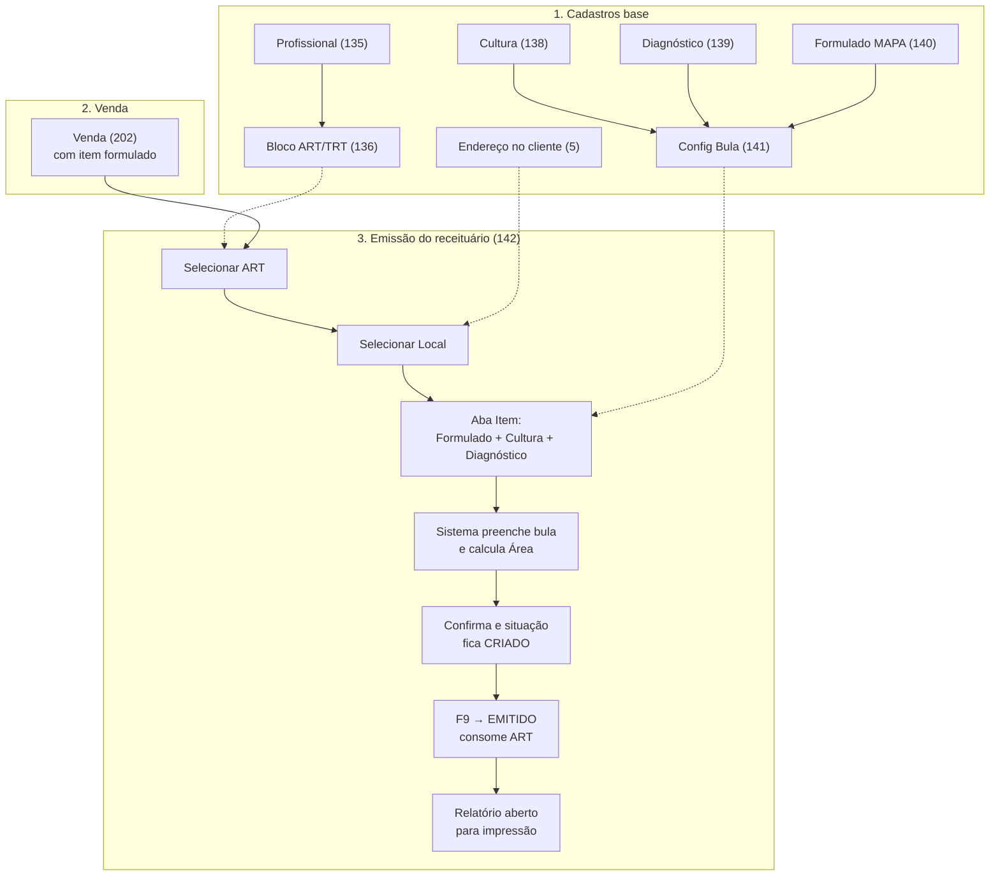

# 📄 Receituário Agronômico - Sol.NET

## 🎯 Visão Geral

O **Receituário Agronômico** é a prescrição técnica obrigatória para a venda de defensivos agrícolas. No Sol.NET, ele é emitido pela tela **Receituário Agronômico** (código `142` na pesquisa F1) e está sempre ligado a um **Movimento de venda** que tenha pelo menos um item formulado.

A emissão consome saldo de um **ART/TRT** ativo do profissional responsável, gera um número de receita sequencial e libera a impressão do documento. Antes de emitir, o sistema valida automaticamente a combinação **Formulado + Cultura + Alvo (Diagnóstico)** contra a bula cadastrada e checa as regras de vínculo entre profissional, empresa, cliente e local de aplicação.

### Principais Características

- ✅ Vínculo obrigatório com um movimento de venda contendo item formulado
- ✅ Consumo automático do saldo do bloco ART/TRT do profissional
- ✅ Validação da dose aplicada contra a faixa min/max da bula
- ✅ Cálculo automático da área tratada a partir de dose e quantidade
- ✅ Bloqueios de coerência (UF do profissional × UF do local, ART × empresa, cliente diferente de "Consumidor Padrão")
- ✅ Cancelamento com estorno de saldo do ART
- ✅ Impressão em layout oficial padrão CREA

---

## 🧭 Pré-requisitos antes de emitir

Para emitir o primeiro receituário, todos os cadastros abaixo precisam estar prontos. Todos são abertos pela pesquisa universal (F1):

| Cadastro | Código | Para que serve |
|---------|--------|----------------|
| Profissionais Externos | `135` | Engenheiro Agrônomo ou Técnico que assina a receita (CREA/CFTA). |
| Gestão ART/TRT | `136` | Bloco de numeração da ART do profissional, com número inicial, final, saldo, validade e empresa associada. |
| Cadastro Cultura Agronômica | `138` | Lista de culturas (Soja, Milho, etc.). |
| Cadastro Diagnóstico Agronômico | `139` | Lista de alvos (pragas, doenças, plantas daninhas, etc.) com o `Tipo Alvo`. |
| Cadastro Formulado Agronômico | `140` | Registro MAPA do produto. Cada produto comercial do ERP precisa estar vinculado a um Formulado para que o receituário seja exigido. |
| Cadastro Config Bula Agronômico | `141` | Combinação **Formulado × Cultura × Alvo** com doses, calda, dias de carência, modo de aplicação. |
| Cadastro de Pessoas — aba Endereços | `5` | Endereços do cliente, usados como Locais de Aplicação (talhões, fazendas). |

Sem esses cadastros (especialmente a **Config Bula** para a combinação que se quer prescrever) a emissão não é liberada.

---

## 🌾 Fluxo geral do módulo



---

## 🧭 Sub-abas do formulário

Ao abrir um receituário em modo de inclusão ou edição, o formulário se organiza em três sub-abas dentro da área de cadastro:

### `Receituário`
Cabeçalho da receita. Reúne dados do ART/TRT escolhido, dados do profissional, dados gerais da receita (número, data, situação), local de aplicação, cliente e o movimento de venda associado.

### `Item`
Detalhes da prescrição em si: formulado, cultura, diagnóstico, dose aplicada, área tratada, quantidade total, unidades, calda e tipo de aplicação. É aqui que o sistema cruza a tríade com a bula e calcula a área.

### `Informações`
Trechos legais que serão impressos no receituário: EPI, restrições de uso, precauções de manuseio, primeiros socorros, sintomas de alarme, antídoto e advertências de meio ambiente. Esses textos são alimentados pela configuração da bula do formulado escolhido.

---

## 🔧 Fluxo de emissão

Há dois pontos de partida válidos:

### Caminho A — A partir da Venda (mais comum)

1. Lance a venda normalmente pela tela `Vendas` (código `202`). Inclua o item formulado.
2. Ainda dentro do movimento, dispare a emissão do receituário pela função correspondente da tela de venda. O Sol.NET abre a tela `Receituário Agronômico` já com o movimento, o item e o formulado preenchidos.
3. Selecione o **ART/TRT** ativo do profissional. Se a empresa do movimento já tiver um único ART vigente, ele é sugerido automaticamente.
4. Selecione o **Local de Aplicação** do cliente. A UF do local precisa coincidir com a UF do registro do profissional — caso contrário o local é descartado.
5. Na aba `Item`, ajuste **Dose Aplicada**, **Área Tratada** e **Quantidade Total** se necessário (o sistema calcula a área automaticamente — ver seção abaixo).
6. Confirme. O receituário fica em situação `CRIADO`.
7. Pressione **F9** (ou o botão `Gerar/Imprimir`) para emitir. O sistema consome um número do bloco ART, muda a situação para `EMITIDO` e abre o relatório da receita para impressão.

### Caminho B — Direto na tela 142

1. Abra a tela `Receituário Agronômico` (código `142` na pesquisa F1).
2. Use `Novo` para iniciar uma receita em branco.
3. No grupo **Movimento**, escolha o movimento de venda já lançado (com item formulado). A escolha do movimento puxa cliente, empresa, item, quantidade e formulado.
4. Continue a partir do passo 3 do Caminho A.

> Em ambos os caminhos, o movimento de venda associado **precisa existir antes** da emissão — o receituário não pode ser emitido sem movimento associado.

---

## 🧮 Cálculo automático da Área Tratada e validação da bula

### Cálculo da área

Quando o usuário preenche **Dose Aplicada** ou **Quantidade Total**, o sistema recalcula a Área Tratada pela fórmula:

```
Área Tratada = (Quantidade Total × 1000) / Dose Aplicada
```

O fator fixo `1000` faz a conversão entre as unidades de medida (mL → L, g → kg, etc.). Se o usuário digitar manualmente uma área diferente da calculada, o Sol.NET pede confirmação informando os dois valores; o usuário decide se mantém o número digitado ou aceita a área calculada.

### Validação da dose contra a bula

Ao escolher a tríade **Formulado + Cultura + Diagnóstico**, o sistema busca a configuração na tela `141` (Config Bula) e:

- Se **Dose Aplicada** estiver vazia, preenche automaticamente com a **Dose Máxima** da bula.
- Se a calda estiver vazia, preenche com a calda da bula.
- Se a dose informada estiver **fora da faixa min/max** da bula, exibe a mensagem *"Dose aplicada fora dos limites estabelecidos pela Configuração da Bula. Deseja confirmar?"*. Confirmando, o sistema aceita a dose; cancelando, volta para a dose máxima da bula.

A aba `Informações` é preenchida com os textos da bula (EPI, restrições, precauções, antídoto, etc.) — esses campos vão para o relatório impresso da receita.

---

## 📌 Situações do receituário

Todo receituário passa por uma das três situações abaixo:

| Situação | Significado |
|----------|-------------|
| `CRIADO` | Receituário rascunho, ainda editável. Não consumiu número do ART. |
| `EMITIDO` | Receita oficializada — número consumido do bloco ART, data de emissão registrada, relatório disponível para impressão. |
| `CANCELADO` | Receita estornada. O saldo do ART foi devolvido ao bloco. Não pode mais ser emitida. |

A transição é sempre `CRIADO → EMITIDO → CANCELADO`. Não existe caminho de volta de `EMITIDO` para `CRIADO`.

- **Editar** só é permitido enquanto a situação é `CRIADO`. Tentar editar um receituário `EMITIDO` ou `CANCELADO` exibe *"Não é possível editar receituário Emitido ou Cancelado!"*.
- **Excluir** um receituário `CRIADO` remove o registro e desfaz a associação com o movimento.
- **Excluir** um receituário `EMITIDO` aciona o cancelamento: estorna o saldo do ART e marca a receita como `CANCELADO` (não remove o registro). Isso só é permitido se a nota fiscal do movimento **ainda não tiver Protocolo de Autorização** — depois da autorização da nota, o receituário fica preso ao movimento.
- **Excluir** um receituário `CANCELADO` exibe *"Esse receituário já está CANCELADO. Não é possível excluir."*.

---

## 🖨️ Impressão

A impressão é feita pelo botão **Gerar/Imprimir** ou pela tecla **F9**. O comportamento depende da situação:

- Receituário em `CRIADO` → o sistema executa a emissão (gera número de receita, consome saldo do ART, muda para `EMITIDO`) e em seguida abre o relatório da receita.
- Receituário em `EMITIDO` → o sistema apenas reabre o relatório da receita.
- Receituário em `CANCELADO` ou sem dados completos → impressão não é liberada. Aparece *"O receituário precisa estar emitido para ser impresso!"*.

Após emitir, o sistema também emite um alerta se o saldo do ART estiver chegando ao limite configurado de aviso.

---

## 🚫 Regras de bloqueio na emissão

Antes de gerar o número da receita, o Sol.NET verifica:

| Condição | Bloqueio / Mensagem |
|----------|---------------------|
| Receituário sem movimento associado | *"Não é possível emitir receituário sem movimento associado!"* |
| Receituário sem item | *"Não é possível emitir receituário sem item!"* |
| Item sem Formulado, Cultura, Diagnóstico, Dose, Área ou Quantidade preenchidos | *"Para emitir o receituário é necessário preencher todos os dados do item!"* |
| Item do movimento não bate com o item do receituário | *"Nenhum item do movimento é compatível com os itens do receituário."* |
| ART/TRT escolhido não é da Empresa do Movimento | *"O ART/TRT preenchido não é da Empresa do Movimento selecionado. Ele será sobrescrito."* / *"O ART/TRT selecionado não é da Empresa do Movimento"* |
| UF do Local de Aplicação diferente da UF do Registro do Profissional | *"O Local selecionado não pertence ao estado do Registro do Profissional."* (o local é limpo) |
| Cliente do receituário = "Consumidor Padrão" | *"Não permitido selecionar Consumidor Padrão"* |
| Receituário emitido com nota fiscal já autorizada (com Protocolo) | *"Não é possível alterar status desse Receituário! O movimento associado já possui nota fiscal com Protocolo de Autorização"* |
| Saldo do ART zerado ou data de validade vencida | Emissão bloqueada pelo controle do ART (tela `136`). |

---

## 🧾 Valores codificados (referência)

### Situação do receituário

| Texto exibido | Significado |
|---------------|-------------|
| `CRIADO` | Rascunho, ainda editável |
| `EMITIDO` | Oficializado, com número de receita e saldo ART consumido |
| `CANCELADO` | Receita estornada, saldo ART devolvido |

### Tipo de alvo (Diagnóstico)

| Texto exibido |
|---------------|
| `FUNGO` |
| `INSETO` |
| `PLANTA DANINHA` |
| `NEMATÓIDE` |
| `BACTÉRIA` |
| `VÍRUS` |

### Tipo de aplicação

| Texto exibido |
|---------------|
| `TERRESTRE` |
| `AÉREO` |
| `MANUAL` |
| `EXPURGO` |

---

## 💡 Exemplos Práticos

### Exemplo 1 — Venda de fungicida para soja (caminho mais comum)

1. Cliente "Fazenda Boa Vista" entra na loja para comprar 10 L de fungicida cujo produto comercial está vinculado a um Formulado.
2. Vendedor lança a venda (tela `202`), informa o cliente e o item.
3. Antes de fechar, o sistema indica que o item exige receituário. O vendedor abre a emissão do receituário a partir do movimento.
4. A tela `Receituário Agronômico` abre já com Movimento, Item, Cliente, Formulado e Empresa preenchidos.
5. O vendedor seleciona o ART do Engenheiro Agrônomo da loja e o Local de Aplicação cadastrado para o cliente.
6. Na aba `Item`, escolhe a Cultura "Soja" e o Diagnóstico "Ferrugem Asiática". O sistema preenche Dose Máxima, Calda e Dias de Carência da bula.
7. O vendedor confirma a Quantidade Total (10 L) e o sistema calcula a Área Tratada automaticamente.
8. O vendedor pressiona **F9**. O receituário sai com número sequencial do bloco ART e o relatório da receita abre para impressão.

### Exemplo 2 — Cancelar uma receita emitida erroneamente

1. O cliente cancela a compra antes da nota fiscal ser autorizada.
2. O operador abre a tela `Receituário Agronômico` (código `142`), localiza a receita no grid e clica em `Excluir`.
3. Como a situação é `EMITIDO` e a nota ainda não tem Protocolo de Autorização, o sistema:
   - Devolve a numeração ao saldo do ART
   - Muda a situação da receita para `CANCELADO`
   - Desassocia o movimento do receituário
4. Mensagem: *"Situação do receituário alterada para CANCELADO e Saldo do ART estornado."*

### Exemplo 3 — Dose acima da bula com justificativa do técnico

1. Na aba `Item`, ao escolher Formulado + Cultura + Diagnóstico, o sistema mostra Dose Mín. = 1,0 L/ha e Dose Máx. = 2,0 L/ha.
2. O Técnico Agrícola decide aplicar 2,5 L/ha (acima da máxima) por orientação específica.
3. Ao sair do campo Dose Aplicada, o sistema exibe *"Dose aplicada fora dos limites estabelecidos pela Configuração da Bula. Deseja confirmar?"*.
4. O usuário confirma. O receituário aceita a dose, recalcula a área tratada e segue para emissão.

---

## ❓ FAQ / Problemas Comuns

### ❓ Não consigo emitir o receituário — a tela reclama que não há movimento associado. O que fazer?

O receituário **precisa** estar ligado a uma venda com item formulado. Mesmo que você esteja na tela `142` direto, é preciso escolher um movimento no grupo `Movimento`. Se ainda não existe venda lançada, lance primeiro pela tela `202`.

### ❓ Apertei F9 e o sistema falou que falta preencher dados do item. Onde olho?

Vá na sub-aba `Item`. Para a emissão, são obrigatórios: Formulado, Cultura, Diagnóstico, Dose Aplicada, Área Tratada e Quantidade Total. Qualquer um vazio bloqueia a emissão.

### ❓ Selecionei o Local de Aplicação mas o sistema apagou. Por quê?

A UF do Local precisa ser igual à UF do Registro do Profissional. Se forem diferentes, o sistema avisa *"O Local selecionado não pertence ao estado do Registro do Profissional."* e limpa o campo. Cadastre um endereço na UF correta (na aba `Endereços` do **Cadastro de Pessoas** — código `5`) ou escolha um profissional com registro na UF do Local.

### ❓ O ART escolhido foi sobrescrito sozinho. Por quê?

O ART precisa pertencer à mesma Empresa do Movimento de venda. Se você escolher um ART de outra empresa, o sistema avisa e tenta sobrescrever pelo ART mais antigo ativo da empresa do movimento. Use a tela `Gestão ART/TRT` (código `136`) para conferir a empresa de cada bloco.

### ❓ A dose que digitei está fora da bula, mas o técnico autorizou. Como prosseguir?

Quando a dose está fora da faixa min/max da bula, o sistema pede confirmação: *"Dose aplicada fora dos limites estabelecidos pela Configuração da Bula. Deseja confirmar?"*. Confirme e a receita aceita a dose informada.

### ❓ Por que o cliente "Consumidor Padrão" não aparece na seleção?

Receituário precisa ter um cliente identificado para fins legais. O cliente genérico "Consumidor Padrão" é bloqueado intencionalmente — *"Não permitido selecionar Consumidor Padrão"*. Cadastre o cliente real (CPF/CNPJ) e use esse cadastro.

### ❓ Tentei excluir uma receita emitida e o sistema não deixou. Por quê?

Provavelmente a nota fiscal do movimento já foi autorizada (tem Protocolo de Autorização). Após autorização, o receituário fica preso ao movimento e não pode mais ser cancelado pelo Sol.NET — a regra é fiscal, não operacional.

### ❓ Preciso reimprimir uma receita antiga. Como faço?

Localize a receita pela lista da tela `Receituário Agronômico` (código `142`) — você pode pesquisar por número da receita, número do ART mãe, nome do profissional, cliente, etc. Abra a receita e pressione **F9** ou o botão `Gerar/Imprimir`. Como a situação já é `EMITIDO`, o sistema só reabre o relatório da receita, sem consumir novo número do ART.

### ❓ Como o sistema calcula a área tratada?

Pela fórmula `Área = (Quantidade Total × 1000) / Dose Aplicada`. O fator `1000` converte mL → L ou g → kg automaticamente. Se você digitar uma área diferente da calculada, o sistema pede confirmação antes de aceitar.

### ❓ Onde cadastrar um novo bloco de ART?

Na tela `Gestão ART/TRT` (código `136`). Você informa profissional, empresa, número da ART mãe, número inicial e final, validade e o sistema controla o saldo conforme as receitas são emitidas e canceladas.

---

**Última atualização**: Maio de 2026
**Versão**: 1.0
**Público-alvo**: Usuários do Sol.NET
