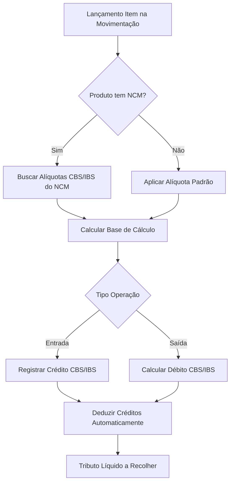

# 🏛️ Reforma Tributária no Sol.NET ERP

## 🎯 Visão Geral

Este documento detalha **como o Sol.NET ERP está preparado para a Reforma Tributária Brasileira** (EC 132/2023), focando nas **mudanças práticas do sistema** e **impactos operacionais** para os usuários.

> 💡 **Nota**: Para informações gerais sobre a reforma tributária, consulte fontes oficiais do governo. Este documento foca em **como usar o Sol.NET** durante e após a transição.

### 📊 O que muda no Sol.NET:
- ✅ **Cadastro de NCM**: Novos campos e classificações tributárias
- ✅ **Cálculo de Tributos**: CBS e IBS em Movimentação e Items
- ✅ **Controle de Créditos**: Aproveitamento automático de créditos tributários
- ✅ **Documentos Fiscais**: NFe 5.0 e NFSe 2.0 com novos tributos
- ✅ **Relatórios**: Análise de impacto e controle de transição
- ✅ **Transição Gradual**: Sistema gerencia período duplo (2026-2033)

---

## 📅 Resumo da Reforma (Contexto)

A Emenda Constitucional 132/2023 substitui **5 tributos** (PIS, COFINS, IPI, ICMS, ISS) por **2 tributos** (CBS e IBS), com implementação gradual de 2026 a 2033:

- **2026**: Teste (CBS 0,9% + IBS 0,1%)
- **2027**: CBS substitui PIS/COFINS
- **2029-2032**: Transição gradual ICMS/ISS → IBS
- **2033**: Regime pleno CBS + IBS

**Principal benefício**: Crédito pleno (não cumulatividade total) - você desconta **integralmente** os tributos pagos nas compras.

> 📚 Para detalhes da reforma, consulte: [FAQ](FAQ Reforma Tributaria.md) | [Guia Rápido](Guia Rapido Reforma Tributaria.md)

---

## 🔧 Como Usar o Sol.NET com a Reforma Tributária

### **📋 Cadastro de NCM - Centro de Controle**

O cadastro de NCM (Nomenclatura Comum do Mercosul) é **essencial** para a correta aplicação de CBS e IBS, pois cada código NCM define a alíquota tributária aplicável.

**Menu**: `Cadastros → Fiscal → NCM (Nomenclatura Comum Mercosul)`

#### **Campos do Cadastro de NCM:**

| Campo | Descrição | Obrigatório | Exemplo |
|-------|-----------|-------------|---------|
| **Código NCM** | Código de 8 dígitos da NCM | ✅ Sim | 0201.10.00 |
| **Descrição** | Descrição do produto/categoria | ✅ Sim | Carne bovina fresca |
| **Classificação Tributária** | Categoria fiscal da reforma | ✅ Sim | Reduzida / Padrão / Zero |
| **Alíquota CBS (%)** | Percentual CBS aplicável | ✅ Sim | 5,4% (60% padrão) |
| **Alíquota IBS (%)** | Percentual IBS aplicável | ✅ Sim | 10,5% (60% padrão) |
| **CEST** | Código Especificador ST | ⚠️ Quando aplicável | 01.001.00 |
| **Vigência** | Data início/fim da configuração | ✅ Sim | 01/01/2027 |

#### **Classificações Tributárias Disponíveis:**

**🟢 Alíquota Padrão** (CBS ~8,5% + IBS ~17,5%)
- Maioria dos produtos e serviços
- Aplicação automática quando não há exceção

**🟡 Alíquota Reduzida** (60% da padrão - CBS ~5,4% + IBS ~10,5%)
- Cesta básica (arroz, feijão, leite, pão, etc.)
- Medicamentos essenciais
- Serviços de saúde e educação
- Produtos agropecuários específicos

**🔵 Alíquota Zero** (0%)
- Transporte público coletivo
- Livros e periódicos
- Hortifrutigranjeiros in natura
- Exportações

**⚪ Isento**
- Situações específicas definidas em lei
- Diferente de alíquota zero (implicações de crédito)

#### **Passo a Passo: Configurar NCM**

**1. Acessar Cadastro:**
```
Menu → Cadastros → Fiscal → NCM
Atalho: Ctrl+Alt+N
```

**2. Novo Registro (F4):**
- Informar código NCM (8 dígitos)
- Sistema busca descrição automaticamente (base IBGE)
- Validar/ajustar descrição

**3. Configurar Tributação Reforma:**
- Selecionar "Classificação Tributária"
- Sistema sugere alíquotas conforme classificação
- Ajustar se necessário (casos especiais)
- Definir vigência (data início)

**4. Vincular Produtos:**
- Todos os produtos devem ter NCM vinculado
- Menu: `Cadastros → Produtos → Aba Fiscal`
- Campo "NCM": Selecionar da lista cadastrada

**5. Validar:**
- Relatório: `Fiscal → Validação NCM`
- Lista produtos sem NCM ou com configuração incompleta
- Corrigir antes da vigência da reforma

#### **⚠️ Atenção:**

**Produtos sem NCM configurado:**
- Sistema aplicará alíquota padrão por padrão
- Pode resultar em tributação maior que o correto
- **Ação**: Revisar 100% dos produtos cadastrados

**Mudanças na legislação:**
- Alíquotas podem ser ajustadas por lei complementar
- Sol.NET disponibilizará atualizações automáticas
- Usuário deve aceitar/revisar atualizações

**NCM x NBS:**
- NCM: Para produtos (mercadorias)
- NBS: Para serviços
- Mesma lógica de configuração no Sol.NET

---

### **📦 Movimentação - Cálculo de Tributos**

O módulo de **Movimentação** é onde os tributos CBS e IBS são **calculados automaticamente** com base nas configurações de NCM e tipo de operação.

**Menu**: `Movimentação → Nova Movimentação (F4)`

#### **Como o Sol.NET Calcula CBS/IBS:**

**Fluxo de Cálculo:**



#### **Campos Relevantes na Movimentação:**

**Cabeçalho da Movimentação:**

| Campo | Descrição | Impacto na Reforma |
|-------|-----------|-------------------|
| **Tipo de Movimento** | Natureza da operação | Define se gera crédito ou débito |
| **Cliente/Fornecedor** | Parceiro da operação | Endereço determina tributação (destino) |
| **Data Emissão** | Data do documento | Define alíquotas vigentes na data |
| **UF Destino** | Estado destinatário | Relevante para IBS (destino) |

**Itens da Movimentação:**

| Campo | Descrição | Impacto CBS/IBS |
|-------|-----------|-----------------|
| **Produto** | Item comercializado | Busca NCM e alíquotas |
| **Quantidade** | Quantidade vendida/comprada | Base de cálculo |
| **Valor Unitário** | Preço unitário | Base de cálculo |
| **Valor Total** | Qtd × Valor Unit | Base para CBS/IBS |
| **CBS Alíquota (%)** | % CBS (do NCM) | Auto-preenchido |
| **CBS Valor (R$)** | Valor CBS calculado | Auto-calculado |
| **IBS Alíquota (%)** | % IBS (do NCM) | Auto-preenchido |
| **IBS Valor (R$)** | Valor IBS calculado | Auto-calculado |

#### **Exemplo Prático - Venda:**

**Cenário**: Venda de arroz (NCM 1006.30.21 - Alíquota reduzida)

```
Movimento: Venda
Cliente: Supermercado ABC - SP
Data: 15/01/2027 (CBS já vigente)

Item:
├─ Produto: Arroz Tipo 1 - 5kg
├─ NCM: 1006.30.21 (automático do cadastro produto)
├─ Classificação: Reduzida (cesta básica)
├─ Quantidade: 100 unidades
├─ Valor Unitário: R$ 25,00
├─ Valor Total: R$ 2.500,00
│
├─ CBS:
│   ├─ Alíquota: 5,4% (automático do NCM)
│   └─ Valor: R$ 135,00
│
└─ IBS:
    ├─ Alíquota: 10,5% (automático do NCM)
    └─ Valor: R$ 262,50

Total Tributos: R$ 397,50
Total Nota: R$ 2.897,50
```

**Créditos Aproveitados** (se houve compra anterior):
```
Compra anterior de arroz:
├─ Valor compra: R$ 1.800,00
├─ CBS pago: R$ 97,20
├─ IBS pago: R$ 189,00
└─ Total créditos: R$ 286,20

Apuração:
├─ Débito venda: R$ 397,50
├─ Crédito compra: R$ 286,20
└─ Tributo líquido: R$ 111,30 (só sobre margem!)
```

#### **Tipos de Movimento e Impacto:**

**🟢 Operações que GERAM CRÉDITO:**
- Compra de mercadorias para revenda
- Compra de matérias-primas e insumos
- Compra de serviços relacionados à atividade
- Importação de produtos
- Aquisição de energia elétrica (uso produtivo)
- Transporte de mercadorias

**🔴 Operações que GERAM DÉBITO:**
- Venda de mercadorias
- Venda de produtos fabricados
- Prestação de serviços
- Transferência entre estabelecimentos (pode variar)

**⚪ Operações SEM MOVIMENTO CBS/IBS:**
- Exportações (alíquota zero, mas mantém créditos)
- Devolução de mercadorias
- Operações internas específicas

#### **Período de Transição (2029-2032):**

Durante a transição, o Sol.NET **calculará automaticamente** tanto os tributos antigos quanto os novos:

```
Exemplo 2030 (IBS 20% + ICMS 80%):

Item vendido - R$ 1.000,00
├─ Tributos Novos:
│   ├─ CBS: 8,5% = R$ 85,00 (pleno)
│   └─ IBS: 3,5% (20% de 17,5%) = R$ 35,00
│
└─ Tributos Antigos:
    ├─ ICMS: 9,6% (80% de 12%) = R$ 96,00
    └─ ISS: (se serviço) proporcional

Total na nota: Todos discriminados
Apuração: Separada por tributo
```

**Relatório de Transição** mostrará lado a lado a evolução dos valores.

---

### **🔢 Movimentação Items - Detalhamento Tributário**

A tela de **Itens da Movimentação** oferece controle granular sobre cada produto/serviço, permitindo ajustes e visualização detalhada dos tributos.

**Menu**: `Movimentação → Editar Items (F9 no cabeçalho)`

#### **Aba "Tributos" nos Items:**

Após lançar um item, acesse a aba "Tributos" para visualizar/editar:

**Seção CBS (Contribuição sobre Bens e Serviços):**
```
📊 CBS
├─ Base de Cálculo: R$ 1.000,00 (auto)
├─ Alíquota: 8,5% (NCM)
├─ Valor CBS: R$ 85,00 (calculado)
├─ Situação Tributária: Tributada (CST)
└─ Origem Crédito: (se entrada) NCM/CFOP
```

**Seção IBS (Imposto sobre Bens e Serviços):**
```
📊 IBS
├─ Base de Cálculo: R$ 1.000,00 (auto)
├─ Alíquota: 17,5% (NCM)
├─ Valor IBS: R$ 175,00 (calculado)
├─ Situação Tributária: Tributada (CST)
├─ UF Destino: SP (determina destino)
└─ Origem Crédito: (se entrada) NCM/CFOP
```

#### **Situações Tributárias (CST):**

O Sol.NET utiliza Código de Situação Tributária (CST) para CBS e IBS:

| CST | Descrição | Quando Usar |
|-----|-----------|-------------|
| **00** | Tributada integralmente | Operação normal com alíquota padrão/reduzida |
| **01** | Tributada com cobrança de CBS/IBS por ST | Substituição tributária |
| **02** | Tributada com redução de base | Casos especiais com redução legal |
| **04** | Isenta | Produtos/serviços isentos por lei |
| **05** | Suspensa | Suspensão temporária (casos específicos) |
| **40** | Alíquota zero | Exportação, livros, transporte público |
| **41** | Não tributada | Fora do campo de incidência |

**Sistema sugere CST automaticamente** com base em:
- NCM do produto
- CFOP da operação
- Tipo de movimento
- Cliente/Fornecedor

**Usuário pode alterar** se necessário (casos especiais).

#### **Ajustes Manuais:**

Embora o sistema calcule automaticamente, é possível ajustar:

**Quando ajustar:**
- ⚠️ Produtos com redução de base de cálculo específica
- ⚠️ Operações com benefícios fiscais pontuais
- ⚠️ Correção de NCM incorreto (melhor: corrigir cadastro)
- ⚠️ Situações não previstas na automação

**Como ajustar:**
1. Acessar item → Aba Tributos
2. Desmarcar "Calcular automaticamente" (se disponível)
3. Alterar campo desejado (alíquota, base, CST)
4. Sistema recalcula valores dependentes
5. Salvar

**⚠️ Cuidado**: Ajustes manuais podem causar divergências fiscais. Sempre documente o motivo do ajuste.

#### **Validações Automáticas:**

O Sol.NET valida cada item:

**✅ Validações de Integridade:**
- NCM informado e válido
- Alíquotas dentro dos limites legais (por NCM)
- CST compatível com operação
- UF destino preenchida (para IBS)
- Base de cálculo coerente com valor do item

**❌ Bloqueios (impedem finalizar):**
- Item sem NCM configurado (após vigência reforma)
- Alíquota fora do permitido para o NCM
- CST incompatível com tipo de operação
- Dados obrigatórios não preenchidos

**⚠️ Avisos (permite prosseguir com confirmação):**
- Alíquota diferente da sugerida para o NCM
- Ajuste manual sem justificativa
- Produto com NCM desatualizado

---

### **📊 Controle de Créditos Tributários**

Um dos **maiores benefícios da reforma** é o crédito pleno. O Sol.NET gerencia automaticamente a apuração e aproveitamento de créditos.

**Menu**: `Fiscal → Apuração CBS/IBS → Controle de Créditos`

#### **Como Funciona:**

**Entrada de Mercadorias/Serviços:**
```
Compra registrada:
├─ Nota Fiscal: NF 12345
├─ Fornecedor: Distribuidora XYZ
├─ Valor: R$ 10.000,00
├─ CBS (8,5%): R$ 850,00 → CRÉDITO
├─ IBS (17,5%): R$ 1.750,00 → CRÉDITO
└─ Total créditos: R$ 2.600,00

Status: Disponível para compensação
```

**Saída de Mercadorias/Produtos:**
```
Venda registrada:
├─ Nota Fiscal: NF 456
├─ Cliente: Loja ABC
├─ Valor: R$ 15.000,00
├─ CBS (8,5%): R$ 1.275,00 → DÉBITO
├─ IBS (17,5%): R$ 2.625,00 → DÉBITO
└─ Total débitos: R$ 3.900,00

Sistema busca créditos automaticamente
```

**Apuração Automática:**
```
Período: Janeiro/2027
├─ Total Débitos CBS: R$ 1.275,00
├─ Total Créditos CBS: R$ 850,00
├─ Saldo a Recolher CBS: R$ 425,00
│
├─ Total Débitos IBS: R$ 2.625,00
├─ Total Créditos IBS: R$ 1.750,00
└─ Saldo a Recolher IBS: R$ 875,00

Total a Recolher: R$ 1.300,00
(Tributo só sobre valor agregado de R$ 5.000!)
```

#### **Relatório de Créditos:**

**Acessar**: `Fiscal → Relatórios → Controle de Créditos CBS/IBS`

**Informações disponíveis:**
- 📊 Saldo de créditos acumulados (CBS e IBS separados)
- 📊 Créditos do período (por nota fiscal de origem)
- 📊 Débitos do período (por nota fiscal de saída)
- 📊 Compensações realizadas
- 📊 Créditos extemporâneos (fora do prazo - se aplicável)
- 📊 Créditos transferidos (entre estabelecimentos)

**Filtros:**
- Por período (mês/ano)
- Por tipo de crédito (CBS/IBS)
- Por origem (compra/importação/outros)
- Por situação (disponível/compensado/extemporâneo)

#### **Créditos Especiais:**

**Exportação:**
```
Venda para exportação:
├─ Valor exportado: R$ 50.000,00
├─ CBS: 0% (alíquota zero)
├─ IBS: 0% (alíquota zero)
├─ Créditos acumulados: R$ 13.000,00 (de compras)
└─ Ação: Pedido de ressarcimento ou compensação futura

Sol.NET gera arquivo para pedido de ressarcimento
```

**Produtos com Alíquota Zero:**
- Gera direito a crédito das compras
- Não gera débito na venda
- Crédito pode ser compensado com outros produtos
- Relatório específico para controle

---

### **📄 Documentos Fiscais (NFe/NFSe)**

Os documentos fiscais eletrônicos foram adaptados para incluir CBS e IBS conforme layout oficial.

#### **NFe 5.0 (Nota Fiscal Eletrônica):**

**Novos Campos:**
- Tag `<CBS>`: Grupo de informações da CBS
  - `<vBC>`: Base de cálculo CBS
  - `<pCBS>`: Alíquota CBS
  - `<vCBS>`: Valor CBS
- Tag `<IBS>`: Grupo de informações do IBS
  - `<vBC>`: Base de cálculo IBS
  - `<pIBS>`: Alíquota IBS
  - `<vIBS>`: Valor IBS
  - `<UFDest>`: UF de destino

**Sol.NET preenche automaticamente** baseado na movimentação.

**DANFE Atualizado:**
- Seção "Tributos" expandida
- Destaque CBS e IBS separados
- QR Code atualizado (validação)

#### **NFSe 2.0 (Nota Fiscal de Serviços):**

Adaptada para substituir ISS por IBS:
- Campo `<IBS>` substitui `<ISS>`
- Mantém estrutura similar
- Integração com prefeituras via Comitê Gestor IBS

**Transição:**
- 2027-2028: Ainda ISS
- 2029-2032: ISS + IBS (proporcional)
- 2033+: Só IBS

---

### **📈 Relatórios Gerenciais**

O Sol.NET oferece relatórios específicos para análise e gestão da reforma tributária.

#### **1. Análise de Impacto Tributário**

**Menu**: `Relatórios → Fiscal → Análise Impacto Reforma`

**Comparativo: Carga Atual × Carga Reforma**

```
Produto: Refrigerante Lata 350ml
NCM: 2202.10.00

Cenário Atual (2024):
├─ PIS: 1,65% = R$ 0,05
├─ COFINS: 7,60% = R$ 0,22
├─ ICMS: 18% = R$ 0,54
└─ Total: R$ 0,81 (27,25%)

Cenário Reforma (2033):
├─ CBS: 8,5% = R$ 0,26
├─ IBS: 17,5% = R$ 0,53
└─ Total: R$ 0,79 (26%)

Diferença: -R$ 0,02 (-1,25%)
```

**Filtros:**
- Por produto/categoria
- Por período comparado
- Por alíquota (padrão/reduzida/zero)
- Simulação com diferentes %

#### **2. Relatório de Transição (2029-2032)**

**Menu**: `Relatórios → Fiscal → Controle Transição`

Mostra lado a lado tributos antigos e novos:

```
Mês: Janeiro/2030
Produto: Calçados Esportivos

Tributos Antigos (80%):
├─ ICMS (80% de 18%): 14,4%
├─ PIS: 0% (já substituído)
└─ COFINS: 0% (já substituído)

Tributos Novos (CBS pleno + IBS 20%):
├─ CBS: 8,5%
└─ IBS (20% de 17,5%): 3,5%

Total Período: 26,4%
Comparativo mês anterior: -0,3%
Projeção 2033: 26%
```

#### **3. Apuração CBS/IBS**

**Menu**: `Fiscal → Apuração → CBS e IBS`

Equivalente à apuração de ICMS/PIS/COFINS:

**Resumo do Período:**
```
Competência: Janeiro/2027

📊 CBS:
├─ Débitos: R$ 45.000,00
├─ Créditos: R$ 32.000,00
├─ Saldo devedor: R$ 13.000,00
└─ Vencimento: 20/02/2027

📊 IBS:
├─ Débitos: R$ 90.000,00
├─ Créditos: R$ 65.000,00
├─ Saldo devedor: R$ 25.000,00
└─ Vencimento: 20/02/2027

Total a recolher: R$ 38.000,00
```

**Geração de Guias:**
- DARF para CBS (Receita Federal)
- Guia IBS (Comitê Gestor - formato a definir)
- Agendamento de pagamento
- Integração bancária

---

## 🔧 Preparação no Sol.NET

### **📅 Checklist de Adequação**

#### **Fase 1: Diagnóstico (2024-2025)**
- [ ] **Mapear produtos/serviços** por categoria de alíquota
- [ ] **Validar NCM** de todos os produtos cadastrados
- [ ] **Revisar processos** de precificação
- [ ] **Capacitar equipe** sobre as mudanças
- [ ] **Simular impacto** com relatórios Sol.NET

#### **Fase 2: Preparação Sistemas (2025-2026)**
- [ ] **Atualizar Sol.NET** para versão com suporte reforma
- [ ] **Configurar NCM** com classificações tributárias
- [ ] **Testar cálculos** com dados reais
- [ ] **Validar integrações** fiscais (NFe/NFSe)
- [ ] **Preparar relatórios** customizados

#### **Fase 3: Período de Teste (2026)**
- [ ] **Habilitar CBS/IBS de teste** (0,9% e 0,1%)
- [ ] **Gerar documentos fiscais** no novo formato
- [ ] **Treinar usuários** finais no sistema
- [ ] **Validar processos** ponta a ponta
- [ ] **Reportar problemas** ao suporte Sol.NET

#### **Fase 4: Transição (2027-2032)**
- [ ] **Migrar para CBS** (Jan/2027)
- [ ] **Acompanhar redução gradual** ICMS/ISS
- [ ] **Controlar créditos** no período duplo
- [ ] **Ajustar precificação** conforme necessário
- [ ] **Monitorar legislação** e atualizações Sol.NET

#### **Fase 5: Regime Pleno (2033+)**
- [ ] **Operar exclusivamente** com CBS e IBS
- [ ] **Otimizar aproveitamento** de créditos
- [ ] **Consolidar processos** simplificados
- [ ] **Auditar resultados** vs. projeções

---

## 💻 Funcionalidades Sol.NET - Resumo

### **Menu Rápido de Acesso:**

```
📂 Sol.NET ERP
├─ Cadastros
│   ├─ Fiscal → NCM (Ctrl+Alt+N)
│   └─ Produtos → Aba Fiscal
├─ Movimentação
│   ├─ Nova Movimentação (F4)
│   └─ Editar Items (F9)
├─ Fiscal
│   ├─ Apuração CBS/IBS
│   ├─ Controle de Créditos
│   └─ Validação NCM
└─ Relatórios
    ├─ Fiscal → Análise Impacto Reforma
    ├─ Fiscal → Controle Transição
    └─ Fiscal → Apuração Mensal
```

### **Atualizações Automáticas:**

O Sol.NET será atualizado progressivamente conforme cronograma da reforma:

- ✅ **2024-2025**: Simuladores e preparação
- ✅ **2026**: Suporte CBS/IBS teste
- ✅ **2027**: CBS em produção (substituição PIS/COFINS)
- ✅ **2029**: Início controle duplo (IBS + ICMS/ISS)
- ✅ **2033**: Regime pleno CBS + IBS

**Todas as atualizações são inclusas** na licença Sol.NET, sem custos adicionais.

---

## 🎓 Exemplos Práticos no Sol.NET

### **Exemplo 1: Cadastrar NCM e Configurar Produto**

**Objetivo**: Configurar produto "Arroz Tipo 1" para reforma tributária

**Passo 1 - Cadastrar NCM:**
```
Menu → Cadastros → Fiscal → NCM
Atalho: Ctrl+Alt+N

Novo (F4):
├─ Código NCM: 1006.30.21
├─ Descrição: Arroz semibranqueado ou branqueado
├─ Classificação Tributária: Reduzida (cesta básica)
├─ CBS Alíquota: 5,4% (60% padrão)
├─ IBS Alíquota: 10,5% (60% padrão)
├─ Vigência Início: 01/01/2027
└─ Salvar (F5)
```

**Passo 2 - Vincular ao Produto:**
```
Menu → Cadastros → Produtos

Buscar: "Arroz Tipo 1"
Editar → Aba Fiscal:
├─ NCM: Selecionar "1006.30.21 - Arroz semibranqueado"
├─ Sistema preenche automaticamente:
│   ├─ Classificação: Reduzida
│   ├─ CBS: 5,4%
│   └─ IBS: 10,5%
└─ Salvar (F5)
```

**Resultado**: Produto configurado para cálculo automático de CBS/IBS em vendas e compras.

---

### **Exemplo 2: Lançar Compra com Crédito**

**Objetivo**: Registrar compra de arroz gerando crédito tributário

**Passo 1 - Nova Movimentação:**
```
Menu → Movimentação → Nova (F4)

Cabeçalho:
├─ Tipo Movimento: "Compra de Mercadorias"
├─ Fornecedor: "Distribuidora Grãos Ltda"
├─ Data Emissão: 10/01/2027
├─ Nota Fiscal: 12345
└─ Prosseguir → Items
```

**Passo 2 - Lançar Item:**
```
Items (F9):
├─ Produto: "Arroz Tipo 1 - 5kg" (F2 buscar)
├─ Quantidade: 1000 unidades
├─ Valor Unitário: R$ 18,00
├─ Valor Total: R$ 18.000,00
│
Sistema calcula automaticamente:
│
├─ CBS (5,4%):
│   ├─ Base Cálculo: R$ 18.000,00
│   ├─ Alíquota: 5,4%
│   ├─ Valor CBS: R$ 972,00
│   └─ Situação: Crédito a Apropriar
│
└─ IBS (10,5%):
    ├─ Base Cálculo: R$ 18.000,00
    ├─ Alíquota: 10,5%
    ├─ Valor IBS: R$ 1.890,00
    └─ Situação: Crédito a Apropriar

Confirmar (F5)
```

**Passo 3 - Finalizar:**
```
Voltar ao cabeçalho
Finalizar Movimentação (F6)

Resumo:
├─ Valor Produtos: R$ 18.000,00
├─ CBS: R$ 972,00 (CRÉDITO)
├─ IBS: R$ 1.890,00 (CRÉDITO)
├─ Total Nota: R$ 20.862,00
└─ Créditos registrados: R$ 2.862,00
```

**Resultado**: Créditos de R$ 2.862,00 disponíveis para compensação em vendas futuras.

---

### **Exemplo 3: Lançar Venda com Aproveitamento de Crédito**

**Objetivo**: Vender arroz aproveitando créditos da compra anterior

**Passo 1 - Nova Venda:**
```
Menu → Movimentação → Nova (F4)

Cabeçalho:
├─ Tipo Movimento: "Venda"
├─ Cliente: "Supermercado ABC Ltda"
├─ Data Emissão: 20/01/2027
├─ UF Destino: SP
└─ Prosseguir → Items
```

**Passo 2 - Lançar Item:**
```
Items (F9):
├─ Produto: "Arroz Tipo 1 - 5kg"
├─ Quantidade: 800 unidades
├─ Valor Unitário: R$ 25,00
├─ Valor Total: R$ 20.000,00
│
Sistema calcula:
│
├─ CBS (5,4%):
│   ├─ Base: R$ 20.000,00
│   ├─ Alíquota: 5,4%
│   ├─ Débito CBS: R$ 1.080,00
│   └─ Créditos disponíveis: R$ 972,00
│
├─ IBS (10,5%):
│   ├─ Base: R$ 20.000,00
│   ├─ Alíquota: 10,5%
│   ├─ Débito IBS: R$ 2.100,00
│   └─ Créditos disponíveis: R$ 1.890,00
│
└─ Apuração automática:
    ├─ Débito CBS: R$ 1.080,00
    ├─ (-) Crédito CBS: R$ 972,00
    ├─ = Saldo CBS: R$ 108,00
    │
    ├─ Débito IBS: R$ 2.100,00
    ├─ (-) Crédito IBS: R$ 1.890,00
    └─ = Saldo IBS: R$ 210,00

Total tributo líquido: R$ 318,00
(Apenas sobre margem de R$ 2.000!)
```

**Passo 3 - Gerar NFe:**
```
Finalizar (F6)
Gerar NFe (F10)

DANFE mostrará:
├─ Valor Produtos: R$ 20.000,00
├─ CBS: R$ 1.080,00
├─ IBS: R$ 2.100,00
├─ Total Nota: R$ 23.180,00
│
└─ Informações Complementares:
    "Créditos CBS/IBS aproveitados conforme legislação.
    Tributo efetivo: R$ 318,00 (sobre valor agregado)"
```

**Resultado**: 
- Cliente paga: R$ 23.180,00
- Tributo efetivo: R$ 318,00 (só sobre a margem!)
- Economia vs. sistema antigo: ~R$ 200,00

---

### **Exemplo 4: Consultar Créditos Acumulados**

**Objetivo**: Verificar saldo de créditos disponíveis para compensação

**Passo 1 - Acessar Relatório:**
```
Menu → Fiscal → Controle de Créditos

Filtros:
├─ Período: 01/01/2027 a 31/01/2027
├─ Tipo: CBS e IBS
└─ Situação: Todos
```

**Passo 2 - Visualizar:**
```
📊 Resumo de Créditos - Janeiro/2027

CBS:
├─ Créditos Gerados (compras): R$ 972,00
├─ Créditos Utilizados (vendas): R$ 972,00
├─ Saldo Acumulado: R$ 0,00
└─ Créditos a Expirar: R$ 0,00 (crédito pleno - sem prazo)

IBS:
├─ Créditos Gerados: R$ 1.890,00
├─ Créditos Utilizados: R$ 1.890,00
├─ Saldo Acumulado: R$ 0,00
└─ Créditos a Expirar: R$ 0,00

Detalhamento:
├─ NF 12345 (Distribuidora Grãos): +R$ 2.862,00
└─ NF 456 (Supermercado ABC): -R$ 2.862,00

Saldo Total: R$ 0,00 (totalmente compensado)
```

**Resultado**: Transparência total do aproveitamento de créditos.

---

### **Exemplo 5: Simular Impacto da Reforma**

**Objetivo**: Comparar carga tributária antes e depois da reforma

**Passo 1 - Acessar Simulador:**
```
Menu → Relatórios → Fiscal → Análise Impacto Reforma

Filtros:
├─ Produto: "Arroz Tipo 1 - 5kg"
├─ Período Base: 2024 (cenário atual)
├─ Período Reforma: 2033 (regime pleno)
└─ Gerar Comparativo
```

**Passo 2 - Analisar Resultado:**
```
📊 Análise Comparativa - Arroz Tipo 1

Operação: Compra R$ 18.000 → Venda R$ 20.000

━━━━━━━━━━━━━━━━━━━━━━━━━━━━━━━━━━━━━━━
CENÁRIO ATUAL (2024):
━━━━━━━━━━━━━━━━━━━━━━━━━━━━━━━━━━━━━━━

Compra (R$ 18.000):
├─ ICMS: R$ 2.160,00 (12%)
├─ PIS: R$ 297,00 (1,65%)
└─ COFINS: R$ 1.368,00 (7,6%)
Total: R$ 3.825,00
Crédito limitado: ~R$ 1.800,00 (PIS/COFINS não cumulativo)

Venda (R$ 20.000):
├─ ICMS: R$ 2.400,00 (12%)
├─ PIS: R$ 330,00 (1,65%)
└─ COFINS: R$ 1.520,00 (7,6%)
Total: R$ 4.250,00

Tributo Líquido: ~R$ 2.450,00
Carga sobre margem: 122,5%

━━━━━━━━━━━━━━━━━━━━━━━━━━━━━━━━━━━━━━━
CENÁRIO REFORMA (2033):
━━━━━━━━━━━━━━━━━━━━━━━━━━━━━━━━━━━━━━━

Compra (R$ 18.000):
├─ CBS: R$ 972,00 (5,4%)
└─ IBS: R$ 1.890,00 (10,5%)
Total: R$ 2.862,00
Crédito PLENO: R$ 2.862,00

Venda (R$ 20.000):
├─ CBS: R$ 1.080,00 (5,4%)
└─ IBS: R$ 2.100,00 (10,5%)
Total: R$ 3.180,00

Tributo Líquido: R$ 318,00
Carga sobre margem: 15,9%

━━━━━━━━━━━━━━━━━━━━━━━━━━━━━━━━━━━━━━━
COMPARATIVO:
━━━━━━━━━━━━━━━━━━━━━━━━━━━━━━━━━━━━━━━

Economia: R$ 2.132,00 (-87%)
Benefício: Crédito pleno reduz drasticamente carga
Recomendação: Precificar considerando menor carga
```

**Resultado**: Visão clara do impacto positivo da reforma para cesta básica.

---

## ❓ FAQ Sol.NET - Perguntas Frequentes

### **Q: Como atualizo o Sol.NET para a reforma?**
**R:** Atualizações automáticas via módulo de atualização:
- Menu → Ajuda → Verificar Atualizações
- Sistema baixa e instala automaticamente
- Reiniciar após instalação
- Sem custo adicional

---

### **Q: Preciso recadastrar todos os produtos?**
**R:** Não precisa recadastrar, apenas **complementar informações**:
- Validar NCM existente
- Adicionar classificação tributária
- Sistema sugere alíquotas automaticamente
- Use relatório "Validação NCM" para identificar pendências

---

### **Q: E se eu não configurar NCM?**
**R:** Sistema aplicará alíquota padrão (maior), potencialmente:
- Tributação maior que o necessário
- Perda de benefícios (alíquota reduzida/zero)
- Alertas fiscais no sistema
- **Recomendação**: Configure 100% dos produtos antes de 2027

---

### **Q: Como funciona no período de transição (2029-2032)?**
**R:** Sol.NET gerencia automaticamente:
- Calcula tributos antigos (ICMS/ISS reduzindo) **E** novos (IBS aumentando)
- Relatório mostra ambos lado a lado
- Apuração separada por tributo
- Usuário não precisa fazer cálculos manuais
- Guias de recolhimento geradas para cada tributo

---

### **Q: Créditos são aproveitados automaticamente?**
**R:** **SIM**, totalmente automático:
- Ao lançar compra: Sistema registra créditos
- Ao lançar venda: Sistema busca e compensa créditos automaticamente
- Usuário apenas visualiza o resultado
- Relatório de créditos para auditoria/controle

---

### **Q: Posso fazer ajustes manuais nos tributos?**
**R:** Sim, mas com cautela:
- Aba "Tributos" em cada item da movimentação
- Permite ajuste de alíquota, base, CST
- Sistema alerta sobre divergências
- **Recomendação**: Só ajustar casos excepcionais documentados

---

### **Q: Como exporto relatórios para meu contador?**
**R:** Múltiplos formatos disponíveis:
- PDF (visualização)
- Excel (análise)
- XML (integração)
- TXT (SPED)
- Menu → Exportar em cada relatório

---

### **Q: O Sol.NET vai parar de calcular ICMS/PIS/COFINS?**
**R:** Gradualmente:
- **2027**: PIS/COFINS desativados (CBS assume)
- **2029-2032**: ICMS/ISS calculados proporcionalmente (redução gradual)
- **2033**: ICMS/ISS desativados completamente (IBS assume)
- Transição transparente para o usuário

---

### **Q: E se a legislação mudar as alíquotas?**
**R:** Sol.NET atualiza automaticamente:
- Equipe monitora legislação 24/7
- Atualizações disponibilizadas imediatamente
- Notificação no sistema
- Histórico de alíquotas mantido (auditoria)

---

### **Q: Posso testar antes de 2026?**
**R:** Sim! Ferramentas disponíveis:
- Simulador de impacto (desde 2025)
- Ambiente de homologação (2026)
- Treinamentos e webinars
- Documentação completa (esta!)

---

## 🚨 Suporte e Recursos

### **📞 Canais de Suporte Sol.NET**

**Dúvidas sobre a Reforma:**
- 💬 **Chat no Sistema**: Suporte em tempo real
- 📧 **E-mail**: suporte.fiscal@solnet.com.br
- 📞 **Telefone**: Consulte portal do cliente
- 📺 **Webinars**: Calendário mensal de treinamentos

**Materiais Complementares:**
- 📚 [Guia Rápido Reforma Tributária](Guia Rapido Reforma Tributaria.md)
- ❓ [FAQ Completo](FAQ Reforma Tributaria.md)
- 🎓 Vídeos tutoriais (portal do cliente)
- 📊 Cases práticos por segmento

**Fontes Oficiais da Reforma:**
- 🏛️ Governo Federal - Reforma Tributária
- 🏛️ Comitê Gestor do IBS
- 🏛️ Receita Federal do Brasil

---

## 📊 Glossário Sol.NET

| Termo | Significado no Sol.NET |
|-------|------------------------|
| **NCM** | Cadastro fiscal obrigatório para classificação tributária |
| **Classificação Tributária** | Campo que define alíquota (Padrão/Reduzida/Zero) |
| **CBS/IBS** | Novos tributos calculados automaticamente pelo sistema |
| **Crédito Tributário** | Valor compensável registrado em compras/entradas |
| **Débito Tributário** | Valor devido registrado em vendas/saídas |
| **Apuração** | Processo automático de cálculo do saldo a recolher |
| **CST** | Código de Situação Tributária (define tratamento fiscal) |
| **CFOP** | Código Fiscal de Operação (determina natureza da operação) |

---

**📅 Última atualização**: Dezembro de 2024  
**📦 Versão**: 2.0 (Foco Sol.NET ERP)  
**🎯 Público-alvo**: Usuários e administradores Sol.NET  
**⚖️ Base legal**: Emenda Constitucional 132/2023

---

> **💡 Importante**: Esta documentação foca em **como usar o Sol.NET** para a reforma tributária. Para entender a reforma em si, consulte o [FAQ completo](FAQ Reforma Tributaria.md) e fontes oficiais do governo.

> **🤝 Conte com o Sol.NET**: Sistema 100% preparado para a transição tributária. Atualizações automáticas, suporte especializado e documentação sempre atualizada.
