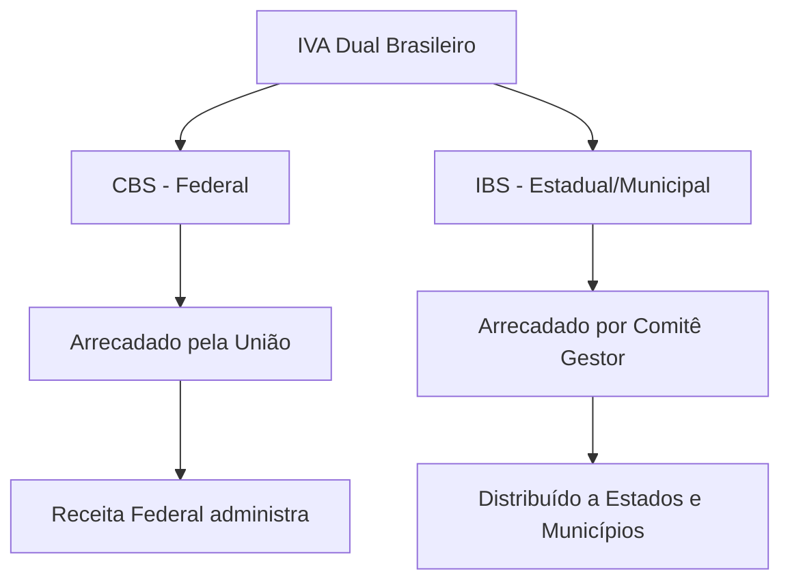

# 🏛️ Reforma Tributária Brasileira - Sol.NET ERP

## 🎯 Visão Geral

A **Reforma Tributária Brasileira** representa a maior mudança no sistema tributário nacional das últimas décadas. Aprovada pela Emenda Constitucional 132/2023, a reforma simplifica o modelo de tributação sobre o consumo, substituindo **cinco tributos** por **dois novos impostos**.

### 📊 Principais Características da Reforma:
- ✅ **Simplificação**: De 5 para 2 tributos sobre consumo
- ✅ **IVA Dual**: IBS (estadual/municipal) + CBS (federal)
- ✅ **Não Cumulatividade Plena**: Crédito total na cadeia produtiva
- ✅ **Transição Gradual**: Período de 2026 a 2033
- ✅ **Alíquota Única**: Por tipo de produto/serviço
- ✅ **Fim da Guerra Fiscal**: Tributação no destino

---

## 📅 Cronograma de Implementação

### **Fase 1: Período de Teste (2026)**
```
📆 2026
├─ CBS: 0,9% (teste)
├─ IBS: 0,1% (teste)
└─ Tributos atuais mantidos (PIS, COFINS, ICMS, ISS)
```

### **Fase 2: Início da Transição (2027)**
```
📆 2027
├─ CBS substitui PIS/COFINS
├─ IBS começa a subir gradualmente
└─ ICMS/ISS começam redução proporcional
```

### **Fase 3: Transição Completa (2029-2032)**
```
📆 2029-2032
├─ Redução gradual: ICMS e ISS (10% ao ano)
├─ Aumento gradual: IBS (10% ao ano)
└─ CBS já operando em regime normal
```

### **Fase 4: Regime Definitivo (2033)**
```
📆 2033
├─ IBS em plena operação
├─ CBS em plena operação
└─ Extinção completa de ICMS/ISS
```

---

## 🔄 Mudanças nos Tributos

### **Tributos Extintos**

| Tributo | Tipo | Responsável | Status |
|---------|------|-------------|--------|
| **PIS** | Federal | União | Extinto em 2027 → CBS |
| **COFINS** | Federal | União | Extinto em 2027 → CBS |
| **ICMS** | Estadual | Estados | Extinto em 2033 → IBS |
| **ISS** | Municipal | Municípios | Extinto em 2033 → IBS |
| **IPI** | Federal | União | Extinto para maioria → CBS |

### **Novos Tributos**

#### **📌 CBS - Contribuição sobre Bens e Serviços**
- **Natureza**: Federal
- **Substitui**: PIS, COFINS e IPI (maioria)
- **Implementação**: 2027
- **Gestão**: Receita Federal
- **Base**: Mesmo fato gerador do IBS

#### **📌 IBS - Imposto sobre Bens e Serviços**
- **Natureza**: Estadual e Municipal
- **Substitui**: ICMS e ISS
- **Implementação gradual**: 2029-2033
- **Gestão**: Comitê Gestor do IBS
- **Base**: Destino da operação

---

## 💡 Principais Conceitos

### **🎯 IVA Dual (Imposto sobre Valor Agregado)**

O Brasil adotará um **modelo dual de IVA**, com dois tributos paralelos:



### **💳 Não Cumulatividade Plena**

**Antes da Reforma:**
- Limitações no aproveitamento de créditos
- Regras diferentes por tributo
- Créditos "presos" em algumas operações

**Após a Reforma:**
- ✅ **Crédito total** de IBS e CBS pagos nas compras
- ✅ **Mesma base de cálculo** para ambos
- ✅ **Neutralidade** na cadeia produtiva
- ✅ **Fim das cumulatividades** residuais

### **📍 Tributação no Destino**

**Mudança fundamental:**
- **Antes**: ICMS tributado na origem (guerra fiscal)
- **Depois**: IBS tributado no destino (consumidor final)
- **Impacto**: Fim dos incentivos fiscais baseados em localização

---

## 🏢 Impactos por Tipo de Empresa

### **🏪 Comércio Varejista**

#### **Simplificações:**
- ✅ Unificação de alíquotas por produto
- ✅ Crédito total sobre compras de mercadorias
- ✅ Menos obrigações acessórias
- ✅ Fim de regimes especiais complexos

#### **Atenção:**
- ⚠️ Produtos com alíquotas diferenciadas (cesta básica, saúde)
- ⚠️ Período de transição requer controle duplo (2029-2032)
- ⚠️ Adequação de sistemas fiscais

### **🏭 Indústria e Fabricação**

#### **Vantagens:**
- ✅ Crédito pleno de insumos e matérias-primas
- ✅ Fim da cumulatividade residual
- ✅ Maior competitividade exportações (desoneração completa)
- ✅ Simplificação da cadeia produtiva

#### **Desafios:**
- ⚠️ Revisão completa de precificação
- ⚠️ Reavaliação de benefícios fiscais atuais
- ⚠️ Controle de créditos na transição

### **🏥 Prestação de Serviços**

#### **Principais Mudanças:**
- ✅ Substituição do ISS por IBS
- ✅ Crédito sobre insumos (antes limitado no ISS)
- ✅ Alíquotas diferenciadas para serviços essenciais
- ✅ Unificação de regras nacionais

#### **Setores com Tratamento Especial:**
- 🏥 **Saúde**: Alíquota reduzida
- 🎓 **Educação**: Alíquota reduzida
- 🚌 **Transporte público**: Alíquota zero
- 🎭 **Cultura**: Possíveis isenções

---

## 📋 Alíquotas e Regimes Especiais

### **⚖️ Alíquota Padrão**

A alíquota padrão será definida para **neutralidade de receita**:
- **Estimativa inicial**: 26,5% a 27,5% (CBS + IBS somados)
- **CBS**: Aproximadamente 8,5% a 9,5%
- **IBS**: Aproximadamente 17,5% a 18,5%

> 💡 **Importante**: Valores estimados, sujeitos a ajustes conforme legislação regulamentadora

### **🎯 Alíquotas Diferenciadas**

#### **Alíquota Reduzida (60% da padrão)**
- 🍎 Produtos da cesta básica nacional
- 💊 Medicamentos essenciais
- 🚗 Dispositivos médicos e de acessibilidade
- 🧑‍🌾 Produtos agropecuários selecionados
- 🏥 Serviços de saúde
- 🎓 Serviços de educação

#### **Alíquota Zero**
- 🚌 Transporte público coletivo
- 📚 Livros, jornais e periódicos
- 🌾 Produtos hortifrutigranjeiros in natura
- 🥚 Ovos e produtos de avicultura básica
- 💊 Medicamentos para doenças graves (via Anvisa)

#### **Isenções e Imunidades**
- 🏛️ Exportações (desoneração total)
- 🏘️ Programa habitacional popular
- 🌱 Insumos agropecuários específicos
- ♻️ Produtos de economia circular (reciclagem)

### **📊 Simples Nacional**

**Adaptações previstas:**
- ✅ Manutenção do regime diferenciado
- ✅ CBS e IBS incluídos na guia única
- ✅ Alíquotas progressivas por faixa de faturamento
- ✅ Benefícios mantidos para pequenas empresas

---

## 🔧 Preparação no Sol.NET

### **📅 Checklist de Adequação**

#### **Fase 1: Diagnóstico (2024-2025)**
- [ ] **Mapear produtos/serviços** por categoria de alíquota
- [ ] **Identificar créditos** não aproveitados atualmente
- [ ] **Revisar processos** de precificação
- [ ] **Avaliar impacto** nos custos e margens
- [ ] **Capacitar equipe** sobre as mudanças

#### **Fase 2: Preparação Sistemas (2025-2026)**
- [ ] **Atualizar cadastro de produtos** com classificações NCM/NBS
- [ ] **Configurar novos tributos** (CBS e IBS) no sistema
- [ ] **Testar cálculos** com alíquotas estimadas
- [ ] **Preparar relatórios** de transição
- [ ] **Validar integrações** fiscais

#### **Fase 3: Período de Teste (2026)**
- [ ] **Habilitar CBS/IBS de teste** (0,9% e 0,1%)
- [ ] **Manter tributos atuais** em paralelo
- [ ] **Gerar documentos fiscais** no novo formato
- [ ] **Acompanhar legislação** e ajustes
- [ ] **Treinar usuários** no novo modelo

#### **Fase 4: Transição (2027-2032)**
- [ ] **Migrar PIS/COFINS para CBS** (2027)
- [ ] **Implementar redução gradual** ICMS/ISS
- [ ] **Controlar créditos duplos** (período transitório)
- [ ] **Ajustar precificação** conforme alíquotas
- [ ] **Monitorar legislação complementar**

#### **Fase 5: Regime Pleno (2033+)**
- [ ] **Operar exclusivamente** com CBS e IBS
- [ ] **Descontinuar** cálculos de ICMS/ISS
- [ ] **Otimizar aproveitamento** de créditos
- [ ] **Consolidar processos** simplificados

---

## 💻 Funcionalidades Sol.NET para Reforma Tributária

### **🔧 Configuração de Tributos**

**Menu**: Cadastros → Fiscal → Configuração de Tributos

#### **Configuração CBS:**
```
Nome: CBS - Contribuição sobre Bens e Serviços
Tipo: Federal
Vigência: A partir de 2027
Base de Cálculo: Valor da operação
Alíquota: Conforme produto/serviço
Aproveitamento: Crédito pleno
```

#### **Configuração IBS:**
```
Nome: IBS - Imposto sobre Bens e Serviços
Tipo: Estadual/Municipal
Vigência: Gradual 2029-2033
Base de Cálculo: Valor da operação (destino)
Alíquota: Conforme produto/serviço
Aproveitamento: Crédito pleno
```

### **📊 Cadastro de Produtos**

**Campos essenciais para reforma:**

| Campo | Descrição | Exemplo |
|-------|-----------|---------|
| **NCM** | Nomenclatura Comum Mercosul | 0201.10.00 |
| **NBS** | Nomenclatura Brasileira Serviços | 01.001.00 |
| **Categoria Tributária** | Padrão, Reduzida, Zero, Isento | Reduzida |
| **Alíquota CBS** | % da CBS aplicável | 5,4% (60% padrão) |
| **Alíquota IBS** | % do IBS aplicável | 10,5% (60% padrão) |
| **CEST** | Código Especificador Substituição | 01.001.00 |

### **📄 Documentos Fiscais**

**Notas Fiscais adaptadas:**
- ✅ **NFe 5.0**: Suporte a CBS e IBS
- ✅ **NFSe 2.0**: Adaptação para IBS em serviços
- ✅ **Detalhamento de créditos**: Destaque por tributo
- ✅ **DANFE atualizado**: Layout com novos tributos

### **📈 Relatórios Gerenciais**

**Novos relatórios disponíveis:**

#### **Análise de Impacto Tributário**
- Comparativo: Carga atual × Carga reforma
- Por produto/categoria
- Por período
- Simulações com diferentes alíquotas

#### **Controle de Créditos**
- Créditos CBS acumulados
- Créditos IBS acumulados
- Aproveitamento na cadeia
- Créditos extemporâneos

#### **Relatório de Transição**
- Tributos antigos × novos (2029-2032)
- Conciliação de valores
- Apuração dupla
- Validação fiscal

---

## 🎓 Exemplos Práticos

### **Exemplo 1: Loja de Alimentos (Comércio)**

**Situação Atual (2024):**
```
Compra de Arroz: R$ 100,00
├─ ICMS: R$ 12,00 (12%)
├─ PIS: R$ 1,65 (1,65%)
└─ COFINS: R$ 7,60 (7,6%)
Total Tributos: R$ 21,25

Venda ao consumidor: R$ 150,00
├─ ICMS: R$ 18,00 (12%)
├─ PIS: R$ 2,48 (1,65%)
└─ COFINS: R$ 11,40 (7,6%)
Total Tributos: R$ 31,88
Crédito aproveitado: R$ 21,25 (limitações em PIS/COFINS)
```

**Situação Futura (2033+):**
```
Compra de Arroz: R$ 100,00
├─ CBS: R$ 5,40 (5,4% - reduzida 60%)
└─ IBS: R$ 10,50 (10,5% - reduzida 60%)
Total Tributos: R$ 15,90

Venda ao consumidor: R$ 150,00
├─ CBS: R$ 8,10 (5,4%)
└─ IBS: R$ 15,75 (10,5%)
Total Tributos: R$ 23,85
Crédito aproveitado: R$ 15,90 (CRÉDITO PLENO)
Tributo efetivo: R$ 7,95 (sobre valor agregado)
```

**💡 Benefício**: Crédito pleno reduz carga sobre margem de lucro

### **Exemplo 2: Indústria de Móveis**

**Situação Atual (2024):**
```
Compra de Madeira: R$ 10.000,00
├─ ICMS: R$ 1.200,00 (12%)
├─ PIS: R$ 165,00 (1,65%)
├─ COFINS: R$ 760,00 (7,6%)
└─ IPI: R$ 500,00 (5%)
Crédito limitado por não cumulatividade parcial

Venda de Móvel: R$ 30.000,00
├─ ICMS: R$ 3.600,00 (12%)
├─ PIS: R$ 495,00 (1,65%)
├─ COFINS: R$ 2.280,00 (7,6%)
└─ IPI: R$ 1.500,00 (5%)
Carga total: R$ 7.875,00
Crédito aproveitado: ~R$ 2.125,00 (limitações)
Tributo efetivo: ~R$ 5.750,00
```

**Situação Futura (2033+):**
```
Compra de Madeira: R$ 10.000,00
├─ CBS: R$ 850,00 (8,5%)
└─ IBS: R$ 1.750,00 (17,5%)
Total: R$ 2.600,00

Venda de Móvel: R$ 30.000,00
├─ CBS: R$ 2.550,00 (8,5%)
└─ IBS: R$ 5.250,00 (17,5%)
Total tributos: R$ 7.800,00
Crédito pleno: R$ 2.600,00
Tributo efetivo: R$ 5.200,00 (sobre valor agregado)
```

**💡 Benefício**: Redução de ~R$ 550 + simplificação operacional

### **Exemplo 3: Clínica Médica (Serviços)**

**Situação Atual (2024):**
```
Consulta médica: R$ 200,00
├─ ISS: R$ 4,00 (2% - alíquota município)
├─ PIS: R$ 1,30 (0,65% - serviço)
└─ COFINS: R$ 6,00 (3% - serviço)
Carga: R$ 11,30 (5,65%)
Sem crédito de materiais/equipamentos
```

**Situação Futura (2033+):**
```
Consulta médica: R$ 200,00
├─ CBS: R$ 5,10 (5,1% - 60% reduzida)
└─ IBS: R$ 10,50 (10,5% - 60% reduzida)
Carga: R$ 15,60 (7,8%)
✅ COM crédito sobre materiais médicos, equipamentos, insumos
Crédito aproveitado: ~R$ 3,00 (estimativa)
Tributo líquido: ~R$ 12,60
```

**💡 Mudança**: Leve aumento, mas com aproveitamento de créditos antes negados

---

## ❓ FAQ - Perguntas Frequentes

### **Q: Quando a reforma entra em vigor completamente?**
**R:** A implementação é gradual:
- **2026**: Teste (CBS 0,9% + IBS 0,1%)
- **2027**: CBS substitui PIS/COFINS
- **2029-2032**: Transição gradual ICMS/ISS → IBS
- **2033**: Regime pleno (somente CBS + IBS)

---

### **Q: Minha empresa terá que pagar mais impostos?**
**R:** **Não necessariamente**. A reforma busca **neutralidade de receita** (arrecadação total semelhante). O impacto varia por setor:
- ✅ **Beneficiados**: Indústria, exportadores, serviços (crédito pleno)
- ⚠️ **Atenção**: Setores que hoje têm benefícios regionais (guerra fiscal)
- 🎯 **Produtos essenciais**: Alíquotas reduzidas (cesta básica, saúde, educação)

---

### **Q: Vou poder usar crédito de TUDO que compro?**
**R:** **Sim**, com algumas exceções:
- ✅ **Crédito pleno**: Insumos, matérias-primas, mercadorias para revenda, energia, telecomunicações, serviços
- ❌ **Exceções**: Bens de uso pessoal, algumas despesas não relacionadas à atividade

A não cumulatividade será **ampla**, permitindo crédito em praticamente toda a cadeia produtiva.

---

### **Q: Como ficam os benefícios fiscais que minha empresa tem hoje?**
**R:** **Transição gradual com regras específicas**:
- 🎯 **Até 2032**: Benefícios existentes mantidos (redução proporcional)
- 🎯 **Após 2033**: Apenas benefícios previstos na Reforma (poucos setores)
- ⚠️ **Impacto**: Zonas francas, incentivos estaduais podem ser reduzidos/extintos
- 💡 **Recomendação**: Avaliar dependência de incentivos e planejar transição

---

### **Q: O Simples Nacional vai acabar?**
**R:** **NÃO**. O Simples será **mantido e adaptado**:
- ✅ Regime diferenciado continua
- ✅ CBS e IBS incluídos na guia única (DAS)
- ✅ Alíquotas progressivas por faixa mantidas
- ✅ Vantagens para pequenas empresas preservadas
- 🔄 Possíveis ajustes nas alíquotas/faixas após 2027

---

### **Q: Como fica a tributação de produtos importados?**
**R:** **Mesmas regras que produtos nacionais**:
- ✅ CBS e IBS incidem na importação
- ✅ Fim do tratamento diferenciado (ICMS importação)
- ✅ Competitividade equalizada (nacional × importado)
- ⚠️ Adiciona-se ao Imposto de Importação (não afetado pela reforma)

---

### **Q: E as exportações?**
**R:** **Desoneração total mantida e ampliada**:
- ✅ CBS: Alíquota zero em exportações
- ✅ IBS: Alíquota zero em exportações
- ✅ **Crédito total** dos insumos utilizados (antes limitado)
- 🎯 **Resultado**: Maior competitividade internacional

---

### **Q: Minha nota fiscal vai mudar?**
**R:** **Sim, com adaptações graduais**:
- 📄 **NFe 5.0**: Campos para CBS e IBS
- 📄 **NFSe 2.0**: Adaptação para serviços com IBS
- 🔄 **Período de transição**: Tributos antigos + novos (2029-2032)
- 💻 **Sol.NET**: Atualizações automáticas conforme legislação

---

### **Q: Preciso fazer algo agora?**
**R:** **Preparação é fundamental**:
1. ✅ **Mapear produtos/serviços** por categoria de alíquota
2. ✅ **Entender impactos** específicos do seu segmento
3. ✅ **Acompanhar legislação** regulamentadora
4. ✅ **Capacitar equipe** fiscal e financeira
5. ✅ **Simular cenários** de custos e preços
6. ✅ **Preparar sistemas** (Sol.NET terá atualizações)

---

### **Q: O Sol.NET já está preparado para a reforma?**
**R:** **Sim, com atualizações progressivas**:
- ✅ **Monitoramento ativo** da legislação
- ✅ **Atualizações graduais** conforme cronograma oficial
- ✅ **Fase de teste 2026**: Sistema preparado
- ✅ **Suporte técnico** especializado
- ✅ **Treinamentos** disponibilizados
- 📅 **Comunicação prévia** de todas as mudanças

---

### **Q: Onde encontro as alíquotas exatas de CBS e IBS?**
**R:** **Ainda em definição**:
- ⏳ **Legislação complementar** definirá alíquotas específicas
- 📊 **Estimativas atuais**: Alíquota padrão ~26,5% a 27,5% (CBS+IBS)
- 🎯 **Diferenciações**: Lei específica definirá produtos/serviços com alíquotas reduzidas/zero
- 📅 **Prazo**: Definição até meados de 2025
- 💻 **Sol.NET**: Atualizações automáticas quando publicadas

---

### **Q: Como calcular o impacto na minha margem de lucro?**
**R:** **Use o Sol.NET para simulações**:
1. 📊 **Relatório de Análise de Impacto** (disponível em versões futuras)
2. 🧮 **Simulador de Preços**: Teste diferentes cenários
3. 📈 **Comparativo**: Carga atual vs. estimada reforma
4. 💡 **Recomendação**: Considere aproveitamento de créditos (principal benefício)

**Exemplo básico:**
```
Cenário Atual:
Compra: R$ 100 (tributos R$ 21,25 - crédito limitado ~R$ 10)
Venda: R$ 150 (tributos R$ 31,88)
Custo tributário líquido: ~R$ 21,88

Cenário Reforma:
Compra: R$ 100 (tributos R$ 26 - crédito pleno R$ 26)
Venda: R$ 150 (tributos R$ 39)
Custo tributário líquido: R$ 13 (sobre valor agregado)
```

---

## 🚨 Atenção Especial

### **⚠️ Pontos Críticos para Gestores**

#### **1. Revisão de Precificação**
- 🎯 **Necessário**: Recalcular preços considerando nova carga tributária
- 🎯 **Considerar**: Aproveitamento de créditos (pode reduzir carga efetiva)
- 🎯 **Planejamento**: Fazer durante período de transição (2027-2032)

#### **2. Classificação Fiscal de Produtos**
- 🎯 **NCM/NBS precisos**: Determinam alíquota aplicável
- 🎯 **Revisão completa**: Validar todos os cadastros
- 🎯 **Atualização**: Acompanhar mudanças na tabela de classificação

#### **3. Créditos Tributários**
- 🎯 **Aproveitar tudo**: Não cumulatividade plena é grande vantagem
- 🎯 **Controle rigoroso**: Documentação de todas as compras
- 🎯 **Validação**: Sistema de créditos no Sol.NET

#### **4. Benefícios Fiscais Atuais**
- 🎯 **Avaliar dependência**: Quantificar impacto da perda
- 🎯 **Planejar transição**: Período 2027-2032 para ajustes
- 🎯 **Alternativas**: Buscar eficiência operacional

---

## 📚 Recursos Adicionais

### **📖 Legislação de Referência**
- **EC 132/2023**: Emenda Constitucional da Reforma Tributária
- **Projeto de Lei Complementar**: Regulamentação (em tramitação)
- **Resoluções do Comitê Gestor**: Normas operacionais (futuras)

### **🎓 Materiais de Estudo**
- **Guia Rápido Reforma Tributária**: [Em desenvolvimento]
- **Webinar Sol.NET**: Calendário de treinamentos
- **Cases práticos**: Simulações por segmento
- **FAQ Técnico**: Dúvidas aprofundadas

### **💻 Ferramentas Sol.NET**
- **Simulador de Impacto**: Análise personalizada
- **Configurador de Tributos**: Setup CBS/IBS
- **Relatórios de Transição**: Acompanhamento gradual
- **Central de Atualização**: Novidades legislativas

### **📞 Suporte Especializado**
- **E-mail**: reforma.tributaria@solnet.com.br
- **Webinars mensais**: Atualizações e tira-dúvidas
- **Consultoria**: Planejamento personalizado
- **Documentação**: Portal sempre atualizado

---

## 🎯 Cronograma de Ações Sol.NET

### **2024-2025: Preparação**
- ✅ Estudo da legislação e regulamentações
- ✅ Desenvolvimento de funcionalidades preliminares
- ✅ Capacitação da equipe de suporte
- ✅ Criação de materiais educativos

### **2026: Teste**
- 📅 Implementação CBS/IBS de teste (0,9% e 0,1%)
- 📅 Documentos fiscais adaptados
- 📅 Treinamentos com clientes
- 📅 Validação em ambiente real

### **2027: CBS em Produção**
- 📅 Substituição completa PIS/COFINS por CBS
- 📅 Relatórios de apuração CBS
- 📅 Controle de créditos CBS
- 📅 Suporte intensivo na migração

### **2029-2032: Transição IBS**
- 📅 Controles duplos: ICMS/ISS + IBS
- 📅 Redução gradual programada
- 📅 Relatórios de conciliação
- 📅 Ajustes conforme feedback usuários

### **2033: Regime Definitivo**
- 📅 Sistema operando exclusivamente CBS + IBS
- 📅 Descontinuação de cálculos antigos
- 📅 Otimização de processos
- 📅 Consolidação de boas práticas

---

## 💼 Recomendações Estratégicas

### **Para Empresas de Pequeno Porte**
1. ✅ **Mantenha-se no Simples Nacional** (vantagens preservadas)
2. ✅ **Aproveite créditos** mesmo sendo Simples (novidade!)
3. ✅ **Simplifique processos** com as facilidades da reforma
4. ✅ **Capacite equipe** gradualmente

### **Para Empresas de Médio Porte**
1. ✅ **Avalie impacto tributário** detalhadamente
2. ✅ **Revise precificação** considerando créditos plenos
3. ✅ **Mapeie benefícios fiscais** e planeje transição
4. ✅ **Invista em sistemas** preparados (Sol.NET)
5. ✅ **Consultoria especializada** para casos complexos

### **Para Grandes Empresas**
1. ✅ **Planejamento tributário** abrangente
2. ✅ **Simulações financeiras** complexas
3. ✅ **Reestruturação da cadeia** de suprimentos
4. ✅ **Governança tributária** robusta
5. ✅ **Integração sistêmica** completa
6. ✅ **Equipe dedicada** para a transição

---

## 🔗 Links Relacionados

### **Documentação Sol.NET Relacionada**
- 📊 [Documentação DRE](Documentacao DRE.md) - Impacto no resultado
- 📄 [Documentação de Portadores](Documentacao Portadores.md) - Meios de pagamento
- 💰 [Módulo Financeiro](README.md) - Visão geral

### **Outros Módulos Afetados**
- 📦 [Módulo Movimentação](../Movimentacao/README.md) - Documentos fiscais
- 👥 [Módulo RH](../RH/README.md) - Encargos e tributação folha
- 🏢 [Portal Principal](../README.md) - Documentação geral

---

## 📊 Glossário de Termos

| Termo | Significado |
|-------|-------------|
| **CBS** | Contribuição sobre Bens e Serviços (Federal) |
| **IBS** | Imposto sobre Bens e Serviços (Estadual/Municipal) |
| **IVA** | Imposto sobre Valor Agregado |
| **Não Cumulatividade** | Sistema que permite crédito do imposto pago em etapa anterior |
| **Alíquota Padrão** | Percentual básico aplicado à maioria dos produtos/serviços |
| **Alíquota Reduzida** | Percentual menor (60% da padrão) para itens essenciais |
| **NCM** | Nomenclatura Comum do Mercosul (classificação produtos) |
| **NBS** | Nomenclatura Brasileira de Serviços (classificação serviços) |
| **Comitê Gestor** | Órgão que administrará o IBS |
| **Tributação no Destino** | Tributo recolhido onde produto/serviço é consumido |
| **Guerra Fiscal** | Competição entre estados via incentivos (fim previsto) |
| **Split Payment** | Divisão automática de pagamentos (tributo × fornecedor) |

---

**📅 Última atualização**: Dezembro de 2024  
**📦 Versão**: 1.0  
**🎯 Público-alvo**: Gestores, contadores, administradores e usuários Sol.NET  
**⚖️ Base legal**: Emenda Constitucional 132/2023 e legislação complementar

---

> **💡 Nota Importante**: Esta documentação está em constante atualização conforme publicação de leis complementares e regulamentações. O Sol.NET acompanhará todas as mudanças legislativas, garantindo conformidade total ao longo da transição.

> **🤝 Conte com o Sol.NET**: Sua parceira tecnológica na transição para o novo modelo tributário brasileiro. Estamos preparados para guiar sua empresa nesta transformação histórica.
