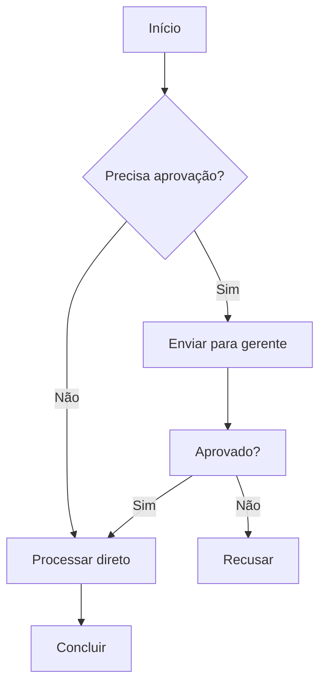
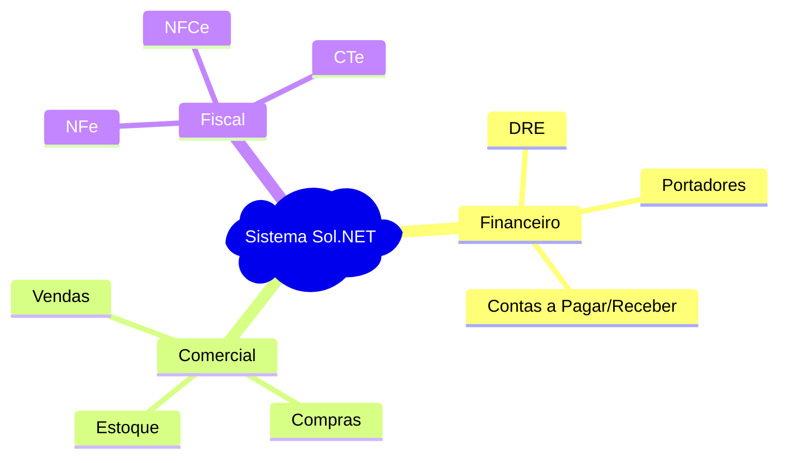
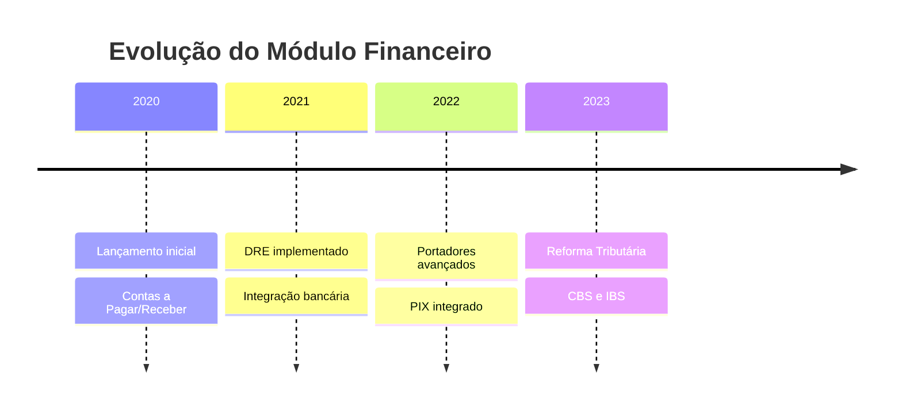
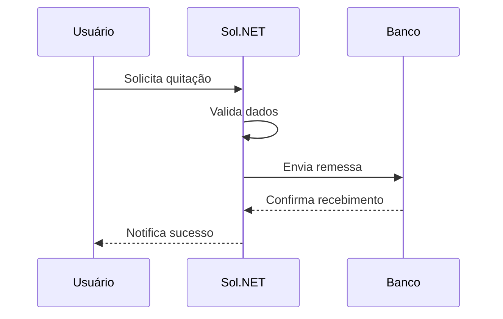
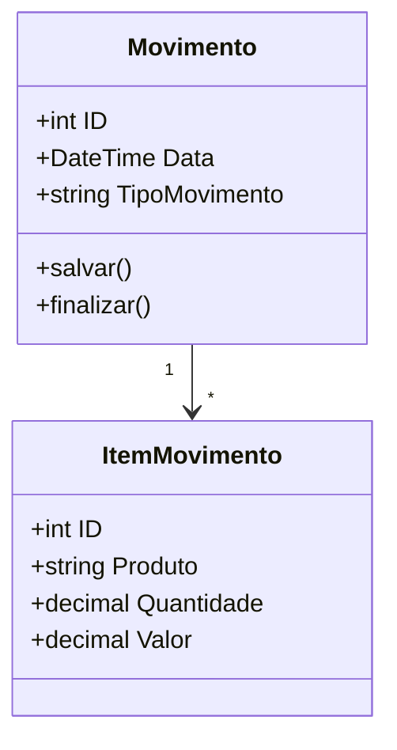
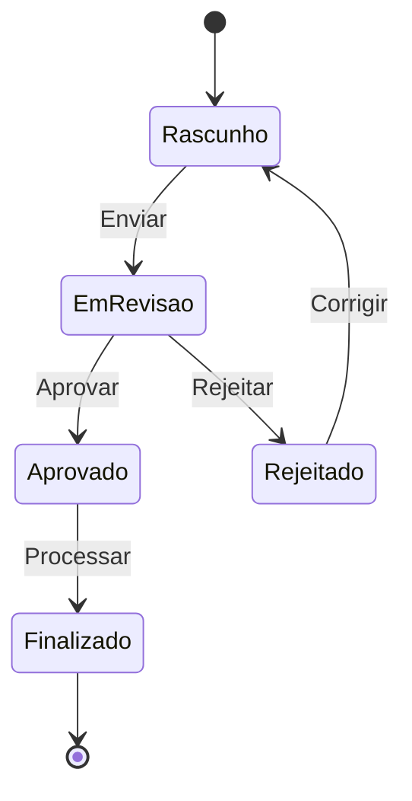
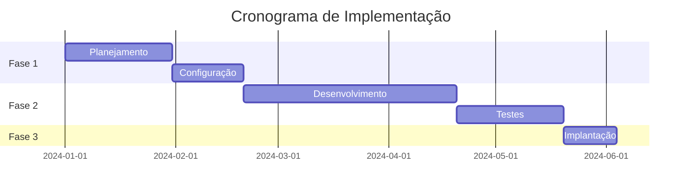
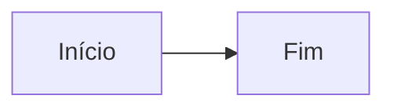

# 📊 Guia de Uso - Diagramas Mermaid

## 🎯 Visão Geral

A documentação Sol.NET agora suporta renderização automática de diagramas Mermaid quando publicada no GitHub Pages. Isso permite criar diagramas dinâmicos e visualmente atraentes diretamente em arquivos Markdown.

---

## ✅ O que é Mermaid?

**Mermaid** é uma ferramenta que permite criar diagramas e gráficos usando sintaxe Markdown. Os diagramas são definidos como código e renderizados automaticamente como SVG.

### Principais Vantagens:
- ✅ **Fácil de editar** - Apenas texto em Markdown
- ✅ **Versionável** - Rastreável no Git
- ✅ **Responsivo** - Adapta-se a diferentes tamanhos de tela
- ✅ **Profissional** - Visual moderno e limpo

---

## 📝 Como Usar

### Sintaxe Básica

Para adicionar um diagrama Mermaid em qualquer arquivo `.md`, use:

````markdown
```mermaid
[tipo de diagrama]
  [conteúdo do diagrama]
```
````

---

## 🎨 Tipos de Diagramas Suportados

### 1️⃣ **Diagrama de Fluxo** (Flowchart)

Ideal para processos e decisões:

````markdown

````

**Orientações disponíveis:**
- `graph TD` - Top Down (cima para baixo)
- `graph LR` - Left to Right (esquerda para direita)
- `graph BT` - Bottom to Top (baixo para cima)
- `graph RL` - Right to Left (direita para esquerda)

---

### 2️⃣ **Mindmap** (Mapa Mental)

Ideal para estruturas hierárquicas:

````markdown

````

---

### 3️⃣ **Timeline** (Linha do Tempo)

Ideal para cronogramas e históricos:

````markdown

````

---

### 4️⃣ **Diagrama de Sequência**

Ideal para interações entre sistemas:

````markdown

````

---

### 5️⃣ **Diagrama de Classes**

Ideal para estrutura de dados:

````markdown

````

---

### 6️⃣ **Diagrama de Estado**

Ideal para status e transições:

````markdown

````

---

### 7️⃣ **Gráfico de Gantt**

Ideal para cronogramas de projeto:

````markdown

````

---

## 💡 Dicas de Uso

### ✅ Boas Práticas:

1. **Mantenha simples** - Evite diagramas muito complexos
2. **Use labels descritivos** - Facilita a compreensão
3. **Teste antes de publicar** - Use a página TESTE_MERMAID.md
4. **Cores e estilos** - Mermaid suporta customização via CSS
5. **Comentários** - Use `%%` para comentários no código Mermaid

### 📌 Exemplos de Comentários:

````markdown

````

---

## 🧪 Teste Seus Diagramas

### Online:
Antes de adicionar à documentação, teste em:
- **[Mermaid Live Editor](https://mermaid.live/)** - Editor online oficial

### No Repositório:
Use a página de teste:
- `TESTE_MERMAID.md` - Exemplos funcionais

---

## 🔗 Recursos Adicionais

### 📚 Documentação Oficial:
- **[Mermaid Docs](https://mermaid.js.org/)** - Documentação completa
- **[Sintaxe](https://mermaid.js.org/intro/syntax-reference.html)** - Referência de sintaxe
- **[Exemplos](https://mermaid.js.org/ecosystem/integrations-community.html)** - Galeria de exemplos

### 🎨 Customização:
- **[Temas](https://mermaid.js.org/config/theming.html)** - Como personalizar cores
- **[Configuração](https://mermaid.js.org/config/setup/modules/mermaidAPI.html)** - Opções avançadas

---

## ⚙️ Configuração Técnica

### Arquivos do Sistema:

| Arquivo | Função |
|---------|--------|
| `_includes/mermaid.html` | Script de inicialização Mermaid.js |
| `_layouts/default.html` | Layout que inclui o suporte Mermaid |
| `_config.yml` | Configuração Jekyll com plugins |

### Versões Utilizadas:
- **Mermaid.js**: v10.9.1
- **Security Level**: strict (maior segurança)
- **CDN**: jsdelivr.net

---

## ❓ Problemas Comuns

### Diagrama não renderiza?

1. **Verifique a sintaxe** - Use o [Mermaid Live Editor](https://mermaid.live/)
2. **Backticks corretos** - Devem ser três ` antes e depois
3. **Indentação** - Mermaid é sensível a espaços
4. **Aguarde deploy** - GitHub Pages pode levar alguns minutos

### Diagrama aparece cortado?

- **Reduza a complexidade** - Divida em diagramas menores
- **Ajuste a orientação** - Tente `graph LR` ao invés de `graph TD`
- **Use zoom** - Navegadores permitem zoom em SVG

---

## 🚀 Exemplos Práticos na Documentação

### Diagramas Existentes:

1. **[RH/README.md](../RH/README.md)** - Fluxo de trabalho RH
2. **[Movimentacao/README.md](../Movimentacao/README.md)** - Sistema de Movimentação
3. **[Financeiro/Documentacao Reforma Tributaria.md](../Financeiro/Documentacao%20Reforma%20Tributaria.md)** - Timeline da reforma

---

**📅 Criado**: Dezembro de 2024  
**🎯 Objetivo**: Guiar uso de diagramas Mermaid na documentação Sol.NET  
**👥 Público**: Contribuidores da documentação
