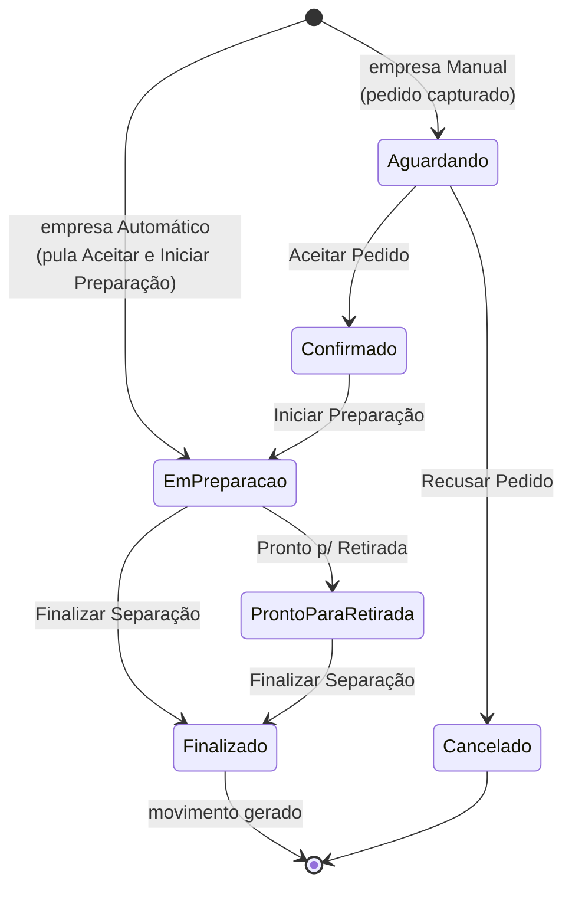

# 📄 Integração de Pedidos iFood - Sol.NET

## 🎯 Visão Geral

A **Integração de Pedidos iFood** conecta o Sol.NET diretamente à API do iFood para receber, processar e faturar pedidos do aplicativo **sem digitação manual**. A integração funciona em duas pontas que trabalham juntas:

1. **Captura automática** — o `Sol.NET Monitor de Integração` consulta a API do iFood a cada poucos minutos, identifica novos pedidos e os grava no banco do Sol.NET.
2. **Operação do balcão** — o atendente abre a tela `Monitor de Pedidos iFood` (código `151`), aceita o pedido, faz a separação dos itens e finaliza, gerando um movimento de venda no Sol.NET.

### Principais características:

- ✅ Captura contínua dos pedidos enquanto o monitor de integração está rodando
- ✅ Aceite manual (atendente clica em `Aceitar Pedido`) ou automático (sistema confirma sozinho na API ao receber)
- ✅ Fluxo de separação com status visíveis (Aguardando → Confirmado → Em Preparação → Pronto p/ Retirada)
- ✅ Exclusão de item por ruptura de estoque, com baixa automática no iFood
- ✅ Ajuste de quantidade do item, sincronizado com o iFood
- ✅ Vínculo manual de produto quando o código externo do iFood não bate com o `Cadastro de Produtos`
- ✅ Recusa com motivos oficiais do iFood
- ✅ Tratamento automático de cancelamentos e disputas iniciados pelo próprio cliente no app
- ✅ Geração do movimento de venda já com itens e pessoa associada
- ✅ Funciona por empresa: cada empresa do Sol.NET pode ter seu próprio Merchant ID iFood

---

## 🛠️ Pré-requisitos

Antes de qualquer configuração, garanta que:

- ✅ A empresa possui a **licença SAC iFood** ativa na Hetosoft. Sem ela, o processo de captura ignora a empresa e registra que a licença não foi encontrada.
- ✅ A empresa tem o **Merchant ID iFood** preenchido na aba `iFood` do `Cadastro de Empresas` (código `1`). Esse identificador vem do próprio iFood e é o que liga aquela empresa à conta do restaurante no app.
- ✅ Os **produtos vendidos no iFood** já estão cadastrados no `Cadastro de Produtos` (código `32`) e sincronizados com o iFood. A integração faz o vínculo pelo campo `Código` do produto.
- ✅ Existe um **Tipo de Movimento** apropriado no `Cadastro de Tipos de Movimento` para representar a venda iFood (escolha do tipo determina toda a regra contábil e financeira do movimento gerado — ver seção [Movimento gerado](#-movimento-gerado)).
- ✅ O **`Sol.NET Monitor de Integração`** está instalado e configurado para rodar no servidor da loja, com o `iFood` registrado entre os processos de e-commerce.
- ✅ As tabelas internas da integração já foram criadas (atualização automática do banco no primeiro `Sol.NET` aberto após receber a versão com iFood — `IFOOD_PEDIDOS`, `IFOOD_EVENTOS`, `IFOOD_PEDIDO_ITENS` e as colunas `IFOOD_*` em `EMPRESAS`).

---

## ⚙️ Configuração no Cadastro de Empresas

A configuração da integração mora no `Cadastro de Empresas` (código `1`), dentro da aba **`iFood`**.

> ⚠️ **Acesso de suporte necessário:** alterações no `Cadastro de Empresas` requerem permissão de acesso de suporte. Entre em contato com o suporte Hetosoft antes de realizar qualquer modificação nesta tela.

Para cada empresa que vai receber pedidos do iFood, preencha (além dos campos do iFood que já existiam — Merchant ID, tabela de preço, estoque mínimo):

### `Tipo de Movimento`
Tipo de movimento que será criado quando o pedido for finalizado. Lista somente tipos **ativos** do `Cadastro de Tipos de Movimento`. **Obrigatório** para que o pedido consiga ser finalizado — sem isso, a tela bloqueia a criação do movimento.

> ⚠️ **Acesso de suporte necessário:** alterações no `Cadastro de Tipos de Movimento` requerem permissão de acesso de suporte. Entre em contato com o suporte Hetosoft antes de realizar qualquer modificação nesta tela.

A escolha do tipo de movimento define **toda** a regra contábil, fiscal e financeira da venda — emissão de NFC-e, geração de contas a receber, baixa de estoque, comissão. Use sempre um tipo específico para iFood, separado dos tipos de balcão, para facilitar relatórios.

### `Confirmação`
Define como o sistema sinaliza o aceite ao iFood:

- **`Manual`** (padrão recomendado) — o pedido entra no `Monitor de Pedidos iFood` em status **`Aguardando`** e fica parado até o atendente clicar em `Aceitar Pedido`. Só nesse momento o Sol.NET responde "aceito" ao iFood. Use para lojas onde o atendente precisa ter o controle do que entra (estoque crítico, hora de pico, conferência humana).
- **`Automático`** — assim que o pedido chega ao Sol.NET pelo processo de captura, o sistema **já confirma no iFood automaticamente** e marca o pedido como **`Em Preparação`** no monitor (linha azul). Ele pula tanto o `Aceitar Pedido` quanto o `Iniciar Preparação` — o atendente entra direto na etapa de separação. Use quando a operação não precisa de camada manual de aprovação e a cozinha pode começar o preparo automaticamente.

A separação dos itens, a sinalização de pronto para retirada e a finalização **continuam manuais** independentemente desta configuração.

---

## 🔄 Captura automática de pedidos

A captura roda no aplicativo **`Sol.NET Monitor de Integração`** — uma aplicação à parte do Sol.NET principal, que fica em execução contínua no servidor.

### Como funciona
Em ciclos regulares, o monitor de integração:

1. Lê a lista de empresas com `Merchant ID iFood` preenchido e licença SAC iFood válida.
2. Para cada empresa, pergunta à API do iFood se há eventos novos (pedido novo, cancelado, em disputa).
3. Grava cada pedido inédito na tabela interna do Sol.NET (com o JSON completo da API), evita duplicação por chave única.
4. Avisa o iFood que recebeu os eventos (`acknowledgment`) para que eles não venham novamente.
5. Para pedidos novos: se a empresa está configurada como `Confirmação Automática`, já chama a API para confirmar; caso contrário, deixa o pedido em status **`Aguardando`** esperando ação do atendente.
6. Para cancelamentos vindos do iFood: marca o pedido como `CANCELLED` no banco e, se o movimento já tinha sido gerado, cancela o movimento e suas parcelas (ver [Cancelamentos e disputas](#-cancelamentos-e-disputas-vindos-do-ifood)).

### Visualizar e forçar uma rodada de captura

No `Sol.NET Monitor de Integração`, na área de log dos processos, o atendente encontra o processo **`Pedidos IFood`** rodando junto dos demais processos de e-commerce (Tray, WBuy, MercadApp). Para forçar uma rodada imediata sem esperar o próximo ciclo:

1. No `Sol.NET Monitor de Integração`, clique com o botão direito sobre a janela de log
2. No menu de contexto, escolha **`eCommerce → Pedidos IFood`**
3. O processo executa imediatamente para todas as empresas configuradas

Use a execução manual quando o atendente acabou de fazer um pedido teste pelo app e quer ver o efeito no monitor sem esperar.

### Se o processo parar
Se o `Sol.NET Monitor de Integração` for fechado ou der erro, **a captura para**. Os pedidos seguem entrando no iFood, mas não chegam ao Sol.NET até o monitor voltar — e quando voltar, ele puxa o atraso de uma vez. Por isso é parte do checklist de abertura de loja **garantir que o monitor de integração está em execução** antes de receber o primeiro pedido do dia.

---

## 🖥️ Monitor de Pedidos iFood (código 151)

A tela principal de operação é o **`Monitor de Pedidos iFood`** — código `151` na pesquisa F1.

### Layout da tela

A tela é dividida em três áreas verticais:

1. **Barra de ações** (topo) — botões coloridos do fluxo (`Atualizar`, `Aceitar Pedido`, `Recusar Pedido`, `Iniciar Preparação`, `Pronto p/ Retirada`, `Finalizar Separação`) e o filtro **`Data:`** que define qual dia mostrar no grid.
2. **Grid de pedidos** (centro-topo) — um pedido por linha, com **`Código`** (o short code do iFood), **`Empresa`**, **`Status`**, **`Tipo`** (entrega ou retirada), **`Total`**, **`Data`**, **`Hora`** e **`Observação`**.
3. **Painel de itens** (centro-baixo) — barra com `Vincular Produto`, `Ajustar Quantidade` e `Excluir Item (Ruptura)`, abaixo o grid de itens do pedido selecionado com **`Item`**, **`Produto (Sistema)`**, **`Vinculado`**, **`Qtd. Original`**, **`Qtd. Ajustada`**, **`Preço Unit.`**, **`Excluído`** e **`Obs.`**.
4. **Painel de detalhe** (rodapé) — recapitula `Código`, `Status`, `Tipo`, `Total`, `Empresa` e `Observação` do pedido selecionado.

### Filtro por data

O `Monitor de Pedidos iFood` carrega por padrão os pedidos **do dia atual**. Para conferir pedidos de outros dias (revisão, conferência fiscal, auditoria), altere a data no campo `Data:` no topo da tela — o grid recarrega automaticamente assim que a data muda.

### Cores no grid de pedidos

A cor da linha indica em que ponto do fluxo o pedido está:

- 🟡 **Amarelo** — pedido em status **`Aguardando`** (precisa de aceite do atendente)
- 🔵 **Azul** — pedido em status **`Em Preparação`** (separação em andamento)
- ⚪ **Branco / padrão** — outros status (já confirmado e aguardando preparação, pronto p/ retirada, cancelado, etc.)

### Cores no grid de itens

- 🔴 **Vermelho** — item sem vínculo de produto. **Não dá para aceitar nem finalizar o pedido enquanto houver linhas vermelhas.**
- ⚪ **Cinza com tachado** — item excluído por ruptura. Ignorado no momento da finalização.

---

## 🔁 Fluxo passo-a-passo (operação do atendente)

O ciclo de um pedido iFood no monitor tem cinco etapas. Cada etapa só fica disponível quando a anterior foi concluída — o sistema habilita os botões em sequência.

### 1️⃣ Receber o pedido

O pedido entra no monitor com linha **amarela** (`Aguardando`). O painel de itens carrega automaticamente quando o pedido é selecionado. Confira:

- Itens do pedido (coluna `Item`)
- Vínculo com produto do sistema (coluna `Vinculado` — se algum item estiver **vermelho/sem vínculo**, resolva isso antes de aceitar; veja [Vincular produto](#-vincular-produto))
- Observação do cliente (painel de detalhe)

### 2️⃣ Aceitar (ou recusar)

Com um pedido **`Aguardando`** selecionado, dois botões ficam habilitados:

- **`Aceitar Pedido`** (verde) — confirma o pedido na API do iFood **antes** de gravar no banco. Se a API rejeitar (credencial vencida, pedido já cancelado pelo cliente), a tela avisa e nada é alterado. Em sucesso, o status muda para **`Confirmado`** e a linha sai do amarelo.
- **`Recusar Pedido`** (vermelho) — abre a [tela de motivo de recusa](#-recusar-pedido). Veja a seção dedicada abaixo.

Se a empresa estiver com `Confirmação = Automático` no Cadastro de Empresas, o pedido **chega já em `Em Preparação`** (linha azul) — as etapas de Aceitar Pedido e Iniciar Preparação não aparecem no fluxo; o atendente entra direto na separação (passo 4 deste guia).

### 3️⃣ Iniciar Preparação

Com um pedido **`Confirmado`** selecionado, o botão **`Iniciar Preparação`** (âmbar) fica habilitado. Ao clicar:

- O Sol.NET avisa o iFood que a preparação começou (a tela do cliente no app passa a mostrar "Seu pedido está sendo preparado")
- O pedido vai para o status **`Em Preparação`** — a linha fica **azul** no grid
- Os botões de **manipulação de itens** (Vincular Produto, Ajustar Quantidade, Excluir Item) **só ficam disponíveis a partir daqui**

Use essa etapa para sinalizar à cozinha/separação que pode começar o preparo.

### 4️⃣ Ajustar itens durante a separação

Durante a separação, antes de finalizar, o atendente pode:

#### 🔗 Vincular produto
Quando um item do pedido vem **sem vínculo** (linha vermelha — o código que o iFood mandou não bate com nenhum produto do `Cadastro de Produtos`):

1. Selecione o item vermelho
2. Clique em **`Vincular Produto`**
3. Digite o `Código` ou o `ID` do produto certo no Sol.NET
4. O sistema valida (o produto precisa existir) e grava o vínculo

Pedidos com itens sem vínculo **não podem ser aceitos nem finalizados**. Resolva o vínculo, ou exclua o item por ruptura.

#### ⚖️ Ajustar quantidade
Quando o cliente pediu 3 e o estoque só permite servir 2:

1. Selecione o item
2. Clique em **`Ajustar Quantidade`**
3. Digite a nova quantidade (precisa ser maior que zero — para "remover", use Excluir Item)
4. O Sol.NET avisa o iFood; o app do cliente mostra a nova quantidade
5. A coluna `Qtd. Ajustada` no grid de itens recebe o valor

A quantidade ajustada é o que vai para o movimento final (não a original do pedido).

#### ❌ Excluir item (ruptura)
Quando o item simplesmente não pode ser entregue (acabou no estoque, fornecedor não trouxe):

1. Selecione o item
2. Clique em **`Excluir Item (Ruptura)`**
3. Confirme com o atendente
4. O Sol.NET avisa o iFood; o app do cliente é atualizado e tipicamente reembolsa o valor do item
5. O item fica **cinza com tachado** no grid e é **ignorado** no momento da finalização

> ℹ️ Esses ajustes só são possíveis enquanto o pedido está **`Em Preparação`**. Depois de **`Pronto p/ Retirada`** os botões ficam desabilitados.

### 5️⃣ Pronto para Retirada

Quando a separação está completa e o pedido aguarda o entregador/cliente, clique em **`Pronto p/ Retirada`** (azul). O Sol.NET avisa o iFood (no app do cliente aparece "Saiu para entrega"/"Pronto para retirada") e o status vai para **`Pronto`**.

Esse passo é **opcional do ponto de vista do Sol.NET** — `Finalizar Separação` pode ser chamado direto a partir de `Em Preparação`. Mas o uso correto melhora a comunicação com o cliente final no app.

### 6️⃣ Finalizar Separação

Com o pedido em `Em Preparação` ou `Pronto`, o botão **`Finalizar Separação`** (azul) fica disponível. Ao clicar:

1. O sistema **confere se todos os itens estão vinculados** — se houver vermelho, mostra a lista de itens problemáticos e bloqueia
2. Pede confirmação ("Finalizar separação do pedido X e gerar o movimento?")
3. Lê os dados do cliente do JSON do pedido (CPF/CNPJ + nome)
4. Resolve/cria a pessoa no `Cadastro de Pessoas` (ver [Resolução do cliente](#-resolução-do-cliente-pessoa))
5. **Cria o movimento de venda** no Sol.NET usando o `Tipo de Movimento iFood` configurado para a empresa, com os itens **não excluídos** e suas quantidades efetivas (ajustadas, quando aplicável)
6. Vincula o `ID_MOVIMENTO` ao pedido na tabela interna

A partir desse ponto, o pedido **já é uma venda no Sol.NET** e pode ser tratado como qualquer outro movimento.

---

## 🚫 Recusar pedido

Com um pedido **`Aguardando`** selecionado, clique em **`Recusar Pedido`** (vermelho). A tela `Recusar Pedido iFood` abre com:

- **Combo `Motivo *`** — lista de motivos **vindos da própria API do iFood** (não é uma lista fixa do Sol.NET; depende do que o iFood retorna naquele momento para aquele pedido). O motivo é **obrigatório**.
- **Campo `Descrição adicional`** — texto livre, **opcional**, para explicar mais. Útil quando o motivo da API é genérico e o atendente quer registrar o contexto.
- Botões **`Ok`** e **`Cancelar`**.

Ao clicar em `Ok`:

1. O Sol.NET chama a API do iFood para cancelar o pedido com o código de motivo selecionado
2. Em sucesso, marca o pedido como `Cancelado` no banco
3. Se a API rejeitar (motivo inválido, pedido já recusado), o atendente recebe um aviso e nada é gravado

Pedidos `Aguardando` sem ação do atendente **não são automaticamente recusados** — eles continuam aparecendo no monitor. Para limpar o painel é preciso aceitar ou recusar conscientemente.

---

## 👤 Resolução do cliente (pessoa)

Quando o pedido é finalizado, o Sol.NET precisa associá-lo a uma `Pessoa` para conseguir gerar o movimento. A resolução segue esta lógica:

1. **Se o pedido traz CPF (11 dígitos) ou CNPJ (14 dígitos)** no JSON do iFood, o Sol.NET procura uma pessoa cadastrada com aquele documento:
   - **Encontrou** → usa essa pessoa.
   - **Não encontrou** → cria uma **pessoa mínima** automaticamente, contendo nome (vindo do iFood) e documento. Demais campos ficam vazios e podem ser completados depois no `Cadastro de Pessoas` (código `5`) se a empresa precisar.
2. **Se o pedido não traz documento** (cliente comprou no iFood sem CPF na nota), o Sol.NET usa o nome **"Consumidor iFood"** e cria/usa uma pessoa genérica para representar a venda. Isso permite faturar mesmo sem identificação do consumidor final.

A pessoa criada/usada aparece normalmente no movimento gerado, então o relatório de vendas por cliente conta com ela como qualquer outra pessoa.

---

## 💰 Movimento gerado

O `Finalizar Separação` cria um movimento de venda no Sol.NET com:

- **Tipo de Movimento** = o configurado na aba `iFood` do `Cadastro de Empresas`
- **Empresa** = a empresa do pedido (a que recebeu pelo Merchant ID)
- **Pessoa** = resolvida conforme a seção anterior
- **Itens** = somente os **não excluídos**, com a **quantidade efetiva** (ajustada quando houver) e o preço unitário do pedido
- **Data de emissão** = a data corrente
- **Estado** = movimento **em aberto** (não finalizado automaticamente)

### Responsabilidade pela finalização financeira

O movimento entra **em aberto**. **Toda regra contábil e financeira do que vai acontecer com esse movimento — geração de NFC-e, baixa de estoque, conta a receber, comissão, classificação fiscal — está definida no `Tipo de Movimento`** escolhido na aba `iFood` do `Cadastro de Empresas`.

Por isso, configure o tipo de movimento iFood com cuidado:

- Se o tipo está configurado para **finalizar automaticamente** (emitir NFC-e, gerar contas a receber, baixar estoque), tudo isso acontece já no momento do `Finalizar Separação` no monitor.
- Se o tipo deixa o movimento aberto para conferência manual, o atendente/financeiro precisa abrir o movimento na tela `Vendas` (código `202`) e finalizá-lo normalmente.

A integração **não impõe** um modo nem outro — ela respeita o tipo de movimento configurado. Quando estiver implantando iFood em um cliente novo, alinhe com ele qual o comportamento esperado e configure o tipo de acordo.

---

## 🔁 Cancelamentos e disputas vindos do iFood

Nem todo cancelamento parte da loja. O cliente pode cancelar pelo app, e o iFood pode abrir uma disputa por reclamação. Esses eventos chegam ao Sol.NET pelo mesmo processo de captura.

### Cancelamento iniciado pelo cliente/iFood

Quando o iFood envia um evento de cancelamento (`CANCELLED`, `ORDER_CANCELLED` ou `CANCELLATION_REQUEST`):

1. O pedido é marcado como **`Cancelado`** no banco
2. **Se o movimento já tinha sido gerado** (`Finalizar Separação` já tinha sido feito), o Sol.NET **cancela o movimento** automaticamente **e também as parcelas a receber** ligadas a ele — desfaz o efeito financeiro
3. **Se o movimento ainda não tinha sido gerado**, basta marcar o pedido — não há nada a desfazer

O atendente nota o cancelamento porque o pedido some das linhas amarelas/azuis do monitor (ou aparece com status `Cancelado` no filtro do dia).

### Disputa

Quando o iFood abre uma disputa (`DISPUTE`, `ORDER_DISPUTE` ou `CONSUMER_DISPUTE`):

- O pedido é marcado como **`Em Disputa`** no banco
- O movimento, se já existir, **NÃO é cancelado** automaticamente — a disputa pode ser resolvida a favor da loja no próprio iFood, e nesse caso a venda continua válida
- A loja precisa acompanhar a disputa pelo painel do iFood e tomar decisão lá; o Sol.NET só registra que ela existe

---

## ❗ Limitações conhecidas

- A integração captura **eventos de pedido** (criado, cancelado, em disputa). Outros eventos do iFood (atualização de cardápio, alteração de preço, fechamento da loja) **não são tratados** por esta integração.
- A integração foi homologada com o fluxo **Aceitar → Iniciar Preparação → Pronto p/ Retirada → Finalizar Separação**. Lojas que pulam etapas (ex.: Aceitar direto para Finalizar) continuam funcionando, mas o cliente final no app não enxerga a evolução real do pedido — alinhe com a operação para usar todos os passos quando possível.
- A finalização financeira do movimento depende **inteiramente** da configuração do `Tipo de Movimento iFood`. Erros de configuração no tipo (ex.: forma de pagamento errada, série fiscal trocada) refletem como erros no movimento gerado, não na tela iFood — diagnóstico vai pelo cadastro de tipos, não pelo monitor.

---

## 💡 Exemplos Práticos

### Exemplo 1 — Pedido típico do almoço

> 12:15. O monitor de integração roda há horas em background. Chega um pedido novo no iFood. O processo `Pedidos IFood` captura na rodada seguinte. A empresa "Restaurante Centro" tem `Confirmação = Manual` configurado.

1. O atendente abre o `Monitor de Pedidos iFood` (F1 → `151`). O pedido aparece amarelo no grid.
2. Atendente seleciona o pedido. Painel de itens carrega 3 itens, todos vinculados (verdes).
3. Clica em `Aceitar Pedido`. O Sol.NET confirma na API; o pedido passa para `Confirmado` (linha sai do amarelo).
4. Cozinha começa o preparo. Atendente clica em `Iniciar Preparação`. Linha fica azul. No app do cliente: "Seu pedido está sendo preparado".
5. 10 minutos depois, pedido pronto. Atendente clica em `Pronto p/ Retirada`. App do cliente: "Aguardando entregador".
6. Entregador iFood pega o pedido. Atendente clica em `Finalizar Separação`. Confirma a janela. Movimento de venda é criado no Sol.NET com os 3 itens, no tipo configurado para iFood.

### Exemplo 2 — Cliente sem CPF, com ruptura de item

> Sábado à noite. Pedido novo chega com 1 hambúrguer, 1 batata frita grande, 1 refrigerante. O cliente não informou CPF no app. Acabou a batata frita grande no estoque.

1. Atendente aceita o pedido, inicia a preparação.
2. Seleciona a linha da batata frita grande no grid de itens. Clica em `Excluir Item (Ruptura)`. Confirma. O Sol.NET avisa o iFood — o cliente recebe a notificação que aquele item saiu do pedido, e o iFood reembolsa o valor.
3. Atendente prepara hambúrguer e refrigerante. Clica em `Pronto p/ Retirada`, depois `Finalizar Separação`.
4. Como o pedido veio sem CPF/CNPJ, o Sol.NET grava o movimento no nome de **"Consumidor iFood"** — uma pessoa genérica que serve para vendas sem identificação.

### Exemplo 3 — Cliente cancela pelo app depois da venda finalizada

> Pedido aceito, separado, finalizado. Movimento gerado e parcela de cartão criada no `Contas a Receber`. 5 minutos depois, o cliente cancela pelo app porque pediu errado.

1. O iFood envia evento `CANCELLATION_REQUEST` para a empresa.
2. Próximo ciclo do monitor de integração captura o evento.
3. O pedido vai para status `Cancelado` no banco.
4. Como o movimento já tinha sido gerado pela finalização da separação, o Sol.NET **automaticamente cancela** o movimento e a parcela de Contas a Receber.
5. No grid do monitor, ao filtrar o dia, o pedido aparece com status `Cancelado`. Atendente confere que o movimento também foi cancelado e segue o atendimento.

### Exemplo 4 — Produto novo, código não bate com o cadastro

> Pedido chega com um item "Pizza Especial Mês de Maio". O atendente cadastrou esse produto novo na semana passada, mas esqueceu de sincronizar o código com o iFood. O item aparece **vermelho** (sem vínculo) no grid.

1. Atendente seleciona o item vermelho.
2. Clica em `Vincular Produto`.
3. Na janela de busca, digita o `Código` do produto "Pizza Especial Mês de Maio" no Sol.NET (ex.: `9981`). O sistema localiza, mostra a descrição e grava o vínculo.
4. A linha do item vai para verde.
5. Atendente segue o fluxo normal (Aceitar → Iniciar Preparação → Finalizar).
6. Depois, o `Código` desse produto no Sol.NET é ajustado na sincronização de cardápio do iFood, para que os próximos pedidos do mesmo item já cheguem com o vínculo automático.

---

## ❓ FAQ / Problemas Comuns

### ❓ Recebi um pedido pelo app mas ele não aparece no Monitor de Pedidos. O que pode ser?

Verifique nessa ordem:
1. O `Sol.NET Monitor de Integração` está em execução? Sem ele, **nenhum pedido entra**.
2. O filtro `Data:` no monitor está no dia certo?
3. A empresa que recebeu o pedido tem `Merchant ID iFood` preenchido no `Cadastro de Empresas`?
4. A licença SAC iFood está ativa para essa empresa? Confira na Hetosoft.
5. Force uma rodada manual: clique direito na janela do monitor de integração → `eCommerce → Pedidos IFood`.

### ❓ O botão Aceitar Pedido está apagado/cinza. Por quê?

O `Aceitar Pedido` só fica disponível quando o pedido está em status **`Aguardando`**. Se ele já passou para `Confirmado` (porque a empresa está com `Confirmação = Automático` ou alguém já aceitou), o próximo passo é `Iniciar Preparação`, não `Aceitar`.

### ❓ Não consigo finalizar a separação. A tela avisa que tem item sem vínculo.

Algum item do pedido está com linha vermelha no grid de itens. O Sol.NET não permite gerar o movimento com itens não vinculados (não saberia que produto colocar no movimento). Você tem duas opções:
- **Vincular** o item ao produto correto com o botão `Vincular Produto`
- **Excluir** o item por ruptura com o botão `Excluir Item (Ruptura)` (o cliente é reembolsado pelo iFood)

### ❓ O cliente cancelou no app. Preciso fazer algo manualmente?

**Não.** O processo automático já trata: marca o pedido como `Cancelado`, e se a venda já tinha gerado movimento e parcela, cancela tudo. Você só precisa intervir se notar que o cancelamento não foi pego automaticamente — nesse caso confirme que o monitor de integração está rodando.

### ❓ Em que momento o estoque é baixado?

A baixa de estoque acontece quando o **movimento é finalizado** — não no momento do `Finalizar Separação` do monitor iFood, mas dependendo do `Tipo de Movimento` configurado. Se o tipo finaliza automaticamente, a baixa é simultânea. Se o tipo deixa em aberto, a baixa acontece quando o financeiro/atendente finaliza pela tela `Vendas` (código `202`).

### ❓ Posso usar iFood em mais de uma empresa do Sol.NET ao mesmo tempo?

Sim. Cada empresa tem seu próprio `Merchant ID iFood`, sua própria licença SAC iFood, seu próprio `Tipo de Movimento iFood` e seu próprio modo de `Confirmação`. O monitor de integração varre todas as empresas configuradas em cada rodada. No grid do `Monitor de Pedidos iFood`, a coluna `Empresa` identifica de qual empresa é cada pedido.

### ❓ Configurei `Confirmação = Automático`. Mesmo assim o atendente precisa fazer algo?

Sim. As etapas de **aceitar** e de **iniciar a preparação** são dispensadas — o pedido já entra no monitor em `Em Preparação` (linha azul) e o Sol.NET avisa o iFood automaticamente que o preparo começou. O atendente continua precisando: ajustar itens em caso de ruptura, sinalizar pronto para retirada e finalizar a separação para gerar o movimento. O `Automático` serve para evitar o "stuck" de pedidos esperando aprovação em horários de pico — não substitui a operação humana de balcão.

### ❓ O pedido apareceu duas vezes no grid. É bug?

Não. A captura tem proteção contra duplicação (chave única por `Empresa + ID do Pedido`). Se está vendo duas linhas, provavelmente são dois pedidos diferentes do mesmo cliente — confirme pelo `Código` (short code do iFood) na primeira coluna; ele é único por pedido.

### ❓ Tem como reabrir um pedido cancelado?

**Não.** Cancelamento (recusa pela loja ou pelo cliente) é definitivo do ponto de vista da integração. Para vender de novo é preciso fazer um novo pedido no iFood.

### ❓ A venda saiu no nome de "Consumidor iFood". Como mudo para o nome real do cliente?

Pedidos sem CPF/CNPJ são lançados em "Consumidor iFood" para permitir que a venda aconteça. Se o cliente depois informar o documento, você pode **alterar a pessoa do movimento** na tela `Vendas` (código `202`) — desde que o movimento ainda esteja em estado editável e a permissão de alteração esteja liberada.

### ❓ Preciso fazer alguma configuração de Forma de Pagamento na aba iFood?

A aba iFood **não exige** configuração de forma de pagamento. A forma de pagamento da venda iFood vem do **`Tipo de Movimento`** configurado para a empresa — toda regra financeira (forma, condição, plano de contas) está definida lá. Configure o tipo de movimento iFood com a forma de pagamento adequada (ex.: "iFood — Crédito on-line") e tudo se resolve automaticamente.

---

**Última atualização**: Maio de 2026  
**Versão**: 1.0  
**Público-alvo**: Usuários do Sol.NET e atendentes de balcão
