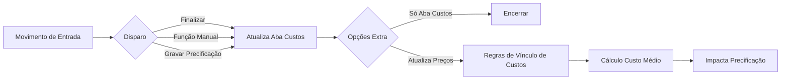

# 🧮 Atualização Automática de Custo - Sol.NET

## 🎯 Visão Geral
A **Atualização de Custo** garante que o cadastro de produtos reflita o custo real após entradas (ex: compras). O processo pode ocorrer de forma automática ou manual durante a operação de movimentos e influencia diretamente **margem, precificação e indicadores**.

### Principais Características:
- ✅ Integração automática ao finalizar movimentos de entrada
- ✅ Reaproveita informações da Nota Fiscal / movimento
- ✅ Respeita vínculos de custo por empresa
- ✅ Calcula (ou recalcula) Custo Médio conforme regra ativa
- ✅ Opcionalmente atualiza apenas a aba Custos

---

## ⚙️ Quando o Custo é Atualizado
O processo de atualização é disparado em qualquer um destes casos:
1. **Finalização** de movimento de Compra ou Outros, quando o Tipo de Movimento está com a opção: `Atualizar Custo do Produto ao Finalizar (Movimentos de Entrada)` = `Sem Confirmação` ou `Sem Confirmação, Depois Normal`.
2. Uso da função direta **"Atualizar custo sem confirmação"** pelo menu de funções (F2) ou clique direito no grid de Itens / Precificação.
3. Ação **Gravar** na aba **Precificação**.

Após execução, cada item impactado recebe a marcação **`Custo Atualizado`**. Novas tentativas no mesmo movimento ignoram itens já marcados, evitando recálculo desnecessário.

---

## 🧩 Componentes do Processo

---

## 🗂️ Etapa 1: Atualização da Aba "Custos"
Sempre ocorre primeiro, **mesmo que a aba não esteja visível**:
- Replica valores relevantes da NF / movimento para o cadastro do produto
- Recalcula o **Custo Médio** conforme regra ativa
- Atualiza custo base da empresa do movimento

Se a configuração `Opções Extra` (aba `Valores -> Total` do Tipo de Movimento) estiver definida como `Atualizar Custo Só da Aba Custos ( Sem Confirmação )`, o processo **termina aqui**.

---

## 🗂️ Etapa 2: Atualização da Aba "Preços" (quando aplicável)
Caso não exista a limitação acima, o sistema verifica quais **custos (1 a 8)** estão efetivamente em uso e aplica as regras de vínculo por empresa.

### Cenário Base de Exemplo
| Custo | Vínculo |
|-------|---------|
| 1 | Sem vínculo |
| 2 | Sem vínculo |
| 3 | Empresa 2 |
| 4 | Empresa 3 |

### 🏢 Empresa do Movimento SEM vínculo específico
> O sistema atualiza **apenas custos sem vínculo**.
Exemplo: NF da **Empresa 1** → Atualiza custos **1 e 2**.

### 🏢 Empresa do Movimento COM vínculo
> O sistema atualiza **somente o custo vinculado** à empresa.
Exemplo: NF da **Empresa 3** → Atualiza **custo 3** (exemplo original menciona 3/4; ajuste conforme cadastro real).

---

## 🧠 Cálculo do Custo Médio
### Quando a regra `Usar Custo Médio Ponderada Móvel (601)` ESTÁ marcada
- Calcula média ponderada entre:
	- `Custo Médio atual em estoque` (excluindo a nota em processamento) e
	- `Custo Unitário Total do item na NF`.
- Se **não há estoque anterior**, o custo médio passa a ser o próprio custo da nota.
- Estoque considerado: **todas as empresas**, exceto quando alguma opção em `Opções Extra` restringe para **apenas a empresa do movimento**.

### Quando a regra NÃO está marcada
- Aplica **média simples** de todas as entradas históricas + custo atual da nota.

> Dica: Manter a regra ponderada ativa torna o custo mais próximo da realidade contábil para operações com grande variação de preço.

---

## 💲 Integração com Precificação
### Atualizar Preço via aba "Precificação"
Processo que ajusta o **preço de venda** de acordo com valores definidos manualmente pelo usuário.

Os cálculos de **Margem**, **Apuração de Impostos** e **Ponto de Equilíbrio** usam:
- **Custo da Nota** → quando o item AINDA **não** tem `Custo Atualizado`.
- **Custo Atual do Produto** (cadastro) → quando o item JÁ está marcado como `Custo Atualizado`.

### Boas Práticas
- Atualize custo antes de ajustar margens sensíveis.
- Verifique se não há itens ignorados por já estarem marcados.
- Utilize relatórios para comparar variação de custo x preço.

---

## 🔍 Checklist Rápido de Verificação
- [ ] Tipo de Movimento correto?
- [ ] Regra de atualização configurada?
- [ ] Opções Extra limitando etapa 2?
- [ ] Vínculos de custo por empresa revisados?
- [ ] Regra 601 (ponderada) definida conforme política?
- [ ] Itens realmente marcaram `Custo Atualizado`?

---

## 💡 Exemplos Práticos
### Exemplo 1: Compra simples sem vínculos
Resultado: Atualiza custo empresa + custos 1 e 2.

### Exemplo 2: Compra filial vinculada
Resultado: Atualiza custo empresa + custo vinculado (ex: custo 4).

### Exemplo 3: Ajuste manual de preço após custo
Fluxo: Finalizar → Atualizar custo → Abrir aba Precificação → Definir nova margem → Gravar.

### Exemplo 4: Uso da função rápida
Operador aciona "Atualizar custo sem confirmação" em lote para agilizar múltiplos itens antes da precificação.

---

## ❓ FAQ / Problemas Comuns
### "O custo não foi recalculado ao repetir a ação"
Item provavelmente já marcado como `Custo Atualizado`.

### "Preço recalculou com margem diferente do esperado"
Verifique se o custo usado era o da NF ou o custo já consolidado.

### "Custos vinculados não atualizaram"
Confirme se a empresa do movimento corresponde ao vínculo do custo.

### "Custo médio ficou igual ao custo da nota"
Pode ser ausência de estoque anterior ou regra ponderada sem saldo histórico.

### "Somente a aba Custos foi atualizada"
`Opções Extra` pode estar definida para limitar a atualização.

---

## 🛠️ Dicas de Otimização
- Padronize vínculos de custos por empresa para evitar resultados inconsistentes.
- Revise periodicamente discrepâncias entre custo médio e último custo da nota.
- Utilize relatórios para monitorar variação percentual de custo x preço.
- Antes de promoções, valide se custos estão atualizados (evita margem negativa).

---

**Última atualização**: Agosto de 2025  
**Versão**: 1.0  
**Público-alvo**: Usuários finais e administradores (Custos / Operação)
