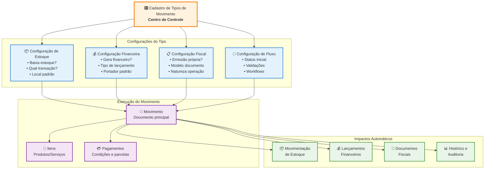

# 📋 Documentação: Sistema de Movimentação Sol.NET

## 🎯 Visão Geral

O **Sistema de Movimentação** é o núcleo operacional do Sol.NET ERP, responsável por gerenciar todas as operações comerciais da empresa, desde vendas e compras até transferências internas e ajustes de estoque. Este sistema oferece máxima flexibilidade através do **Cadastro de Tipos de Movimento**, onde todas as regras personalizáveis são definidas.

### Características Principais:
- ✅ **Flexibilidade Total**: Cada movimento pode ter comportamento único
- ✅ **Controle de Estoque**: Configurável por tipo de movimento
- ✅ **Gestão Financeira**: Geração automática de lançamentos contábeis
- ✅ **Integração Fiscal**: Emissão de documentos fiscais
- ✅ **Rastreabilidade**: Histórico completo das operações
- ✅ **Workflows Personalizados**: Adaptável a diferentes processos de negócio

---

## 🏗️ Arquitetura do Sistema de Movimentação



---

## 🎛️ Cadastro de Tipos de Movimento - Centro de Controle

O **Cadastro de Tipos de Movimento** é onde reside toda a **inteligência** do sistema. É através das configurações definidas aqui que cada movimento adquire seu comportamento específico.

### 🔑 Conceito Fundamental

> **Uma movimentação de venda não necessariamente baixa estoque e gera financeiro**. Tudo depende das **tags e configurações** definidas no Cadastro de Tipo de Movimento.

### Principais Configurações

#### 📦 **Configurações de Estoque**
- **Transação de Estoque**: Define se e como o estoque será afetado
  - *Entrada de Estoque*: Aumenta o saldo
  - *Saída de Estoque*: Diminui o saldo
  - *Sem Movimentação*: Não afeta o estoque
  - *Transferência*: Move entre locais
- **Local de Estoque Padrão**: Define o depósito utilizado
- **Validação de Estoque**: Se deve verificar saldo disponível

#### 💰 **Configurações Financeiras**
- **Tipo de Lançamento Financeiro**: Controla geração automática
  - *Contas a Receber*: Gera títulos de cobrança
  - *Contas a Pagar*: Gera compromissos de pagamento
  - *Sem Lançamento*: Não gera movimentação financeira
  - *Caixa Direto*: Movimentação imediata no caixa
- **Portador Padrão**: Banco ou carteira para os títulos
- **Condição de Pagamento**: Prazo e forma de parcelamento

#### 📋 **Configurações Fiscais**
- **Emissão Própria**: Se o documento fiscal será emitido pelo sistema
- **Modelo de Documento**: NF-e, NFC-e, Cupom Fiscal, etc.
- **Natureza da Operação**: Para composição do CFOP
- **Série do Documento**: Numeração fiscal

#### 🔄 **Configurações de Workflow**
- **Status Inicial**: Como o movimento inicia (Aberto, Finalizado)
- **Validações Obrigatórias**: Campos e verificações necessárias
- **Transformações Permitidas**: Quais tipos podem ser gerados a partir deste

---

## 📋 Fluxo de Trabalho - Passo a Passo

### 1. **Criação do Movimento**
```
🔘 F4 - Novo Movimento
├── Selecionar Tipo de Movimento
├── Definir Empresa de Origem
├── Informar Cliente/Fornecedor
└── Configurar parâmetros iniciais
```

### 2. **Inclusão de Itens**
```
📝 Adicionar Produtos/Serviços
├── Buscar produto (código/descrição)
├── Definir quantidade
├── Confirmar preço (automático ou manual)
├── Aplicar descontos/acréscimos
└── Calcular impostos automaticamente
```

### 3. **Configuração de Pagamento**
```
💳 Definir Condições de Pagamento
├── Selecionar condição de pagamento
├── Escolher portador/banco
├── Definir parcelas
└── Aplicar descontos à vista (se aplicável)
```

### 4. **Finalização**
```
🔘 F6 - Finalizar Movimento
├── Validar dados obrigatórios
├── Verificar estoque (se configurado)
├── Processar impactos automáticos:
│   ├── 📦 Movimentar estoque
│   ├── 💰 Gerar lançamentos financeiros
│   └── 🧾 Emitir documentos fiscais
└── Atualizar status para "Finalizado"
```

---

## ⌨️ Atalhos de Teclado

| Tecla | Função | Descrição |
|-------|--------|-----------|
| **F4** | Novo Movimento | Inicia um novo movimento |
| **F5** | Salvar Alterações | Salva modificações em edição |
| **F6** | Finalizar | Finaliza e processa o movimento |
| **F7** | Transformar Movimento | Converte para outro tipo |
| **F8** | Quitar Movimento | Baixa títulos financeiros |
| **Ctrl+N** | Novo Item | Adiciona item ao movimento |
| **Ctrl+E** | Editar Item | Edita item selecionado |
| **Delete** | Excluir Item | Remove item do movimento |
| **F3** | Pesquisar | Abre pesquisa global |
| **Ctrl+P** | Imprimir | Gera relatório do movimento |

---

## 💡 Exemplos Práticos

### Exemplo 1: Venda com Estoque e Financeiro
**Configuração do Tipo de Movimento "Venda Tradicional":**
- ✅ **Estoque**: Saída de Estoque
- ✅ **Financeiro**: Contas a Receber
- ✅ **Fiscal**: NFC-e Emissão Própria

**Resultado ao Finalizar:**
- 📉 Estoque é baixado automaticamente
- 💰 Títulos são gerados no Contas a Receber
- 🧾 NFC-e é emitida e enviada à SEFAZ

### Exemplo 2: Orçamento (Sem Impactos)
**Configuração do Tipo de Movimento "Orçamento":**
- ❌ **Estoque**: Sem Movimentação
- ❌ **Financeiro**: Sem Lançamento
- ❌ **Fiscal**: Não Fiscal

**Resultado ao Finalizar:**
- 📊 Apenas registro para consulta
- 🔄 Pode ser transformado em Venda posteriormente

### Exemplo 3: Venda de Serviço
**Configuração do Tipo de Movimento "Venda de Serviço":**
- ❌ **Estoque**: Sem Movimentação (serviços não têm estoque)
- ✅ **Financeiro**: Contas a Receber
- ✅ **Fiscal**: NFS-e Emissão Própria

**Resultado ao Finalizar:**
- 📊 Não afeta estoque
- 💰 Títulos são gerados normalmente
- 🧾 NFS-e é emitida para serviços

### Exemplo 4: Venda à Vista (Caixa Direto)
**Configuração do Tipo de Movimento "Venda à Vista":**
- ✅ **Estoque**: Saída de Estoque
- ✅ **Financeiro**: Caixa Direto
- ✅ **Fiscal**: NFC-e Emissão Própria

**Resultado ao Finalizar:**
- 📉 Estoque é baixado
- 💰 Valor vai direto para o caixa (sem títulos)
- 🧾 NFC-e é emitida

---

## ❓ Perguntas Frequentes (FAQ)

### **🤔 Por que uma venda não baixou estoque?**
**R:** O comportamento depende da configuração do Tipo de Movimento. Verifique:
- Se a Transação de Estoque está configurada como "Saída"
- Se o produto possui controle de estoque ativo
- Se o movimento foi finalizado (F6)

### **🤔 Por que não foram gerados títulos financeiros?**
**R:** Verifique a configuração do Tipo de Movimento:
- O Tipo de Lançamento Financeiro deve estar definido
- Para vendas: usar "Contas a Receber"
- Para compras: usar "Contas a Pagar"
- Para pagamento à vista: usar "Caixa Direto"

### **🤔 Como criar um orçamento que não afete estoque nem financeiro?**
**R:** Configure um Tipo de Movimento com:
- Transação de Estoque: "Sem Movimentação"
- Lançamento Financeiro: "Sem Lançamento"
- Documento Fiscal: "Não Fiscal"

### **🤔 É possível transformar um orçamento em venda?**
**R:** Sim, use a função **F7 - Transformar Movimento**:
- O orçamento original permanece inalterado
- É criado um novo movimento do tipo destino
- Os itens são copiados automaticamente

### **🤔 Como configurar vendas com entrega futura?**
**R:** Crie tipos de movimento específicos:
- **Venda com Entrega Futura**: Gera financeiro, mas não baixa estoque
- **Entrega de Mercadoria**: Baixa estoque, mas não gera financeiro
- Vincule os movimentos através de transformação

### **🤔 Posso ter diferentes comportamentos para o mesmo cliente?**
**R:** Sim! O comportamento é determinado pelo **Tipo de Movimento escolhido**, não pelo cliente:
- Venda à Vista → Caixa direto
- Venda a Prazo → Contas a Receber
- Orçamento → Sem impactos

### **🤔 Como funciona a validação de estoque negativo?**
**R:** Configurável no Tipo de Movimento:
- Se habilitada, impede finalizar movimentos que deixariam estoque negativo
- Útil para controle rigoroso de saídas
- Pode ser desabilitada para produtos sob encomenda

### **🤔 É possível ter movimentos que só geram fiscal, sem impactos?**
**R:** Sim, configure:
- Transação de Estoque: "Sem Movimentação"
- Lançamento Financeiro: "Sem Lançamento"  
- Documento Fiscal: "NF-e Emissão Própria"
- Útil para remessas, demonstrações, etc.

---

## 🎯 Cenários de Uso Avançados

### **Transferência Entre Filiais**
- **Tipo Saída**: Baixa estoque da origem, sem financeiro
- **Tipo Entrada**: Aumenta estoque do destino, sem financeiro
- Vinculação automática entre os movimentos

### **Venda Consignada**
- **Remessa Consignação**: Transfere produtos, sem baixa definitiva
- **Venda Consignação**: Confirma venda e baixa estoque
- **Retorno Consignação**: Reverte produtos não vendidos

### **Controle de Produção**
- **Requisição Produção**: Baixa matéria-prima
- **Retorno Produção**: Aumenta produto acabado
- Integração com ordem de produção

### **Ajustes de Estoque**
- **Entrada por Ajuste**: Correções para mais
- **Saída por Ajuste**: Correções para menos
- Rastreabilidade dos motivos de ajuste

---

## 📊 Indicadores e Controles

### **Status do Movimento**
- **🟡 Aberto**: Em edição, permite alterações
- **🟢 Finalizado**: Processado, impactos aplicados
- **🔴 Cancelado**: Anulado, reversão de impactos
- **🔗 Vinculado**: Transformado ou relacionado a outro

### **Controle de Numeração**
- **Numeração Automática**: Gerada pelo sistema
- **Numeração Manual**: Digitada pelo usuário
- **Múltiplas Séries**: Para diferentes propósitos

### **Auditoria e Rastreabilidade**
- **Histórico Completo**: Todas as alterações são registradas
- **Usuário Responsável**: Identificação de quem fez o que
- **Data/Hora**: Timestamp de cada operação

---

## 🚀 Melhores Práticas

### **Planejamento dos Tipos de Movimento**
1. **Mapeie os Processos**: Identifique todos os fluxos da empresa
2. **Defina Padrões**: Crie tipos consistentes e intuitivos
3. **Teste Cenários**: Valide comportamentos antes da produção
4. **Documente Regras**: Mantenha registro das configurações

### **Configuração Eficiente**
1. **Use Nomes Descritivos**: "Venda à Vista Loja A" é melhor que "Tipo 1"
2. **Padronize Séries**: Mantenha numeração organizada
3. **Configure Validações**: Evite erros operacionais
4. **Defina Permissões**: Controle quem pode usar cada tipo

### **Operação Cotidiana**
1. **Treine a Equipe**: Todos devem conhecer os atalhos e fluxos
2. **Use Transformações**: Aproveite conversões entre tipos
3. **Monitore Resultados**: Acompanhe impactos nos estoques e financeiro
4. **Mantenha Consistência**: Sempre use o tipo correto para cada situação

### **Controle de Qualidade**
1. **Confira Antes de Finalizar**: Revise dados antes do F6
2. **Valide Documentos Fiscais**: Verifique emissão após finalização  
3. **Monitore Integrações**: Acompanhe sincronizações externas
4. **Realize Conciliações**: Confirme coerência entre módulos

---

## 🛠️ Solução de Problemas Comuns

### **Movimento Não Finaliza**
**Possíveis Causas:**
- Campos obrigatórios não preenchidos
- Estoque insuficiente (se validação ativa)
- Produto sem NCM (para documentos fiscais)
- Erro na configuração do tipo de movimento

**Soluções:**
- Verifique mensagens de erro na tela
- Complete informações obrigatórias
- Ajuste estoque se necessário
- Revise configuração do tipo

### **Documento Fiscal Não Emitido**
**Verificações:**
- Tipo de movimento configurado para emissão própria
- Certificado digital instalado e válido
- Conexão com internet para SEFAZ
- Série e numeração configuradas

### **Títulos Não Gerados**
**Verificações:**
- Configuração financeira do tipo de movimento
- Condição de pagamento definida
- Portador selecionado
- Cliente com dados financeiros completos

---

## 📈 Relatórios e Consultas

### **Movimentos por Período**
- Filtros por tipo, status, cliente, produto
- Agrupamentos personalizáveis
- Totalizações automáticas

### **Análise de Performance**
- Vendas por vendedor/período
- Produtos mais vendidos
- Margem de lucro por movimento

### **Controle Operacional**
- Movimentos em aberto
- Pendências de finalização
- Erros de processamento

---

## 🔄 Integrações

### **Sistemas Externos**
- **E-commerce**: Importação automática de pedidos
- **EDI**: Troca eletrônica de documentos
- **Marketplaces**: Sincronização com plataformas
- **CRM**: Atualização de oportunidades

### **Módulos Internos**
- **Estoque**: Movimentações automáticas
- **Financeiro**: Lançamentos integrados
- **Fiscal**: Emissão de documentos
- **CRM**: Histórico comercial

---

## 📚 Conclusão

O Sistema de Movimentação do Sol.NET oferece **flexibilidade total** para atender às necessidades específicas de cada empresa. A chave para o sucesso está na **configuração adequada dos Tipos de Movimento**, que determina todo o comportamento do sistema.

### Lembre-se:
- ✅ **Tipo de Movimento** = Centro de controle de todas as regras
- ✅ **Configuração** = Define se afeta estoque, financeiro e fiscal
- ✅ **Flexibilidade** = Mesma operação pode ter comportamentos diferentes
- ✅ **Atalhos** = Agilizam operação cotidiana (F4, F5, F6, F7, F8)

Com essas informações, você está preparado para utilizar todo o potencial do sistema de movimentação, criando fluxos eficientes e adaptados à realidade do seu negócio.

---

**Documentação atualizada em**: Dezembro de 2024  
**Versão do Sistema**: Sol.NET ERP  
**Público-alvo**: Usuários finais e administradores  
**Próxima revisão**: Março de 2025