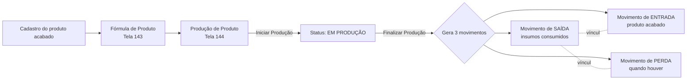

# 📚 Índice: Produção (Movimentação) - Sol.NET

O módulo de **Produção** do Sol.NET permite cadastrar fórmulas de produtos (ingredientes, embalagens e perdas) e executar produções que consomem insumos do estoque e geram o produto acabado, com custo apurado a partir dos próprios ingredientes consumidos. Toda a operação é integrada ao módulo de **Movimentação**: a finalização de uma produção gera automaticamente os movimentos de **saída** dos insumos, **entrada** do produto acabado e (quando há) **perda**, vinculados entre si.

## 🧭 Telas do módulo

Todas as telas são abertas pela **pesquisa universal (F1)** — digite o código ou parte do nome.

| Tela | Código (F1) | Para que serve |
|------|-------------|----------------|
| **Fórmulas de Produtos** (`FrmCadastroFormulaProdutos`) | `143` | Cadastra a "receita" de um produto acabado: ingredientes, embalagens, perdas, unidades e fator de conversão. |
| **Produção de Produtos** (`FrmCadastroProducao`) | `144` | Executa uma produção a partir de uma fórmula, gerando os movimentos de estoque ao finalizar. |

## 📋 Documentos disponíveis

### 📖 [Documentação Completa](documentacao_producao.md)
Referência completa do módulo:
- Arquitetura (Fórmula → Produção → Movimentos)
- Pré-requisitos (tipos de movimento de Entrada/Saída/Perda, situação de estoque, local de estoque)
- Cadastro da fórmula (cabeçalho, ingredientes, tipos de item)
- Execução da produção (status, transições, finalização)
- Como o custo do produto acabado é calculado
- Vínculo entre os movimentos gerados
- Permissões e auditoria
- Mensagens de erro mais comuns

### 🚀 [Guia Rápido](guia_rapido.md)
Referência prática para o dia a dia:
- Passo a passo "do zero" (do cadastro do tipo de movimento à finalização)
- Checklist antes de iniciar uma produção
- Checklist antes de finalizar
- Como cancelar uma produção já finalizada
- Erros frequentes e como resolver

### ❓ [FAQ — Perguntas Frequentes](faq.md)
Respostas para dúvidas comuns:
- Diferença entre Fórmula e Produção
- Por que preciso de 3 tipos de movimento?
- O que conta como "perda" e como ela afeta o custo?
- Posso reabrir uma produção finalizada?
- Como o sistema calcula o custo do produto acabado?
- Tópicos sobre estoque, custos, vínculos e cancelamentos

---

## 🎯 Por onde começar

### **👤 Novo usuário**
1. Leia a [Documentação Completa](documentacao_producao.md) — seções "Visão geral" e "Fluxo de uma produção".
2. Use o [Guia Rápido](guia_rapido.md) para configurar pela primeira vez.
3. Consulte o [FAQ](faq.md) para dúvidas pontuais.

### **🔧 Administrador**
1. Configure os **três tipos de movimento** (Entrada, Saída, Perda) e as **situações/locais de estoque** que serão usadas — ver [Pré-requisitos](documentacao_producao.md#-pré-requisitos).
2. Conceda as permissões da tela `Produção de Produtos` (código `144`) e `Fórmulas de Produtos` (código `143`) aos usuários.
3. Cadastre as primeiras fórmulas pelos responsáveis técnicos.

### **⚡ Usuário experiente**
1. [Guia Rápido](guia_rapido.md) como referência diária.
2. [FAQ](faq.md) para situações específicas (cancelamentos, reaberturas, ajustes de custo).

---

## 🔁 Fluxo resumido

---

## 🔗 Documentos relacionados

- [Documentação Movimentação (visão geral)](../documentacao_movimentacao.md) — conceito de tipo de movimento, situação de estoque e fluxo dos movimentos.
- [Atualização Automática de Custo](../atualizacao_de_custo_automatica.md) — como o sistema recalcula custos médios após o movimento de entrada do produto acabado.
- [Guia Rápido — Movimentação](../guia_rapido.md) — operação cotidiana dos movimentos gerais.

---

**Última atualização**: Abril de 2026
**Versão**: 1.0
**Público-alvo**: Usuários e administradores Sol.NET responsáveis por produção interna de produtos
