# 📚 Documentação de Produção — Sol.NET

A produção interna do Sol.NET permite **cadastrar fórmulas** (receitas) e **executá-las**, disparando a criação automática dos movimentos de estoque correspondentes — saída dos insumos, entrada do produto acabado e (quando há) perda. Os movimentos disparados aparecem nas telas operacionais `Movimentos de Compras` (código `201`), `Movimentos de Vendas` (código `202`) ou `Outros Movimentos` (código `203`), conforme o Tipo de Movimento configurado para cada um. Esta seção concentra os dois cadastros centrais do fluxo.

```mermaid
flowchart TD
  R[Fórmula cadastrada<br/>na tela 143] -. pré-requisito .-> F[Nova Produção<br/>na tela 144]
  F -->|Iniciar Produção| I[Status: Iniciada]
  I -->|Finalizar Produção| OK[Status: Finalizada]
  I -->|Cancelar| C[Status: Cancelada]
  OK --> M1[Movimento de saída<br/>dos ingredientes]
  OK --> M2[Movimento de entrada<br/>do produto acabado]
  OK --> M3[Movimento de perda<br/>quando a fórmula tem perdas]
  M1 --> T{Vão para a tela<br/>operacional do Tipo<br/>de Movimento configurado}
  M2 --> T
  M3 --> T
  T --> T1[201 Compras]
  T --> T2[202 Vendas]
  T --> T3[203 Outros]
```

## 📄 Documentos disponíveis

- [Cadastro de Fórmula de Produtos](documentacao_formulas_de_produtos.md) — tela `143`. Define a receita: produto acabado, ingredientes, perdas, proporção (Fator × Total).
- [Cadastro de Produção de Produtos](documentacao_producao_de_produtos.md) — tela `144`. Executa uma fórmula, registra início/fim e gera os três movimentos automáticos na finalização.

## 🔗 Veja também (fora da subpasta)

- [Cadastro de Tipos de Movimento](../TiposDeMovimento/) — define os tipos usados para entrada do acabado, saída dos insumos e perda.
- [Transações de Estoque](../documentacao_transacoes_de_estoque.md) — define o efeito de cada movimento nas camadas de saldo (Físico, Disponível etc.).
- [Saldo Estoque](../documentacao_saldo_estoque.md) — onde o efeito da produção é visível.

---

**Última atualização**: Maio de 2026
