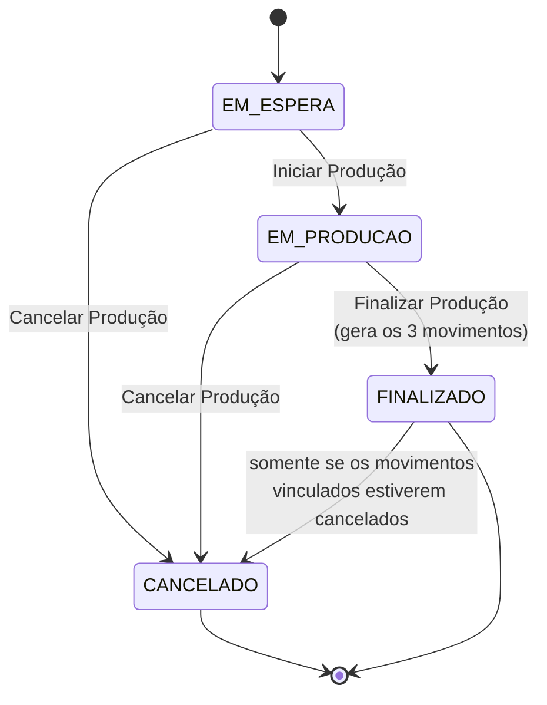

# 📄 Produção de Produtos - Sol.NET

## 🎯 Visão Geral

O módulo **Produção** do Sol.NET permite **fabricar produtos internamente** a partir de uma **fórmula** (receita) que descreve quais insumos, embalagens e perdas compõem o produto acabado. Ao finalizar uma produção, o sistema gera automaticamente os movimentos de estoque que **baixam os insumos consumidos**, **dão entrada** no produto acabado com o custo apurado e, quando houver, registram as **perdas** previstas pela fórmula.

A operação é dividida em duas telas, ambas abertas pela **pesquisa universal (F1)**:

| Tela | Código (F1) | Papel |
|------|-------------|-------|
| **Fórmulas de Produtos** (`FrmCadastroFormulaProdutos`) | `143` | Define a "receita" — produto acabado, ingredientes, embalagens, perdas, unidades e fator de conversão. |
| **Produção de Produtos** (`FrmCadastroProducao`) | `144` | Executa uma produção a partir de uma fórmula, controla o status e gera os movimentos. |

### Características principais

- ✅ **Fórmula reutilizável**: a mesma receita pode ser executada em várias produções.
- ✅ **Custo apurado pelo consumo**: o custo do produto acabado é calculado a partir do custo total dos ingredientes efetivamente consumidos.
- ✅ **Três movimentos automáticos**: ao finalizar, o sistema cria Saída (insumos), Entrada (produto acabado) e, quando aplicável, Perda — todos vinculados entre si.
- ✅ **Status com transições controladas**: `Em Espera` → `Em Produção` → `Finalizado`/`Cancelado`, com validações em cada passo.
- ✅ **Tipos de item por papel**: cada item da fórmula é classificado como `Composição`, `Embalagem` ou `Perda`.
- ✅ **Auditoria por movimento**: a Produção fica vinculada aos movimentos gerados, com o movimento de saída como "raiz" e os demais como vínculos internos.

---

## 🧰 Pré-requisitos

Antes de cadastrar a primeira fórmula ou produção, garanta que os itens abaixo já existam no sistema.

### 1. Tipos de movimento (três tipos)

A Produção cria **três movimentos diferentes** ao finalizar e, por isso, exige **três tipos de movimento previamente cadastrados** (tela `Cadastro de Tipos de Movimento` — abra pela pesquisa F1):

- **Tipo de movimento de ENTRADA** — entrada do produto acabado no estoque (deve incrementar estoque, sem gerar financeiro).
- **Tipo de movimento de SAÍDA** — saída dos insumos do estoque (deve decrementar estoque, sem gerar financeiro nem nota fiscal).
- **Tipo de movimento de PERDA** *(opcional, mas necessário se a fórmula tiver itens do tipo "Perda")* — saída de estoque a título de perda.

> 💡 **Nomeie os tipos de forma clara** (ex.: `Produção - Entrada`, `Produção - Saída`, `Produção - Perda`) para que apareçam de forma identificável quando forem associados à produção.

### 2. Cadastros base

- **Produto acabado**: o produto que será produzido precisa estar previamente cadastrado em `Cadastro de Produtos` (abra pela pesquisa F1).
- **Insumos / embalagens**: cada item que entra na fórmula precisa estar cadastrado como produto e ter **custo unitário > 0** (a finalização exige todos os itens com custo preenchido).
- **Unidades**: as unidades de medida usadas na fórmula (produção, itens, ingredientes totais e perdas) precisam estar em `Cadastro de Unidades`.
- **Local de estoque** e **Situação de estoque**: serão usados como destino dos movimentos gerados.

### 3. Permissões

A atualização do banco que ativa o módulo cria **7 permissões para cada tela** (Pesquisar, Inserir, Alterar, Excluir e três níveis de relatório). Os perfis de usuário que usarão Produção precisam dessas permissões habilitadas — verifique em `Cadastro de Acessos` (abra pela pesquisa F1) os módulos `FORMULA PRODUCAO PRODUTO` (tela `143`) e `PRODUCAO PRODUTOS` (tela `144`).

---

## 🧪 Cadastro da Fórmula

Tela: **Fórmulas de Produtos** — código `143` (abra pela pesquisa F1 e digite o código ou parte do nome).

A fórmula é a "receita" do produto acabado. Ela é independente da produção: você cadastra uma vez e reutiliza em várias produções.

### Cabeçalho da fórmula

| Campo | Descrição |
|-------|-----------|
| **Descrição** | Identificação da fórmula. Ex.: `Pão Francês — receita padrão`. |
| **Produto Acabado** | Produto que será produzido. **Não pode ser alterado** depois que a fórmula tem produções vinculadas. |
| **Total Produzido** | Quantidade de produto acabado obtida ao executar uma vez essa fórmula (ex.: `30,000`). |
| **Unidade de Produção** | Unidade do `Total Produzido` (ex.: `KG`, `UN`). |
| **Fator de Conversão** | Quantos itens individuais correspondem a uma unidade de produção. Ex.: se a fórmula produz `30 KG` e cada pão pesa `0,050 KG`, o fator dá `600` itens. |
| **Itens Produzidos** | Calculado pelo sistema a partir do `Total Produzido` × `Fator de Conversão`. |
| **Unidade de Medida do Item** | Unidade de cada item individual (ex.: `UN`). |
| **Total Quantidade Ingredientes** | Soma da quantidade de todos os itens cadastrados como `Composição` e `Embalagem`. |
| **Unidade Total Ingredientes** | Unidade de medida da soma acima. |
| **Total Perdas** | Soma da quantidade dos itens cadastrados como `Perda`. |
| **Unidade Total Perdas** | Unidade da soma de perdas. |
| **Data de Cadastro** | Preenchida automaticamente. |
| **Inativo** | Marca a fórmula como não utilizável em novas produções. |

### Itens da fórmula

Cada item é classificado por um **Tipo de item**, que define seu papel:

| Tipo de Item | Significado | Vai para qual movimento? |
|--------------|-------------|--------------------------|
| **Composição** | Ingrediente / matéria-prima que compõe o produto. | Movimento de **Saída**. |
| **Embalagem** | Embalagem consumida (frasco, rótulo, caixa). | Movimento de **Saída**. |
| **Perda** | Quantidade que se perde no processo (evaporação, refugo previsto). | Movimento de **Perda**. |

Para cada item, informe:

- **Produto** (insumo cadastrado).
- **Descrição** (sugerida automaticamente a partir do produto, mas editável).
- **Quantidade do item** na fórmula.
- **Unidade de medida** do item.
- **Tipo de item** (Composição / Embalagem / Perda).

> 💡 A combinação `Fórmula + Produto + Tipo de Item` precisa ser **única** dentro de uma fórmula — o sistema cria um índice único `UX_FORMULA_ITEM_UNICO` para garantir isso. Se o mesmo insumo precisar aparecer com papéis diferentes (ex.: parte como composição, parte como perda), use os tipos de item adequados.

### Atalho a partir do cadastro do produto

Na tela **Cadastro de Produtos**, depois que o produto tem fórmulas associadas, aparece a aba **Fórmulas** listando as fórmulas em que ele é o produto acabado. O menu de contexto da grade de busca de produtos também passa a oferecer:

- **Cadastro Fórmula Produção** — abre a tela `Fórmulas de Produtos` já filtrando pelo produto selecionado.
- **Ir para Fórmula de Produção** — só aparece quando o produto já possui fórmula cadastrada; abre a fórmula correspondente diretamente.

---

## 🏭 Execução da Produção

Tela: **Produção de Produtos** — código `144` (abra pela pesquisa F1).

Cada registro de produção representa **uma execução da fórmula**. A tela tem duas abas principais:

- **Aba `Principal`**: dados de configuração, fórmula escolhida, ingredientes copiados da fórmula, totais e botões de mudança de status.
- **Aba `Movimento`**: mostra os três movimentos gerados (Entrada, Saída, Perda), uma vez que a produção tenha sido finalizada.

### Cabeçalho da produção

| Campo | Descrição |
|-------|-----------|
| **Código da Produção** | Identificação livre da execução (lote, ordem de produção). |
| **Loja / Empresa** | Empresa em que a produção ocorre. Os movimentos serão criados nessa empresa. |
| **Data de Cadastro** | Preenchida pelo sistema. |
| **Início da Produção** | Preenchido automaticamente quando o status muda para `EM PRODUÇÃO`. |
| **Fim da Produção** | Preenchido automaticamente quando o status muda para `FINALIZADO`. |
| **Status da Produção** | `EM ESPERA`, `EM PRODUÇÃO`, `FINALIZADO` ou `CANCELADO`. |
| **Situação de Estoque** | Situação de estoque que será usada nos três movimentos. |
| **Local de Estoque** | Local de estoque destino do produto acabado e origem dos insumos. |
| **Tipo de Movimento — Entrada** | Tipo de movimento que será usado para a **entrada do produto acabado**. |
| **Tipo de Movimento — Saída** | Tipo de movimento usado para a **saída dos insumos**. |
| **Tipo de Movimento — Perda** | Tipo de movimento usado para a **saída de perdas** (obrigatório se a fórmula tiver itens do tipo `Perda`). |
| **Fórmula** | Fórmula que será executada. Ao selecionar, o sistema **copia os itens** da fórmula para a produção. |
| **Produto Acabado** | Preenchido automaticamente a partir da fórmula. |
| **Quantidade da Fórmula** | Quantidade prevista pela fórmula (`Total Produzido`). |
| **Quantidade Real** | Quantidade efetivamente produzida — pode ser ajustada antes de finalizar. |
| **Unidade de Produção / Itens** | Unidades copiadas da fórmula. |
| **Fator de Conversão** | Copiado da fórmula. |
| **Quantidade de Itens Produzidos** | Recalculada a partir da `Quantidade Real` × `Fator de Conversão`. |
| **Total Quantidade Ingredientes / Total Perdas / Total Custo Ingredientes** | Totais calculados pelo sistema com base nos itens da produção. |

### Aba de ingredientes

Ao escolher a fórmula, o sistema copia os itens para a aba `Ingredientes` da produção. Para cada ingrediente, há duas quantidades:

- **Qtd. Fórmula** — quantidade originalmente prevista pela fórmula.
- **Qtd. Real** — quantidade efetivamente consumida na execução. **É essa quantidade que vai para o movimento de saída.**

Cada item também tem **Custo Unitário** e **Total Custo** — buscados do cadastro do produto/insumo. **Os dois precisam ser maiores que zero** para que a produção possa ser finalizada.

> 💡 Itens marcados como `Perda` continuam visíveis e ainda contam para o cálculo de **Total Perdas**, mas vão para o movimento de **Perda**, não para o de **Saída**.

---

## 🔁 Status e transições

O status da produção é controlado pelos botões `Iniciar Produção`, `Finalizar Produção` e `Cancelar Produção` da própria tela.



### Regras de transição (validadas pelo sistema)

- A produção precisa estar **salva** antes de mudar de status para qualquer estado diferente de `EM ESPERA` — caso contrário o sistema exibe: *"Produção não encontrada! Salve o cadastro antes de alterar seu status para …"*.
- **`Em Espera` → `Em Produção`**: registra a data/hora em `Início da Produção`.
- **`Em Produção` → `Finalizado`**: registra a data/hora em `Fim da Produção` **e cria os três movimentos** (ver próxima seção).
- **`Cancelado`**: estado terminal — uma produção cancelada **não pode** ser reativada. O sistema também marca o registro como `Inativo`.
- **`Finalizado` → `Cancelado`**: só é permitido se **todos os movimentos vinculados (Entrada, Saída, Perda) já tiverem sido cancelados antes**. Caso contrário o sistema exibe: *"Não é possível alterar status de produção com movimentos associados e não cancelados"*.
- Não é permitido alterar status de uma produção `Cancelada` (mensagem: *"Não é possível alterar produção com status CANCELADO"*).

---

## ⚙️ O que acontece ao Finalizar

Quando o usuário aciona `Finalizar Produção`, o sistema executa, em ordem:

1. **Movimento de SAÍDA** — consumo dos insumos.
   - Inclui todos os itens da produção **exceto** os do tipo `Perda`.
   - Para cada item, usa a `Qtd. Real`, `Custo Unitário` e `Custo Total` da aba de ingredientes.
   - É o **movimento "raiz"**: os outros dois são vinculados a ele através do `COD_VINCULO_INICIO` (e ele mesmo recebe `TP_STATUS = Vinculado`).
2. **Movimento de ENTRADA** — entrada do produto acabado.
   - Quantidade: `Quantidade de Itens Produzidos` (a quantidade realmente produzida).
   - **Custo unitário**: calculado pelo sistema como `TOTAL_CUSTO_INGREDIENTES / QTD_ITENS_PRODUZIDOS` — ou seja, o custo de cada unidade do produto acabado é o **custo total dos ingredientes consumidos dividido pela quantidade efetivamente produzida**.
   - Vinculado ao movimento de saída como **vínculo interno** (`COD_VINCULO_INTERNO`).
3. **Movimento de PERDA** — só é gerado **se a fórmula tiver itens do tipo `Perda`**.
   - Inclui apenas os itens classificados como `Perda`.
   - Vinculado ao movimento de saída como vínculo interno.

> 💡 **Os três movimentos são finalizados automaticamente pelo serviço de produção.** Você não precisa abrir cada movimento individualmente — após finalizar, os três aparecem na aba `Movimento` da própria produção.

> ⚠️ **Validações antes de criar os movimentos:**
> - A produção precisa estar em status `Em Espera` ou `Em Produção` (status `Finalizado`/`Cancelado` bloqueia a criação).
> - Não pode haver movimento já associado à produção (cada produção gera um único conjunto de três movimentos).
> - **Todos os ingredientes precisam ter `Custo Unitário > 0` e `Total Custo > 0`** — caso contrário o sistema retorna: *"Todos os ingredientes devem ter suas informações de custo preenchidas."*
> - A empresa precisa estar selecionada.
> - Os três tipos de movimento (Entrada, Saída e — se houver perda — Perda) precisam estar preenchidos.

### Vínculo entre os três movimentos

| Movimento | Vínculo |
|-----------|---------|
| **Saída** | Movimento "raiz". Recebe `TP_STATUS = Vinculado` e o próprio ID em `COD_VINCULO_INICIO`. |
| **Entrada** | `COD_VINCULO_INICIO` aponta para o ID do movimento de saída. Marcado como vínculo interno. |
| **Perda** | Igual ao movimento de entrada — vinculado ao de saída. |

Esse vínculo é o que protege a integridade: se você tentar **cancelar** ou **recuperar** um dos movimentos individualmente, o sistema bloqueia a operação por estar associada a uma produção. Para cancelar a produção, **cancele primeiro os três movimentos** (na própria tela de Movimentação).

---

## 💰 Como o custo do produto acabado é calculado

O sistema **não usa o custo médio do produto acabado** ao dar entrada — ele usa o custo apurado da própria produção. O cálculo é direto:

```
Custo unitário do produto acabado = Total Custo dos Ingredientes / Quantidade de Itens Produzidos
```

Onde:

- **Total Custo dos Ingredientes** é a soma de `Total Custo` de **todos** os itens da produção — composição, embalagem e perda. Os três tipos consomem estoque, e o custo de cada um é absorvido pelo produto acabado.
- **Quantidade de Itens Produzidos** é a quantidade real produzida × fator de conversão.

A entrada do produto acabado então alimenta a [Atualização Automática de Custo](../atualizacao_de_custo_automatica.md) — o custo médio passa a considerar essa entrada como qualquer outra.

> 💡 Se um insumo estiver com custo zerado, a finalização é bloqueada antes de qualquer movimento ser criado, justamente porque o cálculo acima ficaria inválido.

---

## 📦 Estoque

A produção usa o **mesmo Local de Estoque** e a **mesma Situação de Estoque** para os três movimentos. Isso significa que:

- Os insumos saem do local/situação informados.
- O produto acabado entra no mesmo local/situação.
- A perda também sai desse local/situação.

Se os insumos e o produto acabado precisarem ficar em locais diferentes (ex.: matéria-prima no almoxarifado e produto acabado na expedição), faça uma **transferência de estoque** depois da produção, na própria movimentação.

A aba `Principal` da Produção também exibe blocos de estoque (físico, por endereço, mínimo) do produto acabado para conferência rápida.

---

## 🔐 Permissões e auditoria

A atualização que ativa o módulo cria, por tela, sete permissões padrão:

| Permissão | Tela `143` (Fórmulas) | Tela `144` (Produção) |
|-----------|-----------------------|------------------------|
| Pesquisar | ✓ | ✓ |
| Inserir | ✓ | ✓ |
| Alterar | ✓ | ✓ |
| Excluir | ✓ | ✓ |
| Relatório nível 1 | ✓ | ✓ |
| Relatório nível 2 | ✓ | ✓ |
| Relatório nível 3 | ✓ | ✓ |

Cada produção registra:

- **Início e fim** da produção (timestamps).
- **Vínculos** com os três movimentos gerados.
- **Status** atual e histórico via mudanças de campo (`STATUS_PRODUCAO`, `INATIVO`).

Os três movimentos gerados ficam visíveis tanto na aba `Movimento` da Produção quanto na tela `Movimentação` regular (abra pela pesquisa F1) — neles, o vínculo `COD_VINCULO_INICIO` aponta para o movimento de saída, permitindo localizar todo o conjunto.

---

## 💡 Exemplos Práticos

### Exemplo 1 — Padaria: pão francês

**Cenário**: a padaria produz `30 KG` de pão francês de cada vez, e cada pão pesa `0,050 KG`. A receita usa `18 KG` de farinha, `0,360 KG` de fermento, `0,300 KG` de sal e `12 L` de água.

**Fórmula** (tela `143`):
- Produto Acabado: `Pão Francês — UN`
- Total Produzido: `30,000` `KG`
- Fator de Conversão: `20` (cada KG dá 20 pães de 0,050 KG)
- Itens Produzidos: `600` (calculado)
- Itens:
  - `Farinha de Trigo — 18,000 KG — Composição`
  - `Fermento — 0,360 KG — Composição`
  - `Sal — 0,300 KG — Composição`
  - `Água — 12,000 L — Composição`
  - `Perda de Massa — 0,500 KG — Perda`

**Produção** (tela `144`):
- Quantidade da Fórmula: `30 KG` / Quantidade Real: `28 KG` (saiu 2 KG a menos)
- Itens Produzidos recalculado: `560` pães
- Ingredientes ajustados conforme o consumo real (campo `Qtd. Real` em cada linha).
- Ao **Finalizar**: o sistema baixa os ingredientes consumidos, dá entrada de `560` UN do pão francês com custo unitário = `Total Custo dos Ingredientes / 560`, e baixa a perda de `0,500 KG`.

### Exemplo 2 — Indústria: produto com embalagem

**Cenário**: produzir `100` frascos de `500 ml` de detergente, cada frasco com seu rótulo.

**Fórmula** (tela `143`):
- Produto Acabado: `Detergente 500ml — UN`
- Total Produzido: `50` `L`
- Fator de Conversão: `2` (cada litro vira 2 frascos de 500ml)
- Itens Produzidos: `100` UN
- Itens:
  - `Concentrado de Detergente — 5 L — Composição`
  - `Água — 45 L — Composição`
  - `Frasco 500ml — 100 UN — Embalagem`
  - `Rótulo — 100 UN — Embalagem`

Ao finalizar, o movimento de **Saída** baixa o concentrado, a água, os frascos e os rótulos. O movimento de **Entrada** dá entrada de 100 frascos do produto acabado.

---

## 🛠️ Mensagens de erro mais comuns

| Mensagem | Causa provável | O que fazer |
|----------|----------------|-------------|
| *"Produção não encontrada! Salve o cadastro antes de alterar seu status para …"* | Tentou iniciar/finalizar antes de salvar a produção. | Salve a produção e tente novamente. |
| *"Não é possível alterar produção em status FINALIZADO"* | Tentou voltar uma produção finalizada para `Em Produção` ou `Em Espera`. | A única transição permitida a partir de `Finalizado` é para `Cancelado` — e mesmo assim, só após cancelar os três movimentos. |
| *"Não é possível alterar produção com status CANCELADO"* | Tentou alterar uma produção já cancelada. | `Cancelado` é estado terminal — crie uma nova produção. |
| *"Não é possível alterar status de produção com movimentos associados e não cancelados"* | Tentou cancelar a produção sem antes cancelar os três movimentos vinculados. | Vá à tela `Movimentação` (pesquisa F1), cancele os três movimentos (Saída, Entrada, Perda) e depois cancele a produção. |
| *"Não é possível criar movimentos de Produção no status: FINALIZADO/CANCELADO"* | Tentou finalizar uma produção que já estava finalizada/cancelada. | Verifique o status atual antes de acionar `Finalizar Produção`. |
| *"Já existe um movimento associado à essa produção"* | A produção já tem movimentos gerados — o sistema não cria um segundo conjunto. | Use a aba `Movimento` para visualizar/gerenciar os existentes. |
| *"Todos os ingredientes devem ter suas informações de custo preenchidas."* | Algum item da aba `Ingredientes` está com `Custo Unitário` ou `Total Custo` zerado. | Atualize o custo do insumo no `Cadastro de Produtos` (aba Custos) ou edite o item antes de finalizar. |
| *"Para criar movimentos é necessário selecionar uma empresa."* | O campo `Loja/Empresa` está vazio. | Selecione a empresa em que a produção ocorre. |
| *"Erro ao criar o movimento de …, selecione um tipo de movimento"* | Um dos três tipos de movimento (Entrada, Saída ou Perda) não foi informado. | Selecione todos os tipos antes de finalizar. Se a fórmula não tem perdas, o tipo de Perda pode ficar em branco. |
| *"Quantidade inválida para movimento de entrada."* | `Quantidade de Itens Produzidos` está zerada. | Informe `Quantidade Real` e `Fator de Conversão` antes de finalizar. |

---

## ❓ FAQ / Problemas comuns

Veja a [FAQ — Produção](faq.md) para respostas rápidas a perguntas como:

- "Posso reabrir uma produção finalizada?"
- "Como ajustar o custo do produto acabado depois da finalização?"
- "Por que minha produção exige Tipo de Movimento de Perda se não tem perda na fórmula?"
- "Os movimentos gerados aparecem em relatórios fiscais?"

---

## 🔗 Documentos relacionados

- [Índice da subseção Produção](README.md)
- [Guia Rápido — Produção](guia_rapido.md)
- [Documentação Movimentação (visão geral)](../documentacao_movimentacao.md)
- [Atualização Automática de Custo](../atualizacao_de_custo_automatica.md)

---

**Última atualização**: Abril de 2026
**Versão**: 1.0
**Público-alvo**: Usuários e administradores Sol.NET responsáveis por produção interna de produtos
