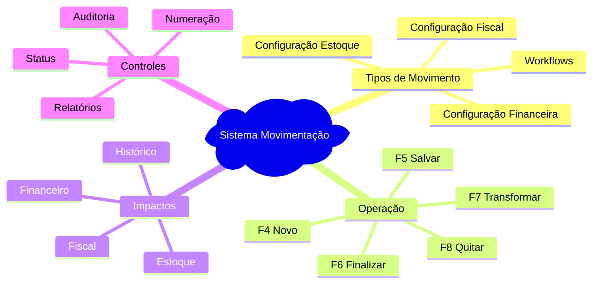

# 📚 Índice: Documentação Movimentação Sol.NET

## 📋 Documentos Disponíveis

### 📖 **[Documentação Completa](Documentacao%20Movimentacao.md)**
Guia completo do sistema de movimentação, incluindo:
- Visão geral do sistema
- Arquitetura e fluxo de trabalho
- Configuração de tipos de movimento
- Exemplos práticos detalhados
- Melhores práticas e solução de problemas

### 🚀 **[Guia Rápido](Guia%20Rapido.md)**
Referência rápida para operação cotidiana:
- Atalhos de teclado essenciais
- Checklist para novos movimentos
- Exemplos rápidos por tipo
- Soluções para problemas comuns
- Configurações básicas de tipos

### ❓ **[FAQ - Perguntas Frequentes](FAQ.md)**
Respostas para dúvidas comuns organizadas por categoria:
- Configuração e tipos de movimento
- Controle financeiro
- Controle de estoque
- Documentos fiscais
- Workflows e transformações
- Problemas e soluções
- Cenários específicos
- Dicas de produtividade

---

## 🎯 Por Onde Começar

### **👤 Novo Usuário**
1. Leia a **[Documentação Completa](Documentacao%20Movimentacao.md)** - seções "Visão Geral" e "Fluxo de Trabalho"
2. Pratique com o **[Guia Rápido](Guia%20Rapido.md)**
3. Consulte o **[FAQ](FAQ.md)** para dúvidas específicas

### **🔧 Administrador/Configurador**
1. Foque na seção "Cadastro de Tipos de Movimento" da **[Documentação Completa](Documentacao%20Movimentacao.md)**
2. Use exemplos práticos para configurar tipos específicos
3. Consulte "Cenários Específicos" no **[FAQ](FAQ.md)**

### **⚡ Usuário Experiente**
1. Use o **[Guia Rápido](Guia%20Rapido.md)** como referência
2. Consulte o **[FAQ](FAQ.md)** para situações específicas
3. Contribua com feedback para melhorias na documentação

---

## 🔍 Busca Rápida por Tópico

### **Configuração**
- [Cadastro de Tipos de Movimento](Documentacao%20Movimentacao.md#-cadastro-de-tipos-de-movimento---centro-de-controle)
- [Configuração de Estoque](FAQ.md#-controle-de-estoque)
- [Configuração Financeira](FAQ.md#-controle-financeiro)

### **Operação**
- [Fluxo de Trabalho](Documentacao%20Movimentacao.md#-fluxo-de-trabalho---passo-a-passo)
- [Atalhos de Teclado](Guia%20Rapido.md#-atalhos-essenciais)
- [Checklist Operacional](Guia%20Rapido.md#-checklist-novo-movimento)

### **Problemas**
- [Solução de Problemas](Documentacao%20Movimentacao.md#-solução-de-problemas-comuns)
- [Problemas Comuns - Soluções Rápidas](Guia%20Rapido.md#-problemas-comuns---soluções-rápidas)
- [FAQ Completo](FAQ.md)

### **Exemplos**
- [Exemplos Práticos Detalhados](Documentacao%20Movimentacao.md#-exemplos-práticos)
- [Exemplos Rápidos por Tipo](Guia%20Rapido.md#-exemplos-rápidos-por-tipo)
- [Cenários Específicos](FAQ.md#-cenários-específicos)

---

## 📊 Mapa de Conceitos Essenciais

---

## 💡 Dicas de Navegação

### **🔗 Links Internos**
Todos os documentos possuem links internos para navegação rápida entre seções.

### **📱 Leitura Mobile**
Os documentos são otimizados para leitura em dispositivos móveis.

### **🔍 Busca**
Use Ctrl+F para buscar termos específicos dentro de cada documento.

### **📋 Cópia de Exemplos**
Exemplos de configuração podem ser copiados e adaptados.

---

## 🚀 Próximos Passos

### **📈 Planejado para Próximas Versões**
- Vídeos tutoriais
- Exemplos interativos
- Templates de configuração
- Casos de uso por segmento

### **💬 Feedback**
Contribua com sugestões para melhorar esta documentação:
- Dúvidas não esclarecidas
- Exemplos adicionais necessários
- Correções ou atualizações

---

**Última atualização**: Dezembro de 2024  
**Versão**: 1.0  
**Público-alvo**: Usuários finais e administradores Sol.NET