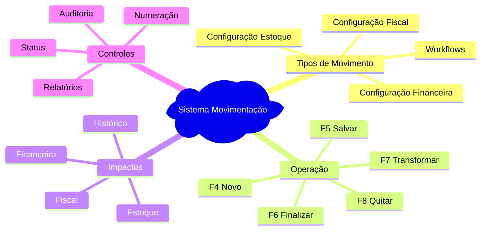

# 📚 Índice: Documentação Movimentação Sol.NET

## 📋 Documentos Disponíveis

### 📖 **[Documentação Completa](documentacao/)**
Guia completo do sistema de movimentação, incluindo:
- Visão geral do sistema
- Arquitetura e fluxo de trabalho
- Configuração de tipos de movimento
- Exemplos práticos detalhados
- Melhores práticas e solução de problemas

### 🚀 **[Guia Rápido](guia-rapido/)**
Referência rápida para operação cotidiana:
- Atalhos de teclado essenciais
- Checklist para novos movimentos
- Exemplos rápidos por tipo
- Soluções para problemas comuns
- Configurações básicas de tipos

### ❓ **[FAQ - Perguntas Frequentes](faq/)**
Respostas para dúvidas comuns organizadas por categoria:
- Configuração e tipos de movimento
- Controle financeiro
- Controle de estoque
- Documentos fiscais
- Workflows e transformações
- Problemas e soluções
- Cenários específicos
- Dicas de produtividade

### 🧮 **[Atualização Automática de Custo](atualizacao-custo/)**
Entenda como o sistema recalcula custos e integra com a precificação:
- Fluxo de disparo (finalização, função manual, precificação)
- Regras de custo médio (ponderada x simples)
- Vínculos de custo por empresa
- Impactos na aba Preços e margens
- Checklist e exemplos práticos

---

## 🎯 Por Onde Começar

### **👤 Novo Usuário**
1. Leia a **[Documentação Completa](documentacao/)** - seções "Visão Geral" e "Fluxo de Trabalho"
2. Pratique com o **[Guia Rápido](guia-rapido/)**
3. Consulte o **[FAQ](faq/)** para dúvidas específicas

### **🔧 Administrador/Configurador**
1. Foque na seção "Cadastro de Tipos de Movimento" da **[Documentação Completa](documentacao/)**
2. Use exemplos práticos para configurar tipos específicos
3. Consulte "Cenários Específicos" no **[FAQ](faq/)**

### **⚡ Usuário Experiente**
1. Use o **[Guia Rápido](guia-rapido/)** como referência
2. Consulte o **[FAQ](faq/)** para situações específicas
3. Contribua com feedback para melhorias na documentação

---

## 🔍 Busca Rápida por Tópico

### **Configuração**
- [Cadastro de Tipos de Movimento](documentacao/#-cadastro-de-tipos-de-movimento---centro-de-controle)
- [Configuração de Estoque](faq/#-controle-de-estoque)
- [Configuração Financeira](faq/#-controle-financeiro)

### **Operação**
- [Fluxo de Trabalho](documentacao/#-fluxo-de-trabalho---passo-a-passo)
- [Atalhos de Teclado](guia-rapido/#-atalhos-essenciais)
- [Checklist Operacional](guia-rapido/#-checklist-novo-movimento)

### **Problemas**
- [Solução de Problemas](documentacao/#-solu%C3%A7%C3%A3o-de-problemas-comuns)
- [Problemas Comuns - Soluções Rápidas](guia-rapido/#-problemas-comuns---solu%C3%A7%C3%B5es-r%C3%A1pidas)
- [FAQ Completo](faq/)

### **Exemplos**
- [Exemplos Práticos Detalhados](documentacao/#-exemplos-pr%C3%A1ticos)
- [Exemplos Rápidos por Tipo](guia-rapido/#-exemplos-r%C3%A1pidos-por-tipo)
- [Cenários Específicos](faq/#-cen%C3%A1rios-espec%C3%ADficos)

---

## 📊 Mapa de Conceitos Essenciais

---

## 💡 Dicas de Navegação

### **🔗 Links Internos**
Todos os documentos possuem links internos para navegação rápida entre seções.

### **📱 Leitura Mobile**
Os documentos são otimizados para leitura em dispositivos móveis.

### **🔍 Busca**
Use Ctrl+F para buscar termos específicos dentro de cada documento.

### **📋 Cópia de Exemplos**
Exemplos de configuração podem ser copiados e adaptados.

---

## 🚀 Próximos Passos

### **📈 Planejado para Próximas Versões**
- Vídeos tutoriais
- Exemplos interativos
- Templates de configuração
- Casos de uso por segmento

### **💬 Feedback**
Contribua com sugestões para melhorar esta documentação:
- Dúvidas não esclarecidas
- Exemplos adicionais necessários
- Correções ou atualizações

---

**Última atualização**: Dezembro de 2024  
**Versão**: 1.0  
**Público-alvo**: Usuários finais e administradores Sol.NET