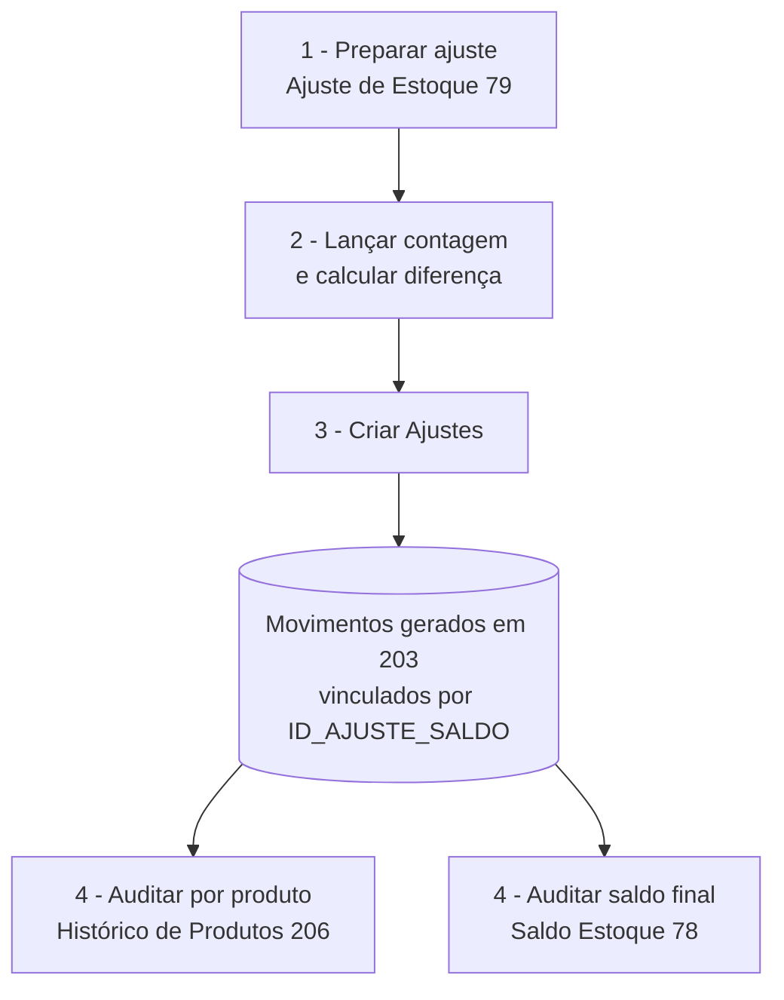

# 📄 Trilha — Ajuste de estoque com auditoria - Sol.NET

## 🎯 Visão Geral

Trilha narrativa que cobre o ciclo completo de **um ajuste de saldo** com auditoria posterior — desde a contagem física até a inspeção dos movimentos gerados e a confirmação do novo saldo.

Esta trilha atravessa:

- [Ajuste de Estoque](../documentacao_ajuste_de_estoque.md) (`79`) — onde a contagem é registrada e o ajuste é disparado.
- [Outros Movimentos](../Movimentos/outros_movimentos.md) (`203`) — onde os movimentos gerados pelo ajuste aparecem.
- [Histórico de Produtos](../documentacao_historico_de_produtos.md) (`206`) — auditoria por produto.
- [Saldo Estoque](../documentacao_saldo_estoque.md) (`78`) — confirmação do novo saldo.
- [Transações de Estoque](../documentacao_transacoes_de_estoque.md) (`33`) — referência das regras das camadas afetadas.

> 💡 **Por que essa trilha existe.** Mexer direto no estoque é fácil de fazer e impossível de auditar. O caminho padrão e auditável no Sol.NET é o `Ajuste de Estoque` (`79`) — ele registra a contagem, dispara movimentos rastreáveis e mantém o vínculo (`ID_AJUSTE_SALDO`) entre o ajuste e os movimentos gerados.

---

## 🗺️ Fluxo completo

---

## 1️⃣ Preparar o ajuste — tela [Ajuste de Estoque](../documentacao_ajuste_de_estoque.md) (`79`)

**O que fazer:**

1. Abra a pesquisa (`F1`) e digite `79`.
2. Clique em **Novo**.
3. Preencha o cabeçalho:
   - `Descrição` — nome livre que identifique o ajuste (`INVENTÁRIO OUT/2026 — LOJA CENTRAL`, `CORREÇÃO SEÇÃO BEBIDAS`).
   - `Data` — data da contagem física.
   - `Descrição da Loja` — a empresa.
   - `Local de Estoque` — local físico do saldo a corrigir (`LOJA`, `DEPÓSITO`).
   - `Situação do Estoque` — camada afetada (geralmente `FISICO`).
   - `Tipo de Movimento — Entrada` — Tipo configurado para gerar movimentos quando a diferença é positiva.
   - `Tipo de Movimento — Saída` — Tipo configurado para gerar movimentos quando a diferença é negativa.

> ⚠️ **Acesso de suporte necessário:** os Tipos de Movimento usados como Entrada e Saída do ajuste vêm do `Cadastro de Tipos de Movimento` (código `37`), que requer permissão de acesso de suporte. Entre em contato com o suporte Hetosoft antes de criar ou alterar Tipos de Movimento dedicados a ajustes de estoque.

---

## 2️⃣ Lançar a contagem e calcular a diferença

**O que fazer:**

1. Na grid de produtos do ajuste, adicione os produtos a inventariar:
   - **Um por um:** botão `Inserir` → busca → confirma.
   - **Em lote:** menu de contexto da grid → `Adicionar Produtos` → filtre por família/grupo → `Selecionar Todos`.
   - **Em massa por leitura:** configure `Comportamentos → Modo Adicionar Itens` para leitura de código de barras.
2. Para cada linha, a coluna `Saldo Atual` aparece preenchida automaticamente (saldo registrado no banco no momento da inclusão).
3. Faça a contagem física (manual, com coletor, com inventariante).
4. Digite o valor medido na coluna `Contagem`. O sistema calcula `Diferença = Contagem - Saldo Atual` automaticamente:
   - **Positiva** — sobrou no físico; vai gerar movimento de entrada.
   - **Negativa** — faltou no físico; vai gerar movimento de saída.
   - **Zero** — confere; nenhum movimento gerado para essa linha.

**Resultado esperado:** grid com `Contagem` preenchida em todas as linhas, `Diferença` calculada e ajuste em status `ABERTO`.

---

## 3️⃣ Disparar a criação dos movimentos — botão `Criar Ajustes`

**O que fazer:**

1. Clique em **`Criar Ajustes`**.
2. Para cada linha com `Diferença ≠ 0`, o Sol.NET cria automaticamente um movimento em [Outros Movimentos](../Movimentos/outros_movimentos.md) (`203`):
   - Se `Diferença > 0`, usa o Tipo `Entrada` configurado no cabeçalho.
   - Se `Diferença < 0`, usa o Tipo `Saída` configurado.
3. Os movimentos ficam vinculados ao ajuste pelo campo interno `ID_AJUSTE_SALDO`.
4. O status do ajuste muda de `ABERTO` para processado, bloqueando alterações posteriores.

**Resultado esperado:**

- **Aba `Movimentos`** do ajuste — lista os IDs dos movimentos criados.
- **Estoque** — saldo corrigido para refletir a contagem.
- **Auditoria** — vínculo `ID_AJUSTE_SALDO` permanece em cada movimento, permitindo rastrear posteriormente qual ajuste originou cada correção.

---

## 4️⃣ Auditar o ajuste depois

A auditoria pode ser feita de três ângulos complementares:

### Por produto — tela [Histórico de Produtos](../documentacao_historico_de_produtos.md) (`206`)

Mostra **cada movimento que tocou o saldo daquele produto**, em ordem. Útil para responder "por que o saldo do produto X mudou nessa data?".

1. Abra `F1` → `206`.
2. Filtre pelo produto e/ou período.
3. Os movimentos gerados pelo ajuste aparecem com o Tipo configurado (Entrada ou Saída).
4. Para abrir o detalhe de um movimento, navegue para `203` e localize pelo ID.

### Por saldo final — tela [Saldo Estoque](../documentacao_saldo_estoque.md) (`78`)

Confirma o **novo saldo** após o ajuste.

1. Abra `F1` → `78`.
2. Filtre pelo produto e/ou Local.
3. Confira o saldo nas camadas afetadas (geralmente `Físico` e `Disponível`).

### Pelas regras das camadas — tela [Transações de Estoque](../documentacao_transacoes_de_estoque.md) (`33`)

Útil para entender **em quais camadas o ajuste mexeu**. Cada Tipo de Movimento aponta para uma Transação que decide o efeito por camada.

1. Abra `F1` → `33`.
2. Localize a Transação amarrada ao Tipo usado no ajuste.
3. Confira as colunas `Físico`, `Disponível`, `Reservado` para entender quais camadas foram alteradas.

---

## ⚠️ Quando dá errado

| Mensagem | Etapa | Onde resolver |
|---|---|---|
| `Ajuste de Estoque sem Produtos!` | 3 | Grid vazia. Adicione produtos antes de clicar em `Criar Ajustes`. |
| `Não Permitido! Só Status Aberto.` | 2 | Tentou editar um ajuste já processado. Ajustes processados são imutáveis — crie um novo ajuste com a contagem invertida para corrigir. |
| `Produto Configurado para 'Não Movimentar Estoque'!` | 2 | Produto está marcado para não movimentar no [Cadastro de Produtos](../../Produtos/documentacao_produtos.md) (`32`). Ajustar o cadastro primeiro, ou remover o produto do inventário. |
| `Não Permitido, Quantidade Máxima Excedida (999.999,99)!` | 2 | Contagem digitada acima do limite. Verifique unidade — provavelmente está pesando em gramas o que deveria ser quilos. |
| `Só com Status 'ABERTO'` ao tentar excluir | — | Ajuste já processado não pode ser excluído. Crie um novo ajuste com a contagem invertida. |
| `Não permitido, Existe Movimento(s) Vinculado!` ao tentar excluir | — | Idem acima — há movimentos gerados a partir deste ajuste. Reverter por novo ajuste, não por exclusão. |

Lista completa em [Índice de mensagens](../indice_mensagens.md).

---

## 💡 Exemplos práticos

### Inventário mensal de uma loja

`79` → `Novo` → cabeçalho com `Descrição = INVENTÁRIO OUT/2026 — LOJA CENTRAL`, `Local = LOJA` → menu de contexto → `Adicionar Produtos` → marca todos os produtos da loja → contagem física com coletor → digita `Contagem` em cada linha → `Criar Ajustes`. Auditoria posterior em `206` (por produto) e `78` (saldo final).

### Inventário rotativo — só uma seção

Cenário: inventário semanal por seção. `79` → `Novo` → descrição refletindo a seção (`INVENTÁRIO BEBIDAS — SEM 42`) → `Adicionar Produtos` filtrado por grupo `BEBIDAS` → `Selecionar Todos` → contagem → `Criar Ajustes`.

### Correção pontual de um único produto

Detectou divergência num produto específico. `79` → `Novo` → cabeçalho com descrição curta (`AJUSTE PONTUAL — PRODUTO X`) → `Inserir` → busca o produto → digita `Contagem` → `Atualizar` → `Criar Ajustes`.

### Reversão de ajuste errado

Errou a contagem e o ajuste já foi processado. **Não tente excluir** — não funciona. Crie um **novo ajuste** com a contagem corrigida; a `Diferença` do novo vai compensar o erro do anterior. Ambos ficam rastreáveis no histórico.

---

## 🔗 Para aprofundar

| Tela / Doc | Quando consultar |
|---|---|
| [Ajuste de Estoque](../documentacao_ajuste_de_estoque.md) (`79`) | Detalhes da tela, comportamentos, painel `Estoque`, validações. |
| [Outros Movimentos](../Movimentos/outros_movimentos.md) (`203`) | Onde os movimentos gerados pelo ajuste vivem. |
| [Histórico de Produtos](../documentacao_historico_de_produtos.md) (`206`) | Auditoria por produto. |
| [Saldo Estoque](../documentacao_saldo_estoque.md) (`78`) | Saldo final por produto × Local × camada. |
| [Transações de Estoque](../documentacao_transacoes_de_estoque.md) (`33`) | Regras das camadas de saldo. |
| [Tipos de Movimento](../TiposDeMovimento/documentacao_tipos_de_movimento.md) (`37`) | Configuração dos Tipos `Entrada` e `Saída` usados pelo ajuste. |

---

**Última atualização**: Maio de 2026
**Versão**: 1.0
**Público-alvo**: Operação de estoque / Inventariante / Suporte
