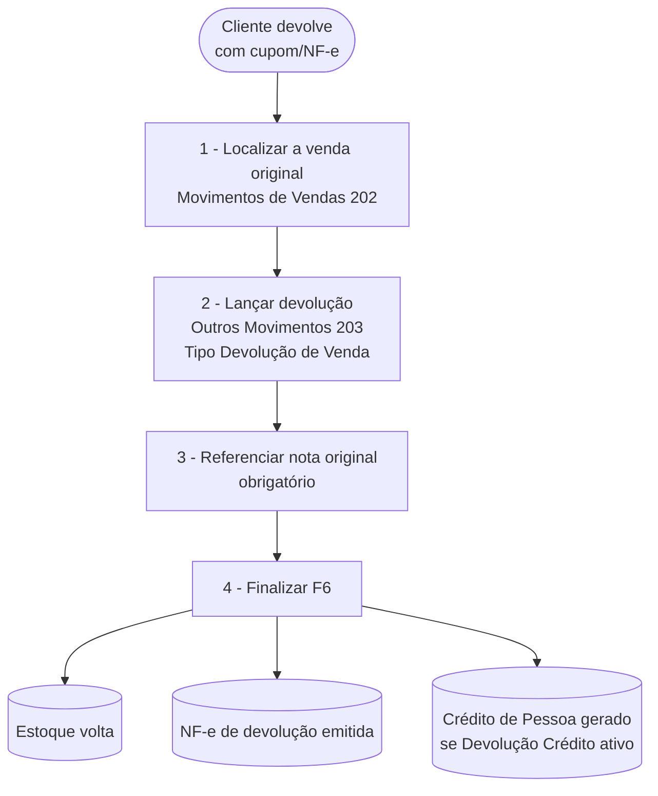

# 📄 Trilha — Devolução de venda - Sol.NET

## 🎯 Visão Geral

Trilha narrativa que cobre o ciclo completo de **uma devolução de mercadoria já vendida**: do recebimento da mercadoria de volta à emissão da NF-e de devolução e à geração do crédito ao cliente.

> ℹ️ **Por que devolução de venda vai em `203` e não em `202`?** A divisão entre as três telas de movimento segue o **operador**, não só o sentido fiscal. Devolução de venda envolve mercadoria entrando de volta, mas é operada pela retaguarda — não pelo vendedor. Por isso fica em [Outros Movimentos](../Movimentos/outros_movimentos.md) (`203`), com Tipos configurados como `Devolução`.

Esta trilha atravessa:

- [Movimentos de Vendas](../Movimentos/movimentos_de_vendas.md) (`202`) — apenas para **consultar** a venda original.
- [Outros Movimentos](../Movimentos/outros_movimentos.md) (`203`) — onde a devolução é lançada.

Em lojas de balcão com volume alto, há também um padrão de **duas etapas** (pedido de devolução intermediário durante o dia + NF-e de devolução consolidada no fechamento) coberto ao final.

---

## 🗺️ Fluxo padrão (devolução direta)

---

## 1️⃣ Localizar a venda original — tela [Movimentos de Vendas](../Movimentos/movimentos_de_vendas.md) (`202`)

Esta etapa é só de consulta — precisa dos dados da venda original para referenciar na devolução.

**O que fazer:**

1. Abra a pesquisa (`F1`) e digite `202`.
2. Na sub-aba `Movimentos`, localize a venda original — filtre por `Pessoa` (cliente), `Período` ou `Nº Documento` do cupom/NF-e.
3. Anote os dados que vão ser usados na referência: `Tipo`, `Série`, `Nº Documento`, `Chave de Acesso` (para NF-e/NFC-e), data e os itens devolvidos.

> 💡 Vendas vindas do PDV (cupons NFC-e) aparecem nesta tela com filtros na sub-aba `Pesquisa PDV`. Devolução de cupom é o caso de uso mais comum — siga o padrão de duas etapas descrito mais abaixo.

---

## 2️⃣ Lançar a devolução — tela [Outros Movimentos](../Movimentos/outros_movimentos.md) (`203`)

**O que fazer:**

1. Abra a pesquisa (`F1`) e digite `203`.
2. Clique em **Novo**.
3. Na sub-aba `Cabeçalho`:
   - `Tipo` = `DEVOLUÇÃO DE VENDA` (ou outro Tipo configurado em `37` com `Devolução = Sim`).
   - `Pessoa` = o cliente que está devolvendo.
   - `Local de Estoque` = onde a mercadoria devolvida vai entrar.
4. Na sub-aba `Itens`, adicione os produtos devolvidos com as mesmas quantidades.

---

## 3️⃣ Referenciar a nota original (obrigatório)

Sem referência à venda original, a finalização é bloqueada com:
*"Não Permitido, Obrigatório Referenciar Nota! (Devolução)"*.

**O que fazer:**

1. Localize, no formulário, a sub-aba/grupo de referência (`Notas Referenciadas` ou equivalente conforme a versão).
2. Aponte para a venda original — o vínculo pode ser pela busca da nota no Sol.NET (mesma empresa) ou pela chave de acesso da NFC-e/NF-e original.
3. A referência deve ser da **mesma empresa**, caso contrário a validação bloqueia: *"Não Permitido, Obrigatório Referenciar Nota da Mesma Empresa! (Devolução)"*.

---

## 4️⃣ Finalizar — `F6`

**O que fazer:**

1. Pressione `F6` ou clique em `Finalizar`.
2. O sistema valida CFOPs (devolução normalmente usa CFOPs `1202`/`2202`/`1410`/`2410`), totalizações, série e referência.

**Resultado esperado:**

- **Estoque** — soma na camada `Físico` e `Disponível` do `Local de Estoque` informado (mercadoria volta).
- **Fiscal** — NF-e de devolução emitida pela SEFAZ, com a referência à venda original.
- **Financeiro / Crédito ao cliente** — se o Tipo está configurado com `Devolução Crédito` ativo (em `37`), um **Crédito de Pessoa** é gerado, visível na sub-aba `Crédito - Gerado` do movimento e na ficha do cliente. O crédito pode ser usado para abater compras futuras.

---

## 🛍️ Variação — duas etapas para devolução de cupom (loja de balcão)

Em lojas com volume alto de devoluções (supermercados, varejo), há um padrão otimizado: o atendente cria um **`PEDIDO DE DEVOLUÇÃO`** rapidamente durante o atendimento; no fechamento do dia, todos os pedidos viram uma **`NF-e Devolução`** consolidada.

A configuração-chave é o flag `Referenciar Mov. Próprio` no Tipo `NF-e Devolução` em `37` — **desmarcado**, faz a NF-e final herdar a referência ao **cupom fiscal de origem** (não ao pedido intermediário).

**Operação:**

1. **Durante o dia**, o atendente: `F1` → `203` → `Novo` → Tipo `PEDIDO DE DEVOLUÇÃO` → aponta o cupom fiscal (chave NFC-e) → confere itens → finaliza. Cliente sai com comprovante; sem NF-e ainda.
2. **No fechamento**, o operador localiza todos os pedidos do dia (filtro por Tipo + período).
3. Em cada pedido, aplica `F7 Mudar` → vira `NF-e Devolução`. Como `Referenciar Mov. Próprio` está desmarcado no Tipo destino, a NF-e referencia o cupom original (não o pedido).
4. Estoque volta e (se configurado) Crédito de Pessoa é gerado.

Detalhes em [Outros Movimentos — devolução de cupom](../Movimentos/outros_movimentos.md#exemplos-pr%C3%A1ticos).

> ⚠️ **Acesso de suporte necessário:** os Tipos `PEDIDO DE DEVOLUÇÃO` e `NF-e Devolução` vêm do `Cadastro de Tipos de Movimento` (`37`), que requer permissão de acesso de suporte. Entre em contato com o suporte Hetosoft antes de criar ou alterar esses Tipos.

---

## ⚠️ Quando dá errado

| Mensagem | Etapa | Onde resolver |
|---|---|---|
| `Não Permitido, Obrigatório Referenciar Nota! (Devolução)` | 4 | Falta a referência à venda original. Volte ao passo 3. |
| `Não Permitido, Obrigatório Referenciar Nota da Mesma Empresa! (Devolução)` | 3 | A nota referenciada é de outra empresa. Use a venda da mesma empresa do movimento atual. |
| `Movimento sem item!` | 4 | Adicione ao menos um item na sub-aba `Itens`. |
| `CFOP não é de entrada!` em devolução de venda | 4 | Devolução de venda fiscalmente é uma entrada (mercadoria volta). Verifique se o Tipo está com CFOPs `1202`/`2202`/`1410`/`2410` ou equivalentes. |
| NF-e de devolução `Rejeitada` pela SEFAZ | 4 | Leia o motivo no `Protocolo Fiscal`. Causas comuns: referência à nota original ausente/incorreta, CFOP incompatível, item da devolução não está na nota original. |

Lista completa em [Índice de mensagens](../indice_mensagens.md).

---

## 💡 Exemplos práticos

### Devolução pontual de uma venda com NF-e identificada

Cliente com NF-e na mão devolve um item. `203` → `Novo` → Tipo `DEVOLUÇÃO DE VENDA` → Pessoa = cliente → Itens = produto devolvido → Referencia a NF-e original → `F6`. Estoque volta, NF-e de devolução emitida, crédito gerado (se configurado).

### Devolução parcial

Cliente devolve só 2 de 5 unidades vendidas. Mesmo fluxo, mas no item informa apenas a quantidade devolvida (`2`). A NF-e de devolução referencia a venda original mas com quantidade parcial.

### Devolução de cupom NFC-e em supermercado

Use o padrão de **duas etapas** descrito acima. Atendente cria `PEDIDO DE DEVOLUÇÃO` durante o atendimento; no fechamento, todos os pedidos viram `NF-e Devolução` consolidada via `F7 Mudar`.

---

## 🔗 Para aprofundar

| Tela / Doc | Quando consultar |
|---|---|
| [Outros Movimentos](../Movimentos/outros_movimentos.md) (`203`) | Particularidades do modo Outros, exemplos completos de devolução de cupom. |
| [Movimentos — referência](../Movimentos/documentacao_movimentos.md) | Ciclo de vida, validações, sub-aba `Crédito - Gerado`. |
| [Tipos de Movimento](../TiposDeMovimento/documentacao_tipos_de_movimento.md) (`37`) | Configuração `Devolução = Sim`, `Devolução Crédito`, `Referenciar Mov. Próprio`. |
| [Tipos de Movimento — referência de configurações](../TiposDeMovimento/referencia_configuracoes_tipos_movimento.md) | Detalhe de cada flag mencionada acima. |
| [Histórico de Movimentações](../documentacao_historico_de_movimentacoes.md) (`205`) | Análise e totais de devoluções por período, vendedor, cliente. |

---

**Última atualização**: Maio de 2026
**Versão**: 1.0
**Público-alvo**: Retaguarda / Atendimento / Operação fiscal
