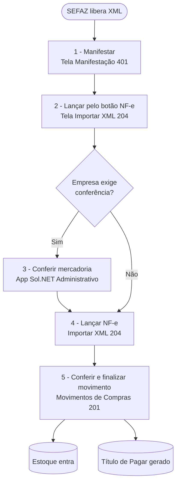

# 📄 Trilha — Entrada de NF-e completa - Sol.NET

## 🎯 Visão Geral

Trilha narrativa que cobre o ciclo completo de **uma entrada de mercadoria via NF-e**: desde a chegada do XML pela SEFAZ até o estoque na prateleira e o título de Pagar gerado.

Esta trilha atravessa **três telas** e (opcionalmente) o aplicativo `Sol.NET Administrativo`:

- [Manifestação do Destinatário](../../Fiscal/documentacao_manifestacao_destinatario.md) (`401`) — fecha a obrigação fiscal.
- [Importar XML NF-e](../documentacao_importar_xml.md) (`204`) — converte o XML em movimento de entrada.
- [Conferência de XML](../documentacao_conferencia_xml.md) — quando a empresa exige contagem física antes do lançamento.
- [Movimentos de Compras](../Movimentos/movimentos_de_compras.md) (`201`) — onde o movimento aparece e é finalizado.

> 💡 **Quando usar.** Toda vez que uma NF-e de fornecedor chega pela SEFAZ (caminho padrão). Para XMLs que vieram por fora (e-mail, pendrive), pule a Manifestação e vá direto à etapa 3.

---

## 🗺️ Fluxo completo

---

## 1️⃣ Manifestar a NF-e — tela [Manifestação do Destinatário](../../Fiscal/documentacao_manifestacao_destinatario.md) (`401`)

A SEFAZ exige manifestação antes de qualquer lançamento. O `Sol.NET_MonitorNFCe` baixa o XML automaticamente em ciclos de ~59 minutos e deixa disponível para manifestação aqui.

**O que fazer:**

1. Abra a pesquisa (`F1`) e digite `401`.
2. Localize a NF-e no grid (filtros por loja, fornecedor, período ou chave de acesso).
3. Com a linha selecionada, clique em `Confirmar(1)` (mercadoria recebida) ou `Ciência(4)` (registra conhecimento sem comprometer).
4. A coluna `Evento` passa a refletir a manifestação enviada.

**Resultado esperado:** evento de manifestação confirmado na SEFAZ. A NF-e está pronta para virar movimento.

> 💡 Os dois pares de botões `NF-e`/`CT-e` à esquerda da tela são **descontinuados** — não usar. Para lançar a entrada, use o botão `NF-e` que fica **entre `Zerar NSU` e `Confirmar`**.

---

## 2️⃣ Abrir o XML no lançamento — tela [Importar XML NF-e](../documentacao_importar_xml.md) (`204`)

**O que fazer:**

1. Ainda na tela `Manifestação`, com a linha selecionada, clique no botão **`NF-e`** (entre `Zerar NSU` e `Confirmar`).
2. O Sol.NET abre a tela `Importar XML NF-e` **em modo de inclusão**, com cabeçalho, fornecedor, itens, tributos e parcelas já preenchidos a partir do XML.
3. Na aba `Itens`, confira que todos estão **vinculados** (descrição preenchida). Itens sem vínculo precisam ser resolvidos antes de lançar:
   - **Duplo clique** sobre o item sem descrição.
   - O `Cadastro de Produtos` (`32`) abre em modo pesquisa, com a descrição do fornecedor exibida no topo.
   - Localize o produto correspondente no cadastro **ou** inclua um novo (os campos `Cód. Fornecedor`, `EAN Fornecedor` e `Descrição Fornecedor` já vêm preenchidos do XML).
4. Na aba `Financeiro`, confira as parcelas trazidas do XML.

**Resultado esperado:** XML com todos os itens vinculados. Status `Edição` ou `Finalizado` (pronto para lançar).

> 💡 **Fornecedor novo.** Quando o emitente não está cadastrado, o campo `Fornecedor` na aba `Cabeçalho` fica em branco. Use o botão de cadastro à direita do campo — o `Cadastro de Pessoas` abre com CNPJ, razão e endereço já preenchidos.

---

## 3️⃣ Conferir a mercadoria (se a empresa exige) — app `Sol.NET Administrativo`

Lojas com **tipo de conferência XML habilitado** no `Cadastro de Empresas` exigem contagem física antes do lançamento. A contagem é registrada no app **Sol.NET Administrativo** — não na tela `204`. A aba `Conferência` em `Importar XML` apenas **exibe** o resultado.

**O que fazer:**

1. No app `Sol.NET Administrativo`, abra a NF-e (mesma chave de acesso).
2. Conferente passa item a item, confirmando ou registrando divergência.
3. O resultado fica disponível na aba `Conferência` da tela `204` no portal.

**Resultado esperado:** `Status Conferência` muda para `Finalizada Sem Divergência` ou `Finalizada Com Divergência`. Reflete no grid da tela `204` (a coluna `Conf.` muda de cor).

> ℹ️ A reabertura de uma conferência já finalizada requer permissão específica (código `375`) e é feita no portal. Detalhes em [Conferência de XML](../documentacao_conferencia_xml.md).

---

## 4️⃣ Lançar a NF-e — tela [Importar XML NF-e](../documentacao_importar_xml.md) (`204`)

Com o XML pronto (e a conferência feita, quando aplicável), gere o movimento de entrada.

**Decida o botão pela situação:**

| Botão | Quando usar |
|---|---|
| **`Lançar NF-e`** | Fluxo padrão: a mercadoria chegou exatamente como descrita na NF-e. |
| **`Lançar Parcial`** | Só parte da mercadoria foi recebida. Marca/desmarca itens e ajusta quantidades antes da gravação. |
| **`Lançar Próprio`** | NF-e emitida pela própria empresa (campo `Emissão` = `PROPRIA`). Caso de conciliação de saídas emitidas por fora. |

**O que fazer:**

1. Clique em `Lançar NF-e` (ou variante).
2. O Sol.NET abre a tela `Movimentos de Compras` (`201`) já preenchida com cabeçalho, itens, tributos e financeiro do XML.
3. Confira o `Tipo de Movimento` proposto (se houver mais de um Tipo aplicável, o usuário escolhe).
4. Grave o movimento.

**Resultado esperado:** o XML passa para status `Importado` e ganha vínculo com o `ID_MOVIMENTO` criado. O movimento aparece em `201` para ser finalizado.

---

## 5️⃣ Finalizar o movimento — tela [Movimentos de Compras](../Movimentos/movimentos_de_compras.md) (`201`)

**O que fazer:**

1. Confira o `Tipo de Movimento`, `Local de Estoque` de entrada, `Pessoa` (fornecedor), `Datas` (Emissão = da NF, E/S = recebimento físico), `Condição de Pagamento`.
2. Na sub-aba `Itens`, confira preços, quantidades e custos. Se o Tipo tiver `Atualizar Custo Automático` marcado, o custo informado **propaga** para o cadastro do produto ao gravar.
3. Na sub-aba `Financeiro → Parcelas`, confira/edite as parcelas geradas a partir do XML ou da Condição de Pagamento.
4. Pressione `F6` para **Finalizar** o movimento.

**Resultado esperado (após finalizar):**

- **Estoque** — soma na camada `Físico` e `Disponível` do `Local de Estoque` informado.
- **Financeiro** — título(s) de Pagar gerado(s) com vencimento da Condição de Pagamento, visíveis em [Pagar e Receber](../../Financeiro/documentacao_pagar_e_receber.md) (`301`).
- **Fiscal** — a NF-e do fornecedor fica vinculada ao movimento e as colunas `M-` da tela `401` mostram o vínculo.
- **Custo** — se o Tipo está configurado para atualizar custo, o cadastro do produto recebe o novo custo.

---

## ⚠️ Quando dá errado

| Mensagem | Etapa | Onde resolver |
|---|---|---|
| `Chave de Acesso já Cadastrada!` | 2 | XML já foi carregado antes. Localize o registro existente no grid da tela `204` em vez de carregar de novo. |
| `( fornecedor ) NÃO É SUA EMPRESA!` | 2 | CNPJ do destinatário no XML não bate com nenhuma loja cadastrada. Verifique se a NF-e foi emitida para o CNPJ correto. |
| `Não Existe Nenhum Item com Vinculo!` | 2 | Há itens sem vínculo no XML. Volte na aba `Itens` e vincule cada item. |
| `Não Permitido, Tipo Serviço!` ao vincular | 2 | Produto selecionado é do tipo `Serviço`. Itens de NF-e de mercadoria não casam com produtos de serviço — selecione outro produto. |
| `CFOP não é de entrada!` | 5 | Tipo de Movimento usado tem CFOP fora da faixa de entrada (`1xxx`/`2xxx`/`3xxx`). Use outro Tipo, ou ajuste a Natureza de Operação. |
| `Caixa Aberto. Fechamento Nº: ( ... )` | 5 | Tipo exige caixa aberto e o caixa do usuário está fechado. Abra o caixa em [Caixa Geral — operação](../../Financeiro/documentacao_caixa_geral_op.md) (`302`). |

Lista completa em [Índice de mensagens](../indice_mensagens.md).

---

## 💡 Exemplos práticos

### Fornecedor recorrente, todos os itens já vinculados

Cenário mais comum. Manifesta → abre pelo botão `NF-e` → lança → finaliza. O ciclo inteiro leva poucos minutos porque o vínculo de cada item já foi gravado em compras anteriores.

### Primeira compra de um fornecedor novo

O fornecedor não existe no cadastro e nenhum item está vinculado. Cadastre o fornecedor pelo botão à direita do campo `Fornecedor` (o `Cadastro de Pessoas` abre pré-preenchido). Em seguida, vincule item a item por duplo clique. A partir da segunda compra desse fornecedor, vira fluxo recorrente.

### Recebimento parcial

A NF-e tem 10 itens, só 7 chegaram. Vincule todos os 10 e, ao lançar, use `Lançar Parcial` em vez de `Lançar NF-e`. Marque na aba `Itens` (coluna `Sel.`) só os 7 itens recebidos. O XML permanece para complementação futura.

---

## 🔗 Para aprofundar

| Tela / Doc | Quando consultar |
|---|---|
| [Manifestação do Destinatário](../../Fiscal/documentacao_manifestacao_destinatario.md) (`401`) | Filtros, eventos da manifestação, prazo legal, NSU. |
| [Importar XML NF-e](../documentacao_importar_xml.md) (`204`) | Detalhes de cada sub-aba, regras de vínculo, bloqueios. |
| [Conferência de XML](../documentacao_conferencia_xml.md) | Habilitação por loja, estados da conferência, permissão de reabertura. |
| [Movimentos de Compras](../Movimentos/movimentos_de_compras.md) (`201`) | Particularidades do modo Compras. |
| [Movimentos — referência](../Movimentos/documentacao_movimentos.md) | Comportamento comum das três telas (`201/202/203`), ciclo de vida, validações. |
| [Tipos de Movimento](../TiposDeMovimento/documentacao_tipos_de_movimento.md) (`37`) | Por que o Tipo escolhido se comporta assim. |

---

**Última atualização**: Maio de 2026
**Versão**: 1.0
**Público-alvo**: Equipe de recebimento / Retaguarda fiscal
