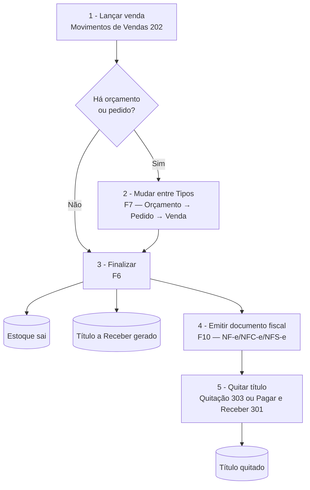

# 📄 Trilha — Venda completa - Sol.NET

## 🎯 Visão Geral

Trilha narrativa que cobre o ciclo completo de **uma venda na retaguarda**: do orçamento (quando há) até a baixa do título financeiro. Atravessa:

- [Movimentos de Vendas](../Movimentos/movimentos_de_vendas.md) (`202`) — onde a venda é lançada, mudada, emitida.
- Emissão fiscal — NF-e/NFC-e/NFS-e disparada pela própria tela `202`.
- [Quitação](../../Financeiro/documentacao_quitacao.md) (`303`) ou [Pagar e Receber](../../Financeiro/documentacao_pagar_e_receber.md) (`301`) — quitação dos títulos gerados.

> ℹ️ **PDV é separado.** Vendas em frente de caixa (cupom NFC-e, comanda) acontecem na aplicação **PDV**, não nesta tela. A tela `202` é para vendas operadas pela retaguarda (balcão atendido por vendedor, orçamento → pedido → faturamento, OS com faturamento). Movimentos do PDV aparecem aqui apenas para consulta/edição complementar.

---

## 🗺️ Fluxo completo



---

## 1️⃣ Lançar a venda — tela [Movimentos de Vendas](../Movimentos/movimentos_de_vendas.md) (`202`)

**O que fazer:**

1. Abra a pesquisa (`F1`) e digite `202`.
2. Clique em **Novo**.
3. Na sub-aba `Cabeçalho`:
   - Selecione o `Tipo de Movimento` (`VENDA BALCÃO`, `ORÇAMENTO`, `PEDIDO`, etc.).
   - Preencha `Pessoa` (cliente — pode ser consumidor final genérico).
   - Ajuste `Condição de Pagamento`, `Portador`, `Vendedor`, `Local de Estoque`, `Tabela de Preço`.
4. Vá para a sub-aba `Itens` e adicione cada produto: código/EAN, quantidade, preço (vem da Tabela), desconto/acréscimo individual.
5. Na sub-aba `Descontos/Outras Despesas`, lance frete, desconto no total ou outras despesas conforme acordado.
6. Na sub-aba `Financeiro → Parcelas`, confira as parcelas geradas a partir da Condição de Pagamento.

**Resultado esperado:** movimento gravado em estado aberto (`LANÇADO`), ainda sem efeito definitivo no estoque/financeiro.

---

## 2️⃣ Ciclo Orçamento → Pedido → Venda (quando aplicável) — `F7` Mudar

Aplica-se quando o cliente passou primeiro por uma cotação ou pedido. A operação `Mudar` (`F7`) **converte o Movimento de um Tipo para outro** — o comportamento é decidido pelo cadastro do Tipo de destino:

- **Transformar** — o mesmo Movimento muda de Tipo (identificador interno preservado). Não exige permissão de estorno. Histórico fica em uma única linha que progride.
- **Duplicar** — um novo Movimento é criado; o original muda para `VINCULADO` e fica congelado. Forma uma pilha auditável visível na sub-aba `Vínculos`.

A escolha entre Transformar e Duplicar é definida no cadastro do Tipo de destino, não pelo operador.

**O que fazer:**

1. Localize o movimento no grid (sub-aba `Movimentos`).
2. Pressione `F7` ou clique em `Mudar`.
3. O sistema oferece o(s) Tipo(s) de destino configurado(s) na aba `Mudar` do Tipo atual.
4. Confirme — o movimento avança no ciclo. Quando `PEDIDO` é o destino, o estoque é baixado e o financeiro gerado neste momento; quando `NFC-e` ou `NF-e` é o destino, a quitação dispara e a emissão fiscal inicia.

**Resultado esperado:** ciclo avançou para a próxima etapa. Cada etapa tem efeito específico conforme a configuração do Tipo.

> 💡 **Exemplo do fluxo padrão de loja** (todos no modo `Transformar`):
> ```
> ORÇAMENTO ──F7──▶ PEDIDO ──F7──▶ NFC-E CUPOM FISCAL
>   (sem estoque)     (estoque baixa,    (quita e emite)
>                      financeiro abre)
> ```

---

## 3️⃣ Finalizar — `F6`

Para vendas diretas (sem ciclo orçamento/pedido), o passo é direto: lançar → finalizar.

**O que fazer:**

1. Com o movimento ainda em edição (ou já gravado), pressione `F6` ou clique em `Finalizar`.
2. O sistema executa validações cruzadas: itens com vínculo, totalizações coerentes, caixa aberto (se o Tipo exige), série fiscal disponível, CFOPs compatíveis.
3. Confirmadas as validações, o Movimento passa para `FINALIZADO`.

**Resultado esperado:**

- **Estoque** — subtrai das camadas configuradas na Transação de Estoque do Tipo (`Físico`, `Disponível`).
- **Financeiro** — título(s) a Receber gerado(s), visíveis em [Pagar e Receber](../../Financeiro/documentacao_pagar_e_receber.md) (`301`).
- **Fiscal** — se o Tipo não dispara emissão automática, ela acontece no passo seguinte.

---

## 4️⃣ Emitir documento fiscal — `F10`

Para Tipos que emitem NF-e/NFC-e/NFS-e.

**O que fazer:**

1. Com o movimento finalizado selecionado, pressione `F10` ou clique em `NF-e`.
2. O Sol.NET gera o XML, assina, envia à SEFAZ e aguarda retorno.
3. O protocolo (autorizada, rejeitada, denegada) aparece na sub-aba `Movimentos → Protocolo Fiscal`.

**Resultado esperado:** documento autorizado e com `Chave de Acesso` atribuída. DANFE pode ser impressa (`F9`).

**Se rejeitada:** leia a mensagem da SEFAZ no `Protocolo Fiscal`, corrija o problema (CFOP, NCM, IE do destinatário etc.) e retransmita com `F10` novamente.

> 💡 Tipos como `NFC-E CUPOM FISCAL` disparam a emissão automaticamente no `Finalizar` ou no `Mudar` final do ciclo — o passo manual de `F10` não é necessário nesses casos.

---

## 5️⃣ Quitar o título — tela [Quitação](../../Financeiro/documentacao_quitacao.md) (`303`) ou direto pelo movimento (`F8`)

**O que fazer (pelo movimento):**

1. Selecione o movimento em `202` na sub-aba `Movimentos`.
2. Pressione `F8` ou clique em `Quitar`. Variantes: `Quitar Múltiplo`, `Quitar Contas PR`, `Quitar/Imprimir Só Portador`.
3. Confirme valores, portador e data da quitação.

**Ou (pela tela específica):**

1. Abra `Quitação` (`303`) para quitação em lote.
2. Localize o(s) título(s) do cliente e quite por seleção.

**Resultado esperado:** título(s) com status `QUITADO`. Saldo do cliente atualizado em [Pagar e Receber](../../Financeiro/documentacao_pagar_e_receber.md) (`301`).

---

## ⚠️ Quando dá errado

| Mensagem | Etapa | Onde resolver |
|---|---|---|
| `Movimento sem item!` | 3 | Adicione ao menos um item na sub-aba `Itens` antes de finalizar. |
| `CFOP não é de saída!` | 3 | Tipo de Movimento com CFOP fora da faixa de saída (`5xxx`/`6xxx`/`7xxx`). Use outro Tipo ou ajuste a Natureza de Operação. |
| `Caixa Aberto. Fechamento Nº: ( ... )` | 3 | Tipo exige caixa aberto. Abra o caixa em [Caixa Geral — operação](../../Financeiro/documentacao_caixa_geral_op.md) (`302`). |
| `Atualizar Custo Automático, Somente para Compras/Outros!` | 3 | Tipo de saída está configurado com `Atualizar Custo` ativo — vendas não atualizam custo. Ajustar no cadastro do Tipo (`37`). |
| `Empresa Não Permitida Para esse Tipo Movimento!` | 1 ou 3 | Tipo restrito a outra empresa. Selecione outro Tipo ou ajuste a configuração de Empresas no Tipo. |
| NF-e `Rejeitada` pela SEFAZ | 4 | Leia o motivo no `Protocolo Fiscal`. Corrija o dado apontado e retransmita com `F10`. |

Lista completa em [Índice de mensagens](../indice_mensagens.md).

---

## 💡 Exemplos práticos

### Venda balcão à vista

Cliente chega, compra, paga na hora. `202` → `Novo` → Tipo `VENDA BALCÃO` → Itens → `F6` (Finalizar). A quitação à vista acontece automaticamente porque a Condição de Pagamento é `À VISTA` e o Portador é `Caixa`. Cupom impresso conforme Relatório do Tipo.

### Orçamento que vira pedido e depois venda

Cliente pede uma cotação. Lance um Tipo `ORÇAMENTO` em `202` — não baixa estoque, não gera financeiro. Cliente aprova: `F7` para `PEDIDO` (estoque baixa, financeiro abre). Faturar: `F7` novamente para `NFC-E CUPOM FISCAL` (dispara quitação e emissão).

### Venda a prazo com 3 parcelas

`202` → `Novo` → Tipo `VENDA A PRAZO` → Condição `30/60/90`. Após `F6`, três títulos com vencimentos escalonados aparecem em `Pagar e Receber` (`301`). A quitação acontece à medida que cada parcela vence (vai em `303` ou direto pelo título em `301`).

---

## 🔗 Para aprofundar

| Tela / Doc | Quando consultar |
|---|---|
| [Movimentos de Vendas](../Movimentos/movimentos_de_vendas.md) (`202`) | Particularidades do modo Vendas. |
| [Movimentos — referência](../Movimentos/documentacao_movimentos.md) | Ciclo de vida (`Mudar`, `Quitar`, `Imprimir`, `NF-e`, `Estornar`), sub-abas, validações. |
| [Tipos de Movimento](../TiposDeMovimento/documentacao_tipos_de_movimento.md) (`37`) | Como configurar o ciclo Orçamento → Pedido → NF-e/NFC-e. |
| [Tabela de Preço](../documentacao_tabela_de_preco.md) (`27`) | Origem do preço aplicado a cada item. |
| [Pagar e Receber](../../Financeiro/documentacao_pagar_e_receber.md) (`301`) | Onde os títulos gerados ficam disponíveis. |
| [Quitação](../../Financeiro/documentacao_quitacao.md) (`303`) | Quitação em lote / por agrupamento. |
| [Histórico de Movimentações](../documentacao_historico_de_movimentacoes.md) (`205`) | Auditoria do que aconteceu com cada movimento. |

---

**Última atualização**: Maio de 2026
**Versão**: 1.0
**Público-alvo**: Vendedores de retaguarda / Operação comercial
