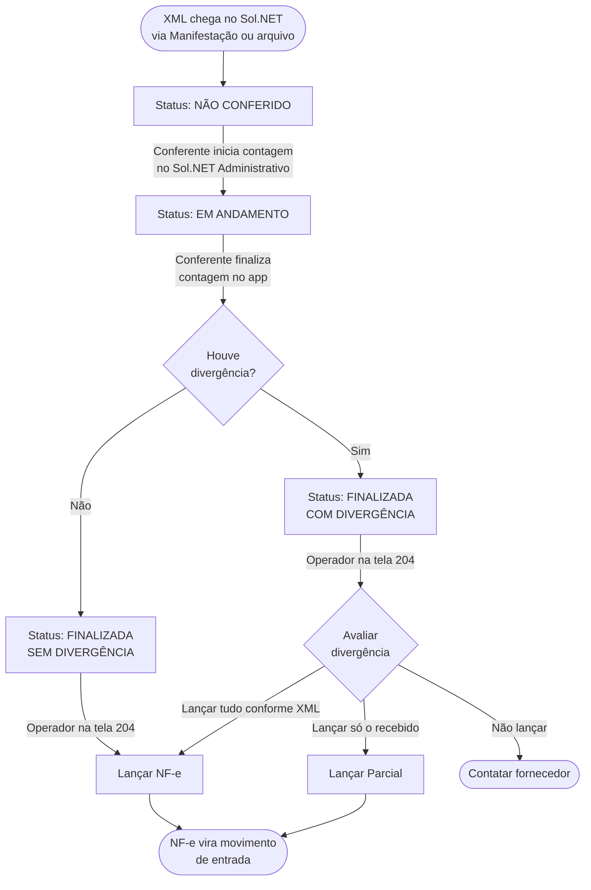

# 📄 Conferência de XML - Sol.NET

## 🎯 Visão Geral

A **Conferência de XML** é um mecanismo opcional do Sol.NET para **confrontar a mercadoria recebida fisicamente com o que veio no XML do fornecedor** *antes* de a NF-e virar movimento de entrada.

A contagem física **não é feita na tela** `Importar XML NF-e` — ela é registrada pelo conferente no aplicativo **Sol.NET Administrativo** (mobile). A tela `204` apenas **exibe o resultado** da conferência feita no app, na aba `Conferência`, e usa esse resultado para classificar o XML em `Sem Divergência` ou `Com Divergência` antes do lançamento.

O fluxo de ponta a ponta fica assim:

1. XML chega na tela `Importar XML` (via Manifestação do Destinatário ou arquivo).
2. **Conferente registra a contagem pelo Sol.NET Administrativo** (etapa externa a esta tela).
3. A aba `Conferência` da tela `204` passa a refletir o que foi conferido — item a item, com indicação de divergências.
4. O `Status Conferência` do XML é classificado: `Não Conferido`, `Em Andamento`, `Finalizada Sem Divergência` ou `Finalizada Com Divergência`.
5. Lançamento na movimentação é feito depois, já ciente do que bate ou não com o XML.

### Para que serve

- ✅ Garantir que a entrada na movimentação só ocorre após conferência física da mercadoria
- ✅ Detectar divergências de quantidade ou de código entre o XML e o recebido
- ✅ Bloquear lançamento (ou pelo menos sinalizar) quando o conferente registrar diferença
- ✅ Auditar quem conferiu cada nota e quando
- ✅ Servir como base de negociação com fornecedor em caso de falta ou excedente

### Situações comuns no dia a dia

- A aba `Conferência` não aparece → a loja não está com o tipo de conferência habilitado.
- `Status Conferência` continua em `Em Andamento` indefinidamente → a conferência foi iniciada mas não foi finalizada; é preciso voltar ao registro e concluir.
- Necessidade de reabrir uma conferência já finalizada → existe um fluxo controlado por permissão para devolver o status para `Em Andamento`.
- NF-e foi lançada sem conferência → a loja pode não usar o recurso ou ele foi desabilitado.

---

## 🚪 Como habilitar a conferência

A conferência é **configurada por loja** (não é um parâmetro global do sistema). A configuração fica no `Cadastro de Empresas`:

1. Pressione F1 e abra o `Cadastro de Empresas` (código `1`).
2. Localize a loja desejada no grid de busca.
3. Abra o registro e localize o campo **`Tipo Conferência XML`** (ou rótulo equivalente).
4. Habilite e grave.

> ⚠️ **Acesso de suporte necessário:** alterações no `Cadastro de Empresas` requerem permissão de acesso de suporte. Entre em contato com o suporte Hetosoft antes de realizar qualquer modificação nesta tela.

A partir da habilitação:

- Todo XML carregado na tela `Importar XML` para essa loja passa a exigir conferência antes do lançamento.
- A aba `Conferência` aparece na tela `204` para registros dessa loja.
- O grid principal da tela `204` mostra a coluna `Status Conferência` preenchida.

Para **desabilitar**, basta desmarcar o campo no `Cadastro de Empresas`. XMLs já em conferência permanecem com seu status registrado, mas novos XMLs daquela loja passam direto.

---

## 🔍 Os estados da conferência

A conferência tem **dois campos** que andam juntos no grid e nos relatórios.

### `Status Conferência` (de andamento)

Indica em que ponto do fluxo o XML está.

| Texto exibido | Significa | Próximo passo no Sol.NET |
|---------------|-----------|--------------------------|
| `NÃO CONFERIDO` | A contagem ainda não foi iniciada no Sol.NET Administrativo. | Aguardar a equipe da loja iniciar a conferência pelo app. |
| `EM ANDAMENTO` | A contagem foi iniciada no app, mas ainda não foi finalizada. | Aguardar a equipe concluir pelo app. |
| `FINALIZADA SEM DIVERGÊNCIA` | A contagem foi concluída e tudo bateu com o XML. | Pode lançar a NF-e. |
| `FINALIZADA COM DIVERGÊNCIA` | A contagem foi concluída e pelo menos um item ficou divergente. | Avaliar a aba `Conferência` antes de lançar; possivelmente usar `Lançar Parcial`. |

### Indicador no grid

Na grid principal da tela `204`, a coluna `Status Conferência` muda de cor conforme o estado — divergências são sinalizadas em vermelho/destaque, conferências finalizadas sem divergência em verde. Isso ajuda a varrer rapidamente o que precisa de atenção.

---

## 🧭 A aba `Conferência` dentro do `Importar XML`

A aba **`Conferência`** só fica visível quando a loja tem o recurso habilitado e o XML está aberto. Ela exibe um grid com **uma linha por item da NF-e**, mostrando **o que o conferente registrou no Sol.NET Administrativo** — quantidades efetivamente recebidas, código bipado e divergências apuradas.

> ℹ️ A aba é **apenas leitura sobre o resultado da contagem**. Não há marcação ou edição da conferência diretamente nessa tela — a operação acontece toda no app.

### Colunas do grid

| Coluna | Para que serve |
|--------|----------------|
| `Sel.` | Marcação manual para ações em lote (uso operacional). |
| `Nº` | Número sequencial do item dentro da NF-e. |
| `Cód. Forn.` | Código do produto no fornecedor (vem do XML). |
| `EAN Forn.` | EAN do produto no fornecedor. |
| `Produto do Fornecedor` | Descrição como aparece na nota do fornecedor. |
| `Código` | Código do produto **no cadastro do Sol.NET** (após vínculo). |
| `Conf.` | Indica se o item foi conferido no app. |
| `Descrição` | Descrição do produto no cadastro. |
| Quantidade (`Q.De`, `Q.Na`, `Quant.`) | Quantidades do XML e suas conversões de unidade — útil para comparar com o que foi efetivamente contado. |
| `Vl. Unitário`, `Custo I. Nota`, `Custo I. Atual`, `Dif. Custo %` | Análise de custo entre o que o XML traz e o cadastro. |
| `Vl. Total`, `Bs. ICMS`, `Vl. ICMS`, `Bs. ICMS ST`, `Vl. ICMS ST`, `Vl. IPI` | Valores fiscais para auditoria. |

> 💡 As colunas de tributos servem mais para auditoria que para análise da contagem — o foco visual é nas colunas de **quantidade** e **código**, que evidenciam onde houve divergência.

---

## 🚦 O ciclo da conferência

O fluxo de ponta a ponta, com cada estado e o agente responsável pela transição:

A contagem em si (`NÃO CONFERIDO` → `EM ANDAMENTO` → `FINALIZADA`) é toda registrada no **Sol.NET Administrativo**. A tela `Importar XML` (`204`) é onde o operador acompanha o status e decide o lançamento depois que a conferência está finalizada.

### Reabrir uma conferência finalizada

Quando uma contagem é concluída mas precisa ser ajustada (item esquecido, divergência registrada errada), é possível **voltar o status para `Em Andamento`** a partir da própria tela `204`:

- A operação exige permissão (consulta interna `375`); usuários sem acesso são bloqueados.
- A reabertura **só é permitida se a conferência já estiver finalizada**. Se estiver em andamento, o sistema responde com `Conferencia não está finalizada!`.
- Ao confirmar, o status volta para `EM ANDAMENTO` e a mensagem `Status de Conferencia Alterado para EM ANDAMENTO.` é exibida. O conferente pode então retomar a contagem pelo app.

A reabertura é uma exceção operacional — o caminho normal é finalizar uma única vez no app.

---

## 🔗 Interação com o lançamento da NF-e

O `Status Conferência` **não bloqueia** automaticamente o lançamento da NF-e — o operador tem autonomia para decidir. Mas a informação serve de gate:

| Situação | Recomendação |
|----------|--------------|
| `Não Conferido` em loja com conferência habilitada | Pedir conferência antes de lançar. Lançar sem conferir contraria o propósito do recurso. |
| `Em Andamento` | Conferência incompleta. Concluir primeiro. |
| `Finalizada Sem Divergência` | Pode lançar com `Lançar NF-e` sem ressalvas. |
| `Finalizada Com Divergência` | Decidir entre: |
| | • `Lançar NF-e` — entrar tudo igual ao XML (assume divergência como erro de conferência). |
| | • `Lançar Parcial` — entrar somente o efetivamente recebido. |
| | • Não lançar e contatar fornecedor. |

A operação de `Lançar` em si é a mesma descrita em [Importar XML — Lançar a NF-e na movimentação](documentacao_importar_xml.md).

---

## 💡 Exemplos Práticos

### Exemplo 1 — Conferência sem divergência

**Cenário**: chegou um caminhão com 12 caixas conforme NF-e. Cada caixa contém um item que está no XML, na quantidade certa.

1. O XML já está no Sol.NET (importado pela Manifestação ou carregado manualmente).
2. A equipe da loja faz a contagem pelo **Sol.NET Administrativo** e finaliza a conferência. Tudo bate.
3. Na tela `204`, o `Status Conferência` aparece como `FINALIZADA SEM DIVERGÊNCIA`.
4. O operador abre o registro, confere visualmente a aba `Conferência` e clica em `Lançar NF-e`. Entrada gerada normalmente.

### Exemplo 2 — Conferência com divergência de quantidade

**Cenário**: XML lista 10 unidades de um produto; chegaram apenas 8.

1. A contagem é feita pelo **Sol.NET Administrativo**. O conferente registra a quantidade efetiva (8) — o item fica marcado como divergente.
2. Ao finalizar a contagem no app, o `Status Conferência` da nota na tela `204` muda para `FINALIZADA COM DIVERGÊNCIA` e a coluna no grid principal aparece em destaque.
3. Na tela `204`, o operador abre o registro e vai na aba `Conferência` para ver qual item divergiu e em que quantidade.
4. O operador decide:
   - **Opção A**: lançar tudo igual ao XML (`Lançar NF-e`) e tratar a falta com o fornecedor depois — gera um excedente fiscal de 2 unidades que precisará de ajuste.
   - **Opção B**: lançar parcial (`Lançar Parcial`), entrando só as 8 unidades; o XML permanece registrado e a divergência fica como histórico.
5. Sempre comunicar o fornecedor para correção (carta de correção, retorno de mercadoria, abatimento).

### Exemplo 3 — Conferência por código diferente

**Cenário**: XML lista o produto X, mas chegou o produto Y (código diferente).

1. Durante a contagem no app, o EAN bipado não bate com o item do XML — o app registra divergência de identificação.
2. Conferência é finalizada como `FINALIZADA COM DIVERGÊNCIA`.
3. Na tela `204`, o operador vê a divergência na aba `Conferência` (códigos não casaram).
4. Esse caso normalmente **não deve virar movimento** — a mercadoria errada precisa voltar para o fornecedor e uma nota corretiva precisa ser emitida.

### Exemplo 4 — Reabrir conferência por engano

**Cenário**: a conferência foi finalizada pelo app, mas a equipe percebeu que um item foi contado errado.

1. Operador com permissão abre o registro na tela `204` (modo visualização).
2. Aciona a função de reabrir conferência (ver `Reabrir uma conferência finalizada` acima).
3. Confirma. Status volta para `EM ANDAMENTO`.
4. A equipe retoma a contagem no Sol.NET Administrativo e finaliza novamente.

---

## ❓ FAQ / Problemas Comuns

### ❓ A aba `Conferência` não aparece para mim. Por quê?

A aba só é exibida quando a loja (registro do XML) tem o `Tipo Conferência XML` habilitado no `Cadastro de Empresas`. Verifique a loja do XML aberto e a configuração da loja.

### ❓ Posso usar conferência em uma loja e em outra não?

Sim. A configuração é **por loja**. Lojas onde o recurso não faz sentido (ex.: ponto de venda sem recebimento físico) podem ficar sem.

### ❓ Quem inicia e finaliza a contagem?

A contagem é feita pela equipe da loja no aplicativo **Sol.NET Administrativo**. Não há ação de iniciar/finalizar conferência na tela `204` — a tela apenas reflete o status atual da contagem.

### ❓ E para reabrir uma conferência finalizada?

A **reabertura** é a única ação relacionada à conferência feita na tela `204` (não no app). Exige permissão específica (controle de acesso interno `375`) — usuários sem esse acesso recebem bloqueio de permissão. Após reabrir, o status volta para `EM ANDAMENTO` e a equipe retoma a contagem no Sol.NET Administrativo.

### ❓ Conferência finalizada pode ser apagada?

Não. O histórico de conferência fica no registro do XML mesmo após o lançamento da NF-e. É possível reabrir (ver acima) para ajustar antes do lançamento.

### ❓ O sistema bloqueia o lançamento da NF-e se a conferência estiver pendente?

O Sol.NET **não bloqueia automaticamente** — mas o `Status Conferência` no grid e na tela serve de aviso visual. A política de "não lançar sem conferir" é uma regra **operacional** da empresa, não uma restrição do sistema.

### ❓ Posso ver quem conferiu cada nota?

Sim. A coluna `Usuário Conferencia` no grid mostra o usuário que finalizou a contagem no app. O carimbo é gravado no momento da finalização.

### ❓ Conferência funciona para NF-e de saída (emissão própria)?

Não no mesmo modelo. A conferência aqui descrita serve para **recebimento de mercadoria** — confronta XML do fornecedor com o que entrou no estoque. Em NF-e própria (saída), a tela `Importar XML` opera com o botão `Lançar Próprio`, sem fluxo de conferência.

---

## 🔗 Documentos relacionados

- [Documentação Importar XML](documentacao_importar_xml.md) — onde a conferência se encaixa
- [Guia Rápido — Importar XML](guia_rapido_importar_xml.md) — cartão de referência rápido
- [FAQ — Importar XML](faq_importar_xml.md) — perguntas mais frequentes
- [Manifestação do Destinatário](../Fiscal/documentacao_manifestacao_destinatario.md) — porta de entrada dos XMLs

---

**Última atualização**: Maio de 2026  
**Versão**: 1.0  
**Público-alvo**: Conferentes, usuários e administradores de loja do Sol.NET ERP
