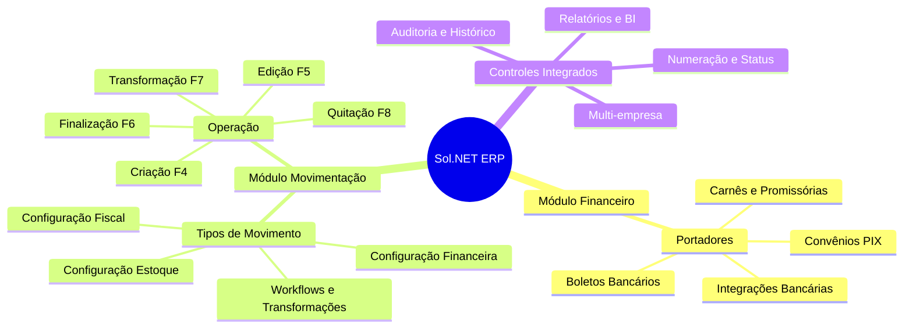

# 📚 Documentação Sol.NET ERP

## 🎯 Bem-vindo ao Centro de Documentação

Este é o **portal principal** para toda a documentação do **Sol.NET ERP**, o sistema integrado de gestão empresarial. Aqui você encontrará guias completos, referências rápidas e soluções para otimizar sua experiência com o sistema.

### 🏢 Sobre o Sol.NET ERP
**Sol.NET** é uma solução completa de ERP (Enterprise Resource Planning) desenvolvida pela Hetosoft, projetada para atender empresas de todos os portes com funcionalidades integradas para gestão comercial, financeira, fiscal e operacional.

### 📍 Principais Características:
- ✅ **Sistema Integrado**: Todos os módulos conectados em tempo real
- ✅ **Interface Intuitiva**: Design focado na experiência do usuário
- ✅ **Conformidade Fiscal**: Atualizado com a legislação brasileira
- ✅ **Relatórios Avançados**: Business Intelligence integrado
- ✅ **Suporte Multi-empresa**: Gestão de múltiplas filiais
- ✅ **API Robusta**: Integração com sistemas terceiros

---

## 🗂️ Módulos Disponíveis

### 💰 **[Módulo Financeiro](Financeiro/)**
Controle completo da gestão financeira da empresa:

#### 📖 **[Documentação de Portadores](Financeiro/Documentacao%20Portadores.md)**
- Configuração de bancos e instrumentos de pagamento
- Boletos, carnês, convênios e integrações PIX  
- Remessa eletrônica e automação bancária
- Comissões e validações automáticas

---

### 📦 **[Módulo Movimentação](Movimentacao/)**
Sistema completo de controle de operações comerciais:

#### **📋 [Índice Completo](Movimentacao/README.md)**
Portal de navegação para toda documentação de movimentação

#### **📖 [Documentação Completa](Movimentacao/Documentacao%20Movimentacao.md)**
- Visão geral e arquitetura do sistema
- Configuração de tipos de movimento
- Fluxo de trabalho detalhado
- Exemplos práticos e melhores práticas

#### **🚀 [Guia Rápido](Movimentacao/Guia%20Rapido.md)**
- Atalhos de teclado essenciais
- Checklist para novos movimentos
- Soluções rápidas para problemas comuns
- Configurações básicas

#### **❓ [FAQ - Perguntas Frequentes](Movimentacao/FAQ.md)**
- Configuração e tipos de movimento
- Controle financeiro e de estoque
- Documentos fiscais e workflows
- Cenários específicos por segmento

#### **💰 [Precificação - Tabela de Preços](Movimentacao/Preco de Venda - Guia do Usuario.md)**
Funcionalidades avançadas de precificação

#### **💲 [Preço de Venda - Guia do Usuário](Movimentacao/Preco%20de%20Venda%20-%20Guia%20do%20Usuario.md)**
Manual completo para gestão de preços de venda

---

## 🎯 Por Onde Começar

### **👤 Novo no Sol.NET?**
1. **Comece aqui**: Leia esta página para entender a estrutura geral
2. **Escolha seu módulo**: Acesse a documentação do módulo que você utilizará
3. **Guia rápido**: Use os guias rápidos para operações do dia a dia
4. **Dúvidas**: Consulte as seções de FAQ para respostas específicas

### **🔧 Administrador/Configurador?**
1. **Documentação completa**: Foque nas seções de configuração avançada
2. **Tipos e regras**: Configure tipos de movimento e regras de negócio  
3. **Integrações**: Configure portadores financeiros e integrações
4. **Cenários específicos**: Consulte FAQs para situações complexas

### **⚡ Usuário Experiente?**
1. **Guias rápidos**: Use como referência para atalhos e operações
2. **FAQs específicos**: Consulte para situações não habituais
3. **Novidades**: Acompanhe atualizações e novas funcionalidades
4. **Contribua**: Envie feedback para melhorias na documentação

---

## 🧭 Navegação Rápida

### **Por Área de Interesse**

#### **💳 Gestão Financeira**
- [Configuração de Portadores](Financeiro/Documentacao%20Portadores.md)
- [Controle Financeiro em Movimentações](Movimentacao/FAQ.md#-controle-financeiro)
- [Processo de Quitação](Movimentacao/Guia%20Rapido.md#-atalhos-essenciais)

#### **📊 Operações Comerciais**  
- [Fluxo de Trabalho Completo](Movimentacao/Documentacao%20Movimentacao.md#-fluxo-de-trabalho---passo-a-passo)
- [Tipos de Movimento](Movimentacao/Documentacao%20Movimentacao.md#-cadastro-de-tipos-de-movimento---centro-de-controle)
- [Exemplos Práticos](Movimentacao/Documentacao%20Movimentacao.md#-exemplos-práticos)

#### **⚙️ Configuração e Administração**
- [Cadastro de Tipos](Movimentacao/README.md#-administradorconfigurador)
- [Configurações Avançadas](Financeiro/Documentacao%20Portadores.md#-configuração-avançada)
- [Cenários Específicos](Movimentacao/FAQ.md#-cenários-específicos)

#### **🆘 Suporte e Problemas**
- [Solução de Problemas](Movimentacao/Documentacao%20Movimentacao.md#-solução-de-problemas-comuns)  
- [FAQ Completo](Movimentacao/FAQ.md)
- [Problemas Comuns](Movimentacao/Guia%20Rapido.md#-problemas-comuns---soluções-rápidas)

---

## 🗺️ Mapa do Sistema

---

## 🚀 Melhorias Planejadas  

### **💭 Feedback Contínuo**
Contribua para melhorar esta documentação:
- Relate dúvidas não esclarecidas
- Sugira exemplos adicionais
- Informe correções necessárias  
- Compartilhe casos de uso específicos

---

## 🔗 Links Importantes

### **📚 Recursos Adicionais**
- **[Suporte Técnico](#)**: Central de atendimento (em breve)
- **[Changelog](#)**: Histórico de atualizações (em breve)
- **[Comunidade](#)**: Fórum de usuários (em breve)

### **⚡ Atalhos Úteis**

| Funcionalidade | Atalho | Módulo |
|---------------|--------|---------|
| Novo movimento | **F4** | Movimentação |
| Salvar alterações | **F5** | Geral |
| Finalizar processo | **F6** | Movimentação |
| Transformar documento | **F7** | Movimentação |
| Quitar financeiro | **F8** | Financeiro |

---

## 📞 Suporte

### **🏢 Hetosoft - Desenvolvimento e Suporte**
- **Sistema**: Sol.NET ERP
- **Documentação**: Portal de usuários
- **Atualizações**: Contínuas conforme demanda

### **📧 Contato**
Para sugestões sobre esta documentação ou solicitação de novos conteúdos, entre em contato através dos canais oficiais da Hetosoft.

---

**📅 Última atualização**: Janeiro de 2025  
**📦 Versão**: 2.0  
**🎯 Público-alvo**: Usuários finais, administradores e configuradores Sol.NET  
**📖 Repositório**: [hetosoft/documentacao-solnet](https://github.com/hetosoft/documentacao-solnet) 
