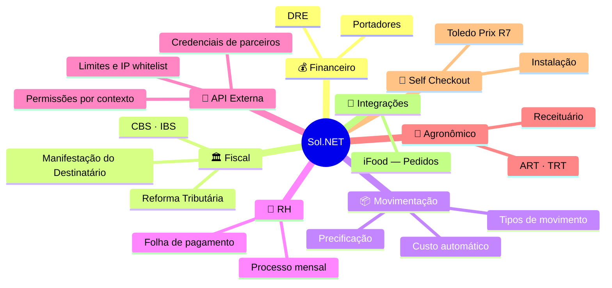

<h1 align="center">📚 Documentação Sol.NET ERP</h1>

<em>O ERP que conecta o que importa.</em>

---

## 👋 Bem-vindo

Você chegou ao **portal central** da documentação do Sol.NET. Aqui mora tudo que você precisa para configurar, operar e tirar o melhor proveito do ERP — escrito por quem usa, para quem usa.

A navegação completa fica no **menu lateral à esquerda** ←  
No celular, abra pelo botão ☰ no topo da página.

---

## 🌐 O ecossistema, num piscar de olhos

```mermaid
mindmap
  root((Sol.NET))
    💰 Financeiro
      DRE
      Portadores
    🏛️ Fiscal
      Reforma Tributária
      CBS · IBS
      Manifestação do Destinatário
    📦 Movimentação
      Tipos de movimento
      Precificação
      Custo automático
    👥 RH
      Folha de pagamento
      Processo mensal
    📡 API Externa
      Credenciais de parceiros
      Permissões por contexto
      Limites e IP whitelist
    🌱 Agronômico
      Receituário
      ART · TRT
    🛒 Self Checkout
      Instalação
      Toledo Prix R7
    🔌 Integrações
      iFood — Pedidos
```

Cada módulo segue o mesmo ritmo de três documentos: a **Documentação** (referência completa), o **Guia Rápido** (cheat-sheet do dia a dia) e o **FAQ** (perguntas que aparecem todo dia no suporte). Comece pela Documentação quando estiver aprendendo, mantenha o Guia Rápido por perto quando estiver operando.

---

## 💡 O atalho que vale por mil

> Em qualquer lugar do Sol.NET, **`F1`** abre a **pesquisa universal de telas**.  
> Digite o nome — ou o código `ID_FORMULARIO` — e vá direto pra função que você quer.  
> É a maneira oficial de navegar pelo sistema. Esqueça menus.

---

<strong>Pronto pra começar?</strong> Escolha um módulo no menu ao lado. 🚀

---

📅 Última atualização: Maio de 2026 · 📦 Versão 3.1 · 👥 Hetosoft — Sol.NET ERP

