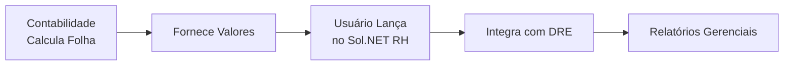

# 💼 Documentação: Módulo RH - Lançamentos de Folha de Pagamento

## 🎯 Visão Geral

O **Módulo de Lançamentos de RH** do Sol.NET ERP é uma ferramenta de **controle interno** que permite registrar os valores da folha de pagamento para integração com o DRE (Demonstração do Resultado do Exercício).

### ⚠️ Importante Compreender

**O que o módulo RH do Sol.NET FAZ:**
- ✅ Registro analítico de valores de folha de pagamento
- ✅ Integração dos lançamentos de RH com o DRE
- ✅ Controle interno por centro de custo/departamento
- ✅ Acompanhamento de despesas com pessoal

**O que o módulo RH do Sol.NET NÃO FAZ:**
- ❌ Cálculo de INSS, IRRF ou FGTS
- ❌ Processamento de folha de pagamento
- ❌ Integração com órgãos externos (eSocial, SEFIP, Receita Federal)
- ❌ Geração de guias de impostos ou encargos
- ❌ Emissão de holerites
- ❌ Controle de ponto eletrônico

### 🔄 Fluxo de Trabalho



**Processo típico:**
1. A **contabilidade externa** (escritório contábil) processa a folha de pagamento completa
2. A contabilidade fornece os **valores totais** por categoria (salários, encargos, benefícios, etc.)
3. O usuário do Sol.NET **lança esses valores** no módulo RH
4. O sistema **integra automaticamente** com o DRE
5. A empresa pode visualizar as **despesas com pessoal** nos relatórios gerenciais

---

## 📊 Estrutura do Módulo

### Organização de Lançamentos

O módulo permite lançar valores de folha organizados por:

- **Centro de Custo/Departamento**: Para alocar despesas por setor
- **Contas Contábeis**: Seguindo o plano de contas da empresa
- **Período (Competência)**: Mês/ano de referência
- **Tipo de Lançamento**: Salários, encargos, benefícios, provisões

### Integração com DRE

Os lançamentos de RH aparecem automaticamente no DRE nas contas configuradas:

```
6. DESPESAS OPERACIONAIS
  6.2 Despesas Administrativas
    6.2.01 Salários e Ordenados
    6.2.02 Encargos Sociais
    6.2.03 Benefícios
    6.2.04 Provisão 13º Salário
    6.2.05 Provisão Férias
```

---

## 💰 Cadastros Básicos

### 👥 Cadastro de Funcionários (Simplificado)

O cadastro de funcionários no Sol.NET serve apenas para **controle interno** e **alocação de custos**.

**Informações principais:**
- **Nome**: Identificação do colaborador
- **Matrícula**: Código interno (opcional)
- **Departamento/Centro de Custo**: Para alocação de despesas
- **Cargo**: Função exercida (referência)
- **Data de Admissão**: Para controle de histórico
- **Status**: Ativo/Inativo

**NÃO é necessário cadastrar:**
- CPF, RG, documentos pessoais
- Dados bancários
- Dependentes
- Informações fiscais detalhadas

### 🏢 Cadastro de Departamentos/Centros de Custo

Estrutura organizacional para alocar custos de RH:

**Informações:**
- **Código**: Identificador único
- **Nome**: Descrição (ex: "Administrativo", "Vendas", "Produção")
- **Conta Contábil de Despesa**: Onde serão lançados os valores de RH
- **Responsável**: Gestor do departamento (opcional)

**Exemplo:**
```
001 - Administrativo → Conta 6.2.01
002 - Vendas → Conta 6.1.01
003 - Produção → Conta 7.1.01
```

---

## 📝 Lançamento de Valores da Folha

### Processo de Lançamento

#### **Passo 1: Receber Informações da Contabilidade**

A contabilidade fornece um resumo como:

```
FOLHA DE PAGAMENTO - MARÇO/2024

Salários Brutos:           R$ 50.000,00
Encargos Sociais (INSS):   R$ 11.000,00
FGTS:                      R$  4.000,00
Benefícios (VT/VR):        R$  3.500,00
Provisão 13º:              R$  4.166,67
Provisão Férias:           R$  5.555,56
───────────────────────────────────────
Total Custo RH:            R$ 78.222,23

Departamento Administrativo: R$ 50.000,00
Departamento Vendas:         R$ 28.222,23
```

#### **Passo 2: Lançar no Sol.NET**

**Menu:** RH → Lançamentos de Folha

1. **Informar Competência:**
   - Mês/Ano: 03/2024

2. **Lançar por Categoria:**

   **Salários:**
   - Conta Débito: 6.2.01 - Salários Administrativo
   - Valor: R$ 30.000,00
   - Centro de Custo: Administrativo
   - Histórico: "Folha de Pagamento Março/2024"

   **Encargos:**
   - Conta Débito: 6.2.02 - Encargos Sociais
   - Valor: R$ 6.600,00
   - Centro de Custo: Administrativo
   - Histórico: "Encargos sobre Folha Março/2024"

3. **Repetir para outros departamentos** (Vendas, Produção, etc.)

4. **Salvar Lançamentos**

#### **Passo 3: Conferir Integração com DRE**

Após lançar, verifique o DRE:
- Menu Financeiro → DRE
- Selecione período: Março/2024
- Confira se os valores aparecem nas contas corretas

---

## 🔧 Configuração

### Vinculação de Contas Contábeis

Configure as contas padrão para cada tipo de lançamento:

**Menu:** RH → Configurações → Contas Padrão

**Contas Sugeridas:**

| Tipo de Lançamento | Conta Débito (Despesa) | Conta Crédito (Passivo) |
|-------------------|------------------------|-------------------------|
| Salários | 6.2.01 - Salários | 2.1.2.01 - Salários a Pagar |
| Encargos INSS | 6.2.02 - Encargos Sociais | 2.1.2.02 - INSS a Recolher |
| FGTS | 6.2.02 - Encargos Sociais | 2.1.2.03 - FGTS a Recolher |
| Benefícios | 6.2.03 - Benefícios | 2.1.2.04 - Benefícios a Pagar |
| Provisão 13º | 6.2.04 - Provisão 13º | 2.1.3.01 - Provisão 13º a Pagar |
| Provisão Férias | 6.2.05 - Provisão Férias | 2.1.3.02 - Provisão Férias a Pagar |

### Centro de Custo por Departamento

Defina o centro de custo padrão de cada departamento para facilitar lançamentos:

**Menu:** RH → Cadastros → Departamentos

Para cada departamento, vincule:
- Centro de Custo
- Conta Contábil de Despesa padrão

Isso agiliza lançamentos futuros.

---

## 💡 Exemplos Práticos

### Exemplo 1: Lançamento Simples de Folha Mensal

**Cenário:**
Empresa com 10 funcionários, todos do administrativo.
Contabilidade informou:
- Salários: R$ 25.000,00
- Encargos: R$ 7.000,00

**Lançamento:**

1. **Menu RH → Lançamentos de Folha → Novo**

2. **Lançamento 1 - Salários:**
   ```
   Data: 31/03/2024
   Histórico: Folha de Pagamento - Março/2024
   Centro de Custo: Administrativo
   
   D - 6.2.01 - Salários Administrativo → R$ 25.000,00
   C - 2.1.2.01 - Salários a Pagar → R$ 25.000,00
   ```

3. **Lançamento 2 - Encargos:**
   ```
   Data: 31/03/2024
   Histórico: Encargos sobre Folha - Março/2024
   Centro de Custo: Administrativo
   
   D - 6.2.02 - Encargos Sociais → R$ 7.000,00
   C - 2.1.2.02 - Encargos a Recolher → R$ 7.000,00
   ```

4. **Salvar**

5. **Resultado no DRE:**
   ```
   6.2 DESPESAS ADMINISTRATIVAS
      6.2.01 Salários .................. R$ 25.000,00
      6.2.02 Encargos Sociais .......... R$  7.000,00
      ────────────────────────────────────────────
      Total Despesas com Pessoal ....... R$ 32.000,00
   ```

### Exemplo 2: Lançamento com Múltiplos Departamentos

**Cenário:**
Empresa com 3 departamentos.
Valores por departamento:

| Departamento | Salários | Encargos |
|-------------|----------|----------|
| Administrativo | R$ 30.000 | R$ 8.400 |
| Vendas | R$ 20.000 | R$ 5.600 |
| Produção | R$ 35.000 | R$ 9.800 |

**Lançamento:**

Fazer 6 lançamentos (2 por departamento):

**Administrativo:**
```
D - 6.2.01 - Salários Administrativo → R$ 30.000
C - 2.1.2.01 - Salários a Pagar → R$ 30.000
Centro: Administrativo

D - 6.2.02 - Encargos Administrativo → R$ 8.400
C - 2.1.2.02 - Encargos a Recolher → R$ 8.400
Centro: Administrativo
```

**Vendas:**
```
D - 6.1.01 - Salários Vendas → R$ 20.000
C - 2.1.2.01 - Salários a Pagar → R$ 20.000
Centro: Vendas

D - 6.1.02 - Encargos Vendas → R$ 5.600
C - 2.1.2.02 - Encargos a Recolher → R$ 5.600
Centro: Vendas
```

**Produção:**
```
D - 7.1.01 - Salários Produção → R$ 35.000
C - 2.1.2.01 - Salários a Pagar → R$ 35.000
Centro: Produção

D - 7.1.02 - Encargos Produção → R$ 9.800
C - 2.1.2.02 - Encargos a Recolher → R$ 9.800
Centro: Produção
```

**Resultado no DRE:**
Permite análise de custo de pessoal por departamento.

### Exemplo 3: Lançamento de Provisões Mensais

**Cenário:**
Provisionar 13º salário e férias mensalmente.
Cálculo feito pela contabilidade:
- Provisão 13º: R$ 7.083,33
- Provisão Férias: R$ 9.444,44

**Lançamento:**

```
Provisão 13º Salário:
D - 6.2.04 - Provisão 13º Salário → R$ 7.083,33
C - 2.1.3.01 - Provisão 13º a Pagar → R$ 7.083,33

Provisão Férias:
D - 6.2.05 - Provisão Férias → R$ 9.444,44
C - 2.1.3.02 - Provisão Férias a Pagar → R$ 9.444,44
```

**Objetivo:**
Distribuir o custo anual de 13º e férias ao longo do ano para ter um DRE mais realista.

---

## 📊 Relatórios

### Relatórios Disponíveis

**1. Resumo de Despesas com Pessoal**
- Total por mês
- Comparativo mensal
- Gráfico de evolução

**2. Custo por Departamento**
- Análise de alocação
- Percentual sobre receita
- Custo médio por funcionário

**3. DRE com Detalhamento RH**
- Despesas com pessoal destacadas
- Por centro de custo
- Comparativos

**Acesso:**
Menu Financeiro → DRE → Selecionar período

---

## ❓ FAQ - Perguntas Frequentes

### **P: Preciso cadastrar todos os dados dos funcionários no Sol.NET?**
**R:** Não. O cadastro no Sol.NET é simplificado, apenas para controle interno. Cadastre nome, departamento e cargo. Os dados completos ficam com a contabilidade.

### **P: O Sol.NET calcula INSS, IRRF e FGTS automaticamente?**
**R:** Não. O Sol.NET **não calcula** impostos ou encargos. Esses valores são calculados pela contabilidade e você apenas **lança os valores informados**.

### **P: Como faço para emitir holerites?**
**R:** O Sol.NET não emite holerites. A emissão de holerites é feita pelo sistema da contabilidade ou software especializado de folha de pagamento.

### **P: O sistema envia informações para o eSocial?**
**R:** Não. O Sol.NET não tem integração com eSocial ou qualquer órgão externo. Essas obrigações são responsabilidade da contabilidade.

### **P: Posso importar dados do ponto eletrônico?**
**R:** Não. O Sol.NET não tem módulo de ponto eletrônico. O controle de frequência é feito externamente.

### **P: Como saber quais valores lançar?**
**R:** A contabilidade (escritório contábil) deve fornecer um resumo mensal com os valores totais por categoria (salários, encargos, benefícios). Lance esses valores informados.

### **P: Os lançamentos de RH aparecem automaticamente no DRE?**
**R:** Sim. Ao lançar valores no módulo RH com as contas contábeis corretas, eles aparecem automaticamente no DRE do período.

### **P: Preciso lançar valor por valor de cada funcionário?**
**R:** Não. Lance os **valores totais** por categoria e departamento. Não é necessário detalhar por funcionário individual.

### **P: Como corrigir um lançamento errado?**
**R:** Localize o lançamento no menu RH → Lançamentos de Folha, edite ou exclua e faça o lançamento correto.

### **P: Qual a diferença entre lançamento de RH e lançamento contábil manual?**
**R:** Lançamento de RH é específico para folha de pagamento e vincula automaticamente ao centro de custo. Mas você também pode fazer lançamentos contábeis manuais em Financeiro → Lançamentos Contábeis se preferir.

---

## 🔧 Melhores Práticas

### ✅ Recomendações

1. **Padronize Históricos:**
   - Use sempre o mesmo padrão (ex: "Folha de Pagamento - MM/AAAA")
   - Facilita consultas e relatórios

2. **Lance Mensalmente:**
   - Mesmo que a contabilidade atrase, provisione valores estimados
   - Ajuste quando receber os valores corretos

3. **Separe por Departamento:**
   - Lance valores já separados por centro de custo
   - Permite análise gerencial mais precisa

4. **Provisione 13º e Férias:**
   - Lance mensalmente 1/12 do custo anual
   - Evita "surpresas" no mês de pagamento

5. **Confira o DRE:**
   - Após lançar, sempre confira se os valores aparecem corretamente no DRE
   - Valide a alocação por centro de custo

6. **Mantenha Histórico:**
   - Não exclua lançamentos antigos
   - Mantenha pelo menos 12 meses para comparativos

### ⚠️ Evite

1. ❌ Tentar calcular encargos no Sol.NET (use valores da contabilidade)
2. ❌ Lançar valores individuais por funcionário (lance totais)
3. ❌ Esquecer de provisionar 13º e férias mensalmente
4. ❌ Lançar em contas erradas (confira o plano de contas)
5. ❌ Lançar em competência errada (use o mês de referência da folha)

---

## 🆘 Troubleshooting

### **Problema: Valores não aparecem no DRE**
**Solução:**
1. Verifique se a conta contábil usada está no plano de contas
2. Confira se o período do DRE corresponde à competência do lançamento
3. Verifique se o lançamento foi salvo corretamente

### **Problema: Valores aparecendo no departamento errado**
**Solução:**
1. Edite o lançamento
2. Corrija o centro de custo
3. Salve novamente
4. Regere o DRE

### **Problema: Diferença entre valor lançado e valor da contabilidade**
**Solução:**
1. Confira os valores informados pela contabilidade
2. Some todos os lançamentos do período
3. Ajuste ou complemente conforme necessário

---

## 📞 Suporte

### Documentação Relacionada

- **[Módulo Financeiro - DRE](../Financeiro/Documentacao DRE.md)**: Entenda como o DRE funciona
- **[Plano de Contas](../Financeiro/Documentacao DRE.md#-estrutura-hierárquica)**: Estrutura de contas contábeis

### Contato

Para dúvidas sobre:
- **Lançamentos no Sol.NET**: Suporte técnico Sol.NET
- **Valores da folha**: Sua contabilidade/escritório contábil
- **Obrigações fiscais**: Contador responsável

---

**📅 Última atualização**: Janeiro de 2025  
**📦 Versão**: 2.0  
**🎯 Público-alvo**: Usuários responsáveis por lançamentos financeiros  
**👥 Contribuidores**: Equipe de Documentação Sol.NET

---

*Esta documentação cobre o módulo de lançamentos de RH do Sol.NET, que é uma ferramenta de controle interno para integração com o DRE. Para processamento completo de folha de pagamento, consulte seu escritório contábil ou utilize software especializado.*
