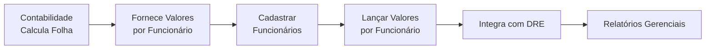

# 💼 Documentação: Módulo RH - Lançamentos de Folha de Pagamento

## 🎯 Visão Geral

O **Módulo de Lançamentos de RH** do Sol.NET ERP é uma ferramenta de **controle interno** que permite registrar os valores da folha de pagamento **por funcionário** para integração com o DRE (Demonstração do Resultado do Exercício).

### ⚠️ Importante Compreender

**O que o módulo RH do Sol.NET FAZ:**
- ✅ Registro de valores de folha **vinculados a cada funcionário**
- ✅ Integração dos lançamentos de RH com o DRE
- ✅ Controle interno detalhado por funcionário e departamento
- ✅ Acompanhamento de despesas com pessoal

**O que o módulo RH do Sol.NET NÃO FAZ:**
- ❌ Cálculo de INSS, IRRF ou FGTS
- ❌ Processamento automático de folha de pagamento
- ❌ Integração com órgãos externos (eSocial, SEFIP, Receita Federal)
- ❌ Geração de guias de impostos ou encargos
- ❌ Emissão de holerites
- ❌ Controle de ponto eletrônico

### 🔄 Fluxo de Trabalho



**Processo típico:**
1. A **contabilidade externa** processa a folha de pagamento completa
2. A contabilidade fornece os **valores individuais de cada funcionário**
3. Os **funcionários são cadastrados** no Sol.NET
4. O usuário **lança os valores de cada funcionário** no módulo RH
5. O sistema **integra automaticamente** com o DRE
6. A empresa pode visualizar as **despesas com pessoal** nos relatórios gerenciais

---

## 👥 Cadastro de Funcionários (Pessoa RH)

### 📋 Importância do Cadastro

**ATENÇÃO:** Todo lançamento de RH no Sol.NET **deve estar vinculado a um funcionário específico**. Por isso, o cadastro completo de funcionários é **essencial** para o funcionamento do módulo.

### Acessar o Cadastro

**Menu:** RH → Cadastros → Funcionários

### Informações do Cadastro de Pessoa RH

O cadastro de funcionários no Sol.NET contém as seguintes informações:

#### **Dados Pessoais**
- **Nome Completo**: Nome do funcionário
- **CPF**: Cadastro de Pessoa Física (para identificação)
- **Matrícula**: Código interno do funcionário na empresa
- **Data de Nascimento**: Para controle de idade e histórico
- **Endereço**: Endereço residencial completo
- **Telefone/Celular**: Contatos
- **E-mail**: E-mail pessoal ou corporativo

#### **Dados Trabalhistas**
- **Data de Admissão**: Quando o funcionário foi contratado
- **Data de Demissão**: Se aplicável (para funcionários inativos)
- **Cargo/Função**: Função exercida pelo funcionário
- **Departamento/Setor**: Área de atuação
- **Centro de Custo**: Para alocação contábil das despesas
- **Salário Base**: Salário contratual (para referência)
- **Status**: Ativo ou Inativo

#### **Configurações Contábeis**
- **Conta Contábil de Salário**: Conta do plano de contas onde serão lançados os salários
- **Conta Contábil de Encargos**: Conta para lançamento de encargos sociais
- **Conta Contábil de Benefícios**: Conta para vale transporte, refeição, etc.
- **Centro de Custo Padrão**: Centro de custo ao qual o funcionário está vinculado

#### **Observações**
- **Anotações Gerais**: Campo livre para observações sobre o funcionário

### Como Cadastrar um Funcionário

**Passo a passo:**

1. **Acessar o Cadastro:**
   - Menu RH → Cadastros → Funcionários
   - Clicar em "Novo" ou pressionar o botão de inclusão

2. **Preencher Dados Pessoais:**
   - Nome completo do funcionário
   - CPF (obrigatório para identificação única)
   - Matrícula (código interno)
   - Data de nascimento
   - Endereço e contatos

3. **Preencher Dados Trabalhistas:**
   - Data de admissão
   - Cargo/função
   - Departamento/setor
   - Centro de custo (importante para alocação no DRE)
   - Salário base (referência)
   - Status: Ativo

4. **Configurar Contas Contábeis:**
   - Definir conta de salário (ex: 6.2.01 - Salários Administrativo)
   - Definir conta de encargos (ex: 6.2.02 - Encargos Sociais)
   - Definir conta de benefícios (ex: 6.2.03 - Benefícios)
   - Essas contas determinam onde os lançamentos aparecerão no DRE

5. **Salvar o Cadastro**

### Exemplo de Cadastro

```
Nome: João da Silva
CPF: 123.456.789-00
Matrícula: 001
Data Admissão: 01/01/2023
Cargo: Analista Financeiro
Departamento: Administrativo
Centro de Custo: 001 - Administrativo
Salário Base: R$ 5.000,00
Status: Ativo

Contas Contábeis:
- Salários: 6.2.01 - Salários Administrativo
- Encargos: 6.2.02 - Encargos Administrativo
- Benefícios: 6.2.03 - Benefícios Administrativo
```

### Gestão de Funcionários

**Funcionários Ativos:**
- Mantêm status "Ativo"
- Recebem lançamentos mensais de folha
- Aparecem nos relatórios

**Funcionários Demitidos:**
- Alterar status para "Inativo"
- Informar data de demissão
- Não recebem mais lançamentos regulares
- Manter cadastro para histórico

---

## 💰 Lançamento de Valores da Folha por Funcionário

### Processo de Lançamento

#### **Passo 1: Receber Informações da Contabilidade**

A contabilidade deve fornecer um resumo **detalhado por funcionário**:

```
FOLHA DE PAGAMENTO - MARÇO/2024

FUNCIONÁRIO: João da Silva (Mat. 001)
───────────────────────────────────────
Salário Bruto:           R$  5.000,00
Horas Extras:            R$    300,00
Comissões:               R$    500,00
───────────────────────────────────────
Total Vencimentos:       R$  5.800,00

Desconto INSS:           R$    638,00
Desconto IRRF:           R$    185,00
Vale Transporte:         R$    150,00
Vale Refeição:           R$    200,00
───────────────────────────────────────
Total Descontos:         R$  1.173,00

Líquido a Pagar:         R$  4.627,00

Encargos Patronais:
INSS Patronal:           R$  1.160,00
FGTS:                    R$    464,00
───────────────────────────────────────
Total Encargos:          R$  1.624,00

Benefícios Empresa:
Vale Transporte:         R$    100,00
Vale Refeição:           R$    300,00
───────────────────────────────────────
Total Benefícios:        R$    400,00

───────────────────────────────────────
CUSTO TOTAL (funcionário): R$  7.824,00
```

#### **Passo 2: Lançar no Sol.NET por Funcionário**

**Menu:** RH → Lançamentos de Folha

**Importante:** Cada lançamento deve estar **vinculado ao funcionário específico**.

**Lançamento para João da Silva (Mat. 001):**

1. **Criar Novo Lançamento:**
   - Competência: Março/2024
   - **Funcionário: João da Silva (selecionar do cadastro)**

2. **Lançar Salário:**
   ```
   Tipo: Vencimento
   Descrição: Salário Base
   Valor: R$ 5.000,00
   Conta Débito: 6.2.01 - Salários (já configurada no cadastro)
   Conta Crédito: 2.1.2.01 - Salários a Pagar
   Centro de Custo: Administrativo (já vinculado ao funcionário)
   ```

3. **Lançar Horas Extras:**
   ```
   Tipo: Vencimento
   Descrição: Horas Extras
   Valor: R$ 300,00
   Funcionário: João da Silva
   ```

4. **Lançar Encargos Patronais:**
   ```
   Tipo: Encargo
   Descrição: INSS Patronal
   Valor: R$ 1.160,00
   Funcionário: João da Silva
   Conta Débito: 6.2.02 - Encargos
   ```

5. **Repetir para cada evento** (comissões, benefícios, etc.)

6. **Salvar Lançamentos**

#### **Passo 3: Repetir para Cada Funcionário**

O processo deve ser repetido para todos os funcionários da folha:
- Maria Santos (Mat. 002)
- Carlos Pereira (Mat. 003)
- Ana Costa (Mat. 004)
- ...e assim por diante

#### **Passo 4: Conferir Integração com DRE**

Após lançar todos os funcionários:
1. Menu Financeiro → DRE
2. Selecione período: Março/2024
3. Confira se os valores aparecem nas contas corretas
4. Verifique a totalização por centro de custo
5. Compare com o total geral informado pela contabilidade

---

## 📊 Tipos de Lançamentos por Funcionário

### Vencimentos (Valores Positivos)

| Tipo | Descrição | Exemplo |
|------|-----------|---------|
| Salário Base | Remuneração contratual | R$ 5.000,00 |
| Horas Extras | Adicional por horas excedentes | R$ 300,00 |
| Comissões | Percentual sobre vendas | R$ 500,00 |
| Gratificações | Prêmios e bonificações | R$ 200,00 |
| Adicional Noturno | 20% sobre hora noturna | R$ 150,00 |

### Descontos (Valores Negativos)

| Tipo | Descrição | Exemplo |
|------|-----------|---------|
| INSS Funcionário | Desconto conforme tabela | R$ 638,00 |
| IRRF | Imposto de renda retido | R$ 185,00 |
| Vale Transporte | Desconto de 6% | R$ 150,00 |
| Vale Refeição | Coparticipação | R$ 200,00 |
| Plano de Saúde | Desconto do funcionário | R$ 100,00 |

### Encargos Patronais (Custo da Empresa)

| Tipo | Descrição | Exemplo |
|------|-----------|---------|
| INSS Patronal | 20% sobre salário | R$ 1.160,00 |
| FGTS | 8% sobre salário | R$ 464,00 |
| RAT/FAP | Risco ambiental | R$ 58,00 |

### Benefícios (Custo da Empresa)

| Tipo | Descrição | Exemplo |
|------|-----------|---------|
| Vale Transporte | Parte da empresa | R$ 100,00 |
| Vale Refeição | Parte da empresa | R$ 300,00 |
| Plano de Saúde | Parte da empresa | R$ 200,00 |

---

## 🔧 Configuração

### Estrutura de Contas Contábeis

Configure o plano de contas para receber os lançamentos de RH:

```
6. DESPESAS OPERACIONAIS
  6.1 Despesas com Vendas
    6.1.01 Salários - Vendas
    6.1.02 Encargos Sociais - Vendas
    6.1.03 Benefícios - Vendas
  
  6.2 Despesas Administrativas
    6.2.01 Salários - Administrativo
    6.2.02 Encargos Sociais - Administrativo
    6.2.03 Benefícios - Administrativo
  
  6.3 Despesas de Produção
    6.3.01 Salários - Produção
    6.3.02 Encargos Sociais - Produção
    6.3.03 Benefícios - Produção

2. PASSIVO CIRCULANTE
  2.1.2 Obrigações Trabalhistas
    2.1.2.01 Salários a Pagar
    2.1.2.02 Encargos a Recolher
    2.1.2.03 FGTS a Recolher
    2.1.2.04 Benefícios a Pagar
```

### Vinculação no Cadastro de Funcionários

Ao cadastrar cada funcionário, vincule as contas conforme o departamento:

**Funcionário do Administrativo:**
```
Conta Salário: 6.2.01 - Salários Administrativo
Conta Encargos: 6.2.02 - Encargos Administrativo
Conta Benefícios: 6.2.03 - Benefícios Administrativo
Centro de Custo: 001 - Administrativo
```

**Funcionário de Vendas:**
```
Conta Salário: 6.1.01 - Salários Vendas
Conta Encargos: 6.1.02 - Encargos Vendas
Conta Benefícios: 6.1.03 - Benefícios Vendas
Centro de Custo: 002 - Vendas
```

---

## 💡 Exemplos Práticos

### Exemplo 1: Lançamento Completo de Um Funcionário

**Cenário:**
- Funcionário: Maria Santos (Mat. 005)
- Departamento: Vendas
- Valores da contabilidade para Março/2024

**Dados fornecidos pela contabilidade:**
```
Salário Base: R$ 3.500,00
Comissões: R$ 1.200,00
INSS Funcionário: R$ 517,00
IRRF: R$ 95,00
Vale Transporte: R$ 105,00
INSS Patronal: R$ 940,00
FGTS: R$ 376,00
```

**Lançamentos no Sol.NET:**

1. **Selecionar Funcionário:**
   - RH → Lançamentos → Novo
   - Competência: 03/2024
   - **Funcionário: Maria Santos (Mat. 005)**

2. **Vencimentos:**
   ```
   Salário Base: R$ 3.500,00
   D - 6.1.01 Salários Vendas
   C - 2.1.2.01 Salários a Pagar
   
   Comissões: R$ 1.200,00
   D - 6.1.01 Salários Vendas
   C - 2.1.2.01 Salários a Pagar
   ```

3. **Descontos:**
   ```
   INSS: R$ 517,00
   (Reduz salário a pagar)
   
   IRRF: R$ 95,00
   (Reduz salário a pagar)
   
   Vale Transporte: R$ 105,00
   (Reduz salário a pagar)
   ```

4. **Encargos:**
   ```
   INSS Patronal: R$ 940,00
   D - 6.1.02 Encargos Vendas
   C - 2.1.2.02 Encargos a Recolher
   
   FGTS: R$ 376,00
   D - 6.1.02 Encargos Vendas
   C - 2.1.2.03 FGTS a Recolher
   ```

5. **Resultado no DRE:**
   ```
   6.1 DESPESAS COM VENDAS
      6.1.01 Salários .............. R$ 4.700,00
      6.1.02 Encargos Sociais ...... R$ 1.316,00
      ──────────────────────────────────────────
      Total (Maria Santos) ......... R$ 6.016,00
   ```

### Exemplo 2: Empresa com 5 Funcionários

**Cenário:**
Empresa tem 5 funcionários em diferentes departamentos.

**Funcionários cadastrados:**
1. João Silva - Administrativo
2. Maria Santos - Vendas
3. Pedro Costa - Produção
4. Ana Oliveira - Administrativo
5. Carlos Lima - Vendas

**Processo mensal:**

1. **Receber planilha da contabilidade** com valores de cada um dos 5 funcionários

2. **Lançar funcionário por funcionário:**
   - Lançar valores de João Silva
   - Lançar valores de Maria Santos
   - Lançar valores de Pedro Costa
   - Lançar valores de Ana Oliveira
   - Lançar valores de Carlos Lima

3. **Conferir totais no DRE:**
   ```
   6.1 Vendas:
       - Salários: Maria + Carlos
       - Encargos: Maria + Carlos
   
   6.2 Administrativo:
       - Salários: João + Ana
       - Encargos: João + Ana
   
   6.3 Produção:
       - Salários: Pedro
       - Encargos: Pedro
   ```

### Exemplo 3: Provisões Mensais

Para provisões de 13º e férias, também vincule ao funcionário:

**Provisão 13º - João Silva:**
```
Competência: Março/2024
Funcionário: João Silva
Tipo: Provisão 13º Salário
Valor: R$ 416,67 (1/12 de R$ 5.000)
D - 6.2.04 Provisão 13º
C - 2.1.3.01 Provisão 13º a Pagar
```

Repita para todos os funcionários.

---

## 📊 Relatórios

### Relatórios Disponíveis

**1. Folha de Pagamento Analítica**
- Lista todos os funcionários
- Detalhamento de vencimentos e descontos por funcionário
- Total por funcionário
- Total geral

**2. Custo por Funcionário**
- Salário + Encargos + Benefícios
- Custo total individual
- Histórico mensal do funcionário

**3. Custo por Departamento**
- Soma de todos os funcionários do departamento
- Comparativo entre departamentos
- Percentual sobre receita

**4. DRE com Detalhamento RH**
- Despesas com pessoal por centro de custo
- Evolução mensal
- Análise comparativa

---

## ❓ FAQ - Perguntas Frequentes

### **P: Preciso lançar cada funcionário individualmente?**
**R:** **Sim**. Todo lançamento de RH no Sol.NET deve estar vinculado a um funcionário específico. Não é possível lançar valores totais sem associar a um funcionário.

### **P: Posso lançar um valor total para todo o departamento?**
**R:** **Não**. Cada lançamento precisa estar associado a um funcionário cadastrado. O sistema depois totaliza automaticamente por departamento no DRE.

### **P: Preciso cadastrar todos os funcionários antes de lançar?**
**R:** **Sim**. É obrigatório cadastrar todos os funcionários no sistema antes de fazer os lançamentos, pois cada lançamento precisa estar vinculado a um funcionário.

### **P: O que acontece se eu não vincular o lançamento a um funcionário?**
**R:** O sistema não permitirá salvar o lançamento sem a vinculação a um funcionário, pois é um campo obrigatório.

### **P: Como o sistema totaliza os valores no DRE?**
**R:** O sistema soma automaticamente os valores de todos os funcionários vinculados ao mesmo centro de custo e mesma conta contábil.

### **P: Preciso informar todos os dados do funcionário no cadastro?**
**R:** Os dados essenciais são: Nome, CPF, Matrícula, Departamento, Centro de Custo e as Contas Contábeis. Os demais dados são importantes para controle, mas opcionais.

### **P: Como lanço um funcionário que mudou de departamento?**
**R:** Atualize o cadastro do funcionário alterando o departamento e centro de custo. Os próximos lançamentos irão para o novo centro de custo automaticamente.

### **P: Posso ter dois funcionários com mesmo nome?**
**R:** Sim, pois cada funcionário é identificado unicamente por CPF e Matrícula.

### **P: Como faço para um funcionário demitido?**
**R:** Altere o status para "Inativo" e informe a data de demissão. O funcionário permanecerá no histórico mas não aparecerá mais nas listagens de ativos.

### **P: A contabilidade fornece valores totais. Como faço?**
**R:** Solicite à contabilidade uma planilha detalhada com os valores individuais de cada funcionário. É essencial ter essa informação para lançar corretamente no Sol.NET.

---

## 🔧 Melhores Práticas

### ✅ Recomendações

1. **Cadastre Funcionários Completos:**
   - Preencha todos os campos do cadastro
   - Vincule corretamente as contas contábeis
   - Defina o centro de custo adequado

2. **Mantenha Cadastro Atualizado:**
   - Atualize mudanças de departamento
   - Registre admissões e demissões
   - Mantenha dados de contato atualizados

3. **Lance Por Funcionário:**
   - Respeite a vinculação obrigatória
   - Verifique se selecionou o funcionário correto
   - Confira os valores antes de salvar

4. **Padronize Descrições:**
   - Use nomes consistentes para os tipos de lançamento
   - Facilita consultas e relatórios

5. **Confira o DRE:**
   - Após lançar todos os funcionários
   - Compare com total da contabilidade
   - Valide alocação por centro de custo

---

## 🆘 Troubleshooting

### **Problema: Não consigo salvar o lançamento**
**Causa:** Falta vincular o lançamento a um funcionário  
**Solução:** Selecione o funcionário no campo apropriado antes de salvar

### **Problema: Valores não aparecem no DRE**
**Causa:** Conta contábil não configurada no cadastro do funcionário  
**Solução:** Edite o cadastro do funcionário e configure as contas contábeis

### **Problema: Valores aparecendo no departamento errado**
**Causa:** Centro de custo incorreto no cadastro do funcionário  
**Solução:** Corrija o centro de custo no cadastro do funcionário

### **Problema: Não encontro o funcionário para vincular**
**Causa:** Funcionário não cadastrado ou inativo  
**Solução:** Cadastre o funcionário ou ative se estiver inativo

---

## 📞 Suporte

### Documentação Relacionada

- **[Módulo Financeiro - DRE](../Financeiro/Documentacao DRE.md)**: Como o DRE funciona
- **[Plano de Contas](../Financeiro/Documentacao DRE.md#-estrutura-hierárquica)**: Estrutura contábil

### Contato

Para dúvidas sobre:
- **Cadastros e lançamentos no Sol.NET**: Suporte técnico Sol.NET
- **Valores individuais dos funcionários**: Sua contabilidade
- **Obrigações fiscais**: Contador responsável

---

**📅 Última atualização**: Janeiro de 2025  
**📦 Versão**: 3.0  
**🎯 Público-alvo**: Usuários responsáveis por lançamentos de RH  
**👥 Contribuidores**: Equipe de Documentação Sol.NET

---

*Esta documentação cobre o módulo de lançamentos de RH do Sol.NET. **Lembre-se: cada lançamento deve estar vinculado a um funcionário específico** - não é possível lançar valores totais sem essa associação.*
