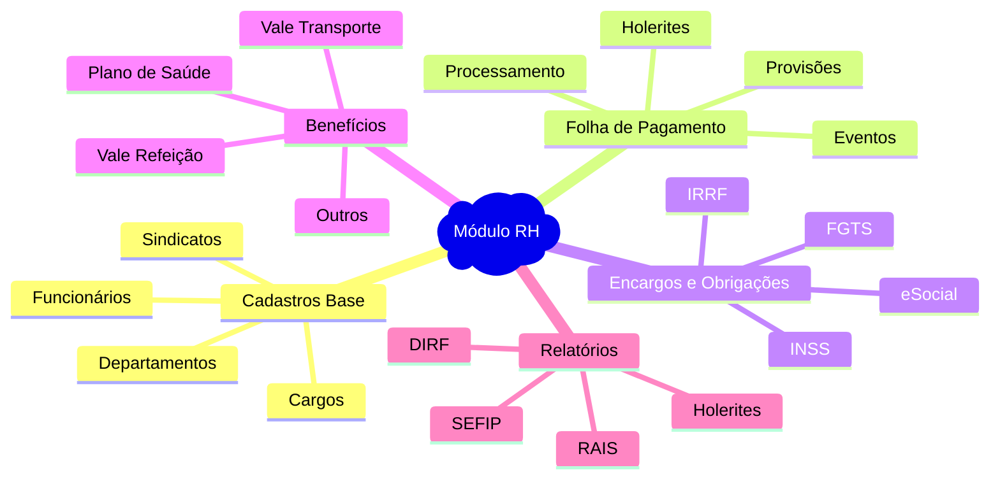
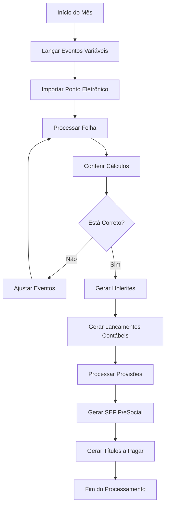
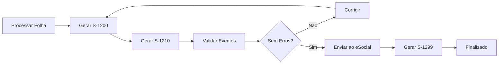

# 💼 Documentação Técnica: Módulo RH - Folha de Pagamento - Sol.NET ERP

## 🎯 Visão Geral

O **Módulo de Recursos Humanos (RH)** do Sol.NET ERP oferece uma solução completa para gestão de pessoal e processamento da **Folha de Pagamento**. Este módulo centraliza todas as operações relacionadas a cálculos trabalhistas, encargos sociais, benefícios, provisões e integração automática com a contabilidade.

### Principais Características:

- ✅ **Processamento Completo**: Cálculo automático de salários, horas extras, descontos e benefícios
- ✅ **Encargos Sociais**: INSS, FGTS, IRRF calculados automaticamente conforme legislação
- ✅ **Provisões Automáticas**: 13º salário, férias e encargos provisionados mensalmente
- ✅ **Integração Contábil**: Lançamentos automáticos no DRE e Plano de Contas
- ✅ **Conformidade Legal**: Atualizado com legislação trabalhista brasileira
- ✅ **eSocial**: Geração de eventos e arquivos para envio ao governo
- ✅ **Centro de Custos**: Alocação de custos por departamento/área
- ✅ **Relatórios Completos**: Holerites, rescisões, SEFIP, DIRF, RAIS

---

## 🏗️ Estrutura do Módulo

### Organização do Sistema

O módulo RH está organizado em áreas funcionais que cobrem todo o ciclo de vida do colaborador:



### Integração com Outros Módulos

O módulo RH integra-se com:
- **Financeiro**: Provisões de despesas e passivos trabalhistas
- **Contabilidade**: Lançamentos automáticos no DRE e Balancete
- **Contas a Pagar**: Geração de títulos para pagamento de salários e encargos
- **Centro de Custos**: Alocação departamental de despesas com pessoal

---

## 👥 Cadastros Essenciais

### 📋 Cadastro de Funcionários

O cadastro de funcionários é a base do módulo RH, armazenando todas as informações necessárias para processamento da folha.

#### **Dados Pessoais**
- **Nome Completo**: Nome civil do colaborador
- **CPF**: Cadastro de Pessoa Física
- **RG**: Registro Geral e órgão expedidor
- **Data de Nascimento**: Para cálculos de IRRF e Salário Família
- **Estado Civil**: Informação para dependentes
- **Endereço Completo**: Residencial do colaborador
- **Contatos**: Telefone, e-mail, celular

#### **Dados Trabalhistas**
- **Matrícula**: Código único do funcionário na empresa
- **Data de Admissão**: Início do vínculo empregatício
- **Cargo**: Função exercida (vinculado ao cadastro de cargos)
- **Departamento**: Setor de alocação (vinculado a centros de custo)
- **Tipo de Contrato**: CLT, Estágio, Temporário, PJ
- **Jornada de Trabalho**: Horas semanais/mensais
- **Salário Base**: Remuneração contratual
- **Conta Bancária**: Dados para crédito em conta

#### **Configurações Contábeis**
- **Centro de Custo**: Departamento para alocação de custos
- **Conta Contábil Salário**: Conta do plano de contas para salários
- **Conta Contábil Encargos**: Conta para encargos sociais
- **Agrupamento DRE**: Vinculação com estrutura do DRE

#### **Dados Adicionais**
- **PIS/PASEP**: Número do cadastro no PIS
- **CTPS**: Carteira de Trabalho e Previdência Social
- **Grau de Instrução**: Escolaridade
- **Dependentes**: Para IRRF e Salário Família
- **Vale Transporte**: Quantidade de vales necessários
- **Plano de Saúde**: Beneficiário e dependentes

---

### 💼 Cadastro de Cargos

Definição das funções existentes na empresa com suas características.

#### **Informações Principais**
- **Código do Cargo**: Identificador único
- **Descrição**: Nome da função (ex: "Analista Financeiro")
- **CBO**: Código Brasileiro de Ocupação
- **Faixa Salarial**: Mínimo e máximo da função
- **Requisitos**: Escolaridade e experiência necessárias
- **Atribuições**: Descrição das responsabilidades

#### **Configurações**
- **Periculosidade**: Percentual adicional se aplicável
- **Insalubridade**: Percentual adicional conforme grau
- **Adicional Noturno**: Configuração de horário noturno
- **Categoria eSocial**: Código para eventos do eSocial

---

### 🏢 Cadastro de Departamentos

Estrutura organizacional da empresa para alocação de custos.

#### **Dados do Departamento**
- **Código**: Identificador único
- **Nome**: Descrição (ex: "Vendas", "Produção", "Administrativo")
- **Responsável**: Gestor do departamento
- **Centro de Custo**: Vinculação contábil

#### **Configurações Contábeis**
- **Conta de Despesa**: Conta padrão para lançamentos
- **Agrupamento DRE**: Classificação no DRE
- **Rateio**: Percentual de distribuição quando aplicável

---

### 🤝 Cadastro de Sindicatos

Informações sobre entidades sindicais para cálculo de contribuições.

#### **Dados do Sindicato**
- **Razão Social**: Nome oficial da entidade
- **CNPJ**: Cadastro Nacional de Pessoa Jurídica
- **Categoria Profissional**: Área de atuação
- **Data Base**: Mês de reajuste salarial da categoria

#### **Contribuições**
- **Contribuição Sindical**: Percentual ou valor fixo
- **Contribuição Assistencial**: Quando aplicável
- **Contribuição Confederativa**: Conforme convenção
- **Mensalidade**: Se houver desconto mensal

---

## 💰 Folha de Pagamento - Processamento

### 🔄 Fluxo de Trabalho



### 📊 Tipos de Eventos da Folha

#### **1. Eventos de Vencimentos (Créditos)**

**Eventos Fixos:**
- **001 - Salário Base**: Remuneração contratual
- **002 - Horas Extras 50%**: Adicional sobre horas excedentes
- **003 - Horas Extras 100%**: Horas em domingos e feriados
- **004 - Adicional Noturno**: 20% sobre hora noturna (22h às 5h)
- **005 - Insalubridade**: Adicional conforme grau (10%, 20%, 40%)
- **006 - Periculosidade**: 30% sobre salário base
- **007 - Adicional de Função**: Gratificação por função especial
- **008 - Comissões**: Percentual sobre vendas

**Eventos Variáveis:**
- **020 - DSR sobre Horas Extras**: Descanso semanal remunerado
- **021 - Salário Família**: Por dependente até 14 anos
- **022 - Adicional de Transferência**: 25% quando aplicável
- **023 - Adicional de Férias**: 1/3 sobre férias
- **024 - Gratificações**: Prêmios e bonificações

#### **2. Eventos de Descontos (Débitos)**

**Descontos Legais:**
- **101 - INSS**: Conforme tabela progressiva do INSS
- **102 - IRRF**: Imposto de Renda Retido na Fonte
- **103 - Contribuição Sindical**: Quando aplicável
- **104 - Pensão Alimentícia**: Conforme determinação judicial

**Benefícios e Outros:**
- **201 - Vale Transporte**: 6% do salário base (limitado)
- **202 - Vale Refeição**: Conforme acordo coletivo
- **203 - Plano de Saúde**: Coparticipação do funcionário
- **204 - Seguro de Vida**: Se houver desconto
- **205 - Empréstimo Consignado**: Parcelas de empréstimos
- **206 - Adiantamento Salarial**: Desconto de adiantamentos

**Faltas e Afastamentos:**
- **301 - Faltas Não Justificadas**: Desconto de dias/horas
- **302 - Atrasos**: Desconto proporcional
- **303 - DSR sobre Faltas**: Perda do repouso remunerado

---

### 🧮 Cálculos e Fórmulas

#### **Cálculo do INSS**

**Tabela Progressiva 2024:**
```
Faixa 1: Até R$ 1.320,00 → 7,5%
Faixa 2: De R$ 1.320,01 até R$ 2.571,29 → 9%
Faixa 3: De R$ 2.571,30 até R$ 3.856,94 → 12%
Faixa 4: De R$ 3.856,95 até R$ 7.507,49 → 14%
Teto: Máximo de R$ 908,85
```

**Exemplo de Cálculo (Salário R$ 5.000,00):**
```
Faixa 1: R$ 1.320,00 × 7,5% = R$ 99,00
Faixa 2: (R$ 2.571,29 - R$ 1.320,00) × 9% = R$ 112,62
Faixa 3: (R$ 3.856,94 - R$ 2.571,29) × 12% = R$ 154,28
Faixa 4: (R$ 5.000,00 - R$ 3.856,94) × 14% = R$ 160,03
TOTAL INSS: R$ 525,93
```

#### **Cálculo do IRRF**

**Tabela Progressiva 2024:**
```
Até R$ 2.112,00 → Isento
De R$ 2.112,01 até R$ 2.826,65 → 7,5% → Parcela a deduzir: R$ 158,40
De R$ 2.826,66 até R$ 3.751,05 → 15% → Parcela a deduzir: R$ 370,40
De R$ 3.751,06 até R$ 4.664,68 → 22,5% → Parcela a deduzir: R$ 651,73
Acima de R$ 4.664,68 → 27,5% → Parcela a deduzir: R$ 884,96
```

**Deduções:**
- R$ 189,59 por dependente
- Total de INSS descontado
- Pensão alimentícia (se judicial)

**Exemplo (Salário R$ 5.000,00, 2 dependentes):**
```
Base de cálculo:
R$ 5.000,00 - R$ 525,93 (INSS) - R$ 379,18 (2 dependentes) = R$ 4.094,89

Aplicando alíquota:
R$ 4.094,89 × 22,5% - R$ 651,73 = R$ 269,57
IRRF a Recolher: R$ 269,57
```

#### **Cálculo do FGTS**

```
FGTS = Remuneração Bruta × 8%

Exemplo (Salário R$ 5.000,00):
FGTS = R$ 5.000,00 × 8% = R$ 400,00
```

---

### 📅 Provisões Mensais

#### **13º Salário**

**Cálculo da Provisão:**
```
Provisão Mensal = (Salário Base + Médias) ÷ 12

Exemplo (Salário R$ 5.000,00):
Provisão Mensal 13º = R$ 5.000,00 ÷ 12 = R$ 416,67

Encargos sobre 13º (INSS + FGTS):
- FGTS 8%: R$ 416,67 × 8% = R$ 33,33
```

**Lançamento Contábil:**
```
D - 6.2.03 - Provisão 13º Salário → R$ 416,67
C - 2.1.3.01 - Provisão 13º a Pagar → R$ 416,67

D - 6.2.05 - Encargos sobre 13º → R$ 33,33
C - 2.1.3.03 - FGTS sobre 13º a Recolher → R$ 33,33
```

#### **Férias**

**Cálculo da Provisão:**
```
Provisão Mensal Férias = (Salário Base + Médias + 1/3) ÷ 12

Exemplo (Salário R$ 5.000,00):
Valor Férias = R$ 5.000,00
Adicional 1/3 = R$ 5.000,00 ÷ 3 = R$ 1.666,67
Total = R$ 6.666,67

Provisão Mensal = R$ 6.666,67 ÷ 12 = R$ 555,56

Encargos:
- FGTS 8%: R$ 555,56 × 8% = R$ 44,44
```

**Lançamento Contábil:**
```
D - 6.2.04 - Provisão Férias → R$ 555,56
C - 2.1.3.02 - Provisão Férias a Pagar → R$ 555,56

D - 6.2.06 - Encargos sobre Férias → R$ 44,44
C - 2.1.3.04 - FGTS sobre Férias a Recolher → R$ 44,44
```

---

## 🔗 Integração com Contabilidade

### 📊 Lançamentos Automáticos no DRE

#### **Estrutura de Contas Sugerida**

```
6. DESPESAS OPERACIONAIS
  6.1 Despesas com Vendas
    6.1.01 Salários - Vendas
    6.1.02 Encargos Sociais - Vendas
    6.1.03 Benefícios - Vendas
  
  6.2 Despesas Administrativas
    6.2.01 Salários - Administrativo
    6.2.02 Encargos Sociais - Administrativo  
    6.2.03 Provisão 13º Salário
    6.2.04 Provisão Férias
    6.2.05 Benefícios - Administrativo
  
  6.3 Despesas com Produção (para indústrias)
    6.3.01 Salários - Produção
    6.3.02 Encargos Sociais - Produção
    6.3.03 Benefícios - Produção

2. PASSIVO
  2.1 Passivo Circulante
    2.1.2 Obrigações Trabalhistas e Sociais
      2.1.2.01 Salários a Pagar
      2.1.2.02 INSS a Recolher
      2.1.2.03 FGTS a Recolher
      2.1.2.04 IRRF a Recolher
      2.1.2.05 Contribuições Sindicais a Recolher
    
    2.1.3 Provisões Trabalhistas
      2.1.3.01 Provisão 13º Salário
      2.1.3.02 Provisão Férias
      2.1.3.03 Provisão FGTS sobre 13º
      2.1.3.04 Provisão FGTS sobre Férias
```

#### **Exemplo Completo de Lançamentos**

**Folha de Pagamento - Departamento Administrativo (R$ 50.000,00):**
```
D - 6.2.01 - Salários Administrativo → R$ 50.000,00
C - 2.1.2.01 - Salários a Pagar → R$ 34.200,00
C - 2.1.2.02 - INSS a Recolher (funcionários) → R$ 5.250,00
C - 2.1.2.04 - IRRF a Recolher → R$ 2.700,00
C - 2.1.2.05 - Vale Transporte a Descontar → R$ 1.850,00
C - Outras Contas de Descontos → R$ 6.000,00
```

**Encargos Patronais (20% INSS + 8% FGTS):**
```
D - 6.2.02 - Encargos Sociais Administrativo → R$ 14.000,00
C - 2.1.2.02 - INSS Patronal a Recolher → R$ 10.000,00
C - 2.1.2.03 - FGTS a Recolher → R$ 4.000,00
```

**Provisões (13º + Férias):**
```
D - 6.2.03 - Provisão 13º Salário → R$ 4.166,67
D - 6.2.04 - Provisão Férias → R$ 5.555,56
C - 2.1.3.01 - Provisão 13º a Pagar → R$ 4.166,67
C - 2.1.3.02 - Provisão Férias a Pagar → R$ 5.555,56
```

---

## ⚙️ Processo Passo a Passo

### 📋 Checklist Mensal da Folha de Pagamento

#### **Semana 1 do Mês (Dias 1-7)**
- [ ] **Conferir cadastros**: Admissões, demissões e alterações do mês anterior
- [ ] **Atualizar dependentes**: Inclusões/exclusões para IRRF e Salário Família
- [ ] **Verificar afastamentos**: INSS, licenças médicas, maternidade
- [ ] **Lançar eventos fixos**: Comissões, gratificações, adicionais

#### **Semana 2 do Mês (Dias 8-15)**
- [ ] **Importar ponto eletrônico**: Horas trabalhadas, extras, faltas e atrasos
- [ ] **Conferir horas extras**: Validar cálculo de 50% e 100%
- [ ] **Lançar eventos variáveis**: Bonificações, prêmios do mês
- [ ] **Verificar benefícios**: Vale transporte, refeição, plano de saúde

#### **Semana 3 do Mês (Dias 16-23)**
- [ ] **Processar folha de pagamento**: Executar cálculo completo
- [ ] **Conferir totais**: INSS, IRRF, FGTS e líquido a pagar
- [ ] **Validar provisões**: 13º salário e férias calculadas
- [ ] **Gerar holerites**: Emitir para distribuição/envio eletrônico
- [ ] **Revisar exceções**: Valores discrepantes ou alertas do sistema

#### **Semana 4 do Mês (Dias 24-30)**
- [ ] **Gerar lançamentos contábeis**: Integrar com DRE e contabilidade
- [ ] **Processar eSocial**: Gerar eventos S-1200, S-1210, S-1299
- [ ] **Gerar SEFIP**: Para FGTS e INSS quando aplicável
- [ ] **Criar títulos a pagar**: Salários, INSS, FGTS, IRRF
- [ ] **Distribuir holerites**: Enviar aos funcionários
- [ ] **Backup de segurança**: Salvar cópia da folha processada

#### **Dia 5 do Mês Seguinte**
- [ ] **Pagar salários**: Processar crédito em conta ou pagamento
- [ ] **Recolher INSS**: Guia GPS até dia 20
- [ ] **Recolher FGTS**: SEFIP até dia 7
- [ ] **Recolher IRRF**: DARF até último dia útil do 2º decêndio

---

### 🚀 Atalhos do Teclado

| Funcionalidade | Atalho | Descrição |
|---------------|--------|-----------|
| Novo funcionário | **F4** | Abre cadastro de novo colaborador |
| Processar folha | **F9** | Inicia processamento da folha |
| Gerar holerite | **F10** | Emite holerite do funcionário |
| Imprimir relatório | **F8** | Imprime relatórios de RH |
| Salvar alterações | **F5** | Salva modificações no cadastro |
| Consulta rápida | **F2** | Busca funcionário por nome/matrícula |
| Lançar evento | **F6** | Lança evento na folha |

---

## 📄 Obrigações e Relatórios

### 🏛️ eSocial - Eventos Principais

#### **Eventos de Tabela**
- **S-1000**: Informações do Empregador
- **S-1005**: Tabela de Estabelecimentos
- **S-1010**: Tabela de Rubricas
- **S-1020**: Tabela de Lotações

#### **Eventos Não Periódicos**
- **S-2200**: Admissão de Trabalhador
- **S-2205**: Alteração de Dados Cadastrais
- **S-2206**: Alteração de Contrato de Trabalho
- **S-2230**: Afastamento Temporário
- **S-2299**: Desligamento
- **S-2300**: Trabalhador Sem Vínculo - Início
- **S-2399**: Trabalhador Sem Vínculo - Término

#### **Eventos Periódicos (Mensais)**
- **S-1200**: Remuneração do Trabalhador
- **S-1210**: Pagamentos de Rendimentos do Trabalho
- **S-1299**: Fechamento dos Eventos Periódicos

#### **Processo de Envio**


---

### 📊 SEFIP - Sistema Empresa de Recolhimento do FGTS

**Informações Transmitidas:**
- Remuneração dos trabalhadores
- FGTS a recolher (8% sobre salários)
- Contribuição social a recolher
- Informações de afastamentos e movimentações

**Prazo de Envio:**
- Até o dia 7 de cada mês
- Referente ao mês anterior

**Processo no Sol.NET:**
1. Menu RH > Obrigações > SEFIP
2. Selecionar competência (mês/ano)
3. Gerar arquivo .sfi
4. Importar no aplicativo SEFIP da Caixa
5. Validar informações
6. Transmitir ao Conectividade Social

---

### 📑 DIRF - Declaração do Imposto de Renda Retido na Fonte

**Prazo de Entrega:**
- Até o último dia útil de fevereiro
- Ano-calendário anterior

**Informações Declaradas:**
- Valores pagos a pessoas físicas
- IRRF retido mensalmente
- 13º salário pago
- Férias pagas
- Rendimentos isentos

**Geração no Sol.NET:**
1. Menu RH > Obrigações > DIRF
2. Selecionar ano-calendário
3. Conferir valores consolidados
4. Gerar arquivo .dec
5. Importar no programa DIRF da Receita Federal
6. Transmitir

---

### 📈 RAIS - Relação Anual de Informações Sociais

**Prazo de Entrega:**
- Até 22 de março
- Ano-base anterior

**Informações Prestadas:**
- Identificação dos empregados
- Remuneração por mês
- Data de admissão e desligamento
- Nacionalidade, grau de instrução
- Jornada de trabalho

**Processo:**
1. Menu RH > Obrigações > RAIS
2. Selecionar ano-base
3. Conferir vínculos ativos e rescindidos
4. Gerar arquivo .rais
5. Importar no RAIS Online
6. Transmitir e obter recibo

---

## 💡 Exemplos Práticos

### 📝 Exemplo 1: Admissão de Novo Funcionário

**Cenário:**
- Nome: João da Silva
- Cargo: Analista Financeiro
- Salário: R$ 4.500,00
- Departamento: Financeiro
- Admissão: 15/01/2024

**Passos:**
1. **Cadastrar Funcionário** (F4)
   - Preencher dados pessoais (CPF, RG, endereço)
   - Informar CTPS e PIS
   - Definir data de admissão

2. **Vincular Cargo e Departamento**
   - Cargo: Analista Financeiro
   - Departamento: Financeiro (Centro de Custo 002)
   - Conta contábil: 6.2.01 - Salários Administrativo

3. **Configurar Remuneração**
   - Salário base: R$ 4.500,00
   - Jornada: 220 horas/mês
   - Benefícios: Vale transporte, vale refeição

4. **Gerar Evento eSocial**
   - S-2200: Admissão de Trabalhador
   - Enviar ao eSocial até o dia anterior ao início

5. **Primeira Folha (Proporcional)**
   - Dias trabalhados: 17 dias (de 31)
   - Salário proporcional: R$ 4.500,00 × (17/31) = R$ 2.467,74
   - INSS: Calcular sobre R$ 2.467,74
   - IRRF: Aplicar tabela progressiva

---

### 📝 Exemplo 2: Processamento de Férias

**Cenário:**
- Funcionária: Maria Souza
- Salário: R$ 3.800,00
- Período aquisitivo completo: 12 meses
- Férias: 30 dias a partir de 01/03/2024

**Cálculo:**
```
Valor das Férias: R$ 3.800,00
Adicional 1/3: R$ 3.800,00 ÷ 3 = R$ 1.266,67
Total a Receber: R$ 5.066,67

Descontos:
INSS sobre férias: R$ 466,93
IRRF sobre férias: R$ 312,45 (se aplicável)

Líquido a Receber: R$ 4.287,29
```

**Lançamento Contábil:**
```
Provisão (Baixa):
D - 2.1.3.02 - Provisão Férias a Pagar → R$ 5.066,67
C - 2.1.2.01 - Férias a Pagar → R$ 4.287,29
C - 2.1.2.02 - INSS a Recolher → R$ 466,93
C - 2.1.2.04 - IRRF a Recolher → R$ 312,45
```

**Evento eSocial:**
- **S-1200**: Informar férias no campo específico
- **S-2230**: Se houver afastamento

---

### 📝 Exemplo 3: Rescisão de Contrato

**Cenário:**
- Funcionário: Carlos Pereira
- Salário: R$ 5.200,00
- Admissão: 10/05/2021
- Demissão sem justa causa: 28/02/2024
- Tempo de casa: 2 anos e 9 meses
- Aviso prévio: Indenizado (30 dias)

**Verbas Rescisórias:**
```
1. Saldo de Salário (28 dias): R$ 5.200,00 × (28/28) = R$ 5.200,00
2. Aviso Prévio Indenizado: R$ 5.200,00
3. 13º Salário Proporcional (2 meses): R$ 5.200,00 × (2/12) = R$ 866,67
4. Férias Vencidas + 1/3: R$ 5.200,00 + R$ 1.733,33 = R$ 6.933,33
5. Férias Proporcionais (2 meses) + 1/3: R$ 1.213,33
6. FGTS (saldo + multa 40%): Depósitos + 40% de multa

Total Bruto: R$ 19.413,33

Descontos:
- INSS: Conforme tabela
- IRRF: Conforme tabela
- Outros descontos: Vale transporte, plano de saúde proporcional

Líquido a Receber: R$ 16.850,00 (aproximado)
```

**Lançamentos Contábeis:**
```
D - 6.2.07 - Rescisões e Indenizações → R$ 19.413,33
C - 2.1.2.06 - Rescisões a Pagar → R$ 16.850,00
C - 2.1.2.02 - INSS a Recolher → R$ 1.850,00
C - 2.1.2.04 - IRRF a Recolher → R$ 713,33
```

**Eventos eSocial:**
- **S-2299**: Desligamento
- **S-1200**: Informar verbas rescisórias
- **S-2250**: Aviso prévio indenizado
- **S-5001**: Informações FGTS para saque

---

## ❓ FAQ - Perguntas Frequentes

### 🔧 Configuração e Cadastros

#### **P: Como configurar o primeiro funcionário no sistema?**
**R:** 
1. Menu RH > Cadastros > Funcionários > Novo (F4)
2. Preencha Aba "Dados Pessoais" completamente
3. Na Aba "Dados Trabalhistas", vincule cargo e departamento
4. Na Aba "Contábil", defina centro de custo e contas contábeis
5. Configure benefícios na Aba "Benefícios"
6. Salve (F5) e gere evento S-2200 no eSocial

#### **P: Onde configuro as contas contábeis para folha de pagamento?**
**R:** 
- Menu RH > Configurações > Integração Contábil
- Ou no cadastro de cada funcionário/departamento
- Defina: Conta Salário, Conta Encargos, Conta Benefícios
- Configure o centro de custo para alocação departamental

#### **P: Como criar um novo evento (rubrica) na folha?**
**R:**
1. Menu RH > Cadastros > Eventos
2. Informar código e descrição
3. Definir tipo: Vencimento (crédito) ou Desconto (débito)
4. Configurar incidências: INSS, FGTS, IRRF
5. Vincular conta contábil
6. Informar código eSocial correspondente

---

### 💰 Cálculos e Processamento

#### **P: Como funciona o cálculo de horas extras?**
**R:**
- **50%**: Horas normais excedentes (segunda a sábado)
  - Cálculo: (Salário ÷ 220 horas) × 1,5 × horas extras
- **100%**: Domingos e feriados
  - Cálculo: (Salário ÷ 220 horas) × 2 × horas trabalhadas
- **DSR sobre Horas Extras**: Proporcional aos domingos do mês

**Exemplo:**
```
Salário: R$ 3.000,00
Hora normal: R$ 3.000,00 ÷ 220 = R$ 13,64
10 horas extras 50%: R$ 13,64 × 1,5 × 10 = R$ 204,60
4 horas extras 100%: R$ 13,64 × 2 × 4 = R$ 109,12
```

#### **P: O sistema calcula INSS e IRRF automaticamente?**
**R:** Sim, o Sol.NET calcula automaticamente:
- **INSS**: Aplica tabela progressiva vigente
- **IRRF**: Deduz INSS, dependentes e pensão, depois aplica alíquota
- As tabelas são atualizadas automaticamente conforme legislação
- É possível conferir o cálculo no holerite detalhado

#### **P: Como funcionam as provisões de 13º e férias?**
**R:**
- **Automático**: O sistema provisiona 1/12 mensalmente
- **13º Salário**: (Salário + médias) ÷ 12
- **Férias**: (Salário + médias + 1/3) ÷ 12
- **Encargos**: FGTS 8% sobre as provisões
- Lançamentos automáticos no DRE todo mês

---

### 🔗 Integrações

#### **P: Como a folha integra com o DRE?**
**R:**
Após processar a folha, execute "Gerar Lançamentos Contábeis":
1. Sistema identifica centro de custo de cada funcionário
2. Agrupa por conta contábil configurada
3. Gera lançamentos de débito (despesas) e crédito (passivos)
4. Atualiza saldos no Plano de Contas
5. Reflete automaticamente no DRE

#### **P: É possível ratear um funcionário em múltiplos centros de custo?**
**R:** Sim:
1. No cadastro do funcionário, aba "Rateio"
2. Adicione os centros de custo com percentuais
3. Exemplo: 70% Administrativo, 30% Vendas
4. O sistema divide salários e encargos automaticamente

#### **P: Como gerar os títulos a pagar da folha?**
**R:**
1. Após processar folha, menu RH > Gerar Financeiro
2. O sistema cria automaticamente:
   - Título de salários líquidos (vencimento dia 5)
   - Título INSS patronal (vencimento dia 20)
   - Título FGTS (vencimento dia 7)
   - Título IRRF (vencimento conforme calendário)
3. Títulos vão para Contas a Pagar

---

### 📄 eSocial e Obrigações

#### **P: Quais eventos do eSocial o sistema gera automaticamente?**
**R:**
- **S-1200**: Remuneração mensal (gerado ao processar folha)
- **S-1210**: Pagamentos diversos (se houver)
- **S-1299**: Fechamento mensal (após validações)
- Eventos não periódicos (S-2200, S-2299, etc.) são gerados manualmente conforme a ação (admissão, demissão, etc.)

#### **P: Como corrigir um erro no eSocial já enviado?**
**R:**
1. Identifique o evento com erro no extrato do eSocial
2. No Sol.NET, menu RH > eSocial > Retificação
3. Localize o evento original
4. Gere evento retificador com informações corretas
5. Envie a retificação
6. Acompanhe o processamento no portal do eSocial

#### **P: O que fazer se a SEFIP não abrir o arquivo gerado?**
**R:**
Verifique:
- Versão do SEFIP está atualizada (download no site da Caixa)
- Arquivo .sfi não está corrompido
- Competência informada está correta
- Todos os funcionários têm PIS válido
- No Sol.NET, regere o arquivo marcando "Validar dados antes de gerar"

---

### 🛠️ Problemas Comuns

#### **P: Funcionário não aparece na folha do mês**
**R:** Verifique:
- Status do cadastro está "Ativo"
- Data de admissão é anterior ao período da folha
- Não há afastamento sem vencimento no período
- Funcionário não foi demitido antes do período
- Filtros de departamento/centro de custo na tela de processamento

#### **P: Valor do INSS diferente do esperado**
**R:**
- Sol.NET usa tabela progressiva (correto desde 2020)
- Cada faixa tem uma alíquota diferente
- Cálculo não é simples (salário × alíquota)
- Use a calculadora INSS do sistema para conferir
- Menu RH > Ferramentas > Calculadora INSS

#### **P: Provisão de férias não está sendo lançada**
**R:**
1. Verifique Menu RH > Configurações > Provisões
2. Certifique-se que "Provisionar Férias" está marcado
3. Confira se contas contábeis estão configuradas
4. Verifique se o processamento de provisões está ativado
5. Execute manualmente: RH > Processos > Processar Provisões

---

## 🔧 Configurações Avançadas

### ⚙️ Parâmetros do Sistema

#### **Configurações Gerais**
- **Horário Comercial**: Define hora normal e noturna
- **Considerar DSR**: Sobre horas extras e faltas
- **Arredondamento de Horas**: Tolerância de entrada/saída
- **Tipo de Média**: Simples ou ponderada para 13º/férias

#### **Integração Contábil**
- **Gerar Lançamentos Automáticos**: Sim/Não
- **Provisões Mensais**: 13º, Férias, FGTS sobre provisões
- **Histórico Padrão**: Template para lançamentos
- **Agrupar Lançamentos**: Por funcionário, departamento ou geral

#### **eSocial**
- **Ambiente**: Produção ou Produção Restrita
- **Certificado Digital**: Configuração A1 ou A3
- **Envio Automático**: Após processar folha
- **Validar Antes de Enviar**: Recomendado

---

### 🎨 Personalização de Relatórios

#### **Holerite Personalizado**
1. Menu RH > Relatórios > Designer de Holerite
2. Escolha layout: Padrão, Simplificado, Detalhado
3. Adicione logo da empresa
4. Configure campos visíveis
5. Salve como template padrão

#### **Relatórios Gerenciais**
- **Custo por Departamento**: Análise mensal de custos RH
- **Evolução Salarial**: Histórico de reajustes
- **Turnover**: Taxa de rotatividade de pessoal
- **Absenteísmo**: Faltas e afastamentos
- **Horas Extras**: Análise por funcionário/departamento

---

## 📚 Melhores Práticas

### ✅ Recomendações Operacionais

1. **Processar Folha com Antecedência**
   - Inicie o processamento até dia 20
   - Permite tempo para correções
   - Evita atrasos no pagamento

2. **Manter Cadastros Atualizados**
   - Atualizar dados de dependentes regularmente
   - Conferir alterações salariais imediatamente
   - Revisar benefícios mensalmente

3. **Backup Antes de Processar**
   - Sempre fazer backup antes de finalizar folha
   - Manter histórico de pelo menos 12 meses
   - Testar restauração periodicamente

4. **Conferência em Duas Etapas**
   - Primeira pessoa processa e confere
   - Segunda pessoa valida antes de finalizar
   - Reduz erros significativamente

5. **Documentação de Processos**
   - Manter manual interno atualizado
   - Documentar exceções e casos especiais
   - Registrar decisões de cálculos complexos

---

### 🎯 Conformidade e Auditoria

1. **Guarda de Documentos**
   - Holerites: 5 anos (mínimo legal)
   - Folhas de pagamento: 10 anos
   - Documentos de admissão/demissão: Permanente
   - Comprovantes de recolhimento: 5 anos

2. **Rastreabilidade**
   - Todo lançamento tem usuário e data/hora
   - Logs de alterações em cadastros
   - Histórico completo de processamentos

3. **Segregação de Funções**
   - Quem cadastra não deve processar
   - Quem processa não deve aprovar pagamento
   - Diferentes níveis de acesso no sistema

---

## 🛟 Troubleshooting - Solução de Problemas

### ⚠️ Erro: "INSS acima do teto permitido"

**Causa:** Cálculo manual sobrescreveu valor automático

**Solução:**
1. Abra o processamento da folha
2. Localize o funcionário
3. Remova evento manual de INSS se houver
4. Reprocesse o funcionário
5. Sistema calculará automaticamente dentro do teto

---

### ⚠️ Erro: "Funcionário sem conta contábil"

**Causa:** Cadastro incompleto

**Solução:**
1. Menu RH > Cadastros > Funcionários
2. Localize o funcionário
3. Aba "Contábil"
4. Preencha: Conta Salário, Conta Encargos, Centro de Custo
5. Salve e reprocesse a folha

---

### ⚠️ Erro: "Evento eSocial rejeitado"

**Causa:** Dados inconsistentes ou fora dos padrões eSocial

**Solução:**
1. Consulte o erro específico no retorno do eSocial
2. Erros comuns:
   - CPF inválido: Corrija no cadastro
   - Data incompatível: Verifique data de admissão/evento
   - Código rubrica não existe: Cadastre na tabela S-1010
3. Após corrigir, gere evento retificador
4. Se for S-2200 não enviado, corrija e envie novamente

---

### ⚠️ Problema: "Diferença entre líquido calculado e líquido pago"

**Investigação:**
1. Imprima holerite detalhado
2. Confira evento por evento
3. Verifique descontos não previstos (empréstimos, pensões)
4. Confira arredondamentos (sistema arredonda para 2 decimais)
5. Compare com folha do mês anterior

**Prevenção:**
- Use relatório de conferência antes de pagar
- Configure alertas para valores fora do padrão

---

## 📞 Suporte e Recursos Adicionais

### 🆘 Central de Ajuda

**Dentro do Sistema:**
- Tecla **F1**: Ajuda contextual em qualquer tela
- Menu RH > Ajuda > Tutoriais em Vídeo
- Menu RH > Ajuda > Perguntas Frequentes

**Comunidade Sol.NET:**
- Fórum de usuários: Troca de experiências
- Base de conhecimento: Artigos e tutoriais
- Webinars mensais: Novidades e dicas avançadas

---

### 📖 Documentação Relacionada

- **[Módulo Financeiro - DRE](../Financeiro/Documentacao DRE.md)**: Integração contábil
- **[Módulo Financeiro - Portadores](../Financeiro/Documentacao Portadores.md)**: Pagamentos
- **[Configuração de Centro de Custos](#)**: Alocação departamental

---

### 🎓 Treinamentos Recomendados

#### **Curso Básico - RH/Folha de Pagamento (24 horas)**
- **Módulo 1**: Cadastros e configurações (6h)
- **Módulo 2**: Processamento mensal da folha (6h)
- **Módulo 3**: eSocial e obrigações (6h)
- **Módulo 4**: Relatórios e análises (6h)

#### **Curso Avançado (40 horas)**
Inclui curso básico + 
- Cálculos complexos (rescisões, férias coletivas)
- Integração contábil avançada
- Customização de relatórios
- Auditoria e conformidade

---

## 📊 Indicadores e Análises

### 📈 KPIs de Recursos Humanos

#### **Custo com Pessoal**
```
Custo Total RH = Salários + Encargos + Benefícios + Provisões

Percentual sobre Receita = (Custo Total RH ÷ Receita Bruta) × 100

Ideal: 15% a 35% conforme segmento
```

#### **Custo por Funcionário**
```
Custo Médio = Custo Total RH ÷ Número de Funcionários

Análise por departamento identifica áreas mais onerosas
```

#### **Taxa de Turnover**
```
Turnover = [(Admissões + Demissões) ÷ 2] ÷ Total de Funcionários × 100

Mensal ou Anual
Ideal: Abaixo de 5% ao mês
```

---

## 🔐 Segurança e Privacidade

### 🛡️ Proteção de Dados (LGPD)

O módulo RH do Sol.NET está em conformidade com a Lei Geral de Proteção de Dados:

- **Criptografia**: Dados sensíveis criptografados em repouso e em trânsito
- **Controle de Acesso**: Permissões granulares por usuário
- **Auditoria**: Log completo de acessos e alterações
- **Anonimização**: Opção para anonimizar dados de ex-funcionários
- **Direito ao Esquecimento**: Exclusão de dados conforme solicitação

### 🔑 Níveis de Acesso Recomendados

1. **Administrador RH**: Acesso total
2. **Analista RH**: Cadastros e processamento, sem configurações
3. **Consulta RH**: Apenas visualização de relatórios
4. **Gestor Departamental**: Apenas funcionários do seu departamento
5. **Funcionário**: Apenas seu próprio holerite (portal self-service)

---

## 📅 Calendário Anual de Obrigações

| Mês | Obrigação | Prazo | Descrição |
|-----|-----------|-------|-----------|
| Janeiro | RAIS | 22/03 | Dados do ano anterior |
| Fevereiro | DIRF | Último dia útil | Imposto retido ano anterior |
| Março | Informe Rendimentos | 28/02 | Entrega aos funcionários |
| Abril | - | - | - |
| Maio | - | - | - |
| Junho | - | - | - |
| Julho | - | - | - |
| Agosto | - | - | - |
| Setembro | - | - | - |
| Outubro | - | - | - |
| Novembro | 13º Salário (1ª parcela) | 30/11 | Metade do 13º |
| Dezembro | 13º Salário (2ª parcela) | 20/12 | Saldo do 13º |
| Mensal | SEFIP | Dia 7 | FGTS e informações |
| Mensal | eSocial | Dia 15 | Eventos periódicos |
| Mensal | GPS (INSS) | Dia 20 | Guia de recolhimento |

---

**📅 Última atualização**: Janeiro de 2025  
**📦 Versão**: 1.0  
**🎯 Público-alvo**: Administradores de RH, Departamento Pessoal e Contadores  
**👥 Contribuidores**: Equipe de Documentação Sol.NET

---

*Esta documentação abrange o funcionamento completo do módulo de RH com foco em Folha de Pagamento do sistema Sol.NET ERP. Para dúvidas específicas ou sugestões de melhoria, entre em contato através dos canais oficiais de suporte.*
