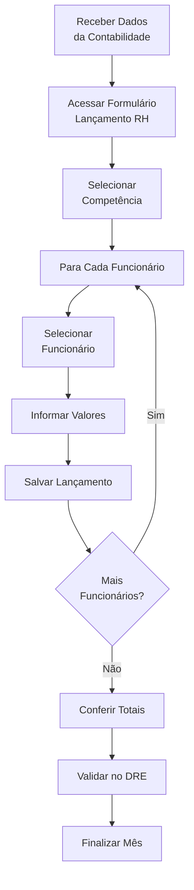

# 📅 Processo Mensal de Lançamento de RH

## 🎯 Visão Geral

Esta documentação detalha o processo mensal de registro de valores da folha de pagamento no Sol.NET, utilizando o **formulário de Lançamento RH**.

### Fluxo Mensal Completo



---

## 📋 Formulário de Lançamento RH

### Acesso ao Formulário

**Caminho:** Menu RH → Lançamentos → Lançamento de Folha

ou

**Caminho:** RH → Processos → Lançamento Mensal

### Estrutura do Formulário

O formulário de Lançamento RH é a interface principal para registro mensal dos valores de cada funcionário.

#### **Seção 1: Seleção de Competência**

**Campos:**
- **Mês**: Selecionar o mês de referência (01 a 12)
- **Ano**: Informar o ano (ex: 2024)
- **Competência Completa**: Exibição MM/AAAA (ex: 03/2024)

**Função:**
Define o período ao qual os lançamentos se referem. Todos os lançamentos do mês serão agrupados por esta competência.

#### **Seção 2: Seleção de Funcionário**

**Campos:**
- **Funcionário**: Campo de busca/seleção (obrigatório)
  - Pode buscar por nome, matrícula ou CPF
  - Mostra apenas funcionários ativos
  - Vinculação obrigatória para cada lançamento

**Informações Exibidas ao Selecionar:**
- Nome completo do funcionário
- Matrícula
- Departamento
- Centro de custo
- Contas contábeis configuradas (salário, encargos, benefícios)

#### **Seção 3: Dados do Lançamento**

**Tipos de Valores:**

**1. Vencimentos (Valores Positivos/Créditos)**
- Salário Base
- Horas Extras
- Comissões
- Gratificações
- Adicional Noturno
- Adicional de Insalubridade
- Adicional de Periculosidade
- Outros vencimentos

**2. Descontos (Valores Negativos/Débitos)**
- INSS Funcionário
- IRRF
- Vale Transporte (desconto)
- Vale Refeição (desconto)
- Plano de Saúde (coparticipação)
- Empréstimos consignados
- Pensão alimentícia
- Outros descontos

**3. Encargos Patronais (Custo da Empresa)**
- INSS Patronal
- FGTS
- RAT/FAP
- Salário Educação
- INCRA/SENAI/SESI/SEBRAE

**4. Benefícios (Custo da Empresa)**
- Vale Transporte (parte empresa)
- Vale Refeição (parte empresa)
- Plano de Saúde (parte empresa)
- Seguro de Vida
- Outros benefícios

**Campos para Cada Tipo:**
- **Descrição**: Nome do evento/rubrica
- **Valor**: Valor em reais (R$)
- **Conta Débito**: Conta contábil de despesa (auto-preenchida do cadastro)
- **Conta Crédito**: Conta contábil de passivo
- **Observações**: Campo livre para anotações

#### **Seção 4: Totalização**

**Totalizadores Automáticos:**
- **Total Vencimentos**: Soma de todos os valores positivos
- **Total Descontos**: Soma de todos os valores negativos
- **Líquido a Pagar**: Vencimentos - Descontos
- **Total Encargos**: Soma dos encargos patronais
- **Total Benefícios**: Soma dos benefícios empresa
- **Custo Total**: Vencimentos + Encargos + Benefícios

#### **Seção 5: Ações**

**Botões Disponíveis:**
- **Novo**: Limpa formulário para novo lançamento
- **Salvar**: Grava o lançamento do funcionário atual
- **Excluir**: Remove lançamento existente
- **Cancelar**: Descarta alterações não salvas
- **Próximo Funcionário**: Salva atual e abre novo para próximo
- **Imprimir**: Gera relatório do lançamento

---

## 🔄 Processo Passo a Passo

### Preparação (Antes de Começar)

**1. Receber Planilha da Contabilidade**

A contabilidade deve fornecer planilha detalhada com:
```
Competência: Março/2024

Funcionário: João Silva (Mat. 001)
├── Vencimentos
│   ├── Salário Base: R$ 5.000,00
│   ├── Horas Extras: R$ 300,00
│   └── Total Vencimentos: R$ 5.300,00
├── Descontos
│   ├── INSS: R$ 583,00
│   ├── IRRF: R$ 95,00
│   ├── Vale Transporte: R$ 150,00
│   └── Total Descontos: R$ 828,00
├── Líquido: R$ 4.472,00
└── Encargos Empresa
    ├── INSS Patronal: R$ 1.060,00
    ├── FGTS: R$ 424,00
    └── Total Encargos: R$ 1.484,00

Funcionário: Maria Santos (Mat. 002)
[... dados individuais ...]

[Repetir para todos os funcionários]
```

**2. Validar Cadastros**

Verificar que todos os funcionários da planilha estão:
- Cadastrados no sistema
- Com status "Ativo"
- Com contas contábeis configuradas
- Com centro de custo definido

---

### Lançamento no Formulário

#### **Passo 1: Abrir Formulário de Lançamento**

1. Menu RH → Lançamentos → Lançamento de Folha
2. Sistema abre o formulário de Lançamento RH

#### **Passo 2: Definir Competência**

1. Selecionar **Mês**: 03 (Março)
2. Selecionar **Ano**: 2024
3. Sistema mostra: Competência 03/2024

#### **Passo 3: Lançar Primeiro Funcionário**

**Para João Silva (Mat. 001):**

1. **Selecionar Funcionário:**
   - Clicar no campo "Funcionário"
   - Digitar "João" ou "001"
   - Selecionar "João Silva - Mat. 001"
   - Sistema carrega dados do cadastro

2. **Informar Vencimentos:**
   ```
   Salário Base:
   - Descrição: Salário Base
   - Valor: R$ 5.000,00
   - Conta Débito: 6.2.01 (auto-preenchida)
   - Conta Crédito: 2.1.2.01
   
   Horas Extras:
   - Descrição: Horas Extras 50%
   - Valor: R$ 300,00
   - Conta Débito: 6.2.01 (auto-preenchida)
   - Conta Crédito: 2.1.2.01
   ```

3. **Informar Descontos:**
   ```
   INSS:
   - Descrição: INSS Funcionário
   - Valor: R$ 583,00
   - (Reduz o líquido a pagar)
   
   IRRF:
   - Descrição: IRRF
   - Valor: R$ 95,00
   
   Vale Transporte:
   - Descrição: Vale Transporte
   - Valor: R$ 150,00
   ```

4. **Informar Encargos Patronais:**
   ```
   INSS Patronal:
   - Descrição: INSS Patronal
   - Valor: R$ 1.060,00
   - Conta Débito: 6.2.02 (auto-preenchida)
   - Conta Crédito: 2.1.2.02
   
   FGTS:
   - Descrição: FGTS
   - Valor: R$ 424,00
   - Conta Débito: 6.2.02 (auto-preenchida)
   - Conta Crédito: 2.1.2.03
   ```

5. **Conferir Totalizadores:**
   ```
   Total Vencimentos: R$ 5.300,00 ✓
   Total Descontos: R$ 828,00 ✓
   Líquido: R$ 4.472,00 ✓
   Total Encargos: R$ 1.484,00 ✓
   Custo Total: R$ 6.784,00
   ```

6. **Salvar:**
   - Clicar em "Salvar" ou usar botão "Próximo Funcionário"
   - Sistema grava lançamento de João Silva
   - Limpa formulário para próximo

#### **Passo 4: Lançar Próximo Funcionário**

**Para Maria Santos (Mat. 002):**

1. Selecionar "Maria Santos - Mat. 002"
2. Informar vencimentos conforme planilha
3. Informar descontos
4. Informar encargos
5. Conferir totais
6. Salvar

#### **Passo 5: Repetir para Todos**

Continuar o processo para cada funcionário da planilha:
- Pedro Costa (Mat. 003)
- Ana Oliveira (Mat. 004)
- Carlos Lima (Mat. 005)
- [... todos os demais ...]

---

## ✅ Conferência e Validação

### Durante o Processo

**Após cada funcionário:**
- [ ] Valores conferidos com planilha
- [ ] Totalizadores corretos
- [ ] Lançamento salvo com sucesso
- [ ] Marcar funcionário como "lançado" na planilha

### Após Todos os Lançamentos

#### **1. Conferir Total Geral**

**No Formulário:**
- Menu RH → Relatórios → Resumo Mensal
- Selecionar competência: 03/2024
- Verificar total de funcionários lançados
- Comparar total geral com planilha da contabilidade

**Exemplo:**
```
Resumo Março/2024:
─────────────────────────────────────
Funcionários Lançados: 10
Total Salários: R$ 45.000,00
Total Encargos: R$ 12.600,00
Total Benefícios: R$ 3.500,00
─────────────────────────────────────
Custo Total RH: R$ 61.100,00

Comparar com planilha contabilidade ✓
```

#### **2. Validar no DRE**

**Acessar:**
- Menu Financeiro → DRE
- Competência: 03/2024

**Verificar:**
```
6.2 DESPESAS ADMINISTRATIVAS
    6.2.01 Salários ........... R$ 30.000,00
    6.2.02 Encargos Sociais ... R$ 8.400,00
    6.2.03 Benefícios ......... R$ 2.100,00

6.1 DESPESAS COM VENDAS
    6.1.01 Salários ........... R$ 15.000,00
    6.1.02 Encargos Sociais ... R$ 4.200,00
    6.1.03 Benefícios ......... R$ 1.400,00
```

#### **3. Checklist Final**

- [ ] Todos os funcionários da planilha foram lançados
- [ ] Total geral confere com contabilidade
- [ ] Valores aparecem corretamente no DRE
- [ ] Alocação por centro de custo está correta
- [ ] Não há lançamentos duplicados
- [ ] Competência está correta

---

## 💡 Recursos do Formulário

### Funcionalidades Úteis

#### **Busca de Funcionário**

**Métodos de busca:**
- Por nome: Digite parte do nome
- Por matrícula: Digite número da matrícula
- Por CPF: Digite CPF completo ou parcial

**Filtros:**
- Mostrar apenas ativos
- Mostrar todos (ativos + inativos)
- Por departamento específico

#### **Copiar Lançamento Anterior**

Se disponível:
1. Selecionar funcionário
2. Clicar em "Copiar Mês Anterior"
3. Sistema traz valores do mês passado
4. Ajustar valores conforme novo mês
5. Salvar

**Útil para:**
- Funcionários com salário fixo
- Provisões mensais recorrentes
- Benefícios que não variam

#### **Lançamento em Lote**

Se disponível:
- Importar planilha Excel com dados
- Sistema valida e cria lançamentos
- Conferir antes de gravar definitivamente

#### **Histórico do Funcionário**

Visualizar lançamentos anteriores:
1. Selecionar funcionário
2. Clicar em "Histórico"
3. Ver todos os meses anteriores
4. Comparar valores

---

## ⚠️ Problemas Comuns e Soluções

### **Problema: Funcionário não aparece na busca**

**Causas:**
- Funcionário não cadastrado
- Status inativo
- Filtro de departamento ativo

**Solução:**
1. Verificar em RH → Cadastros → Funcionários
2. Cadastrar se não existir
3. Ativar se estiver inativo
4. Remover filtros de busca

---

### **Problema: Contas contábeis não preenchidas**

**Causa:**
Contas não configuradas no cadastro do funcionário

**Solução:**
1. Ir em RH → Cadastros → Funcionários
2. Editar o funcionário
3. Aba "Configurações Contábeis"
4. Preencher contas de salário, encargos e benefícios
5. Salvar
6. Voltar ao formulário de lançamento

---

### **Problema: Erro ao salvar**

**Causas comuns:**
- Funcionário não selecionado
- Valor não informado
- Conta contábil inválida
- Competência não definida

**Solução:**
- Verificar todos os campos obrigatórios
- Conferir mensagem de erro específica
- Validar se funcionário está ativo

---

### **Problema: Total diferente da contabilidade**

**Causas:**
- Faltou lançar algum funcionário
- Valor digitado incorreto
- Lançamento duplicado

**Solução:**
1. Gerar relatório resumo do mês
2. Comparar lista de funcionários
3. Verificar valores individuais
4. Corrigir discrepâncias

---

### **Problema: Valores não aparecem no DRE**

**Causas:**
- Conta contábil errada
- Competência diferente
- Lançamento não salvo

**Solução:**
1. Conferir se lançamento foi salvo
2. Validar contas contábeis
3. Verificar competência
4. Regerar DRE

---

## 📊 Relatórios Disponíveis

### Durante o Processo

**1. Resumo de Lançamentos**
- Lista funcionários já lançados no mês
- Valores por funcionário
- Total parcial

**2. Pendências**
- Funcionários ainda não lançados
- Baseado em mês anterior
- Alerta de esquecimentos

### Após Finalizar

**1. Folha Analítica**
- Detalhamento completo
- Todos os funcionários
- Todos os eventos
- Totalização geral

**2. Folha Sintética**
- Resumo por departamento
- Totais por tipo (salários, encargos, benefícios)
- Comparativo com mês anterior

**3. Comprovante de Lançamento**
- Documento para arquivo
- Assinatura responsável
- Data de processamento

---

## 💡 Dicas de Produtividade

### **1. Organize o Trabalho**

**Por departamento:**
- Lanc todos do Administrativo
- Depois todos de Vendas
- Depois Produção
- Facilita conferência

**Por ordem alfabética:**
- Organizar planilha da contabilidade
- Lançar na mesma ordem
- Usar checklist

### **2. Use Atalhos (se disponíveis)**

Verifique atalhos de teclado para:
- Salvar e próximo: Agiliza processo
- Buscar funcionário: Acesso rápido
- Conferir totais: Validação rápida

### **3. Valide Incrementalmente**

Não espere lançar todos para conferir:
- A cada 5 funcionários, confira subtotal
- Valide departamento completo antes de mudar
- Reduz retrabalho

### **4. Mantenha Controle**

**Planilha de acompanhamento:**
```
Funcionário | Mat | Lançado | Conferido | Obs
─────────────────────────────────────────────
João Silva  | 001 |    ✓    |     ✓     | OK
Maria Santos| 002 |    ✓    |     ✓     | OK
Pedro Costa | 003 |    ✓    |     ✓     | OK
...
```

### **5. Backup**

Antes de finalizar:
- Exportar lançamentos
- Salvar planilha da contabilidade
- Documentar ajustes feitos

---

## 📅 Calendário Sugerido

### **Dia 1-5 do Mês**
- Receber planilha da contabilidade
- Validar dados recebidos
- Conferir cadastros atualizados

### **Dia 6-15**
- Processar lançamentos
- Lançar funcionário por funcionário
- Conferir incrementalmente

### **Dia 16-20**
- Finalizar lançamentos
- Conferência final
- Validar DRE
- Gerar relatórios

### **Dia 21-25**
- Disponibilizar para análise gerencial
- Arquivo de documentação
- Preparar para próximo mês

---

## 🔗 Documentação Relacionada

- **[Cadastro de Funcionários](Documentacao Folha de Pagamento.md#-cadastro-de-funcionários-pessoa-rh)**: Como cadastrar funcionários
- **[Guia Rápido](Guia Rapido.md)**: Referência rápida para lançamentos
- **[FAQ](FAQ.md)**: Perguntas frequentes sobre lançamentos

---

**📅 Última atualização**: Janeiro de 2025  
**📦 Versão**: 1.0  
**🎯 Público-alvo**: Usuários responsáveis por lançamentos mensais de RH  
**👥 Contribuidores**: Equipe de Documentação Sol.NET

---

*Esta documentação detalha o processo mensal de lançamento usando o formulário de Lançamento RH. Lembre-se: cada lançamento deve estar vinculado a um funcionário específico e os valores são fornecidos pela contabilidade externa.*
