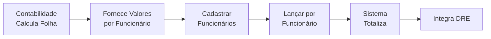

# 👥 Índice: Documentação Módulo RH - Sol.NET ERP

## 🎯 Sobre Este Módulo

O **Módulo de Lançamentos de RH** do Sol.NET é uma ferramenta de **controle interno** para registrar valores da folha de pagamento **por funcionário** e integrá-los ao DRE.

### ⚠️ Regra Fundamental

**TODO LANÇAMENTO DE RH DEVE ESTAR VINCULADO A UM FUNCIONÁRIO ESPECÍFICO**

Não é possível lançar valores totais sem associação a funcionários individuais.

### O Que Este Módulo É

**Este módulo É:**
- ✅ Ferramenta de lançamento de valores por funcionário
- ✅ Integração com DRE para análise gerencial
- ✅ Controle detalhado de despesas com pessoal
- ✅ Sistema de cadastro de funcionários

**Este módulo NÃO É:**
- ❌ Sistema completo de folha de pagamento
- ❌ Calculadora de impostos e encargos
- ❌ Emissor de holerites ou guias
- ❌ Integrado com eSocial ou órgãos externos

---

## 📋 Documentos Disponíveis

### 💼 **[Documentação de Lançamentos de Folha](Documentacao Folha de Pagamento.md)**
Guia completo do módulo de lançamentos de RH:
- **Cadastro de Funcionários (Pessoa RH)** - Seção ampliada e detalhada
  - Todos os campos e suas finalidades
  - Importância da vinculação de contas contábeis
  - Como cadastrar passo a passo
  - Gestão de funcionários ativos e inativos
- Visão geral e propósito do módulo
- Fluxo de trabalho por funcionário
- Processo de lançamento individual
- Tipos de lançamentos por funcionário
- Configuração de contas contábeis
- Exemplos práticos detalhados
- FAQ e troubleshooting

### 📅 **[Processo Mensal de Lançamento](Processo Mensal.md)**
Guia detalhado do processo mensal usando o formulário de Lançamento RH:
- **Formulário de Lançamento RH** - Estrutura completa e campos
- Processo passo a passo mês a mês
- Como usar o formulário para cada funcionário
- Conferência e validação dos lançamentos
- Recursos úteis (busca, cópia, histórico)
- Relatórios disponíveis
- Dicas de produtividade
- Calendário mensal sugerido

### 🚀 **[Guia Rápido](Guia Rapido.md)**
Referência rápida para operações do dia a dia:
- Checklist para cadastro de funcionários
- Checklist mensal de lançamentos
- Fluxo de lançamento por funcionário
- Exemplo prático com múltiplos funcionários
- Problemas comuns e soluções
- Dicas para trabalhar com muitos funcionários

### ❓ **[FAQ - Perguntas Frequentes](FAQ.md)**
Respostas para dúvidas comuns:
- **Sobre vinculação obrigatória a funcionários**
- Cadastro de funcionários detalhado
- Como fazer lançamentos individuais
- Diferença entre módulo RH e sistema de folha completo
- Problemas técnicos e cenários específicos
- Como trabalhar quando contabilidade fornece só totais

---

## 🔄 Como Funciona



**Fluxo detalhado:**
1. Escritório contábil processa a folha de pagamento completa
2. Contabilidade fornece planilha com **valores individuais de cada funcionário**
3. **Cadastrar todos os funcionários** no Sol.NET (se ainda não cadastrados)
4. **Lançar valores de cada funcionário** individualmente
5. Sistema totaliza automaticamente por departamento
6. Integração automática com DRE
7. Análise de despesas com pessoal nos relatórios

---

## 👥 Cadastro de Funcionários - Essencial

### Por Que é Importante

**Sem funcionários cadastrados, não é possível fazer lançamentos.**

Todo lançamento precisa estar vinculado a um funcionário específico cadastrado no sistema.

### Informações Principais do Cadastro

| Categoria | Campos Importantes |
|-----------|-------------------|
| **Identificação** | Nome, CPF, Matrícula |
| **Trabalhista** | Admissão, Cargo, Departamento, Status |
| **Contábil** | Centro de Custo, Contas (Salário, Encargos, Benefícios) |
| **Complementar** | Endereço, Contatos, Observações |

### Acesso ao Cadastro

**Menu:** RH → Cadastros → Funcionários

Veja detalhes completos em: [Cadastro de Pessoa RH](Documentacao Folha de Pagamento.md#-cadastro-de-funcionários-pessoa-rh)

---

## 💰 Lançamentos por Funcionário

### Processo Mensal

**Para empresa com 10 funcionários:**

1. **Receber da contabilidade:**
   - Planilha com 10 linhas (uma por funcionário)
   - Valores individuais de cada um

2. **Fazer 10 conjuntos de lançamentos:**
   - Funcionário 1: Salário + Encargos + Benefícios
   - Funcionário 2: Salário + Encargos + Benefícios
   - ...
   - Funcionário 10: Salário + Encargos + Benefícios

3. **Sistema totaliza automaticamente:**
   - Por departamento
   - Por conta contábil
   - Aparece consolidado no DRE

### Exemplo de Lançamento

```
FUNCIONÁRIO: João Silva (Mat. 001)
─────────────────────────────────────
Lançamento 1:
  Salário: R$ 5.000,00
  D - 6.2.01 Salários
  C - 2.1.2.01 Salários a Pagar

Lançamento 2:
  INSS Patronal: R$ 1.000,00
  D - 6.2.02 Encargos
  C - 2.1.2.02 Encargos a Recolher

Lançamento 3:
  FGTS: R$ 400,00
  D - 6.2.02 Encargos
  C - 2.1.2.03 FGTS a Recolher
```

**Repetir para todos os outros funcionários.**

---

## 📋 Checklist Simplificado

### **Início (Uma Vez)**
```
[ ] Cadastrar todos os funcionários
[ ] Configurar contas contábeis de cada um
[ ] Definir centro de custo de cada um
[ ] Validar cadastros completos
```

### **Mensal**
```
[ ] Receber planilha detalhada da contabilidade (por funcionário)
[ ] Para cada funcionário:
    [ ] Criar lançamento vinculado ao funcionário
    [ ] Lançar salário
    [ ] Lançar encargos
    [ ] Lançar benefícios
    [ ] Salvar
[ ] Conferir total no DRE
[ ] Comparar com total da contabilidade
```

---

## ❓ Perguntas Mais Comuns

**Posso lançar valores totais sem vincular a funcionários?**  
→ **NÃO**. Vinculação é obrigatória.

**Preciso cadastrar todos os funcionários?**  
→ **SIM**. Sem cadastro não há lançamento.

**A contabilidade só me dá valores totais, e agora?**  
→ Solicite planilha detalhada por funcionário. É essencial.

**Quantos lançamentos faço por mês?**  
→ Um conjunto de lançamentos para **cada funcionário**.

**O sistema calcula os valores?**  
→ Não. Você lança os valores calculados pela contabilidade.

**Como emito holerites?**  
→ Sol.NET não emite. Use sistema da contabilidade.

---

## 🔗 Navegação Rápida

### **Por Tarefa**

**Cadastrar Funcionários:**
- [Guia Completo de Cadastro](Documentacao Folha de Pagamento.md#-cadastro-de-funcionários-pessoa-rh)
- [Campos Obrigatórios](Documentacao Folha de Pagamento.md#informações-do-cadastro-de-pessoa-rh)
- [Configurar Contas Contábeis](Documentacao Folha de Pagamento.md#configurações-contábeis)

**Fazer Lançamentos Mensais:**
- **[Processo Mensal Completo](Processo Mensal.md)** - Guia detalhado do formulário
- [Formulário de Lançamento RH](Processo Mensal.md#-formulário-de-lançamento-rh)
- [Passo a Passo](Processo Mensal.md#-processo-passo-a-passo)
- [Conferência e Validação](Processo Mensal.md#-conferência-e-validação)
- [Guia Rápido](Guia Rapido.md#-fluxo-de-lançamento)
- [Exemplos Práticos](Documentacao Folha de Pagamento.md#-exemplos-práticos)

**Resolver Problemas:**
- [Troubleshooting](Documentacao Folha de Pagamento.md#-troubleshooting)
- [FAQ Completo](FAQ.md)
- [Problemas Comuns](Guia Rapido.md#️-problemas-comuns)

---

## 📚 Documentação Relacionada

### **Módulos Integrados**
- **[Financeiro - DRE](../Financeiro/Documentacao DRE.md)**: Como o DRE funciona e totaliza os valores
- **[Financeiro - Portadores](../Financeiro/Documentacao Portadores.md)**: Para pagamento de salários

---

## 💡 Dicas Importantes

### **Para Novos Usuários**
1. **Cadastre todos os funcionários primeiro** - não há como lançar sem isso
2. **Entenda a vinculação obrigatória** - cada lançamento = um funcionário
3. **Solicite dados detalhados** - contabilidade deve fornecer valores por funcionário
4. **Organize o trabalho** - lance departamento por departamento

### **Para Administradores**
1. **Treine bem a equipe** - vinculação a funcionário é conceito-chave
2. **Padronize com contabilidade** - formato de planilha detalhada
3. **Configure contas nos cadastros** - agiliza lançamentos
4. **Estabeleça checklist** - evita esquecer funcionários

---

## 🆘 Suporte

### **Dúvidas Sobre:**

**Cadastro de Funcionários**  
→ [Documentação Completa - Seção Cadastro](Documentacao Folha de Pagamento.md#-cadastro-de-funcionários-pessoa-rh)

**Vinculação de Lançamentos**  
→ [FAQ - Vinculação](FAQ.md#-sobre-vinculação-a-funcionários)

**Valores Individuais**  
→ Entre em contato com sua contabilidade

**Sistema Sol.NET**  
→ Suporte técnico Sol.NET

---

**📅 Última atualização**: Janeiro de 2025  
**📦 Versão**: 3.0  
**🎯 Público-alvo**: Usuários responsáveis por lançamentos de RH  
**👥 Contribuidores**: Equipe de Documentação Sol.NET  
**⚠️ Lembre-se: Cada lançamento deve estar vinculado a um funcionário específico**

---

*Este índice organiza a documentação do Módulo de Lançamentos de RH. O ponto central é o **Cadastro de Funcionários** e a **vinculação obrigatória** de cada lançamento a um funcionário específico. Para processamento completo de folha de pagamento, consulte seu escritório contábil.*
