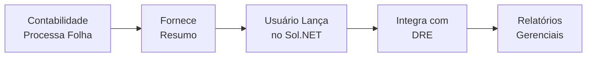

# 👥 Índice: Documentação Módulo RH - Sol.NET ERP

## 🎯 Sobre Este Módulo

O **Módulo de Lançamentos de RH** do Sol.NET é uma ferramenta de **controle interno** para registrar valores da folha de pagamento e integrá-los ao DRE.

### ⚠️ Importante Entender

**Este módulo É:**
- ✅ Ferramenta de lançamento de valores de RH
- ✅ Integração com DRE para análise gerencial
- ✅ Controle de despesas com pessoal por departamento

**Este módulo NÃO É:**
- ❌ Sistema completo de folha de pagamento
- ❌ Calculadora de impostos e encargos
- ❌ Emissor de holerites ou guias
- ❌ Integrado com eSocial ou órgãos externos

---

## 📋 Documentos Disponíveis

### 💼 **[Documentação de Lançamentos de Folha](Documentacao Folha de Pagamento.md)**
Guia completo do módulo de lançamentos de RH:
- Visão geral e propósito do módulo
- Diferença entre o que o módulo faz e não faz
- Fluxo de trabalho (contabilidade → lançamento → DRE)
- Cadastros básicos (funcionários e departamentos)
- Processo de lançamento passo a passo
- Configuração de contas contábeis
- Exemplos práticos detalhados
- FAQ e troubleshooting

### 🚀 **[Guia Rápido](Guia Rapido.md)**
Referência rápida para operações do dia a dia:
- Checklist mensal de lançamentos
- Tipos de lançamento (salários, encargos, provisões)
- Fluxo rápido de lançamento
- Exemplo prático completo
- Problemas comuns e soluções
- Dicas produtivas

### ❓ **[FAQ - Perguntas Frequentes](FAQ.md)**
Respostas para dúvidas comuns:
- Sobre o módulo e suas limitações
- Como fazer lançamentos
- Valores e cálculos (feitos pela contabilidade)
- Integração com DRE
- Cadastros necessários
- Problemas técnicos e cenários específicos

---

## 🔄 Como Funciona



**Fluxo típico:**
1. Escritório contábil processa a folha de pagamento completa
2. Contabilidade fornece resumo com valores totais
3. Usuário lança esses valores no módulo RH do Sol.NET
4. Sistema integra automaticamente com o DRE
5. Empresa analisa despesas com pessoal nos relatórios

---

## 🎯 Por Onde Começar

### **👤 Novo Usuário**
1. Leia **[Documentação Completa](Documentacao Folha de Pagamento.md)** - seção "Visão Geral"
2. Entenda o que o módulo faz e o que não faz
3. Compreenda o fluxo: contabilidade → lançamento → DRE
4. Pratique com o **[Guia Rápido](Guia Rapido.md)**

### **🔧 Administrador/Configurador**
1. Configure **Departamentos/Centros de Custo**
2. Defina **Contas Contábeis** para cada tipo de lançamento
3. Cadastre **Funcionários** (opcional, apenas para controle)
4. Estabeleça **Procedimento Mensal** com a equipe

### **⚡ Usuário Experiente**
1. Use o **[Guia Rápido](Guia Rapido.md)** como referência
2. Consulte **[FAQ](FAQ.md)** para situações específicas
3. Padronize lançamentos para ganhar agilidade

---

## 💰 Tipos de Lançamento

### **Principais Categorias**

| Categoria | Conta Débito | Conta Crédito | Fonte do Valor |
|-----------|--------------|---------------|----------------|
| Salários | 6.2.01 | 2.1.2.01 | Contabilidade |
| Encargos Sociais | 6.2.02 | 2.1.2.02 | Contabilidade |
| Benefícios | 6.2.03 | 2.1.2.04 | Contabilidade |
| Provisão 13º | 6.2.04 | 2.1.3.01 | Contabilidade |
| Provisão Férias | 6.2.05 | 2.1.3.02 | Contabilidade |

**Importante:** Todos os valores são informados pela contabilidade. O Sol.NET apenas registra.

---

## 📋 Checklist Mensal Simplificado

```
Início do Mês:
[ ] Solicitar resumo da folha à contabilidade

Meio do Mês (até dia 15):
[ ] Receber valores por categoria
[ ] Conferir se estão separados por departamento

Até dia 20:
[ ] Lançar valores no Sol.NET
[ ] Conferir integração com DRE
[ ] Validar totais

Final do Mês:
[ ] Analisar relatórios gerenciais
[ ] Comparar com meses anteriores
```

---

## 📊 Exemplo Rápido

**Resumo da Contabilidade (Março/2024):**
```
Salários:        R$ 40.000,00
Encargos:        R$ 11.200,00
Benefícios:      R$  3.000,00
Provisão 13º:    R$  3.333,33
Provisão Férias: R$  4.444,44
──────────────────────────────
Total:           R$ 61.977,77
```

**Lançamentos no Sol.NET:**
- 5 lançamentos (um por categoria)
- Data: 31/03/2024
- Total lançado: R$ 61.977,77

**Resultado:**
- Valores aparecem no DRE de Março
- Análise de despesas com pessoal disponível
- Comparativo com meses anteriores

---

## ❓ Perguntas Mais Comuns

**O Sol.NET calcula INSS e IRRF?**  
→ Não. Valores são calculados pela contabilidade e apenas lançados no sistema.

**Preciso cadastrar todos os funcionários?**  
→ Não obrigatório. Cadastre apenas se quiser controle interno de nomes.

**Como emito holerites?**  
→ O Sol.NET não emite holerites. Use o sistema da contabilidade.

**O sistema envia dados para o eSocial?**  
→ Não. Sol.NET não tem integração com órgãos externos.

**Posso importar dados do ponto eletrônico?**  
→ Não. Sol.NET não tem módulo de ponto.

**Como sei quais valores lançar?**  
→ A contabilidade deve fornecer um resumo mensal com valores por categoria.

---

## 🔗 Navegação Rápida

### **Por Tarefa**

**Fazer Lançamentos Mensais:**
- [Processo Completo](Documentacao Folha de Pagamento.md#-lançamento-de-valores-da-folha)
- [Guia Rápido](Guia Rapido.md#-fluxo-rápido-de-lançamento)
- [Exemplo Prático](Guia Rapido.md#-exemplo-prático)

**Configurar o Sistema:**
- [Cadastrar Departamentos](Documentacao Folha de Pagamento.md#-cadastro-de-departamentoscentros-de-custo)
- [Definir Contas Contábeis](Documentacao Folha de Pagamento.md#-vinculação-de-contas-contábeis)

**Resolver Problemas:**
- [Troubleshooting](Documentacao Folha de Pagamento.md#-troubleshooting)
- [FAQ Completo](FAQ.md)
- [Problemas Comuns](Guia Rapido.md#️-problemas-comuns)

**Analisar Resultados:**
- [Integração com DRE](Documentacao Folha de Pagamento.md#-integração-com-dre)
- [Relatórios](Documentacao Folha de Pagamento.md#-relatórios)

---

## 📚 Documentação Relacionada

### **Módulos Integrados**
- **[Financeiro - DRE](../Financeiro/Documentacao DRE.md)**: Como o DRE funciona e como RH se integra
- **[Financeiro - Portadores](../Financeiro/Documentacao Portadores.md)**: Para pagamento de salários

### **Conceitos Importantes**
- **Plano de Contas**: Estrutura de contas contábeis
- **Centro de Custos**: Alocação por departamento
- **Regime de Competência**: Lançamento por período de referência

---

## 💡 Dicas Importantes

### **Para Novos Usuários**
1. **Entenda as limitações**: O módulo não processa folha, apenas registra valores
2. **Parceria com contabilidade**: Essencial para fornecer valores corretos
3. **Padronize processos**: Defina um fluxo mensal fixo
4. **Confira sempre**: Valide lançamentos no DRE após salvar

### **Para Administradores**
1. **Configure contas padrão**: Agiliza lançamentos futuros
2. **Organize por departamento**: Permite análises gerenciais
3. **Estabeleça responsáveis**: Defina quem lança e quem confere
4. **Documente o processo**: Mantenha manual interno atualizado

---

## 🆘 Suporte

### **Dúvidas Sobre:**

**Lançamentos no Sol.NET**  
→ Consulte esta documentação ou suporte técnico Sol.NET

**Valores da Folha de Pagamento**  
→ Entre em contato com sua contabilidade/escritório contábil

**Obrigações Fiscais e Trabalhistas**  
→ Consulte seu contador responsável

### **Canais de Suporte**
- **Documentação Online**: Este portal
- **Suporte Técnico Sol.NET**: Para questões do sistema
- **Contabilidade**: Para questões de valores e cálculos

---

**📅 Última atualização**: Janeiro de 2025  
**📦 Versão**: 2.0  
**🎯 Público-alvo**: Usuários responsáveis por lançamentos de RH  
**👥 Contribuidores**: Equipe de Documentação Sol.NET

---

*Este índice organiza a documentação do Módulo de Lançamentos de RH, ferramenta de controle interno para integração de despesas com pessoal ao DRE. Para processamento completo de folha de pagamento, consulte seu escritório contábil.*
