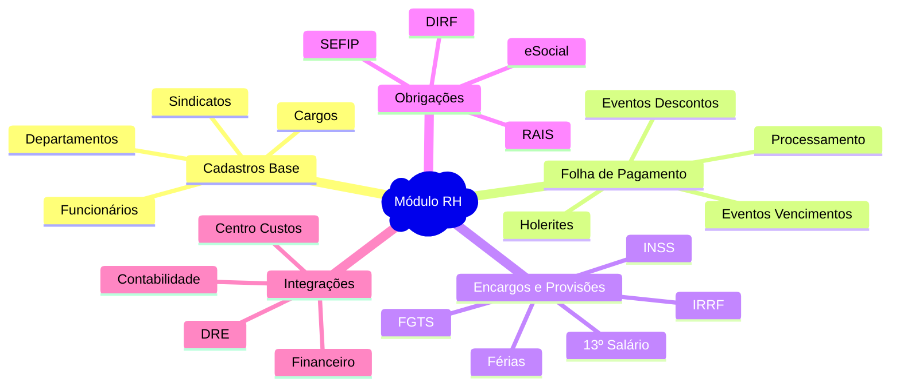
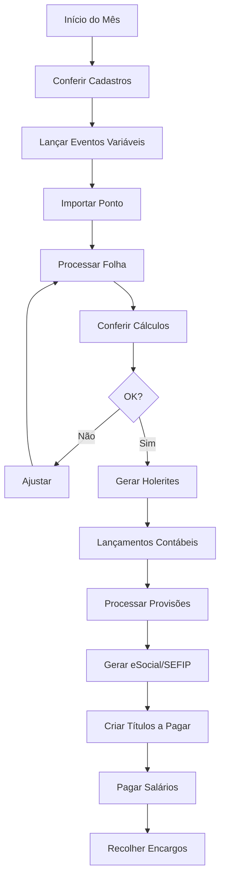

# 👥 Índice: Documentação Módulo RH - Sol.NET ERP

## 📋 Documentos Disponíveis

### 💼 **[Documentação Folha de Pagamento](Documentacao Folha de Pagamento.md)**
Guia completo do módulo de Recursos Humanos e Folha de Pagamento, incluindo:
- Visão geral e características do módulo
- Cadastros essenciais (funcionários, cargos, departamentos)
- Processo completo de lançamento da folha
- Cálculos detalhados de INSS, IRRF e FGTS
- Provisões automáticas (13º salário e férias)
- Integração com contabilidade e DRE
- Obrigações trabalhistas (eSocial, SEFIP, DIRF, RAIS)
- Exemplos práticos de admissão, férias e rescisão
- FAQ completo e troubleshooting

### 🚀 **[Guia Rápido](Guia Rapido.md)**
Referência rápida para operações do dia a dia:
- Atalhos de teclado essenciais
- Checklist mensal da folha
- Prazos e obrigações
- Soluções rápidas para problemas comuns
- Fluxo de trabalho simplificado

### ❓ **[FAQ - Perguntas Frequentes](FAQ.md)**
Respostas para dúvidas comuns organizadas por categoria:
- Configuração de cadastros
- Cálculos e processamento
- Integrações contábeis
- eSocial e obrigações acessórias
- Problemas comuns e soluções
- Cenários específicos

---

## 🎯 Por Onde Começar

### **👤 Novo no Módulo RH**
1. Comece com a **[Documentação Folha de Pagamento](Documentacao Folha de Pagamento.md)** - seção "Visão Geral"
2. Entenda os **Cadastros Essenciais** antes de processar
3. Siga o **Fluxo de Trabalho passo a passo**
4. Pratique com exemplos de **Admissão** e **Processamento Mensal**

### **🔧 Administrador/Configurador**
1. **Cadastros Base**: Configure cargos, departamentos e sindicatos
2. **Funcionários**: Cadastre colaboradores com dados contábeis corretos
3. **Eventos**: Configure rubricas da folha (salários, descontos, benefícios)
4. **Integração**: Configure contas contábeis e centros de custo
5. **eSocial**: Configure certificado digital e ambiente

### **⚡ Usuário Experiente**
1. Use o **[Guia Rápido](Guia Rapido.md)** como referência diária
2. Consulte **[FAQ](FAQ.md)** para situações específicas
3. Explore **Relatórios Gerenciais** para análises avançadas
4. Configure **Alertas Automáticos** para exceções

---

## 🧭 Navegação Rápida por Funcionalidade

### **👥 Cadastros e Configuração**
- [Cadastro de Funcionários](Documentacao Folha de Pagamento.md#-cadastro-de-funcionários)
- [Cadastro de Cargos](Documentacao Folha de Pagamento.md#-cadastro-de-cargos)
- [Cadastro de Departamentos](Documentacao Folha de Pagamento.md#-cadastro-de-departamentos)
- [Cadastro de Sindicatos](Documentacao Folha de Pagamento.md#-cadastro-de-sindicatos)

### **💰 Folha de Pagamento**
- [Fluxo de Trabalho Completo](Documentacao Folha de Pagamento.md#-fluxo-de-trabalho)
- [Tipos de Eventos](Documentacao Folha de Pagamento.md#-tipos-de-eventos-da-folha)
- [Cálculos e Fórmulas](Documentacao Folha de Pagamento.md#-cálculos-e-fórmulas)
- [Provisões Mensais](Documentacao Folha de Pagamento.md#-provisões-mensais)
- [Checklist Mensal](Documentacao Folha de Pagamento.md#-checklist-mensal-da-folha-de-pagamento)

### **🔗 Integrações**
- [Integração com Contabilidade](Documentacao Folha de Pagamento.md#-integração-com-contabilidade)
- [Lançamentos Automáticos no DRE](Documentacao Folha de Pagamento.md#-lançamentos-automáticos-no-dre)
- [Estrutura de Contas Sugerida](Documentacao Folha de Pagamento.md#-estrutura-de-contas-sugerida)

### **📄 Obrigações Trabalhistas**
- [eSocial - Eventos Principais](Documentacao Folha de Pagamento.md#️-esocial---eventos-principais)
- [SEFIP - FGTS](Documentacao Folha de Pagamento.md#-sefip---sistema-empresa-de-recolhimento-do-fgts)
- [DIRF - Imposto de Renda](Documentacao Folha de Pagamento.md#-dirf---declaração-do-imposto-de-renda-retido-na-fonte)
- [RAIS - Relação Anual](Documentacao Folha de Pagamento.md#-rais---relação-anual-de-informações-sociais)

### **💡 Exemplos e Casos Práticos**
- [Exemplo: Admissão de Funcionário](Documentacao Folha de Pagamento.md#-exemplo-1-admissão-de-novo-funcionário)
- [Exemplo: Processamento de Férias](Documentacao Folha de Pagamento.md#-exemplo-2-processamento-de-férias)
- [Exemplo: Rescisão de Contrato](Documentacao Folha de Pagamento.md#-exemplo-3-rescisão-de-contrato)

### **🆘 Suporte e Problemas**
- [FAQ Completo](Documentacao Folha de Pagamento.md#-faq---perguntas-frequentes)
- [Troubleshooting](Documentacao Folha de Pagamento.md#-troubleshooting---solução-de-problemas)
- [Melhores Práticas](Documentacao Folha de Pagamento.md#-melhores-práticas)

---

## 📊 Mapa de Conceitos do Módulo RH

---

## 🔄 Fluxo Mensal Típico

---

## 💡 Dicas de Produtividade

### **Atalhos Úteis no Módulo RH**

| Funcionalidade | Atalho | Descrição |
|---------------|--------|-----------|
| Novo funcionário | **F4** | Abre cadastro novo |
| Processar folha | **F9** | Inicia processamento |
| Gerar holerite | **F10** | Emite holerite |
| Consulta rápida | **F2** | Busca funcionário |
| Lançar evento | **F6** | Adiciona evento |
| Salvar | **F5** | Salva alterações |
| Imprimir | **F8** | Imprime relatório |

### **Fluxos Otimizados**
1. **Processamento Rápido**: Use filtros por departamento para processar em lotes
2. **Eventos Recorrentes**: Configure templates para eventos que se repetem
3. **Validação Automática**: Ative alertas para valores fora do padrão
4. **Backup Automático**: Configure backup diário das folhas processadas

---

## 📅 Calendário de Obrigações

### **Mensal**
- **Dia 5**: Pagamento de salários
- **Dia 7**: Envio SEFIP e recolhimento FGTS
- **Dia 15**: Fechamento eSocial (eventos periódicos)
- **Dia 20**: Recolhimento INSS (GPS)
- **Último dia útil 2º decêndio**: Recolhimento IRRF

### **Anual**
- **28/Fevereiro**: Entrega de Informes de Rendimentos
- **Último dia útil Fevereiro**: Entrega DIRF
- **22/Março**: Entrega RAIS
- **30/Novembro**: Pagamento 1ª parcela 13º salário
- **20/Dezembro**: Pagamento 2ª parcela 13º salário

---

## 📈 Indicadores e Análises

### **KPIs Principais**
- **Custo Total com Pessoal**: Despesa mensal completa
- **Custo por Funcionário**: Média por colaborador
- **Percentual sobre Receita**: Custo RH ÷ Receita Bruta
- **Taxa de Turnover**: Rotatividade de pessoal
- **Horas Extras**: Volume e custo mensal
- **Absenteísmo**: Taxa de faltas e afastamentos

### **Relatórios Gerenciais**
- Custo por Departamento
- Evolução Salarial
- Análise de Benefícios
- Projeção de Provisões
- Comparativo Orçado x Realizado

---

## 🎓 Treinamento Recomendado

### **Curso Básico - RH/Folha de Pagamento (24 horas)**
- **Módulo 1**: Cadastros e configurações iniciais (6h)
- **Módulo 2**: Processamento mensal da folha (6h)
- **Módulo 3**: eSocial e obrigações acessórias (6h)
- **Módulo 4**: Relatórios e análises gerenciais (6h)

### **Curso Avançado (40 horas)**
Inclui curso básico +
- Cálculos complexos (rescisões, férias coletivas, dissídios)
- Integração contábil avançada e rateios
- Customização de relatórios e holerites
- Auditoria e conformidade fiscal
- Otimização de processos e automações

---

## 🔧 Configurações Essenciais

### **Primeiro Setup - Checklist**
- [ ] **Empresa**: Dados cadastrais, CNPJ, CNAE
- [ ] **Certificado Digital**: Configurar para eSocial
- [ ] **Plano de Contas**: Estrutura contábil para RH
- [ ] **Centros de Custo**: Departamentos definidos
- [ ] **Cargos**: Funções da empresa cadastradas
- [ ] **Eventos**: Rubricas da folha configuradas
- [ ] **Sindicatos**: Entidades e contribuições
- [ ] **Parâmetros**: Horários, DSR, arredondamentos
- [ ] **Integração**: Vínculos contábeis configurados

### **Validação da Configuração**
- [ ] **Teste com 1 funcionário**: Processar folha de teste
- [ ] **Conferir cálculos**: INSS, IRRF, FGTS
- [ ] **Validar integração**: Lançamentos no DRE
- [ ] **Gerar eSocial de teste**: Ambiente de homologação
- [ ] **Emitir holerite**: Verificar layout

---

## 📚 Documentação Relacionada

### **Módulos Integrados**
- **[Financeiro - DRE](../Financeiro/Documentacao DRE.md)**: Integração contábil da folha
- **[Financeiro - Portadores](../Financeiro/Documentacao Portadores.md)**: Pagamento de salários
- **[Movimentação](../Movimentacao/)**: Para empresas com comissionamento

### **Legislação de Referência**
- CLT - Consolidação das Leis do Trabalho
- Instruções Normativas RFB - INSS e IRRF
- Manual do eSocial - Versão S-1.0
- Resolução CAIXA - SEFIP e FGTS

---

## 📞 Suporte Especializado

### **Canais de Atendimento**
- **Chat online**: Disponível no sistema (F12)
- **E-mail**: suporte.rh@solnet.com.br
- **Telefone**: 0800-xxx-xxxx (ramal 3)
- **Base de conhecimento**: Central de ajuda online

### **Recursos Adicionais**
- **Vídeos tutoriais**: Canal Sol.NET no YouTube
- **Webinars mensais**: Novidades e legislação
- **Comunidade**: Fórum de usuários RH
- **Newsletter**: Alertas de mudanças na legislação

---

## 🆘 Suporte Emergencial

### **Problemas Críticos Durante Fechamento**
Se encontrar problemas críticos durante o processamento da folha:

1. **Não finalize** o processamento se houver dúvidas
2. **Documente** o erro com prints e mensagens
3. **Contate** o suporte prioritário: suporte.urgente@solnet.com.br
4. **Informe**: Empresa, competência, erro específico
5. **Aguarde** orientação antes de continuar

### **Horário Estendido (Final do Mês)**
- Dias 20 a 5: Suporte estendido até 20h
- Sábados (dia 1 a 7): Suporte das 8h às 14h
- Plantão emergencial: WhatsApp (xx) xxxxx-xxxx

---

## 🔐 Segurança e Compliance

### **LGPD - Proteção de Dados**
- Dados pessoais criptografados
- Acesso controlado por perfil
- Auditoria completa de acessos
- Direito ao esquecimento implementado
- Relatório de dados pessoais disponível

### **Auditoria e Rastreabilidade**
- Log de todas as alterações em cadastros
- Histórico de processamentos preservado
- Identificação de usuário em cada ação
- Relatórios de auditoria disponíveis
- Backup automático diário

---

**📅 Última atualização**: Janeiro de 2025  
**📦 Versão**: 1.0  
**🎯 Público-alvo**: Profissionais de RH, Departamento Pessoal e Administradores  
**👥 Contribuidores**: Equipe de Documentação Sol.NET

*Este índice organiza toda a documentação do Módulo RH, proporcionando navegação eficiente e acesso rápido às informações mais relevantes para cada tipo de usuário.*
