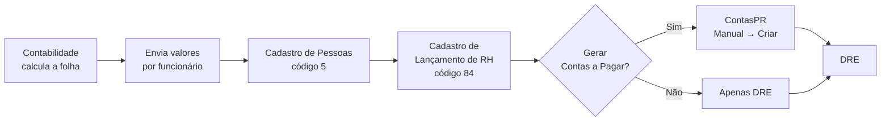

# 👥 Índice: Documentação Módulo RH - Sol.NET ERP

## 🎯 Sobre o módulo

O **Módulo de Lançamentos de RH** do Sol.NET registra, **por pessoa** (funcionário) e em base contábil (débito/crédito), os valores da folha de pagamento — alimentando o **DRE** e, quando necessário, abrindo automaticamente os títulos em **Contas a Pagar/Receber**.

### ⚠️ Regra fundamental

**Todo lançamento de RH é vinculado a uma pessoa cadastrada como `Funcionário`.** Não há lançamento avulso ou agregado — cada linha contábil aponta para um funcionário específico.

### O que o módulo **é**

- ✅ Ferramenta de **controle contábil** dos valores da folha por funcionário
- ✅ Integração automática com o **DRE** (despesas com pessoal por centro de custo)
- ✅ Geração de **Contas a Pagar/Receber** a partir do lançamento de RH
- ✅ **Rateio** entre planos de contas, centros de custo e pessoas
- ✅ **Modelos recorrentes** para itens fixos da folha (`Configuração RH`)
- ✅ Importação de **Holerite Excel**

### O que o módulo **não é**

- ❌ Sistema completo de folha de pagamento — não calcula INSS/IRRF/FGTS
- ❌ Emissor automático de holerites — apenas importa via `Holerite Excel`
- ❌ Integrado com eSocial, SEFIP ou Receita Federal
- ❌ Controle de ponto eletrônico

---

## 🧭 Telas do módulo (todas pela pesquisa `F1`)

Toda tela do Sol.NET é aberta pela pesquisa universal — atalho **`F1`** — digitando o **código** ou parte do **nome** da tela.

| Tela | Código (`F1`) | Para quê serve |
|------|---------------|----------------|
| **Cadastro de Pessoas** | `5` | Cadastrar/editar funcionários (classificação `Funcionário`) |
| **Cadastro de Lançamento de RH** | `84` | Tela principal: lançar valores mensais |
| **Configuração RH** | `222` | Modelos recorrentes (salário base, encargos fixos) |
| **Holerite Excel** | `134` | Importar holerites de planilha Excel |
| **Pessoa Rateio** | `133` | Modelos de rateio por pessoa |

---

## 📋 Documentos disponíveis

### 💼 [Documentação principal — Lançamentos de Folha de Pagamento](documentacao_folha_de_pagamento.md)

Referência completa do módulo:

- Visão geral, o que faz e o que não faz
- Telas envolvidas e seus códigos
- Cadastro do funcionário em `Cadastro de Pessoas` (código `5`)
- Estrutura da tela `Cadastro de Lançamento de RH` (código `84`) — abas Principal, Vínculos, ContasPR - Manual, Rateio, Lançamento em Massa
- Rateio e integração com Contas a Pagar/Receber
- `Configuração RH` (código `222`) e modelos recorrentes
- `Holerite Excel` (código `134`)
- Estrutura contábil sugerida
- Exemplos práticos
- Problemas comuns e boas práticas

### 📅 [Processo Mensal de Lançamento](processo_mensal.md)

Rotina mês a mês:

- Preparação (recebimento da planilha, validação de cadastros, conferência de modelos)
- Passo a passo na tela `Cadastro de Lançamento de RH` (código `84`)
- Quando usar rateio e quando gerar Contas a Pagar
- Conferência incremental e fechamento do mês
- Checklist final, calendário sugerido e dicas de produtividade

### 🚀 [Guia Rápido](guia_rapido.md)

Referência de bolso:

- Tabela de telas e códigos
- Checklist mensal compacto
- Fluxo por funcionário em 7 passos
- Exemplo prático curto
- Problemas comuns resumidos

### ❓ [FAQ](faq.md)

Perguntas frequentes, organizadas por categoria:

- Onde fica cada tela
- Cadastro de funcionários
- Lançamentos
- Valores
- Configuração RH e modelos recorrentes
- Integração com Contas a Pagar/Receber
- Integração com o DRE
- Holerite Excel
- Problemas técnicos
- Cenários específicos (mudança de departamento, admissão/demissão no meio do mês etc.)

---

## 🔄 Como funciona o processo


```mermaid
graph LR
    A[Contabilidade<br/>calcula a folha] --> B[Envia valores<br/>por funcionário]
    B --> C[Cadastro de Pessoas<br/>código 5]
    C --> D[Cadastro de<br/>Lançamento de RH<br/>código 84]
    D --> E{Gerar<br/>Contas a Pagar?}
    E -->|Sim| F[ContasPR<br/>Manual → Criar]
    E -->|Não| G[Apenas DRE]
    F --> H[DRE]
    G --> H
```

**Resumo do fluxo:**

1. A contabilidade externa processa a folha e envia o detalhamento por funcionário.
2. Cada funcionário precisa estar no **`Cadastro de Pessoas`** (código `5`) com classificação `Funcionário`.
3. Os valores são lançados na tela **`Cadastro de Lançamento de RH`** (código `84`), linha a linha, com débito/crédito, plano de contas e centro de custo.
4. Quando o valor representa um pagamento a ser efetuado (líquido, encargos, vales), a aba **`ContasPR - Manual`** gera o título no módulo financeiro.
5. O **DRE** consolida automaticamente por centro de custo e plano de contas.

---

## 👥 Cadastro do funcionário

**Não existe** uma tela "RH → Funcionários". Funcionário é um tipo de pessoa: o registro é feito em **`Cadastro de Pessoas`** (código `5`), marcando o cadastro com classificação **`Funcionário`**.

| Categoria | O que preencher |
|-----------|------------------|
| Identificação | Nome, CPF |
| Classificação | Marcar como `Funcionário` |
| Centro de Custo | Define onde a despesa aparece no DRE |
| Complementar | Endereço, contatos, observações (opcionais) |

Detalhes: [Documentação principal — Cadastro do Funcionário](documentacao_folha_de_pagamento.md#-cadastro-do-funcionário).

---

## 💰 Lançamentos por funcionário

O lançamento na tela **`Cadastro de Lançamento de RH`** (código `84`) é **contábil** — cada evento da folha (salário, encargos, descontos, benefícios) vira uma **linha** com débito, crédito, plano de contas e centro de custo.

Exemplo (João Silva — competência 03/2024):

```
Linha 1 — Salário: R$ 5.000,00
   D - 6.2.01 Salários Administrativo
   C - 2.1.2.01 Salários a Pagar

Linha 2 — INSS Patronal: R$ 1.000,00
   D - 6.2.02 Encargos Administrativo
   C - 2.1.2.02 Encargos a Recolher

Linha 3 — FGTS: R$ 400,00
   D - 6.2.02 Encargos Administrativo
   C - 2.1.2.03 FGTS a Recolher
```

Para gerar o título do salário líquido no financeiro, use a aba **`ContasPR - Manual`** e clique em **`Criar`**.

Detalhes: [Documentação principal — Tela 84](documentacao_folha_de_pagamento.md#-tela-cadastro-de-lançamento-de-rh-código-84).

---

## 📋 Checklist simplificado

### Início (uma vez)

```
[ ] Cadastrar todos os funcionários em `Cadastro de Pessoas` (código 5)
[ ] Marcar cada um com classificação `Funcionário`
[ ] Definir Centro de Custo padrão de cada um
[ ] (Opcional) Cadastrar modelos recorrentes em `Configuração RH` (código 222)
```

### Mensal

```
[ ] Receber planilha detalhada da contabilidade (por funcionário)
[ ] Abrir `Cadastro de Lançamento de RH` (código 84)
[ ] Para cada funcionário:
    [ ] Lançar linhas de salário, encargos, descontos, benefícios
    [ ] Aplicar rateio quando necessário
    [ ] Criar título em ContasPR quando aplicável
    [ ] Salvar
[ ] Conferir total no DRE e comparar com a contabilidade
```

---

## ❓ Perguntas mais comuns

**Posso lançar valor total sem vincular a funcionário?**
→ **Não.** A vinculação a uma pessoa é obrigatória.

**Existe uma tela "Cadastro de Funcionários"?**
→ **Não.** Use `Cadastro de Pessoas` (código `5`) e marque como `Funcionário`.

**O Sol.NET calcula INSS/IRRF/FGTS?**
→ **Não.** Os valores vêm prontos da contabilidade.

**Como gero o título do salário a pagar no financeiro?**
→ Pela aba **`ContasPR - Manual`** da tela `Cadastro de Lançamento de RH` (código `84`) → botão **`Criar`**.

**O Sol.NET emite holerite?**
→ **Não emite**, mas **importa** via tela **`Holerite Excel`** (código `134`).

**A contabilidade só me dá valor total — e agora?**
→ Solicite o detalhamento por funcionário. Sem isso o DRE perde rastreabilidade e os títulos de ContasPR não podem ser gerados individualmente.

Mais perguntas: [FAQ completo](faq.md).

---

## 🔗 Navegação por tarefa

### Cadastrar funcionário
- [Documentação principal — Cadastro do funcionário](documentacao_folha_de_pagamento.md#-cadastro-do-funcionário)
- [FAQ — Cadastro de Funcionários](faq.md#-cadastro-de-funcionários)

### Fazer o lançamento mensal
- [Processo Mensal — passo a passo](processo_mensal.md)
- [Guia Rápido — fluxo por funcionário](guia_rapido.md#-fluxo-por-funcionário)
- [Documentação principal — Tela 84](documentacao_folha_de_pagamento.md#-tela-cadastro-de-lançamento-de-rh-código-84)

### Configurar modelos recorrentes
- [Documentação principal — Configuração RH](documentacao_folha_de_pagamento.md#-configuração-rh-código-222-modelos-de-lançamento-recorrente)
- [FAQ — Configuração RH e modelos recorrentes](faq.md#-configuração-rh-e-modelos-recorrentes)

### Importar Holerite Excel
- [Documentação principal — Holerite Excel](documentacao_folha_de_pagamento.md#-holerite-excel-código-134)
- [FAQ — Holerite Excel](faq.md#-holerite-excel)

### Resolver problemas
- [Documentação principal — Problemas comuns](documentacao_folha_de_pagamento.md#-problemas-comuns)
- [Guia Rápido — Problemas comuns](guia_rapido.md#-problemas-comuns)
- [FAQ — Problemas técnicos](faq.md#-problemas-técnicos)

---

## 📚 Documentação relacionada

- **[Financeiro — DRE](../Financeiro/documentacao_dre.md)** — como o DRE consome os lançamentos de RH
- **[Financeiro — Portadores](../Financeiro/documentacao_portadores.md)** — pagamento dos títulos gerados pela aba `ContasPR - Manual`

---

## 🆘 Suporte

| Dúvida sobre… | Onde procurar |
|----------------|----------------|
| Cadastro de funcionários | [Documentação principal](documentacao_folha_de_pagamento.md#-cadastro-do-funcionário) |
| Estrutura da tela 84 | [Documentação principal](documentacao_folha_de_pagamento.md#-tela-cadastro-de-lançamento-de-rh-código-84) |
| Rateio | [Documentação principal — Rateio](documentacao_folha_de_pagamento.md#rateio) |
| Modelos recorrentes | [Configuração RH](documentacao_folha_de_pagamento.md#-configuração-rh-código-222-modelos-de-lançamento-recorrente) |
| Valores e cálculos | Contabilidade externa |
| Telas que não abrem / erros do sistema | Suporte técnico Hetosoft |

---

**📅 Última atualização**: Maio de 2026
**📦 Versão**: 4.0
**🎯 Público-alvo**: Equipe de suporte e usuários do módulo RH
**⚠️ Lembre-se**: cada lançamento é vinculado a uma pessoa classificada como `Funcionário` no `Cadastro de Pessoas` (código `5`).

---

*Este índice organiza a documentação do **Módulo de Lançamentos de RH**. O cálculo da folha em si continua sendo feito pela contabilidade externa ou por software dedicado — o Sol.NET registra os valores e os integra com o DRE e o financeiro.*
