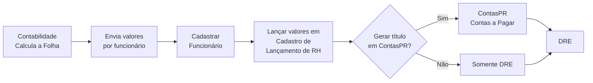

# 💼 Documentação: Módulo RH - Lançamentos de Folha de Pagamento - Sol.NET

## 🎯 Visão Geral

O **Módulo de Lançamentos de RH** do Sol.NET é uma ferramenta de **controle gerencial e contábil**: registra, por pessoa (funcionário), os valores que a folha de pagamento gera todo mês, vincula esses valores ao **Plano de Contas** e ao **Centro de Custo** corretos e — quando necessário — abre o título financeiro correspondente em **Contas a Pagar/Receber (ContasPR)** e o consolida no **DRE**.

### ⚠️ O que o módulo FAZ

- ✅ Registro contábil dos lançamentos de RH (débito/crédito) por pessoa, plano de contas e centro de custo
- ✅ Integração automática com o DRE para análise das despesas com pessoal
- ✅ Geração de títulos financeiros (Contas a Pagar) a partir do lançamento de RH
- ✅ **Rateio** de um mesmo valor entre múltiplos planos de contas, centros de custo ou pessoas
- ✅ **Configuração de lançamentos recorrentes** (modelos mensais por pessoa)
- ✅ Importação de holerites via planilha Excel

### ⚠️ O que o módulo NÃO FAZ

- ❌ Não calcula INSS, IRRF, FGTS ou qualquer encargo — os valores vêm prontos da contabilidade
- ❌ Não processa folha de pagamento de ponta a ponta
- ❌ Não integra com eSocial, SEFIP ou Receita Federal
- ❌ Não gera guias de impostos
- ❌ Não controla ponto eletrônico

> Sol.NET é o sistema de **controle interno** que recebe os valores já calculados pela contabilidade externa e os organiza contabilmente. A folha em si continua sendo processada pelo escritório contábil ou por software dedicado.

### 🔄 Fluxo geral



---

## 🧭 Telas envolvidas

Todas as telas do Sol.NET são abertas pela **pesquisa universal (atalho `F1`)**: digite o **código** ou parte do **nome** da tela.

| Tela | Código (`F1`) | Para quê serve |
|------|---------------|----------------|
| **Cadastro de Pessoas** | `5` | Cadastrar/editar funcionários (classificação `Funcionário`), além de clientes, fornecedores, etc. |
| **Cadastro de Lançamento de RH** | `84` | Tela principal: lançar mensalmente os valores de folha por funcionário |
| **Configuração RH** | `222` | Cadastrar **modelos de lançamento recorrente** (ex.: salário mensal padrão de cada funcionário) |
| **Holerite Excel** | `134` | Importar holerites a partir de planilha Excel |
| **Pessoa Rateio** | `133` | Configurar rateios por pessoa que podem ser reaproveitados em lançamentos |

---

## 👥 Cadastro do Funcionário

### Onde cadastrar

No Sol.NET, **funcionário é um tipo de Pessoa**. Não existe uma tela específica de "Cadastro de Funcionários" — o registro é feito na própria tela `Cadastro de Pessoas`.

Tela: **`Cadastro de Pessoas`** — código **`5`** (abra pela pesquisa `F1`).

### Marcando a pessoa como funcionário

Ao criar (ou editar) um registro de Pessoa, marque a **classificação** como `Funcionário`. Isso permite que essa pessoa apareça nos filtros e listas internas do módulo RH (a pesquisa do `Cadastro de Lançamento de RH` filtra automaticamente por pessoas dessa classificação).

### Dados essenciais

Para que o lançamento de RH funcione corretamente, preencha pelo menos:

- **Dados pessoais**: nome, CPF, contato
- **Classificação**: marcar como **`Funcionário`**
- **Centro de Custo**: define em qual área a despesa do funcionário será alocada no DRE

Os demais campos (endereço, contatos, observações, datas) são úteis para gestão de RH mas não interferem na contabilização.

### Funcionários inativos

Funcionários desligados podem ser mantidos no cadastro para preservar histórico. Marque o registro como inativo (ou ajuste a classificação) para que ele deixe de aparecer nas listas de seleção dos lançamentos mensais.

---

## 💰 Tela `Cadastro de Lançamento de RH` (código 84)

É a tela central do módulo. Cada **linha** registrada é um lançamento contábil vinculado a uma pessoa, com débito, crédito, plano de contas, centro de custo e competência.

Tela: **`Cadastro de Lançamento de RH`** — código **`84`** (abra pela pesquisa `F1`).

### Estrutura do registro

Cada lançamento de RH guarda:

- **Competência** — mês/ano de referência (ex.: 03/2024)
- **Pessoas** — funcionário ao qual o valor pertence (campo obrigatório; pesquisa por nome, código ou CPF)
- **Data de Emissão** — data contábil do lançamento
- **Valor** — em reais
- **Plano de Contas** — conta contábil de despesa (lado do débito) ou de passivo (lado do crédito), conforme a natureza
- **Centro de Custo** — área/departamento que recebe o custo
- **Tipo de Conta** — tipo do lançamento (referencia o `Cadastro de Configuração RH`, código `222`, quando o lançamento usa um modelo recorrente)
- **Operação** — natureza da operação contábil (débito/crédito)
- **Nível** — agrupamento gerencial usado em relatórios
- **Status** / **Fechamento** — controle de aberto/quitado/cancelado
- **Observação** — texto livre

> Diferente de um sistema de folha, o lançamento de RH no Sol.NET é **contábil linha a linha** (débito/crédito), não um holerite com rubricas pré-definidas. As "categorias" típicas (salário, encargo, benefício, desconto) viram **linhas separadas** vinculadas a planos de contas distintos.

### Abas da tela

A tela trabalha em abas. As principais:

- **Pesquisar** — localiza lançamentos por competência, pessoa, plano de contas, centro de custo, status ou nível
- **Registro → Principal** — formulário do lançamento atual (campos descritos acima)
- **Registro → Vínculos** — informações de quitação e relação com ContasPR (registro de fechamento, status, vencimento)
- **Registro → ContasPR - Manual** — gera/abre um título em **Contas a Pagar/Receber** a partir do lançamento (ex.: o salário a pagar vira um título no financeiro). Campos: `Tipo de Documento`, `Portador`, `Vencimento`, botão `Criar`
- **Registro → Rateio** — divide o valor do lançamento entre múltiplas combinações de plano de contas / centro de custo / pessoa (ver `Rateio` abaixo)
- **Registro → Lançamento em Massa** — permite inserir/excluir várias linhas de uma vez para acelerar o lançamento mensal

### Rateio

Quando um valor precisa ser **distribuído** entre vários planos de contas, centros de custo ou pessoas (ex.: o salário do diretor financeiro alocado parte em Administrativo e parte em Vendas), use a aba **Rateio** do registro:

1. Informe o valor total na aba `Principal`.
2. Vá em `Rateio` e clique em **Inserir** para adicionar uma linha de rateio (`Plano de Contas`, `Centro de Custo`, `Data`, `Valor`, `%`).
3. Adicione quantas linhas forem necessárias. O sistema mostra `Total`, `Total do Rateio` e `Diferença` — a diferença precisa fechar em zero.
4. Salve o lançamento.

Se o mesmo padrão de rateio se repete por funcionário, ele pode ser pré-cadastrado na tela **`Pessoa Rateio`** (código `133`) e reaproveitado.

### Geração de Contas a Pagar

Quando o lançamento representa um valor que será efetivamente pago (líquido a pagar, encargos a recolher, vale a depositar), a aba **ContasPR - Manual** permite **gerar o título financeiro** no mesmo ato:

- Preencha `Tipo de Documento`, `Portador` e `Vencimento`.
- Clique em **Criar**.
- O Sol.NET abre o registro correspondente no módulo de **Contas a Pagar/Receber**, que então participa do fluxo de caixa normal.

Se preferir lançar apenas para o DRE sem criar título financeiro, basta não usar essa aba.

---

## 🗂️ `Configuração RH` (código 222) — modelos de lançamento recorrente

A tela **`Cadastro de Configuração RH`** permite definir **modelos recorrentes** de lançamento — útil para itens fixos que se repetem todo mês (salário base, vale-transporte, plano de saúde patronal, etc.).

Tela: **`Configuração RH`** — código **`222`** (abra pela pesquisa `F1`).

Para cada modelo é possível definir:

- `Descrição` e `Pessoas` (a quem se aplica)
- `Valor` e `Operação`
- `Plano de Contas`, `Centro de Custo`, `Tipo de Conta`
- `Dia` de competência e `Data Mês Início` / `Data Mês Fim` (vigência)
- `Proporcional` — calcula valor proporcional ao período
- `Mês Ref.` — competência base
- `Criar PR` — se deve gerar Contas a Pagar/Receber automaticamente
- `Tipo de Documento` e `Portador` — para a geração de ContasPR
- `Vencimento para Próximo Mês`
- `Rateio` — modelo de rateio aplicado

A `Configuração RH` é referenciada pelo `Tipo de Conta` em cada lançamento de RH; com isso, lançamentos mensais herdam automaticamente plano de contas, centro de custo e regras de rateio do modelo.

---

## 📑 `Holerite Excel` (código 134)

A tela **`Holerite Excel`** permite **importar** holerites a partir de uma planilha Excel — útil quando a contabilidade fornece os valores nesse formato.

Tela: **`Holerite Excel`** — código **`134`** (abra pela pesquisa `F1`).

A importação cria os registros correspondentes (cabeçalho do holerite por funcionário e os itens detalhados), que servem como base ou fonte de conferência para os lançamentos contábeis do módulo RH.

> Os layouts de planilha aceitos podem variar por versão. Confirme com o suporte qual o template vigente antes da primeira importação.

---

## 📊 Estrutura contábil sugerida

Para que o DRE apresente a despesa com pessoal segmentada, mantenha contas separadas por **natureza** (salário, encargos, benefícios) e **centro de custo** (administrativo, vendas, produção, etc.). Exemplo:

```
6. DESPESAS OPERACIONAIS
   6.1 Vendas
      6.1.01 Salários — Vendas
      6.1.02 Encargos — Vendas
      6.1.03 Benefícios — Vendas
   6.2 Administrativo
      6.2.01 Salários — Administrativo
      6.2.02 Encargos — Administrativo
      6.2.03 Benefícios — Administrativo
   6.3 Produção
      6.3.01 Salários — Produção
      6.3.02 Encargos — Produção
      6.3.03 Benefícios — Produção

2. PASSIVO CIRCULANTE
   2.1.2 Obrigações Trabalhistas
      2.1.2.01 Salários a Pagar
      2.1.2.02 Encargos a Recolher
      2.1.2.03 FGTS a Recolher
      2.1.2.04 Benefícios a Pagar
```

O **Centro de Custo** do lançamento normalmente acompanha o do funcionário (vem do cadastro da pessoa), mas pode ser alterado por linha quando há rateio.

---

## 💡 Exemplos Práticos

### Exemplo 1 — Lançamento mensal de um funcionário

**Cenário:** competência 03/2024, funcionária Maria Santos (Vendas).
Valores recebidos da contabilidade:

```
Salário base ............. R$ 3.500,00
Comissões ................ R$ 1.200,00
INSS funcionário (desc.) . R$   517,00
IRRF (desc.) ............. R$    95,00
Vale Transporte (desc.) .. R$   105,00
INSS patronal ............ R$   940,00
FGTS ..................... R$   376,00
```

**Passo a passo no Sol.NET:**

1. Abra a pesquisa `F1` e digite `84` (ou "Lançamento de RH").
2. Na aba `Principal`, defina `Competência = 03/2024` e selecione `Pessoas = Maria Santos`.
3. Para cada item da planilha, crie uma linha de lançamento com `Valor`, `Plano de Contas`, `Centro de Custo`, `Operação`. Exemplo:

| Descrição | Valor | Plano de Contas (D) | Plano de Contas (C) |
|-----------|-------|---------------------|---------------------|
| Salário base | 3.500,00 | 6.1.01 Salários Vendas | 2.1.2.01 Salários a Pagar |
| Comissões | 1.200,00 | 6.1.01 Salários Vendas | 2.1.2.01 Salários a Pagar |
| INSS funcionário | 517,00 | 2.1.2.01 Salários a Pagar | 2.1.2.02 Encargos a Recolher |
| IRRF | 95,00 | 2.1.2.01 Salários a Pagar | 2.1.2.02 Encargos a Recolher |
| Vale Transporte | 105,00 | 2.1.2.01 Salários a Pagar | 2.1.2.04 Benefícios a Pagar |
| INSS patronal | 940,00 | 6.1.02 Encargos Vendas | 2.1.2.02 Encargos a Recolher |
| FGTS | 376,00 | 6.1.02 Encargos Vendas | 2.1.2.03 FGTS a Recolher |

4. Na aba **ContasPR - Manual**, gere o título do líquido a pagar (Salários a Pagar) com `Vencimento` no 5º dia útil — clique em `Criar`.
5. Salve o lançamento.

**Resultado no DRE (Maria Santos, 03/2024):**

```
6.1 Vendas
   6.1.01 Salários ......... R$ 4.700,00
   6.1.02 Encargos ......... R$ 1.316,00
   Total Maria Santos ...... R$ 6.016,00
```

### Exemplo 2 — Provisão de 13º salário

A provisão também é um lançamento de RH (1/12 do salário + encargos), vinculada ao funcionário e ao Plano de Contas de provisão.

```
Competência: 03/2024
Pessoas:     João Silva
Valor:       R$ 416,67
D - 6.2.04 Provisão 13º Salário
C - 2.1.3.01 Provisão 13º a Pagar
```

Para automatizar a provisão mensal, cadastre-a em **`Configuração RH`** (código `222`) — daí em diante o lançamento entra automaticamente na competência configurada.

### Exemplo 3 — Salário rateado entre dois centros de custo

**Cenário:** o diretor financeiro acumula funções e seu salário é rateado em 60% Administrativo / 40% Vendas.

1. Na tela `Cadastro de Lançamento de RH`, registre o salário total na aba `Principal`.
2. Vá em `Rateio` → `Inserir`:

| Plano de Contas | Centro de Custo | % | Valor |
|-----------------|------------------|----|-------|
| 6.2.01 Salários Adm. | Administrativo | 60 | 6.000,00 |
| 6.1.01 Salários Vendas | Vendas | 40 | 4.000,00 |

3. Confira que `Diferença` está zerada e salve.

O DRE recebe os valores nos dois centros de custo automaticamente.

---

## 🆘 Problemas comuns

### Não consigo salvar o lançamento

**Causa provável:** falta selecionar a pessoa, a competência ou o plano de contas.
**Como resolver:** verifique os campos obrigatórios do registro na aba `Principal` (Competência, Pessoas, Valor, Plano de Contas). Se necessário, abra a tela `Cadastro de Pessoas` (código `5`) e confirme que o funcionário está cadastrado e classificado como `Funcionário`.

### Funcionário não aparece na pesquisa

**Causa provável:** registro não cadastrado, inativo ou sem a classificação `Funcionário`.
**Como resolver:** abra `Cadastro de Pessoas` (código `5`), inclua/ative o registro e aplique a classificação `Funcionário`.

### Valor aparece no centro de custo errado no DRE

**Causa provável:** o centro de custo padrão da pessoa está incorreto, ou o rateio não foi aplicado.
**Como resolver:** corrija o centro de custo no `Cadastro de Pessoas` (código `5`) para que novos lançamentos herdem o valor correto, ou ajuste o rateio do lançamento existente.

### O título não apareceu em Contas a Pagar

**Causa provável:** a aba `ContasPR - Manual` não foi usada (lançamento foi salvo sem clicar em `Criar` ContasPR).
**Como resolver:** edite o lançamento, vá em `ContasPR - Manual`, preencha `Tipo de Documento`, `Portador`, `Vencimento` e clique em `Criar`.

### Rateio está com diferença

**Causa provável:** a soma das linhas de rateio é diferente do valor total do lançamento.
**Como resolver:** confira o campo `Diferença` na aba `Rateio` — ele precisa estar em zero. Ajuste valores ou percentuais até zerar.

### Total do mês difere do informado pela contabilidade

**Causa provável:** algum funcionário não foi lançado, valor digitado incorreto, ou lançamento duplicado.
**Como resolver:** liste os lançamentos do mês pela aba `Pesquisar` (filtre por competência) e compare funcionário a funcionário com a planilha da contabilidade.

---

## ✅ Boas práticas

1. **Cadastre os funcionários antes do primeiro lançamento.** Sem o cadastro, a pesquisa do form 84 não traz a pessoa.
2. **Configure o Centro de Custo no cadastro da pessoa.** Isso evita digitar repetidamente o centro de custo em cada linha e garante consistência no DRE.
3. **Use `Configuração RH` (código `222`) para itens fixos.** Salário base, vale-transporte patronal e plano de saúde patronal raramente mudam — modelos recorrentes economizam tempo e reduzem erros.
4. **Padronize as descrições.** "INSS Patronal" sempre escrito do mesmo jeito facilita filtros e relatórios.
5. **Confira o DRE depois de fechar o mês.** Compare o total de despesas com pessoal com o relatório da contabilidade.
6. **Documente quem mudou de centro de custo no meio do mês.** O lançamento da competência anterior pode ter ficado no centro antigo.

---

## 🔗 Documentação relacionada

- **[Processo Mensal de Lançamento de RH](processo_mensal.md)** — passo a passo da rotina mês a mês
- **[Guia Rápido](guia_rapido.md)** — checklist de bolso
- **[FAQ](faq.md)** — dúvidas frequentes
- **[Financeiro — DRE](../Financeiro/documentacao_dre.md)** — como o DRE consome os lançamentos de RH
- **[Financeiro — Portadores](../Financeiro/documentacao_portadores.md)** — pagamento dos títulos gerados pela aba `ContasPR - Manual`

---

**📅 Última atualização**: Maio de 2026
**📦 Versão**: 4.0
**🎯 Público-alvo**: Equipe de suporte e usuários responsáveis por lançamentos de RH

---

*Esta documentação descreve o módulo de **Lançamentos de RH** do Sol.NET, focado em controle contábil/gerencial. O cálculo da folha em si continua a cargo da contabilidade externa ou de um software dedicado de folha de pagamento.*
