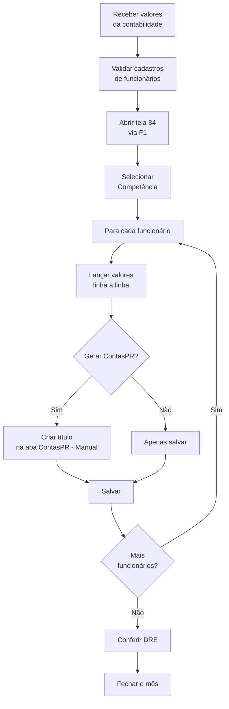

# 📅 Processo Mensal de Lançamento de RH

## 🎯 Visão Geral

Este documento descreve a **rotina mensal** de registro dos valores da folha de pagamento no Sol.NET, usando a tela **`Cadastro de Lançamento de RH`** (código `84`).

A rotina cobre, todos os meses:

1. Receber e validar os valores enviados pela contabilidade.
2. Garantir que os funcionários estão cadastrados e classificados corretamente.
3. Registrar os lançamentos por funcionário na tela `Cadastro de Lançamento de RH` (código `84`).
4. Gerar (quando aplicável) os títulos financeiros em Contas a Pagar/Receber.
5. Conferir os totais no **DRE** e fechar o mês.

### Fluxo do mês



---

## 🧭 Telas usadas no processo mensal

Todas as telas abrem pela pesquisa universal — atalho **`F1`** — digitando o código ou o nome.

| Tela | Código (`F1`) | Quando entra |
|------|---------------|--------------|
| `Cadastro de Pessoas` | `5` | Ao cadastrar novos funcionários ou ajustar centro de custo de um já existente |
| `Cadastro de Lançamento de RH` | `84` | Tela principal do processo mensal — onde os valores são registrados |
| `Configuração RH` | `222` | Para criar/ajustar modelos de lançamentos recorrentes (salário base, vale-transporte patronal etc.) |
| `Holerite Excel` | `134` | Quando a contabilidade fornece os holerites em planilha Excel para importação |

---

## 📋 Preparação (antes de começar)

### 1. Receber a planilha da contabilidade

Solicite à contabilidade um relatório **detalhado por funcionário**, contendo:

- Competência (mês/ano)
- Nome do funcionário (ou matrícula/CPF para identificação)
- Cada **evento** com seu valor: salário, comissões, horas extras, INSS funcionário, IRRF, vale-transporte, INSS patronal, FGTS, benefícios, provisões etc.
- Total por funcionário e total geral do mês

Exemplo de formato útil:

```
Competência: 03/2024

Funcionário: João Silva
   Salário base ............ R$ 5.000,00
   Horas extras ............ R$   300,00
   INSS funcionário (desc.). R$   583,00
   IRRF (desc.) ............ R$    95,00
   Vale Transporte (desc.) . R$   150,00
   INSS patronal ........... R$ 1.060,00
   FGTS .................... R$   424,00
```

### 2. Validar os cadastros

Para cada funcionário que aparece na planilha, confira na tela **`Cadastro de Pessoas`** (código `5`) se:

- O registro existe.
- Está marcado com a classificação **`Funcionário`**.
- O **Centro de Custo** está correto (define onde o custo aparece no DRE).
- Não está inativo (a menos que se trate de uma rescisão pendente).

Se faltar algum funcionário, inclua o registro antes de iniciar os lançamentos.

### 3. Confirmar os modelos em `Configuração RH` (opcional)

Se já existem modelos recorrentes em **`Configuração RH`** (código `222`), confirme se eles estão vigentes para a competência em andamento. Modelos com `Data Mês Fim` no mês anterior precisam ser estendidos ou substituídos.

---

## 🔄 Lançamento na tela `Cadastro de Lançamento de RH`

Tela: **`Cadastro de Lançamento de RH`** — código **`84`** (abra pela pesquisa `F1`).

### Passo 1 — Abrir a tela

1. Pressione **`F1`** em qualquer lugar do Sol.NET.
2. Digite `84` (ou parte do nome `Lançamento de RH`).
3. Selecione a tela na lista e confirme.

### Passo 2 — Selecionar competência e funcionário

Na aba **`Registro → Principal`**:

1. Preencha o campo **Competência** com o mês/ano da folha (ex.: `03/2024`).
2. No campo **Pessoas**, busque o funcionário pelo nome, código ou CPF.
3. Confirme os dados que aparecem ao selecionar a pessoa (centro de custo padrão, classificação).

### Passo 3 — Lançar os valores linha a linha

Cada **evento** da planilha vira uma linha contábil. Para cada linha, informe:

- **Valor**
- **Plano de Contas** (lado do débito, normalmente a conta de despesa)
- **Centro de Custo** (sugerido pelo cadastro da pessoa; ajuste se houver rateio)
- **Tipo de Conta** (ligue ao modelo de `Configuração RH`, quando aplicável)
- **Operação** (débito/crédito)
- **Observação** (opcional, mas útil para conferência)

> O sistema trabalha com lançamentos contábeis (débito/crédito), não com rubricas de holerite. Salário, encargo e benefício viram **linhas independentes** vinculadas a planos de contas e tipos de conta diferentes.

### Passo 4 — Rateio (se necessário)

Se um valor precisa ser dividido entre vários centros de custo ou planos de contas:

1. Vá na aba **`Registro → Rateio`**.
2. Clique em **Inserir** e adicione uma linha por destino, com `Plano de Contas`, `Centro de Custo`, `%` e `Valor`.
3. Confirme que o campo **Diferença** está em zero antes de salvar.

### Passo 5 — Gerar título em Contas a Pagar/Receber (quando aplicável)

Para os valores que serão efetivamente pagos (líquido do funcionário, guias de encargos, vales), use a aba **`Registro → ContasPR - Manual`**:

1. Preencha **Tipo de Documento**, **Portador** e **Vencimento**.
2. Clique em **Criar**.
3. O título passa a aparecer no módulo de **Contas a Pagar/Receber** e entra no fluxo de caixa normal.

Se a aba não for usada, o lançamento entra **somente** no DRE (sem reflexo financeiro automático).

### Passo 6 — Salvar e passar ao próximo

1. Salve o lançamento usando o botão equivalente da tela.
2. Vá ao próximo funcionário (selecione novo `Pessoas` na aba `Principal`) e repita os passos 3 a 5.
3. Repita até cobrir todos os funcionários da planilha do mês.

### Lançamento em massa

A aba **`Registro → Lançamento em Massa`** permite inserir/excluir várias linhas de uma vez (botões `Inserir` e `Deletar`). É útil quando o mesmo tipo de evento se repete para muitos funcionários — por exemplo, lançar o FGTS de todos de uma vez. Confira sempre os valores antes de salvar.

---

## ✅ Conferência e fechamento

### Após cada funcionário

- [ ] Soma das linhas do funcionário confere com o total da planilha
- [ ] Centro de custo e plano de contas conferem com a estrutura contábil esperada
- [ ] Quando houve geração de ContasPR, o título aparece no módulo financeiro
- [ ] Lançamento salvo com sucesso (sem mensagem de erro)
- [ ] Marcar o funcionário como "lançado" na planilha de controle

### Ao final do mês

1. **Filtrar os lançamentos da competência** na aba `Pesquisar` da tela `Cadastro de Lançamento de RH` (código `84`).
2. Conferir que **todos** os funcionários da planilha aparecem.
3. Conferir o **total** geral contra o relatório da contabilidade.
4. Abrir o **DRE** (consulte a documentação do módulo Financeiro) e verificar:
   - Distribuição dos valores nas contas de despesa
   - Totais por centro de custo
   - Comparação com o mês anterior
5. Se identificar diferença, voltar à tela `84` e localizar o lançamento divergente pela aba `Pesquisar`.

### Checklist final do mês

- [ ] Todos os funcionários da planilha foram lançados
- [ ] Total geral confere com a contabilidade
- [ ] Não há lançamentos duplicados (busque por funcionário/competência)
- [ ] Títulos do líquido a pagar estão criados em ContasPR (se for a prática da empresa)
- [ ] DRE da competência reflete o esperado
- [ ] Planilha original da contabilidade arquivada como evidência

---

## ⚠️ Problemas comuns

### Funcionário não aparece na pesquisa do campo `Pessoas`

**Causas:** funcionário não cadastrado, inativo ou sem classificação `Funcionário`.
**Como resolver:** abra `Cadastro de Pessoas` (código `5`), ajuste e volte ao lançamento.

### Plano de contas ou centro de custo aparecem vazios

**Causas:** o `Tipo de Conta` selecionado não tem o modelo em `Configuração RH` preenchido, ou o cadastro da pessoa não tem centro de custo padrão.
**Como resolver:** ajuste o `Tipo de Conta` em `Configuração RH` (código `222`) ou informe os campos manualmente no lançamento.

### Erro ao salvar

**Causas:** algum campo obrigatório não foi preenchido (Competência, Pessoas, Valor, Plano de Contas), ou o rateio está com diferença.
**Como resolver:** confira a mensagem do sistema, complete o campo apontado e tente salvar novamente.

### Total no DRE diverge da contabilidade

**Causas possíveis:** funcionário esquecido, valor digitado errado, lançamento duplicado, centro de custo trocado.
**Como resolver:** filtre os lançamentos da competência na aba `Pesquisar` da tela `84`, compare lista por lista com a planilha e corrija.

### O título de Contas a Pagar não foi criado

**Causa:** o lançamento foi salvo sem usar a aba `ContasPR - Manual`.
**Como resolver:** edite o lançamento, vá em `ContasPR - Manual`, preencha `Tipo de Documento`/`Portador`/`Vencimento` e clique em `Criar`.

---

## 💡 Dicas de produtividade

1. **Organize por departamento.** Lançar todos do Administrativo antes de passar para Vendas facilita a conferência por centro de custo.
2. **Use `Configuração RH` para itens fixos.** Salário base, vale-transporte patronal, plano de saúde — tudo que se repete entra como modelo recorrente em `Configuração RH` (código `222`).
3. **Confira incrementalmente.** A cada 5 funcionários, abra a aba `Pesquisar` e valide subtotal — corrigir um lançamento isolado é mais barato que reabrir o mês inteiro.
4. **Mantenha uma planilha de acompanhamento** marcando funcionário a funcionário o status (lançado, conferido).
5. **Padronize as descrições** ("INSS Patronal", "FGTS", "Vale-Transporte") — facilita filtros e relatórios.

---

## 📅 Calendário sugerido

| Período do mês | O que fazer |
|----------------|-------------|
| Dias 1-5 | Receber planilha e/ou holerites da contabilidade; conferir cadastros |
| Dias 6-15 | Lançar funcionário por funcionário na tela `84`; criar ContasPR quando aplicável |
| Dias 16-20 | Conferência final, validação no DRE, geração de relatórios |
| Dias 21-25 | Disponibilizar a análise gerencial e arquivar a documentação do mês |

---

## 🔗 Documentação relacionada

- **[Documentação principal do módulo RH](documentacao_folha_de_pagamento.md)** — detalhes de campos, abas, rateio, integração com ContasPR
- **[Guia Rápido](guia_rapido.md)** — referência de bolso
- **[FAQ](faq.md)** — perguntas frequentes
- **[Financeiro — DRE](../Financeiro/documentacao_dre.md)** — onde os lançamentos aparecem consolidados

---

**📅 Última atualização**: Maio de 2026
**📦 Versão**: 2.0
**🎯 Público-alvo**: Equipe de suporte e usuários responsáveis pelo fechamento mensal de RH

---

*Esta documentação descreve a rotina mensal de uso do `Cadastro de Lançamento de RH` (código `84`). Os valores lançados são os calculados pela contabilidade externa — o Sol.NET não calcula a folha em si.*
