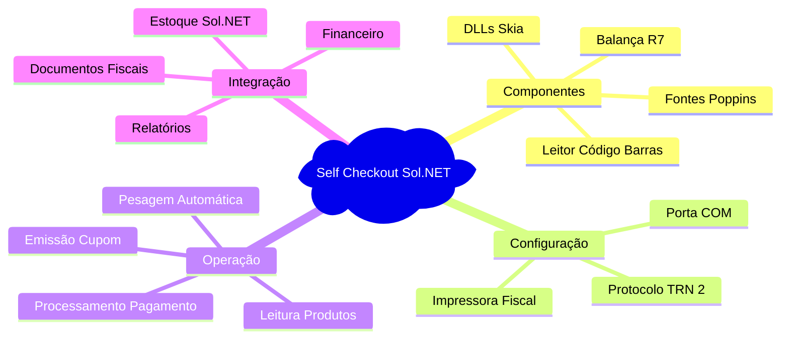

# 🛒 Índice: Documentação Self Checkout Sol.NET

## 📋 Documentos Disponíveis

### 📖 **[Documentação de Instalação](Documentacao Instalacao.md)**
Guia completo para instalação e configuração do Self Checkout, incluindo:
- Instalação das DLLs Skia para renderização gráfica
- Instalação das fontes Poppins
- Configuração da balança R7
- Configurações padrão no Cadastro de Empresas (Sol.NET)
- Configuração inicial do servidor (primeiro acesso)
- Configuração de dispositivos no Self Checkout
- Testes e verificação completa
- Solução de problemas comuns
- Checklist final de instalação

### 🚀 **[Guia Rápido](Guia Rapido.md)**
Referência rápida para instalação e operação:
- Checklist resumido de instalação
- Passos essenciais de configuração
- Comandos e atalhos principais
- Soluções rápidas para problemas comuns

### ❓ **[FAQ - Perguntas Frequentes](FAQ.md)**
Respostas para dúvidas comuns organizadas por categoria:
- Instalação e configuração
- Problemas com DLLs e fontes
- Integração com balança
- Operação do Self Checkout
- Integração com Sol.NET
- Manutenção e atualizações

---

## 🎯 Por Onde Começar

### **👤 Técnico de Suporte - Primeira Instalação**
1. Leia a **[Documentação de Instalação](Documentacao Instalacao.md)** completa
2. Verifique todos os **pré-requisitos** antes de iniciar
3. Siga o processo passo a passo
4. Use o **checklist final** para validação
5. Consulte o **[FAQ](FAQ.md)** para dúvidas específicas

### **🔧 Instalação Rápida - Técnico Experiente**
1. Use o **[Guia Rápido](Guia Rapido.md)** como referência
2. Baixe e instale os componentes necessários
3. Configure a balança conforme especificado
4. Execute testes de validação
5. Consulte **[FAQ](FAQ.md)** se necessário

### **⚡ Resolução de Problemas**
1. Consulte a seção **Solução de Problemas** na **[Documentação de Instalação](Documentacao Instalacao.md)**
2. Verifique o **[FAQ](FAQ.md)** para problemas conhecidos
3. Use o **[Guia Rápido](Guia Rapido.md)** para verificações básicas
4. Documente problemas não resolvidos para referência futura

---

## 🔍 Busca Rápida por Tópico

### **Instalação**
- [Pré-requisitos do Sistema](Documentacao Instalacao.md#-pré-requisitos-do-sistema)
- [Instalação das DLLs Skia](Documentacao Instalacao.md#passo-1-instalação-das-dlls-skia)
- [Instalação das Fontes Poppins](Documentacao Instalacao.md#passo-2-instalação-das-fontes-poppins)
- [Checklist Final](Documentacao Instalacao.md#-checklist-final-de-instalação)

### **Configuração**
- [Configuração da Balança Toledo](Documentacao Instalacao.md#passo-3-configuração-da-balança-toledo-prix-r7)
- [Configuração Inicial do Servidor](Documentacao Instalacao.md#passo-4-configuração-inicial-do-self-checkout)
- [Configurações Padrão no Sol.NET](Documentacao Instalacao.md#passo-5-configuração-no-solnet---cadastro-de-empresas)
- [Configuração de Dispositivos](Documentacao Instalacao.md#passo-6-configuração-de-dispositivos-no-self-checkout)
- [Teste de Comunicação](Documentacao Instalacao.md#-validação)

### **Problemas**
- [DLLs Skia não encontradas](Documentacao Instalacao.md#-problema-dlls-skia-não-encontradas)
- [Fontes Poppins não aparecem](Documentacao Instalacao.md#-problema-fontes-poppins-não-aparecem)
- [Balança não comunica](Documentacao Instalacao.md#-problema-balança-não-comunica)
- [Self Checkout não inicia](Documentacao Instalacao.md#-problema-self-checkout-não-inicia)
- [Produtos pesáveis não funcionam](Documentacao Instalacao.md#-problema-produtos-pesáveis-não-funcionam)

### **Testes**
- [Checklist de Testes](Documentacao Instalacao.md#-testes-e-verificação)
- [Teste de Interface](Documentacao Instalacao.md#-checklist-de-testes)
- [Teste de Balança](Documentacao Instalacao.md#-checklist-de-testes)
- [Teste de Integração](Documentacao Instalacao.md#-checklist-de-testes)

---

## 📊 Visão Geral do Sistema

O Self Checkout é uma **aplicação separada** que faz parte do ecossistema Sol.NET e integra:

---

## 💡 Componentes Essenciais

### 🖼️ **DLLs Skia**
- **Função**: Renderização gráfica de alta qualidade
- **Download**: [DLLs skia.zip](https://github.com/user-attachments/files/25111774/DLLs.skia.zip)
- **Destino**: Diretório de instalação do Self Checkout
- **Crítico**: Interface não carrega sem essas bibliotecas

### 🔤 **Fontes Poppins**
- **Função**: Interface visual moderna e legível
- **Download**: [Poppins.zip](https://github.com/user-attachments/files/25111757/Poppins.zip)
- **Destino**: Windows Fonts (instalação para todos os usuários)
- **Impacto**: Layout pode ficar desconfigurado sem as fontes

### ⚖️ **Balança Toledo Prix R7**
- **Função**: Pesagem de produtos no autoatendimento
- **Manual**: [Manual do Usuário R7](https://github.com/user-attachments/files/25111795/Manual_do_Usurio_R7_Rev1.pdf)
- **Configuração crítica**: 6º parâmetro = "TRN 2"
- **Comunicação**: Porta serial (COM) com Baud Rate 2400

---

## 🚀 Fluxo de Instalação Resumido

1. **Preparação**
   - ✅ Verificar pré-requisitos
   - ✅ Baixar componentes necessários
   - ✅ Preparar balança e periféricos

2. **Instalação de Software**
   - ✅ Copiar DLLs Skia
   - ✅ Instalar fontes Poppins

3. **Configuração de Hardware**
   - ✅ Configurar balança (TRN 2, Baud Rate 2400)
   - ✅ Conectar porta serial/USB
   - ✅ Testar comunicação

4. **Configuração Inicial do Self Checkout**
   - ✅ Configuração do Servidor (primeiro acesso)
   - ✅ Testar conexão com banco de dados
   - ✅ Confirmar carga de dados do BD

5. **Configurações Padrão no Sol.NET**
   - ✅ Cadastro de Empresas
   - ✅ Definir tipo de movimento e série fiscal
   - ✅ Configurar métodos de pagamento padrão

6. **Configuração de Dispositivos no Self Checkout**
   - ✅ Configurar balança (porta COM, TRN 2, Baud 2400)
   - ✅ Configurar outros dispositivos
   - ✅ Testar cada dispositivo

7. **Testes e Validação**
   - ✅ Teste de interface
   - ✅ Teste de balança
   - ✅ Teste de fluxo completo
   - ✅ Teste de integração

---

## 📁 Downloads Necessários

Todos os arquivos necessários para instalação:

| Componente | Link | Descrição |
|------------|------|-----------|
| **DLLs Skia** | [Baixar](https://github.com/user-attachments/files/25111774/DLLs.skia.zip) | Bibliotecas de renderização gráfica |
| **Fontes Poppins** | [Baixar](https://github.com/user-attachments/files/25111757/Poppins.zip) | Fonte utilizada na interface |
| **Manual Balança** | [Baixar](https://github.com/user-attachments/files/25111795/Manual_do_Usurio_R7_Rev1.pdf) | Manual Toledo Prix R7 Rev1 |

---

## 📚 Recursos e Referências

### **📖 Documentação Disponível**
- **Instalação completa**: [Documentacao Instalacao.md](Documentacao Instalacao.md)
- **Guia rápido**: [Guia Rapido.md](Guia Rapido.md)
- **FAQ**: [FAQ.md](FAQ.md)

### **🔧 Resolução de Problemas**
- Consulte a seção de **Solução de Problemas** na documentação de instalação
- Verifique o **FAQ** para problemas conhecidos e suas soluções
- Documente novos problemas encontrados para atualização desta base de conhecimento

---

## 📝 Notas Importantes

### ⚠️ **Atenção**
- Sempre instale as fontes Poppins **para todos os usuários**
- Configure o **6º parâmetro** da balança como **TRN 2** (essencial)
- Verifique a porta COM correta antes de configurar
- Execute testes completos antes de colocar em produção

### 💡 **Dicas**
- Anote todas as configurações específicas do terminal
- Documente em chamada a porta COM utilizada para cada terminal
- Treine a equipe antes de liberar para uso

---

### **💬 Feedback**
- Contribua com sugestões para melhorar esta documentação
- Relate problemas não documentados
- Compartilhe boas práticas de instalação

---

**📅 Última atualização**: Fevereiro de 2026  
**📦 Versão**: 1.0  
**🎯 Público-alvo**: Equipe de suporte e técnicos de implantação  
**👨‍💻 Elaborado por**: Equipe Hetosoft - Documentação Sol.NET
