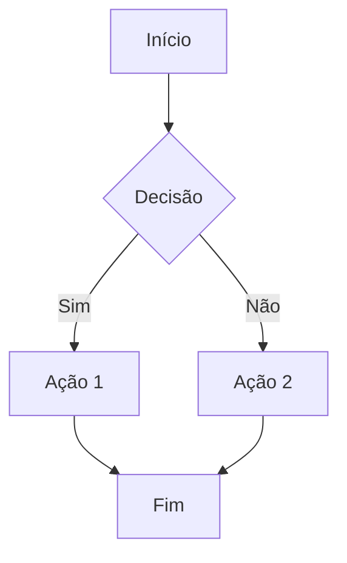
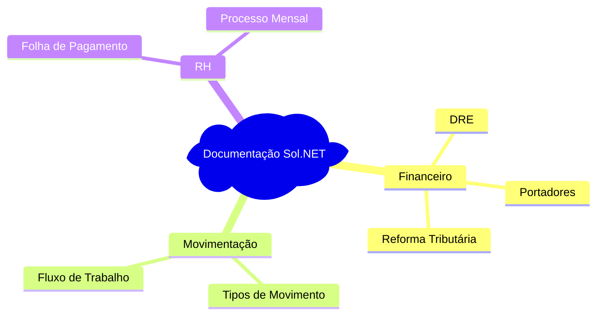
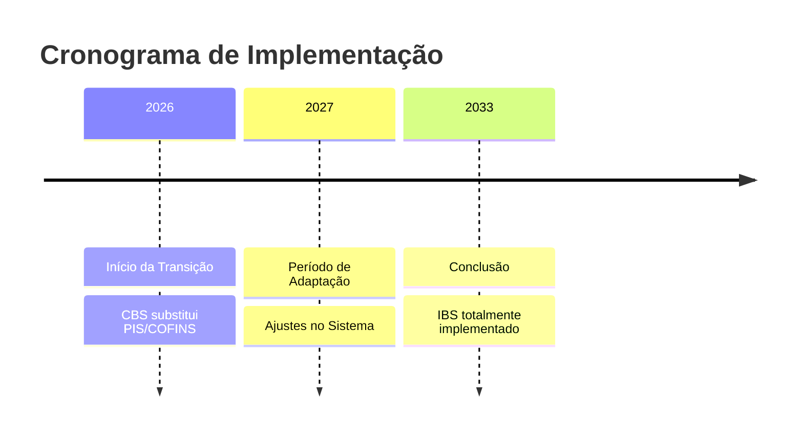

# 🧪 Teste de Renderização Mermaid

Este arquivo é usado para testar a renderização de diagramas Mermaid no GitHub Pages.

## 📊 Exemplo de Diagrama de Fluxo

## 🗺️ Exemplo de Mindmap

## ⏱️ Exemplo de Linha do Tempo

## ✅ Verificação

Se você consegue ver os diagramas renderizados acima (e não apenas o código), então o suporte Mermaid está funcionando corretamente! 🎉
