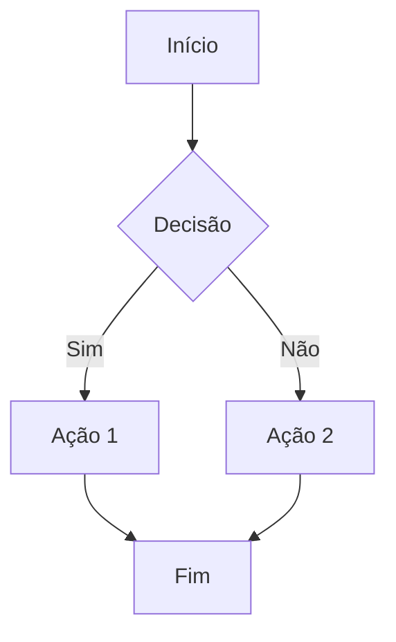
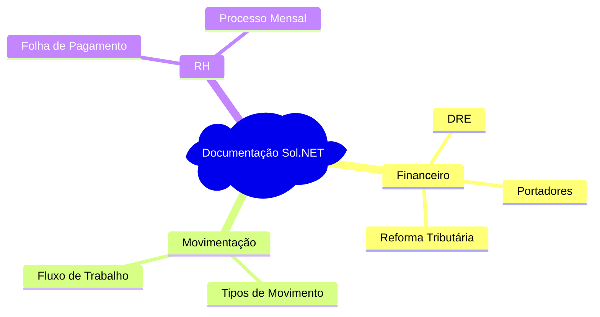
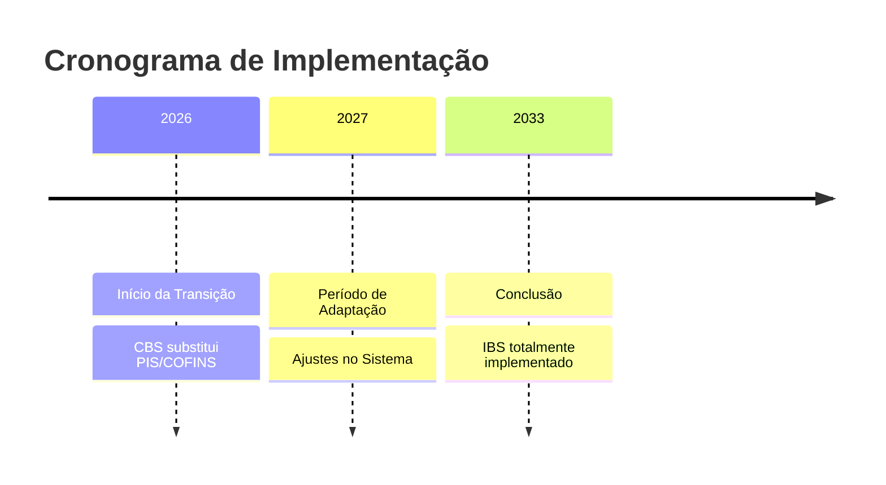
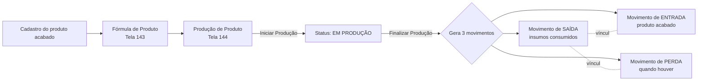
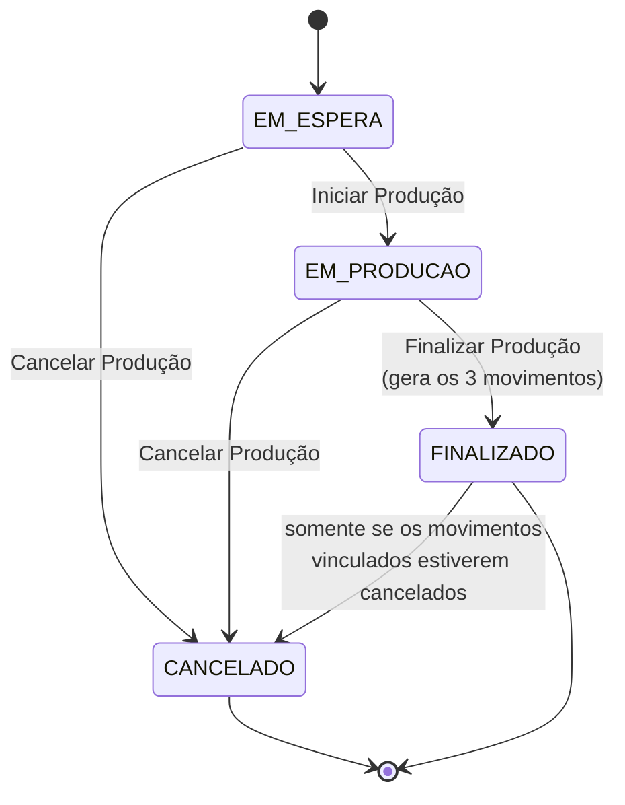
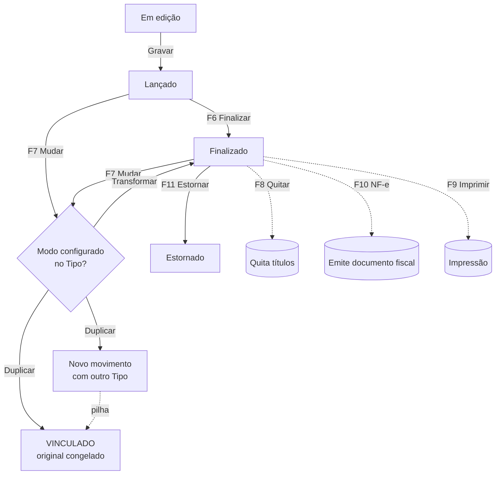
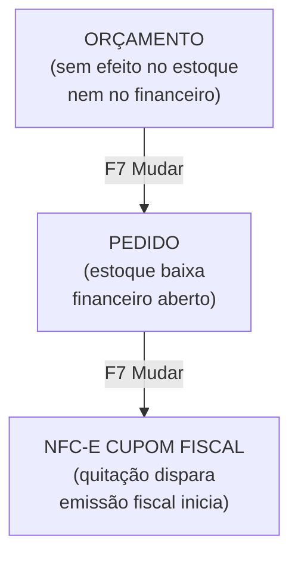
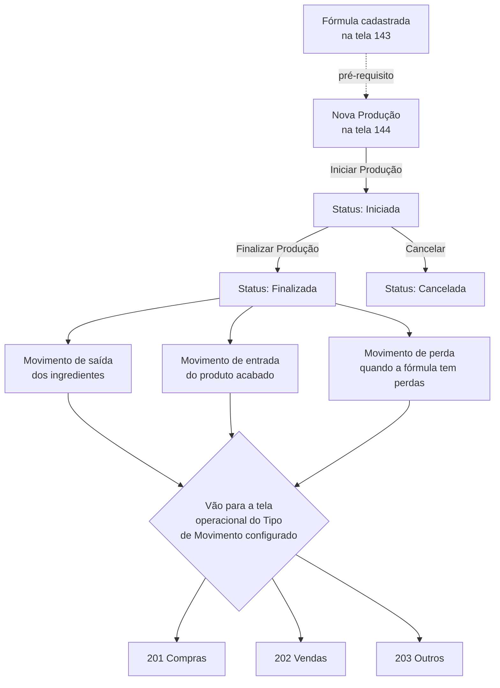
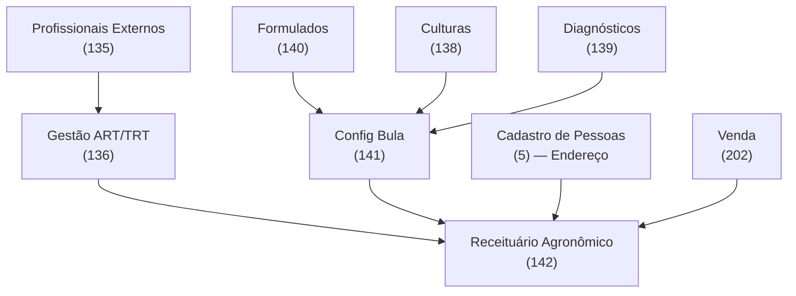
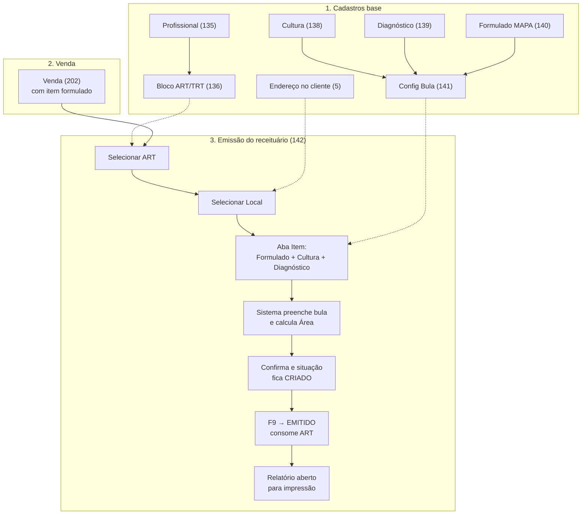

# 🧪 Teste de Renderização Mermaid

Este arquivo é usado para testar a renderização de diagramas Mermaid no GitHub Pages.

## 📊 Exemplo de Diagrama de Fluxo

```mermaid
graph TD
    A[Início] --> B{Decisão}
    B -->|Sim| C[Ação 1]
    B -->|Não| D[Ação 2]
    C --> E[Fim]
    D --> E
```

## 🗺️ Exemplo de Mindmap

```mermaid
mindmap
  root)Documentação Sol.NET(
    Financeiro
      DRE
      Portadores
      Reforma Tributária
    Movimentação
      Tipos de Movimento
      Fluxo de Trabalho
    RH
      Folha de Pagamento
      Processo Mensal
```

## ⏱️ Exemplo de Linha do Tempo

```mermaid
timeline
    title Cronograma de Implementação
    2026 : Início da Transição
         : CBS substitui PIS/COFINS
    2027 : Período de Adaptação
         : Ajustes no Sistema
    2033 : Conclusão
         : IBS totalmente implementado
```

## 🏭 Fluxograma Produção (subseção Movimentação/Produção)

```mermaid
flowchart LR
    A[Cadastro do produto acabado] --> B[Fórmula de Produto<br/>Tela 143]
    B --> C[Produção de Produto<br/>Tela 144]
    C -->|Iniciar Produção| D[Status: EM PRODUÇÃO]
    D -->|Finalizar Produção| E{Gera 3 movimentos}
    E --> F[Movimento de SAÍDA<br/>insumos consumidos]
    E --> G[Movimento de ENTRADA<br/>produto acabado]
    E --> H[Movimento de PERDA<br/>quando houver]
    F -.vínculo.- G
    F -.vínculo.- H
```

## 🔁 Diagrama de Estados — Status da Produção

```mermaid
stateDiagram-v2
    [*] --> EM_ESPERA
    EM_ESPERA --> EM_PRODUCAO: Iniciar Produção
    EM_PRODUCAO --> FINALIZADO: Finalizar Produção<br/>(gera os 3 movimentos)
    EM_ESPERA --> CANCELADO: Cancelar Produção
    EM_PRODUCAO --> CANCELADO: Cancelar Produção
    FINALIZADO --> CANCELADO: somente se os movimentos<br/>vinculados estiverem cancelados
    CANCELADO --> [*]
    FINALIZADO --> [*]
```

## 🧰 Leva-piloto de diagramas — rascunhos a validar

Diagramas em validação antes de irem pros docs finais (PR #36, conteúdo paralelo à reescrita do trio Movimentos 201/202/203).

### Rascunho 1 — Ciclo de vida de um Movimento

Setas sólidas = transição de estado. Setas pontilhadas = operação que gera artefato sem mudar o estado do movimento. O losango decisão do `F7 Mudar` ramifica conforme o Tipo de destino esteja configurado como `Transformar` (mesmo ID muda de Tipo) ou `Duplicar` (novo movimento criado, original vira `VINCULADO`).

```mermaid
flowchart TD
  E[Em edição] -->|Gravar| L[Lançado]
  L -->|F6 Finalizar| F[Finalizado]
  L -->|F7 Mudar| D{Modo configurado<br/>no Tipo?}
  F -->|F7 Mudar| D
  D -->|Transformar| F
  D -->|Duplicar| N[Novo movimento<br/>com outro Tipo]
  D -->|Duplicar| V[VINCULADO<br/>original congelado]
  N -. pilha .-> V
  F -->|F11 Estornar| X[Estornado]
  F -. F8 Quitar .-> Q[(Quita títulos)]
  F -. F10 NF-e .-> NF[(Emite documento fiscal)]
  F -. F9 Imprimir .-> P[(Impressão)]
```

### Rascunho 2 — Ciclo Orçamento → Pedido → NFC-e

```mermaid
flowchart TD
  O["ORÇAMENTO<br/>(sem efeito no estoque<br/>nem no financeiro)"] -->|F7 Mudar| P["PEDIDO<br/>(estoque baixa<br/>financeiro aberto)"]
  P -->|F7 Mudar| N["NFC-E CUPOM FISCAL<br/>(quitação dispara<br/>emissão fiscal inicia)"]
```

### Rascunho 3 — Fluxo de Produção

```mermaid
flowchart TD
  R[Fórmula cadastrada<br/>na tela 143] -. pré-requisito .-> F[Nova Produção<br/>na tela 144]
  F -->|Iniciar Produção| I[Status: Iniciada]
  I -->|Finalizar Produção| OK[Status: Finalizada]
  I -->|Cancelar| C[Status: Cancelada]
  OK --> M1[Movimento de saída<br/>dos ingredientes]
  OK --> M2[Movimento de entrada<br/>do produto acabado]
  OK --> M3[Movimento de perda<br/>quando a fórmula tem perdas]
  M1 --> T{Vão para a tela<br/>operacional do Tipo<br/>de Movimento configurado}
  M2 --> T
  M3 --> T
  T --> T1[201 Compras]
  T --> T2[202 Vendas]
  T --> T3[203 Outros]
```

## 🌱 Rascunhos — Receituário Agronômico (validação antes de virar PR #43)

### Diagrama 1 — Relação entre as telas do módulo

```mermaid
flowchart TD
    P135["Profissionais Externos<br/>(135)"]
    P136["Gestão ART/TRT<br/>(136)"]
    P138["Culturas<br/>(138)"]
    P139["Diagnósticos<br/>(139)"]
    P140["Formulados<br/>(140)"]
    P141["Config Bula<br/>(141)"]
    P5["Cadastro de Pessoas<br/>(5) — Endereço"]
    P202["Venda<br/>(202)"]
    P142["Receituário Agronômico<br/>(142)"]

    P135 --> P136
    P140 --> P141
    P138 --> P141
    P139 --> P141

    P136 --> P142
    P141 --> P142
    P5 --> P142
    P202 --> P142
```

### Diagrama 2 — Fluxo de emissão com subgrafos

```mermaid
flowchart TD
    subgraph Base ["1. Cadastros base"]
        A1["Profissional (135)"] --> A2["Bloco ART/TRT (136)"]
        B1["Cultura (138)"]
        B2["Diagnóstico (139)"]
        B3["Formulado MAPA (140)"]
        B1 --> C["Config Bula (141)"]
        B2 --> C
        B3 --> C
        D["Endereço no cliente (5)"]
    end

    subgraph Venda ["2. Venda"]
        V1["Venda (202)<br/>com item formulado"]
    end

    subgraph Emissao ["3. Emissão do receituário (142)"]
        E1["Selecionar ART"] --> E2["Selecionar Local"]
        E2 --> E3["Aba Item:<br/>Formulado + Cultura + Diagnóstico"]
        E3 --> E4["Sistema preenche bula<br/>e calcula Área"]
        E4 --> E5["Confirma e situação<br/>fica CRIADO"]
        E5 --> E6["F9 → EMITIDO<br/>consome ART"]
        E6 --> E7["Relatório aberto<br/>para impressão"]
    end

    A2 -.-> E1
    C -.-> E3
    D -.-> E2
    V1 --> E1
```

## ✅ Verificação

Se você consegue ver os diagramas renderizados acima (e não apenas o código), então o suporte Mermaid está funcionando corretamente! 🎉
