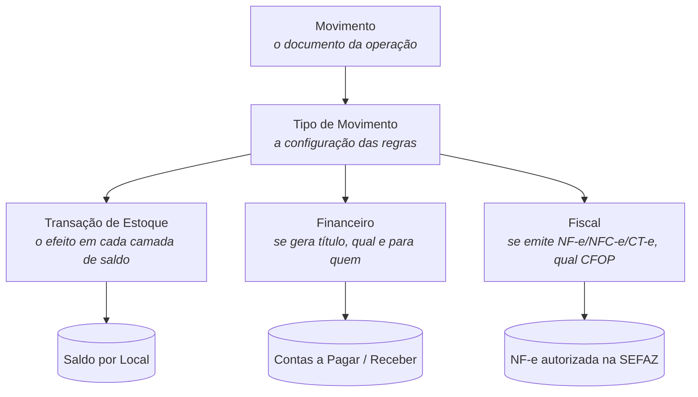

# 📄 Como o Sol.NET pensa — Visão geral do sistema

## 🎯 Visão Geral

Esta página explica **o modelo mental** do Sol.NET — como o sistema enxerga uma operação por dentro, em vez de descrever telas individuais. É o que faltava ler antes de abrir qualquer documentação específica.

> 💡 **Quando voltar aqui.** Sempre que uma tela parecer ter "regras estranhas" que vêm de outro lugar. Quase sempre vêm de um dos elos descritos abaixo.

---

## 🧭 O eixo central

Toda operação que mexe com **mercadoria, dinheiro ou documento fiscal** passa por uma cadeia única:

Leia este diagrama da seguinte forma:

- O **Movimento** é o documento (linha que aparece no grid `201`/`202`/`203`).
- O **Tipo de Movimento** é o "molde" — quem decide tudo que o Movimento vai fazer.
- A partir do Tipo, três caminhos paralelos: **Estoque**, **Financeiro**, **Fiscal**. Cada um pode ser acionado, ou não, conforme o Tipo configurar.

> 💡 **A regra de ouro.** Quando uma tela "se comporta diferente do esperado", a resposta quase sempre está no `Tipo de Movimento` que está sendo usado, não no Movimento em si. O Tipo é a tela mais importante de entender em conjunto com qualquer Movimento.

Para uma visão expandida e visual, há o mapa completo do sistema em [`Assets/SolNET Mindmap.svg`]({{ '/Assets/SolNET Mindmap.svg' | relative_url }}).

---

## 🔍 As 3 dimensões de qualquer operação

Toda operação no Sol.NET — desde uma venda simples até uma transferência entre filiais — responde a **três perguntas**. O [Tipo de Movimento](glossario.md#tipo-de-movimento) (`37`) é onde essas três respostas são configuradas.

### 1. Estoque — entra, sai, transfere ou nada?

O Tipo aponta para uma [Transação de Estoque](glossario.md#transacao-de-estoque) (`33`), que decide o efeito em cada **camada** de [Saldo](glossario.md#saldo):

- Entrada de compra: soma em `Físico` e `Disponível`.
- Venda balcão: subtrai de `Físico` e `Disponível`.
- Reserva de pedido: subtrai de `Disponível`, soma em `Reservado`.
- Transferência entre filiais: subtrai do Local origem, soma no Local destino.
- Ajuste positivo/negativo: soma ou subtrai sem contrapartida.

O **Local de Estoque** sempre entra na conta — saldo é por produto × Local.

### 2. Financeiro — gera título? Quando? Para quem?

O Tipo decide se um título de Pagar/Receber é gerado no momento da finalização, qual é o tipo de título, e qual a Condição de Pagamento padrão. Pode também:

- **Não gerar nada** (transferência entre filiais, ajuste de inventário, produção — não há dinheiro envolvido).
- **Gerar Pagar** (compra de fornecedor).
- **Gerar Receber** (venda a prazo).
- **Gerar Crédito de Pessoa** (devolução de venda que vira saldo a favor do cliente).

### 3. Fiscal — emite documento? Recebe? Qual CFOP?

O Tipo aponta para uma [Natureza de Operação](glossario.md#cfop) (`36`), que carrega o **CFOP** e as demais regras tributárias. Pode:

- **Emitir NF-e/NFC-e/NFS-e** (venda, transferência, devolução).
- **Receber e referenciar XML de terceiros** (compra com NF-e do fornecedor).
- **Não emitir nada** (ajuste interno).

Comportamentos como obrigatoriedade de referenciar nota (em devoluções), exigência de Chave de Acesso, modelo fiscal e série também são herdados via Tipo.

---

## 🗺️ Onde acontece cada coisa

Mapa rápido das telas mais usadas, organizadas pela tarefa do dia:

| Quero… | Vá para |
|---|---|
| Vender (balcão, prazo, OS) | [Movimentos de Vendas](Movimentacao/Movimentos/movimentos_de_vendas.md) (`202`) |
| Receber uma NF-e de compra | [Manifestação](Fiscal/documentacao_manifestacao_destinatario.md) (`401`) → [Importar XML](Movimentacao/documentacao_importar_xml.md) (`204`) → [Movimentos de Compras](Movimentacao/Movimentos/movimentos_de_compras.md) (`201`) |
| Devolver uma venda, transferir entre lojas, ajustar inventário | [Outros Movimentos](Movimentacao/Movimentos/outros_movimentos.md) (`203`) |
| Ajustar saldo manualmente | [Ajuste de Estoque](Movimentacao/documentacao_ajuste_de_estoque.md) (`79`) — gera movimento visível em `203` |
| Saber quanto tenho de um produto | [Saldo Estoque](Movimentacao/documentacao_saldo_estoque.md) (`78`) |
| Entender por que o saldo está assim | [Histórico de Produtos](Movimentacao/documentacao_historico_de_produtos.md) (`206`) |
| Auditar um movimento (quem alterou, quando) | [Histórico de Movimentações](Movimentacao/documentacao_historico_de_movimentacoes.md) (`205`) |
| Lançar/quitar um título | [Pagar e Receber](Financeiro/documentacao_pagar_e_receber.md) (`301`) · [Quitação](Financeiro/documentacao_quitacao.md) (`303`) |
| Operar caixa diário | [Caixa Geral — operação](Financeiro/documentacao_caixa_geral_op.md) (`302`) |
| Configurar como um Tipo se comporta | [Tipos de Movimento](Movimentacao/TiposDeMovimento/documentacao_tipos_de_movimento.md) (`37`) |
| Ajustar preço de venda de produtos | [Tabela de Preço](Movimentacao/documentacao_tabela_de_preco.md) (`27`) |

Toda tela é aberta pela **pesquisa universal (`F1`)** — digite nome ou código.

---

## 🔁 Os 7 verbos do dia

Quase tudo que se faz com um Movimento se resume a sete verbos. Eles aparecem nos botões da tela e no ciclo de vida do documento:

| Verbo | O que faz | Atalho | Onde |
|---|---|---|---|
| **Lançar** | Grava um novo Movimento (em estado aberto, pronto pra ajuste). | (botão `Novo` / `Gravar`) | `201/202/203` |
| **Finalizar** | Consolida — gera financeiro, baixa estoque, emite fiscal se aplicável. | `F6` | `201/202/203` |
| **Mudar** | Converte o Movimento para outro Tipo (orçamento→pedido→venda). Pode `Transformar` (mesmo Movimento) ou `Duplicar` (novo Movimento + original `VINCULADO`). | `F7` | `201/202/203` |
| **Quitar** | Liquida o(s) título(s) financeiro(s) gerados. | `F8` | `201/202/203`, [Pagar e Receber](Financeiro/documentacao_pagar_e_receber.md), [Quitação](Financeiro/documentacao_quitacao.md) |
| **Imprimir** | Aciona o modelo de impressão configurado no Tipo (DANFE, comprovante, OS). | `F9` | `201/202/203` |
| **Emitir** | Transmite o documento eletrônico à SEFAZ (NF-e/NFC-e/NFS-e). | `F10` | `201/202/203` |
| **Estornar** | Reverte completamente — devolve saldo, cancela financeiro e fiscal. | `F11` | `201/202/203` |

> ⚠️ Os atalhos `F6`–`F11` só funcionam **fora** do modo de pesquisa. Dentro da lista de busca, ficam inativos.

Cada um desses verbos tem detalhes (modos, validações, particularidades) cobertos na [referência completa de Movimentos](Movimentacao/Movimentos/documentacao_movimentos.md).

---

## 💡 Exemplos práticos do modelo mental em ação

### Exemplo 1 — Por que minha venda não baixou o estoque?

O Movimento foi finalizado, mas o saldo continua igual. Olhando o **eixo central**: a falha está entre `Tipo de Movimento → Transação de Estoque`. O Tipo usado aponta para uma Transação que **não subtrai** do Físico/Disponível, ou aponta para uma Transação que afeta uma camada que você não está consultando.

**Como confirmar:** abra o Tipo do Movimento em `37`; veja qual `Transação de Estoque` está vinculada; abra a Transação em `33` e confira as colunas `Físico` e `Disponível`.

### Exemplo 2 — Por que apareceu um título a pagar inesperado?

Lançou um movimento como "transferência" mas um título de Pagar foi gerado. Olhando o eixo: a configuração do Tipo está com `Gerar Lançamento Financeiro` ativo. Transferências reais entre filiais não geram financeiro — o Tipo precisa estar configurado sem isso.

### Exemplo 3 — Por que devolução de venda fica em `203` e não em `202`?

A divisão entre `201/202/203` segue **dois critérios** combinados: o `Comportamento` do Tipo (Entrada/Saída/Outros) e o **fluxo operacional** de quem usa. Devolução de venda envolve mercadoria entrando de volta, mas é operada pela retaguarda (não pelo vendedor) — por isso vai em `203`, com Tipos de Comportamento `Outros`, e não em `202`.

---

## ❓ FAQ / Problemas comuns

**Onde aprendo "tudo" sobre Movimentos?**
A [referência completa de Movimentos](Movimentacao/Movimentos/documentacao_movimentos.md) cobre o ciclo de vida, todas as sub-abas (consulta e lançamento), validações principais e telas relacionadas. É a leitura mais densa do portal.

**E sobre Tipos de Movimento?**
[Tipos de Movimento — documentação](Movimentacao/TiposDeMovimento/documentacao_tipos_de_movimento.md) (`37`) cobre as 12 abas de configuração e 50+ validações. A [referência de configurações](Movimentacao/TiposDeMovimento/referencia_configuracoes_tipos_movimento.md) detalha cada flag.

**Quero seguir um caminho ponta a ponta, não ler tela por tela.**
Vá direto para as [Trilhas operacionais](Movimentacao/Trilhas/) — guias narrativos que atravessam as telas na ordem de uma demanda real (entrada de NF-e, venda completa, devolução, ajuste com auditoria).

**Não sei por qual tela começar a resolver meu problema.**
Veja o [índice "Quero…"](quero.md) — entrada orientada à tarefa.

**Preciso conferir o significado de um termo.**
[Glossário](glossario.md) — definições com link para as telas que usam cada termo.

---

## 🔗 Páginas para ler em seguida

| Página | Para que serve |
|---|---|
| [Glossário](glossario.md) | Termos do dia a dia, com âncoras para deep-link. |
| [Quero…](quero.md) | Índice por tarefa do usuário. |
| [Movimentos — referência](Movimentacao/Movimentos/documentacao_movimentos.md) | Mergulho na tela central da operação. |
| [Tipos de Movimento](Movimentacao/TiposDeMovimento/documentacao_tipos_de_movimento.md) | Onde as regras dos Movimentos são configuradas. |
| [Trilhas operacionais](Movimentacao/Trilhas/) | Caminhos prontos para as demandas mais comuns. |

---

**Última atualização**: Maio de 2026
**Versão**: 1.0
**Público-alvo**: Todos os usuários do Sol.NET — especialmente novos
